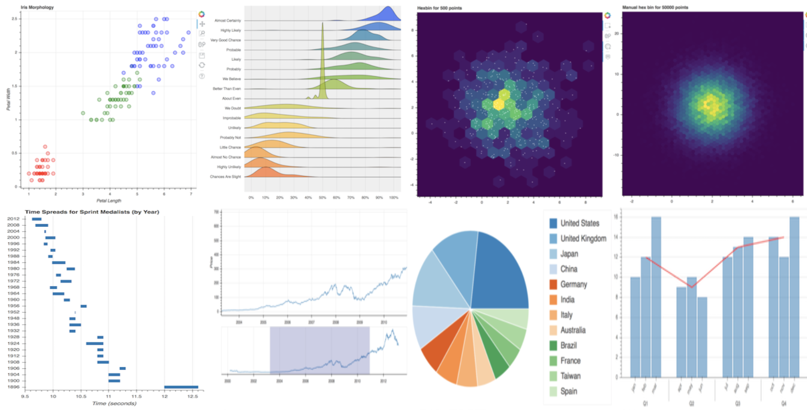
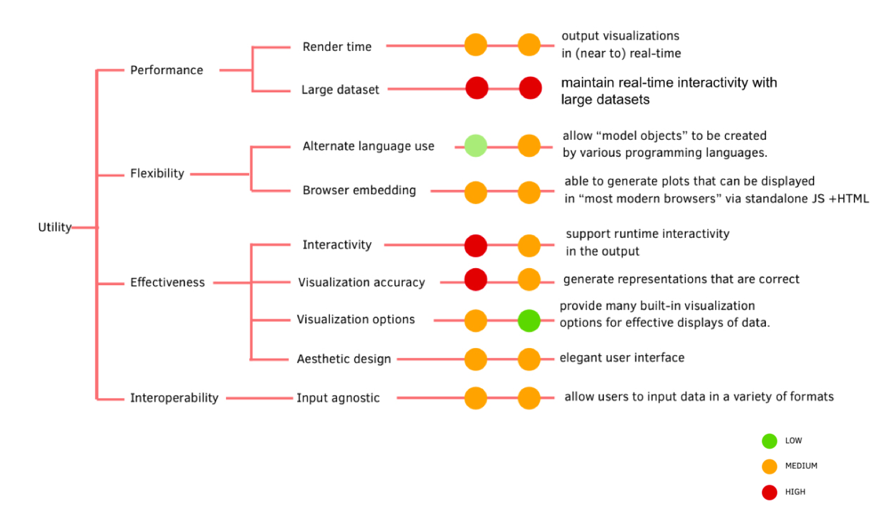
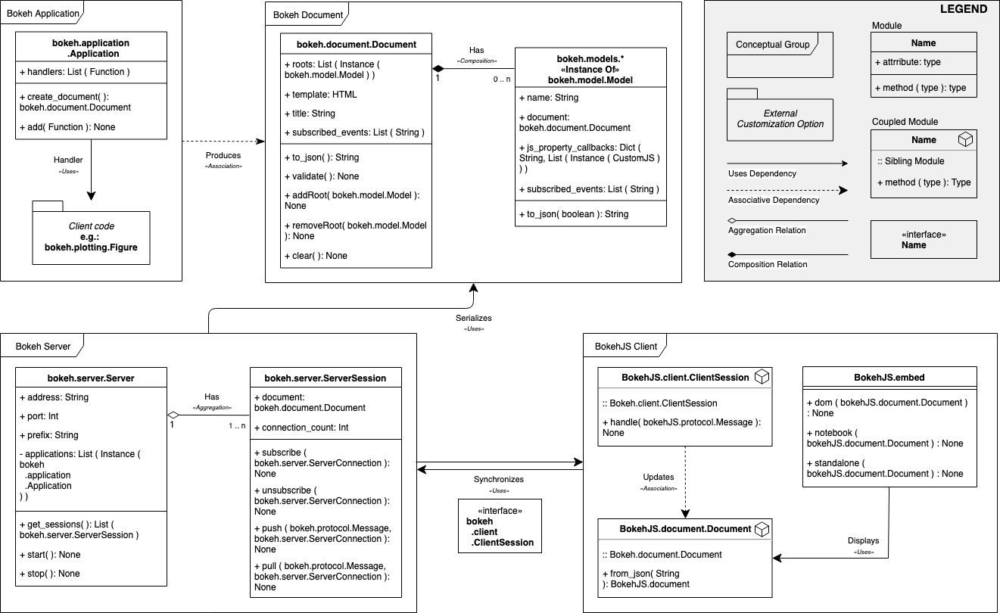
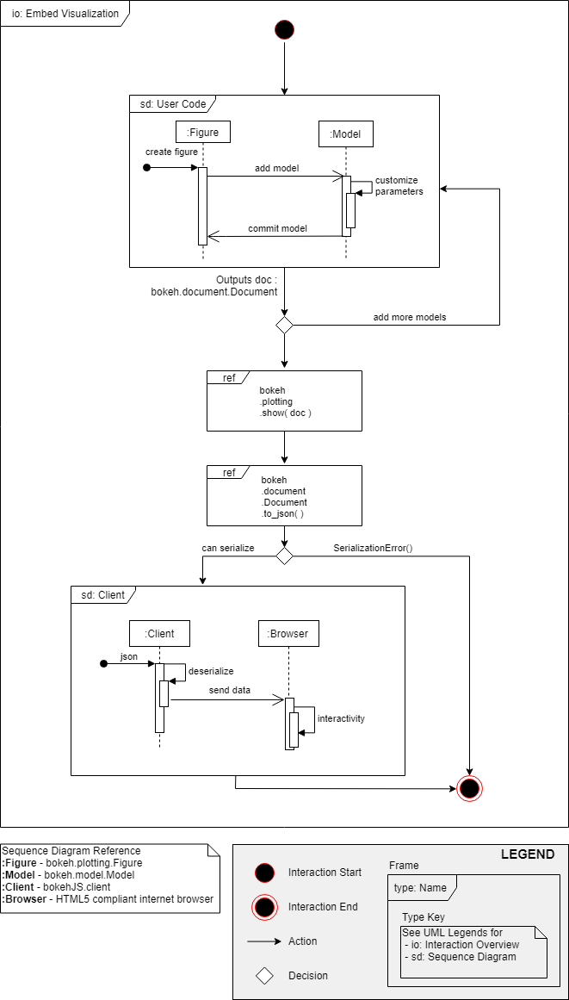
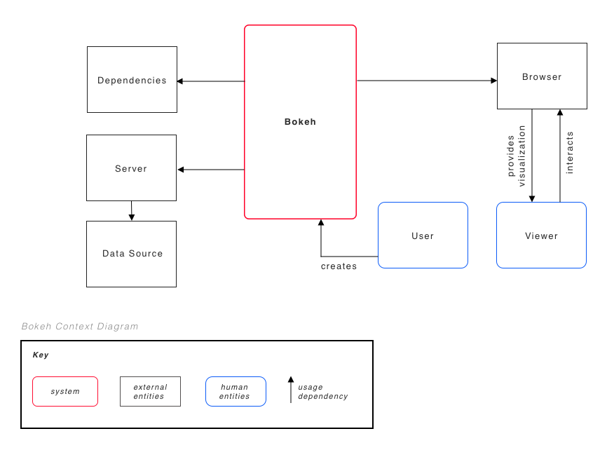
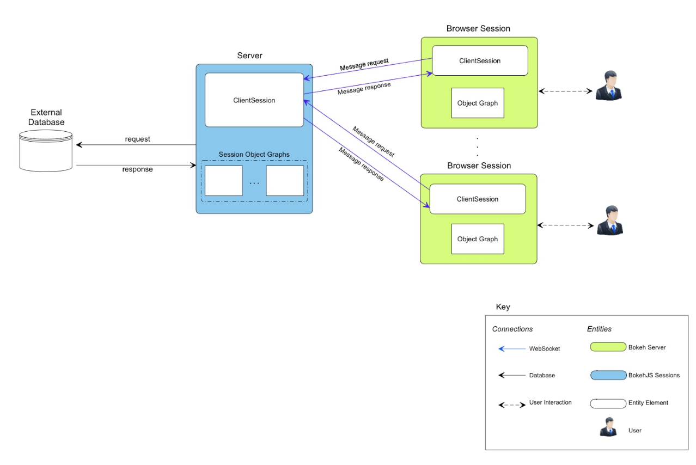
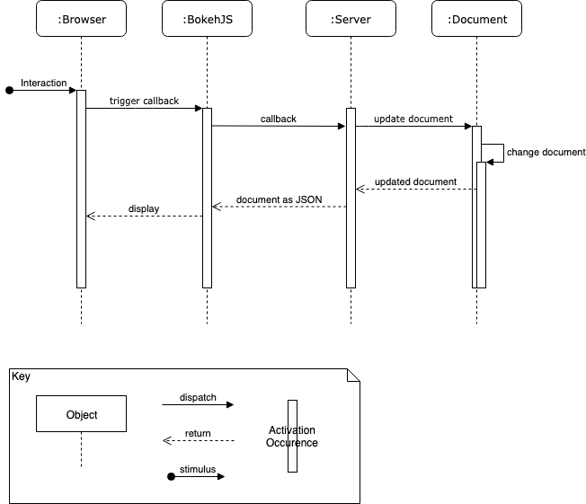
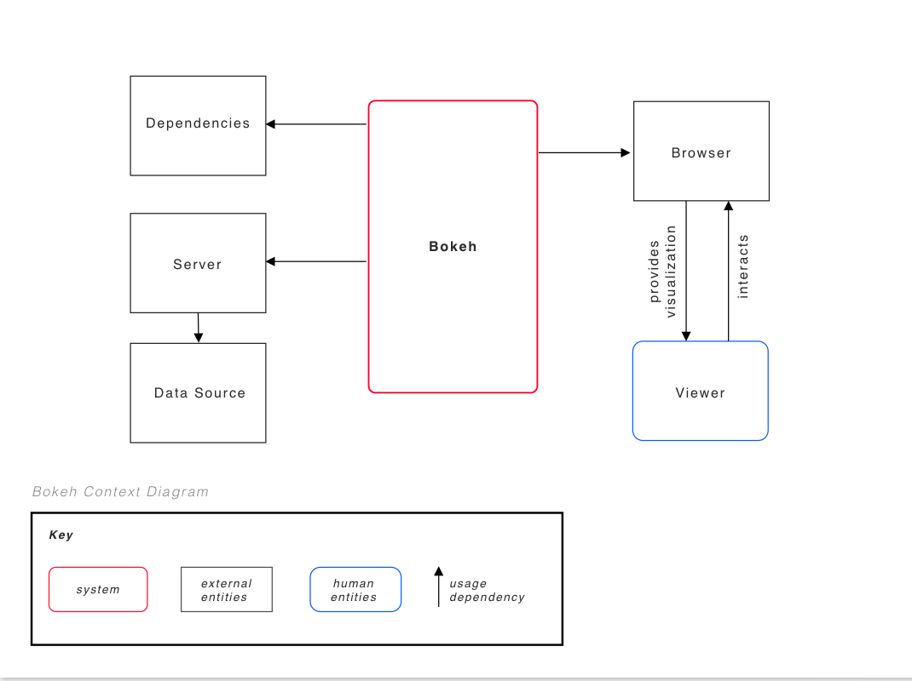
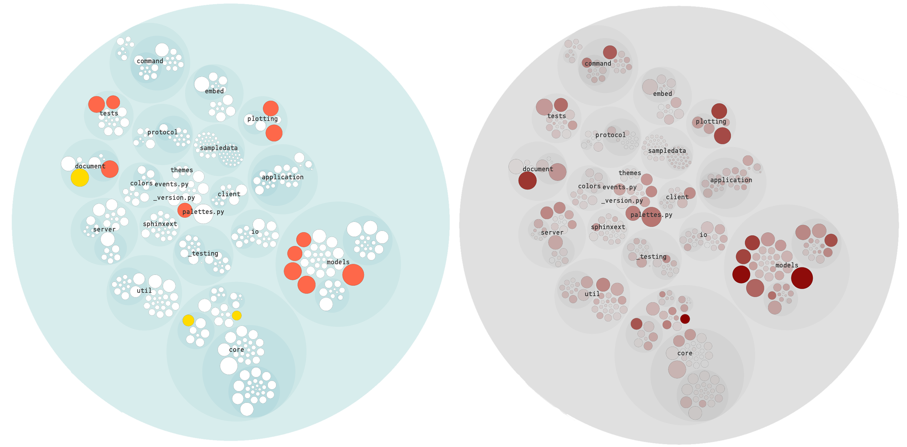
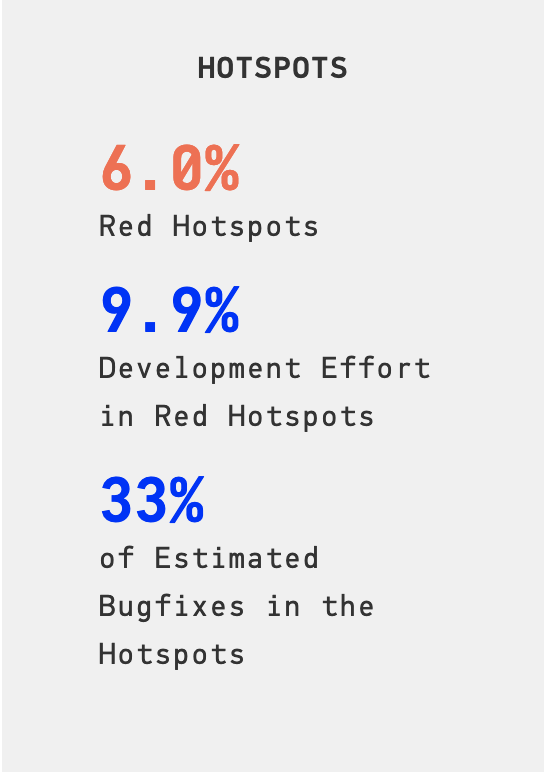

# [Bokeh](https://github.com/bokeh/bokeh) - Documentation

## Table Of Contents

1. [Introduction](#introduction)
2. [Stakeholders](#stakeholders)
3. [Business Goals](#business-goals)
4. [Architecturally Significant Requirements](#architecturally-significant-requirements)
5. [Utility Tree](#utility-tree)
6. [Quality Attribute Scenarios](#quality-attribute-scenarios)
7. [Module View](#module-view)  
    * Primary Presentation
    * Element Catalog
        * Elements and their Properties
        * Relations and their Properties
        * Element Behaviour
    * Context Diagram
    * Rationale
8. [Component and Connector View](#component-and-connector-view)
    * Primary Presentation
    * Element Catalog
        * Elements
        * Relationships
        * Interfaces
        * Behaviour
    * Context Diagram
    * Variability Guide
    * Rationale
9. [Code Quality and Technical Debt](#code-quality-and-technical-debt)
10. [Conclusion](#conclusion)

## Team Members

1. [Lily Bryant](https://github.com/lilybryant)
2. [Ricardo Rodriguez](https://github.com/ricrodri)
3. [Zev Isert](https://github.com/zevisert)
4. [Hunter Watson](https://github.com/hunterwatson)
5. [Amy Hanvoravongchai](https://github.com/amyhanv)

## Introduction

Bokeh is a Python-based interactive visualization library for web browsers. It aims to provide elegant, high-performance interactive graphics and data-centric applications, such as interactive plots, dashboards, and data applications [1]. Some examples of Bokeh visualizations are shown below. Bokeh is an open source project available for anyone to use and allows public contribution to its development through GitHub [2].

Financially, Bokeh is supported by NumFOCUS, an American non-profit dedicated to supporting the open source scientific computing community [3]. This sponsorship allows for a few core team members to continuously oversee and contribute to the project. Previously, Bokeh has also received funding from both the DARPA XDATA program at Georgia Tech and Anaconda, Inc. Consequently, Bokeh’s development team is currently comprised almost exclusively of Anaconda employees [4][5]. All three main sponsors have amplified Bokeh’s success through various marketing strategies and helped it become a widely-used tool in many professional fields, such as finance, oil and gas, meteorology, computational biology, and astronomy [3].

In the following chapter, we detail our interpretation and analysis of Bokeh's system architecture. We begin by presenting potential system stakeholders and the business goals that may be important to them. Next, we describe architecturally significant requirements for Bokeh and detail three resulting quality attribute scenarios. Then, we give a module view and component and connector view of the system. Finally, we present our analysis of technical debt in Bokeh using various code quality tools and human inspection.

**Sources**

[1] Bokeh, “Welcome to Bokeh - Bokeh 1.0.4 Documentation,” PyData [Online] Available: https://bokeh.pydata.org/en/latest/. [Accessed: January 30, 2019].

[2] Bokeh, “bokeh/bokeh - Interactive Web Plotting in Python,” GitHub [Online] Available: https://github.com/bokeh/bokeh. [Accessed: January 29, 2019].

[3] NumFOCUS, “Bokeh - NumFOCUS,” NumFocus [Online] Available: https://numfocus.org/project/bokeh. [Accessed: February 1, 2019].

[4] B. Van de Ven, “BEP 4: Project Roles - bokeh/bokeh wiki,” GitHub [Online] Available: https://github.com/bokeh/bokeh/wiki/BEP-4:-Project-Roles. [Accessed: January 29, 2019].

[5] Bokeh, “bokeh/MAINTAINERS at master - bokeh/bokeh,” GitHub [Online] Available: https://github.com/bokeh/bokeh/blob/master/MAINTAINERS. [Accessed: January 30, 2019].

## Stakeholders

### Team Definitions

@bokeh/core currently consists of Sarah Bird, Luke Canavan, Mateusz Paprocki, and Bryan Van de Ven.

@bokeh/dev uses a minimum criteria for joining as the acceptance of two substantive PRs to a Bokeh Project. Members are required to make at least one code contribution annually, and in failing to do so are flagged for removal from the team.

### Stakeholder Profile Table

| Role | |
|:---|:---|
| _Acquirers_ | The NumFOCUS Project Steering Committee is comprised of: Sarah Bird, Luke Canavan, Ryan Hafen, Andy Terrel, and Bryan Van de Ven. |
| _Assessors_ | According to Bokeh’s code of conduct, most legal matters are forwarded to NUMFocus through the @bokeh/core team. |
| _Communicators_ | Members of @bokeh/core are responsible for explaining the system to other stakeholders via its documentation. |
| _Developers_ | The developers of the Bokeh Project are members of the @bokeh/dev group. This team can vary over the lifetime of the project. |
| _Maintainers_ | Bokeh defines maintainers as members of @bokeh/core who can make and manage releases. The updated list of maintainers is found at [bokeh/MAINTAINERS](https://github.com/bokeh/bokeh/blob/master/MAINTAINERS). |
| _Production Engineers_ | Members of @bokeh/core, as they are responsible for making and implementing decisions about project infrastructure. |
| _Suppliers_ | Anaconda, Inc. (Distributor) |
| _Support Staff_ | No explicit support staff. Users are urged to make posts on StackOverflow or create issues on GitHub. In either case, it is likely that @bokeh/core will end up providing support, as StackOverflow questions are sometimes tracked on GitHub using the ‘type: tracker’ issue label. |
| _System Administrators_ | Described on the Bokeh team page as “The current regularly active Core Team members”: Mateusz Paprocki and Bryan Van de Ven. |
| _Testers_ | Developers are responsible for writing their own tests, which are automatically run on TravisCI. |
| _Users_ | Computer or Data Scientists wanting to develop visualizations for various datasets in an online environment. Bokeh aims to help anyone who would like to quickly and easily create interactive plots, dashboards, and data applications. |

## Business Goals

### Meeting Personal Objectives

Bokeh aims to provide an elegant, Python-based alternative to the D3 Javascript visualization library, both of which are targeted for use in web browsers. In particular, they hope to cater to large and streaming datasets, naming high-performance as a top priority. They also hope to remain user-friendly, allowing users to quickly create beautiful and interactive data visualizations.

### Meeting Responsibility to Shareholders

Bokeh works to contribute to the success of their supporting company, NUMFocus. NUMFocus is a public non-profit organization in the United States with a mission to promote educational programs and events through fiscal sponsorship of open source scientific computing projects, developing software that can be used by anyone.

### Managing Market Position

As mentioned, Bokeh hopes to compete with D3. Although Bokeh is funded by a non-profit, they still aim to be bring success both internally and to NUMFocus.

### Meeting Responsibility to Society

The recent surge in large quantities of easy-to-collect data has increased the demand for data visualization and analysis in many fields. Bokeh helps to address this need by continuing to develop an easy-to-use tool built for visualizing and understanding very large datasets. By supporting its development, some of the barriers often faced in the field of data science can be lowered. Bokeh’s software vision has the potential to save data scientists working in all sectors a substantial amount of time if developed correctly.

## Architecturally Significant Requirements

### List of Architecturally Significant Requirements

* Optimized rendering times for varying datasets. The amount of time required for Bokeh to deliver visuals is crucial to its performance goals.
* Support for large datasets. Bokeh's ability to handle large amounts of data without sacrificing any performance or effectiveness.
* Alternative language use. The ability to use Bokeh with a variety of programming languages is critical for the flexibility of the application.
* Interactivity
* Browser embedding. The ability to utilize Bokeh visualizations from most modern browsers. 
* Visualization accuracy. The capacity to accurately represent large data while utilizing various optimization techniques is crucial to Bokeh's effectiveness.
* Visualization options. The capacity to offer users a multitude of choice in the way they desire to present their data.
* Aesthetic Design. Not only offering technically accurate visulizations, but for them to be visually appealing as well.
* Input data format agnostic.

## Utility Tree

## Quality Attribute Scenarios

* Output visualizations in (near to) real-time (M,M)
* Allow Bokeh “model objects” to be created by various programming languages (L,M)
* Generate plots that can be displayed in “most modern browsers” via standalone Javascript and HTML (H,M)
* Provide many built-in visualization options for effective displays of data (M,L)
* Support runtime interactivity in the output plots (H,M)
* Generate representations that are correct (H,M)
* Allow users to input data in a variety of formats (eg. Numpy Arrays, Pandas’ DataFrames, Python Lists) (M,M)

### QAS Tables

#### QAS Template One

| Aspect             | Data |
|:-------------------|:-----|
| Scenario Name      | Output visualizations in (near to) real-time |
| Business Goals     | [Bokeh hopes] to cater to large and streaming datasets, naming high-performance as a top priority. |
| Quality Attributes | Performance |
| Stimulus           | Javascript callback |
| Stimulus Source    | User interacting with web browser |
| Response           | Bokeh utilizes techniques such as automatic updates to server and Javascript asynchronous callbacks and timeouts to constantly refresh data as the visualization is being interacting with. When a callback occurs, relevant visual and data updates are quickly returned to the browser using a standardized JSON format. |
| Response measure | Because we are looking at “real-time”, a simple human inspection of delay time between user interaction and visual updates would be sufficient to judge success. Alternatively, one could time this precisely and assess whether the change occurred in under 100 ms in average connection |

#### QAS Template Two

| Aspect             | Data |
|:-------------------|:-----|
| Scenario Name      | Generate representations that are correct |
| Business Goals     | Bokeh helps to address [the] need [for data visualization and analysis] by continuing to develop an easy-to-use tool built for visualizing and understanding very large datasets. |
| Quality Attributes | Effectiveness |
| Stimulus           | `bokeh.io.show(fig)` is called where `fig` is an instance of a `bokeh.plotting.figure`. |
| Stimulus Source    | Either by  (a) programmer creating a visualization locally or  (b) web browser user interacting with a Bokeh graphic |
| Response           | A plot, graph, visualization, or the like. |
| Response measure   | Visual assessment based on the following: <ul><li>Data is positioned correctly according to a given axis and is to appropriate scale.</li><li>Colors are presented as requested.</li><li>Any glyphs (circles, rectangles, lines) accurately mirror the parameters which describe them.</li></ul> |

#### QAS Template Three

| Aspect             | Data |
|:-------------------|:-----|
| Scenario Name      | Generate plots that can be displayed in “most modern browsers” via standalone Javascript and HTML |
| Business Goals     | Bokeh aims to provide an alternative to the D3 Javascript visualization library, both of which are targeted for use in web browsers. … They also hope to remain user-friendly. |
| Quality Attributes | Flexibility |
| Stimulus           | Call to a `bokeh.embed` module function |
| Stimulus Source    | Python code generating output to embed into browser |
| Response           | Combined JSON (data), HTML, CSS, and JS (for interactivity) is generated |
| Response measure   | The output markup and model will properly render a Bokeh plot in a supported browser. The output code is verified to be valid HTML, CSS, and Javascript. |

#### QAS Template Four

| Aspect             | Data |
|:-------------------|:-----|
| Scenario Name      | Interactivity in Generated Plots |
| Business Goals     | Bokeh aims to address a need for data visualization and analysis tools by developing an easy-to-use platform for quickly visualizing, exploring, interacting with, and, ultimately, understanding large datasets. |
| Quality Attributes | Effectiveness, Usability |
| Stimulus           | A webpage containing a Bokeh plot is interacted with by a browser user. |
| Stimulus Source    | Mouse click, drag, or scroll actions either on the Bokeh plot or with associated UI elements, such as buttons, sliders, or dropdown menus. |
| Response           | An updated Bokeh plot that includes the expected result from having performed the specified interaction. |
| Response measure   | Listing all possible interactive actions and their results is infeasible as there are uncountably many ways to interact with a generic figure, instead we define the following measure based on the definition of interactivity: <ul> <li>“Interactive” implies not having to wait, so response can be based on time taken to respond to an interaction.</li> <li>Feedback should appear to be immediate to a human user. E.g. clicking a button that navigates to another page and loads a new plot is not interactive, whereas another button that changes colors of plot elements could be considered as such </li></ul> |

## Module View

### Primary Presentation

### Element Catalog

#### Elements and their Properties

**`bokeh.application`**

* Base code which handles the setup and management of a Bokeh server, including production of Bokeh documents, Bokeh models, and the subsequent visualizations based upon client code descriptions.

**`bokeh.document`**

* A data structure which manages Bokeh models, defined as an object graph, and other associated data. Documents are serialized as JSON, and then sent to the browser-size BokehJS module. Alternatively, documents may also be used to render visualizations in an output file or notebook. This is typically used to create simple visualizations or test design options.

**`bokeh.model`**

* Bokeh models are built to be a superclass of all visual and data aspects relating to Bokeh visualizations [1]. This encompasses simple graphical elements (glyphs), plotting and selection tools (widgets), and data sources. Each Bokeh document contains a graph of many Bokeh models, which is used to build the entire visualization.

**`bokeh.server`**

* Bokeh server acts as the connection between user-created code and the in-browser BokehJS library. The server manages Bokeh documents across user sessions, which are updated by user interaction. Depending upon client needs, servers can also handle multiple server sessions, each containing their own set of Bokeh documents. In addition to the set-up shown in the primary view, Bokeh also allows for clients to interact with a Bokeh server via the client API. This functionality allows for Bokeh visualizations to be embedded within other web frameworks, such as Flask or Django.

**`BokehJS`**

* BokehJS is the in-browser client-side runtime library that users of Bokeh ultimately interact with [2]. BokehJS manages both client sessions and asynchronous updates to the visualization via server-side Bokeh documents.

#### Relations and their Properties

All relations in the primary view relate to a “uses” relationship. A uses B implies there is a dependency between A and B, where A requires correct functionality of B to work properly. Below we detail the specific types of use dependencies in the primary presentation.

**`produces`**

* The Bokeh application produces Bokeh document objects via create_document defined in client code.

**`serializes`**

* A Bokeh server serializes Bokeh documents to build Bokeh visualizations using Bokeh core functions.The documents are then displayed in-browser, or sent to another output.

**`synchronizes`**

* The local Bokeh server and browser-side BokehJS are synchronized via Javascript calls. The Bokeh documents on each side must always match to produce proper visualizations for the user.

**`displays`**

* Within BokehJS, the embed module handles the conversion of the Bokeh document JSON to a human-viewable form and produces the interactive image in-browser.

**`updates`**

* The BokehJS client maintains client sessions for browser users. These sessions manage interaction and update the browser-side documents according to server-side specification.

**`has`**

* Bokeh documents hold multiple instances of Bokeh models to build a complete visualization design.
* Bokeh servers are built with the ability to maintain multiple server sessions.

#### Element Behaviour

### Context Diagram

Bokeh interacts with external entities as shown in the diagram above. There are two users: User and Viewer. User creates the Bokeh application and Viewer interacts, views, and manipulates the Bokeh visualization. Bokeh also relies on third-party libraries and dependencies in the environment and for the Bokeh application to perform. These required third-party dependencies include: Jinja2, numpy, packaging, Pillow, python-dateutil, PyYAML, six, and Tornado Websockets and for them to be in range of the specified versions. In addition to the required dependencies, some additional packages are necessary for certain optional features and to use the Bokeh server with Python 2.7, you must also install the Futures package.

To serve a Bokeh web application publicly on the internet, it is often desirable to host the Bokeh application module on an internal network with proxy connections to it through a dedicated HTTP server. This functionality is not illustrated in the above diagram, however a Bokeh application can utilize Nginx or Apache to serve this purpose. The Bokeh server architecture is also designed to be scalable, so if you need more capacity, you simply run additional servers. It may be a good idea to run all the Bokeh server instances behind a load balancer. Nginx also offers this load balancing capability.

### Rationale

The system designers of Bokeh put in a lot of effort into the layout of all the system modules. Their attention to detail becomes most apparent when exploring the source code of the application and discovering the astute approached to software architecture. As stated by the Bokeh documentation, there are many modules that make up this application but the more significant and important ones are:

* [`Bokeh.model`](https://bokeh.pydata.org/en/latest/docs/reference/models.html)
* [`Bokeh.plotting`](https://bokeh.pydata.org/en/latest/docs/reference/plotting.html)
* [`Bokeh.layouts`](https://bokeh.pydata.org/en/latest/docs/reference/layouts.html)
* [`Bokeh.io`](https://bokeh.pydata.org/en/latest/docs/reference/io.html)
* [`Bokeh.palettes`](https://bokeh.pydata.org/en/latest/docs/reference/palettes.html)
* [`Bokeh.settings`](https://bokeh.pydata.org/en/latest/docs/reference/settings.html)

These six system modules dictate most of Bokeh’s behaviour and will be the focus of this rationale. Furthermore, after studying Bokeh’s source code and documentation it becomes clear that the most essential of these modules is `bokeh.models`. As mentioned in the Bokeh Reference Guide, `bokeh.models` encompasses “Everything that comprises a Bokeh plot or application: tools, controls, glyphs, and data sources—is a Bokeh Model. Bokeh models are configured by setting values their various properties.” The other five system modules mentioned above either use or manipulate Bokeh Models in order create the desired result for the user.

When analyzing Bokeh from the point of view of a software architect, there is one question about how the designers organized the system modules that stands out from the rest. Why did the designers make the decision to revolve so much of the application around `bokeh.models`? Although, there are probably many technical reasons as to why they chose this design approach, we think the main one is how it enables Bokeh Models to be incredibly generalizable. As we have previously discussed while exploring the quality attributes of this application, Bokeh is very flexible. Graphics can be created using different programming languages and they can be viewed in most modern browsers. Flexibility for users was clearly important to the designers of Bokeh, which would require the communication between system modules to be as streamlined as possible. Having `bokeh.models` as a central pillar for all other modules was the elegant solution that was reached in order to achieve this goal.

The benefits of Bokeh’s flexibility can be explored when re-examining one of our quality attribute scenarios from M2. “The system must generate representations that are correct.” Bokeh was created to visualize large datasets in whichever way the user decides to present it. Presenting data accurately requires in-depth manipulation of models, figures, colors, etc. System modules such as bokeh.palettes, bokeh.plotting and of course `bokeh.models` gives the user the freedom to ensure the data is represented accurately and is visually appealing.

With all of this said, and additional quality attribute that greatly benefits from this system module design is modifiability. In order for Bokeh to deliver the expansive catalogue of graphics and stay relevant among its users, it must be able to adopt change efficiently. Using `bokeh.models` as the foundation for the rest of the application creates an environment where adding, changing or removing features can occur with minimal impact to the other system modules.  

**Sources**

[1] Bokeh, “bokeh.models - Bokeh 1.0.4 Documentation,” PyData [Online] Available: https://bokeh.pydata.org/en/latest/docs/reference/models.html. [Accessed: March 10, 2019].

[2] Bokeh, “BokehJS - Bokeh 1.0.4 Documentation,” PyData [Online] Available: https://bokeh.pydata.org/en/latest/docs/dev_guide/bokehjs.html#devguide-bokehjs. [Accessed: March 10, 2019].

## Component and Connector View

### Primary Presentation

### Element Catalog

#### Elements and their Properties

**`Database Component`**

* Web server database containing, at minimum, static data for the purpose of visualization.

**`Server Component`**

* The Bokeh server manages the display of in-browser Bokeh visualizations via a WebSocket connection and maintains copies of the visualization object graphs. The server-side ClientSession fields JSON-formatted Message requests and sends appropriate Message responses to user sessions.

**`Session Component`**

* Bokeh sessions implemented using BokehJS contain a ‘matching’ ClientSession which sends and receives Message objects via the WebSocket server connection to the server-side ClientSession. The Javascript-implemented ClientSession sends Message update requests when a user interacts with the Bokeh visualization. Responses are then used to update its object graph and, subsequently, the displayed in-browser visualization.

**`Object Graph Component`**

* Both server and session elements contain object graph representations of Bokeh visualizations and must mirror each other at all times. Object graphs are Bokeh’s method of managing all elements of complex visualizations using a hierarchical JSON format.

**`User Component`**

* Human users interact with Bokeh browser visualizations, which triggers asynchronous visual updates via the browser-side ClientSession.

**`WebSocket Connector`**

* WebSockets are utilized to provide a real-time connection between the server and browser sessions in an effort to maintain consistent object graphs. Both sides transmit Message objects, which are formatted as three separate WebSocket frames (header, metadata, and content), to continuously update visualizations as user interaction occurs.

**`Database Query/Response Connector`**

* Database implementation is independent of Bokeh, so communication style and formatting between database and server will vary. In some fashion, a query will be transmitted to the database and data will be returned. Before this data is usable to the Bokeh library, preprocessing must occur to format it as a Bokeh ColumnDataSource or Pandas DataFrame/GroupBy object.

#### Relations and their Properties

**`Server Port to Request Message Role`**

* The server will accept client requests over the `/app_path/ws` API route using the previously established WebSocket protocol connection. Each JSON-formatted Message is received and then decoded using the three-frame breakdown, detailing sender information, request details, and possible new content.

**`Session Port to Response Message Role`**

* Like the server connection, the client fields responses over the WebSocket connection. Each JSON response Message is decoded using the three-frame breakdown, detailing housekeeping information and new content formatted as a Bokeh Document.

**`Database Port to Query Role`**

* Database queries are sent to the database via an external piece of author-created architecture placed within the web server. The query will ask for pieces of data needed by the Bokeh visualization, likely formatted as JSON.

**`Server Port to Response Role`**

* Database responses are handled by an external piece of architecture, which is then fed into Bokeh as a ColumnDataSource or Pandas DataFrame/GroupBy object.

**`User to Client Session`**

* Users interact with browser elements using their mouse which triggers Javascript events.

#### Element Interfaces

1. Name: Client-Server Interface

2. Resources Provided:

<ol>
<li type="A">Syntax</li>
Connections to Bokeh servers are done through a websocket connection located at the `/app_path/ws/` URL.

<li type="A">Semantics</li>
Each server contains one or more applications that each house a session with a 1-1 relationship with instances of Bokeh Documents. When a browser connects to the server, it receives a new session Document, which is populated with visualizations and data by the application. 
The session object `ServerSession` handles most interaction between the client and the server, controlled by Tornado. Client and server sessions are mostly symmetrical. When one side is manipulated, a change notification is received on both ends. The server has a websocket connection open to each client and the primary role of the websocket is to keep the session’s `Document` synced up between the client and the server.

There are two client implementations in Bokeh:

- Python `ClientSession`
- JavaScript `ClientSession`.

In addition to websockets, Bokeh has a `Message` concept, which spans across websocket frames and contains, in JSON string:

- header frame -  message type and ID
- metadata frame - debugging data
- content frame - message body

This Message object is used for communication between the client and server entities for successful connections or errors. The messages frames contain notifications such as: `ACK` for an initial handshake, `OK` for a success, `ERROR`, `SERVER-INFO-REQ` and response, and other flags that is used to synchronize documents. Typically, when opening a connection one side will pull or push the entire document; after the initial pull or push, the two sides stay in sync using PATCH-DOC messages.

<li type="A">Error handling</li>
In order to avoid events bouncing back and forth between the client and the server, as each patch would generate new events which would be sent back, the session informs the client session Document that it was responsible for generating the patch and any subsequent events that are generated. In this way, when a Session is notified of a change to the document, it can check whether the `event.setter` is identical with itself and therefore skip processing the event. [1]
</ol>

3. Data types:
All communication is carried out using JSON, which consists of indexed or associative collections of the serializable number, string, and boolean primitive types.

4. Error Handling: 
Bokeh handles errors gracefully by responding to erroneous state with error messages. Error messages include a status text and optional error traceback for debugging purposes. Furthermore, in effort to reduce errors in application code, bokeh provides a validation mechanism. `bokeh.core.validation` provides the ability to check the integrity of a bokeh document and generate warnings or errors to help notify an application of potential logic errors. To assist with diagnosing potential problems, Bokeh performs a validation step when outputting a visualization for display. [2]

5. Variability:
If a code creator wishes, some functionality can be offloaded onto the Tornado framework to increase performance between server and browser. These improvements involve utilizing elements of the framework which are not set-up in default Bokeh. As well, code authors can manually improve Bokeh code to allow for the transmittance of NumPy arrays and other data structures over the websocket connection.

6. Quality attributes: Effectiveness, Usability

7. Rationale:
This client-server synchronization method is agnostic to how the visualization objects, called models, and change events are encoded and decoded. Each model object and its properties are responsible for converting their values to a JSON-like format, which can then be sent across the WebSocket connection. The server client session run-time modules handles most interaction between the clients and their server which encapsulates the process between the two entities and provides an interface for the two.

8. Usage Guide: 
Each session has a document instance. When a browser connects to the server, it gets a new session; the application fills in the session’s document with data. This means that a user is able to utilize this interface when accessing a Bokeh application

#### Element Behaviour

### Context Diagram

### Variability Guide

This Bokeh server/in-browser paired design has multiple points of variability. Firstly, code authors may host multiple Bokeh servers which distribute client sessions among themselves. As well, authors may implement load balancing between servers through Nginx. Multiple platforms also exist for hosting and accessing Bokeh servers from BokehJS. These alternatives include Nginx, Apache, and SSH tunneling. As well, Bokeh visualizations can be interacted with and tested without a Bokeh server. A common option for this alternative is to import the library into Jupyter for simple visualization creation. Finally, Bokeh’s heavy reliance on the Tornado websocket framework implies that users can offload further elements of the server-browser communication onto Tornado. In this case, Tornado would act as an intermediary between the server and browser Message requests and responses.

### Rationale

While examining Bokeh at run-time, the developers’ dedication to providing the users with a smooth and interactive experience becomes clear. They have designed a model for presenting in-depth and responsive visuals while at the same time offering a flexible software capable of delivering the same quality experience across many programming language implementations. Although many different Bokeh modules work to ensure an optimal user-experience at run-time, there are two that stand out from the others:

* [`bokeh.client`](https://bokeh.pydata.org/en/latest/docs/reference/client.html)
* [`bokeh.server`](https://bokeh.pydata.org/en/latest/docs/reference/server.html)

The bokeh.client module is relatively straightforward: its main tasks are to “provide client API for connecting to a Bokeh server from a Python process”, [3] offer testing infrastructure for Bokeh server applications, and, as illustrated in the primary presentation, handle communication between Bokeh servers and BokehJS for client session customization and interactivity. Similarly, bokeh.server has quite simple functionality. It’s main purpose is to provide a customizable Bokeh server application for web deployment. The ingenuity of this design is made apparent when examining both modules in conjunction with the BokehJS Javascript library. Bokeh is built to seamlessly integrate into both web servers and their subsequent web applications through a mirrored model between the two Bokeh libraries (Python and Javascript). All computations and data retrieval are handled on the server-side, which is then transmitted to the browser-side display. Any user interactivity is sent back to the server and visualization elements are modified before being returned. Bokeh client code is capable of running outside of a Bokeh server, but, by doing so, code creators forfeit key Bokeh features which could improve their experience. As stated in the Bokeh Reference Guide, “the most flexible way to create interactive data visualizations using the Bokeh server is to create Bokeh Applications, and serve them with a Bokeh server”. [4]

When analyzing this design choice from a software architecture point of view, one could make the educated guess that this design choice was driven by the goal of giving all users the full extent of Bokeh’s capabilities, across all platforms. It creates a standardized environment for Bokeh applications on which to run, despite the use of varying browsers, server-side programming language, or browser-side frameworks.

In addition to architecture developed by the Bokeh team, Bokeh’s server communication design depends heavily upon the Tornado websocket framework. This design decision allows Bokeh to take advantage of an efficient, real-time, dual-directional connection without having to reinvent the “web server wheel”. Because Bokeh is a small project, the development team has made the decision to implement only the bare minimum using the Tornado library. This includes limitations such as not allowing parallelized messaging and potential bugs resulting from circular Message references sent over the websocket connection.

**Sources**

[1] Bokeh, "Server Architecture - Bokeh 1.0.4 Documentation," PyData [Online] Available: https://bokeh.pydata.org/en/latest/docs/dev_guide/server.html#devguide-server. [Accessed: March 17, 2019].

[2] Bokeh, "bokeh.core.validation - Bokeh 1.0.4 Documentation," PyData [Online] Available: https://bokeh.pydata.org/en/latest/docs/reference/core/validation.html [Accessed: March 17, 2019].

[3] Bokeh, “bokeh.client - Bokeh 1.0.4 Documentation,” PyData [Online] Available: https://bokeh.pydata.org/en/latest/docs/reference/client.html. [Accessed: March 16, 2019].

[4] Bokeh, “bokeh.server - Bokeh 1.0.4 Documentation,” PyData [Online] Available: https://bokeh.pydata.org/en/latest/docs/reference/server.html. [Accessed: March 16, 2019].

## Code Quality and Technical Debt

### Code Quality Report

We used a combination of CodeScene, SonarQube, and human inspection to analyze Bokeh's code quality. The following sections outline the findings using each of the methods.

#### CodeScene

[Bokeh - CodeScene Analysis](https://codescene.io/projects/4442/jobs/12483/results)  

CodeScene offers in-depth and valuable insight when exploring the code quality of software. It analyzes an application and displays the results for the user in a high-level, clear and legible format. By dividing up the information into sections such as _Technical Debt_, _Architecture_, and _Project Management_, it facilitates our jobs as software architects. While using CodeScene to evaluate Bokeh, the _Technical Debt_ section shed a light on issues that were not apparent while previously examining the source code. Within the Technical Debt section, the subsections _Refactoring Targets_ and _Defects_ proved to be especially helpful.

The _Refactoring Targets_ subsection is meant to provide the areas in the code where improvements will provide the largest return on their investment. As stated by CodeScene's documentation, refactoring targets help “shrink the problem space with main suspects”. When looking into the refactoring targets for Bokeh, the majority of main suspects were found within bokeh.models. This was to be expected; as we have discussed in [previous milestones](#rationale), Bokeh utilizes `bokeh.models` as the base for a lot of functionality within the application. It makes sense that changes within this module would impact the rest of the application the most. Apart from this CodeScene highlighted modules such as bokeh.test and bokeh.plotting which although are not as crucial as the models module, are still involved in a multitude of processes across the application.

*Defects (Right) and Refactoring Targets (Left) Visualization*

The _Defects_ subsection provided by CodeScene presents to the user a visual representation of where in the codebase it is likely that there are defects due to factors such as unnecessary code complexity. Keep in mind that unless CodeScene is configured properly, it does not take into account auto-generated content that could skew these results; regardless, it offers a good starting point for possible improvements. When it analyzing Bokeh with this tool, it returns a much more even spread of highlighted sections or Hotspots as they are referred to on CodeScene. On top of this, CodeScene also returns the following summary:

These values convey to the user that the prioritized hotspots only make up 6% of the total codebase, the Bokeh dev team spends 9.9% of our development efforts in those hotspots, and
33% of all bugs that we detect and fix are in that small part of the code. If accurate, is incredibly valuable information to software architects and developers alike.

#### SonarQube

[Bokeh - SonarQube Analysis](https://sonarcloud.io/dashboard?id=zevisert_bokeh)

SonarQube is similar to CodeScene in purpose and functionality; however, it provided different warnings and issues. SonarQube’s overview highlighted 21 bugs, 11 days of debt, 778 code smells in Bokeh, but upon further inspection, these issues turned out to be mostly minor coding errors. Naming conventions, command-line security, and some other best practice recommendations made up the majority of the cases. 

SonarQube did reveal some cases of functions with a high cyclomatic and cognitive complexity scores (such as [`bokeh/core/has_props.py`](https://sonarcloud.io/component_measures?id=zevisert_bokeh&metric=complexity&selected=zevisert_bokeh%3Abokeh%2Fcore%2Fhas_props.py))  and modules with code duplication (such as [`bokeh/commands/subcommands/serve.py`](https://sonarcloud.io/component_measures?id=zevisert_bokeh&metric=duplicated_lines&selected=zevisert_bokeh%3Abokeh%2Fcommand%2Fsubcommands%2Fserve.py). Awareness of these areas is important when considering how long it might take to change a section. There were no major issues found by SonarQube.

SonarQube was not able to detect Bokeh’s tests, so the test coverage functionality was not useful to us (although there may be a way to manually configure the tool to recognize the tests). As a result, files in SonarQube’s Measures tab were littered with "Not covered by tests" alerts. We found CodeScene to be more useful for Bokeh, as it provided us with a higher level view of problems and potential issues.

#### Github Issues

The Bokeh project uses Github as its source control system, and Github issues for issue management. The Bokeh core team triages issues by manually assigning various labels to the issues submitted by the Bokeh community. Using the Github Graphql API we extracted all issues that were labeled as bugs, and from those we ranked the number of issues which also had a label with the format “tag: `<component_name>`”. The rankings are shown in table 1.

##### Table 1: Issues labelled with a tag and as a bug

| Tag Name            | Bug Count |
|---------------------|-----------|
| component: bokehjs  | 376       |
| component: docs     | 116       |
| component: server   | 61        |
| layout              | 50        |
| component: examples | 49        |
| regression          | 42        |
| component: tests    | 36        |
| component: build    | 27        |
| widgets             | 19        |
| notebook            | 18        |
| webgl               | 9         |
| API: plotting       | 6         |
| API: models         | 5         |
| geo                 | 2         |
| typescript          | 2         |
| performance         | 1         |

From this analysis, our team estimates that the bokeh team’s decision to reimplement bokehjs using the type system provided by typescript was a decision driven by the number of bugs that component was generating - however, the overall architecture of the component seems to have not been significantly changed. Assuming that implementation mistakes are most common with components that are communicating over an internet network are most common, we restrict our view to the remaining components. The remaining components suggest that a redesign of the bokeh.layout module could help to reduce technical debt currently being created by bug reports against this module. Additionally, the data in table 1 also provided direction for the remaining analyses.

### Technical Debt Analysis

For our analysis of technical debt in the Bokeh library, we utilized debt-finding tools, namely CodeScene and SonarQube, as well as human inspection of development history, issue tracking, and source code. Throughout our inspection, we found Bokeh to contain limited technical debt in most areas. We hypothesize that Bokeh is able to maintain a clean and architecturally-sound code base through the use of a small development team and carefully-planned structural changes. In the following section, we discuss design tradeoffs and potential technical issues found in Bokeh.

Firstly, our team utilized SonarQube to look for potential areas of weakness within Bokeh. Surprisingly, SonarQube was only able to pinpoint small software flaws. The software’s flagged items mainly consisted of command line use warnings and Python function naming convention conflicts. In a small number of cases, the source code was found to contain functions with high computational complexity. However, their effects were found to be negligible as the files were not architecturally important and often mainly consisted of if/else statements which could be written more concisely. As well, SonarQube found some instances of code reuse in these complex functions. Overall, the problems found using SonarQube had little effect on Bokeh’s technical debt and were likely small issues which would result in little reward if fixed.

Next, we ran CodeScene on Bokeh, which lead to more significant results. Viewing the [technical debt system map](https://codescene.io/projects/4442/jobs/12483/results/code/hotspots/system-map), we could easily see where rapid code alteration was occurring based upon GitHub commits. While moderate hotspots were found in the document, plotting, and palettes modules, the largest occurred in the models module. More specifically, this significant refactoring activity was seen in `tools.py`, `annotations.py`, and `plots.py`. As well, these files were massive in size and contained large numbers of class definitions. During previous documentation work, our team had expressed surprise over the development team’s decision to build a model superclass to contain all visualization elements as a massive hierarchy. Of course, inheritance can be beneficial, but further code inspection found that these element hierarchies were very shallow, which resulted in these big files. GitHub issue tracker and commit activity also revealed that this architectural method requires significant upkeep. That being said, the development team is still able to continue their development using this style successfully and the project is unlikely to grow much larger, so it can only be deemed mild to moderate technical debt.

In addition to the above design problem, Bokeh also maintains some technical debt by dividing development across two main developers. [CodeScene shows](https://codescene.io/projects/4442/jobs/12483/results/social/knowledge/individuals) that Bryan Van De Ven contributes almost all commits to Bokeh/Bokeh, while Mateusz Paprocki develops the majority of Bokeh/BokehJS. This lack of collaboration across the two key pieces of Bokeh could lead to future issues if team members leave or disagree on a certain development path.

[CodeScene’s “Temporal Coupling” section](https://codescene.io/projects/4442/jobs/12483/results/code/temporal-coupling/by-commits) also pointed us to a potential area of technical debt in Bokeh. Multiple files for Bokeh server rely heavily on each other and the Tornado websocket framework, resulting in degrees of coupling up to 60%. While the close-coupling of modules may not cause issues on its own, further development may be restricted if, for example, the development team wishes to modify Bokeh servers for Jupyter notebook without affecting servers which use websockets. In addition to this example, Bokeh did contain other dependencies across source files. As well, Bokeh relies heavily upon external libraries and frameworks, including around 8 dependencies for Bokeh’s Python side and approximately 300 dependencies for BokehJS (Javascript).

In analyzing the technical debt present in Bokeh, we utilized the resources CodeScene and SonarQube. These tools help us to better identify the strengths and weakness within Bokeh. It is crucial to have a solid grasp and understanding of the architecture and its potential technical debts to contain potential areas of weakness and manage their effects during growth of the software. Under CodeScene's technical analysis, a significant portion of refactoring targets for Bokeh are found in bokeh.model, the core foundation for visualization within the application. In addition to this, CodeScene provides a Defects analysis, which represents Bokeh's codebases' flaws and inefficiencies. It summarizes the Hotspots, signifying that the Bokeh development and architecture teams could improve in terms of bug detection and prioritization. SonarQube's overview of Bokeh resulted in a number of bugs; these issues revealed to be mostly coding errors, which include some unconventional namings, command-line security, and other best practice conventions which Bokeh deviates upon in some files. Ultimately, there were more alarming issues found by CodeScene. Additionally, we utilized the Github Graphql API to identify that BokehJS has the highest number of bugs. We conclude that the Bokeh team's decision to rework BokehJS using an alternate type system was due to the amount of prioritized bugs within the library. Overall, we hypothesize that the project is unlikely to grow much larger, so issues such as file size and code complexity can be deemed mild to moderate technical debt whose effects are unlikely to increase. We conclude that Bokeh should be able to maintain their relatively debt-free codebase if their development team stays consistent and continues to handle issues effectively without making any major structural changes.

## Conclusion

Bokeh is an interactive data visualization library that is mainly designed for use in modern web browsers. Bokeh's goal is to provide elegant, concise construction of versatile graphics, and interactivity on big datasets. Bokeh's users may consist of computer or data scientists or individuals who want to develop visualizations for various datasets in an online environment. Bokeh is an open source library that is sponsored by NUMFocus, a nonprofit dedicated to supporting the open source computing community. NUMFocus is Bokeh's most significant stakeholder. Bokeh's core team currently consists of Sarah Bird, Luke Canavan, Mateusz Paprocki, and Bryan Van de Ven; development members are required to make at least one code contribution annually. In addition to analyzing key stakeholders, we have identified  the multiple key business goals for Bokeh which adhere to their dedication to performance, flexibility and usability, as well as their responsibility to NUMFocus

With the aforementioned business goals in mind, the system designers of Bokeh put in a lot of thought into the layout of the system modules, which is most apparent when exploring the source code of the application and discovering their approach to software architecture design. Bokeh is comprised of multiple elements that create a Bokeh document for viewing. A Bokeh application handles the setup and management of a Bokeh server, including production of Bokeh documents, Bokeh models, and the subsequent visualizations based upon client code descriptions. Bokeh documents are a data structure that manages Bokeh models and other data. These models are built to be a superclass of all visual and data aspects relating to Bokeh visualizations. The connection between the code and browser-side BokehJS is handled by `bokeh.server`. The Bokeh server manages the display of in-browser Bokeh visualizations via a WebSocket connection and maintains copies of the document visualization object graphs. The server-side ClientSession fields JSON-formatted Message requests and sends appropriate Message responses to user sessions. Additionally, Bokeh has its own runtime library `BokehJS` that users interact with on their browsers.

The most utilized of the mentioned modules is the model or `bokeh.models`. This module encompasses everything that comprises a Bokeh plot or application. Other system modules either use or manipulate Bokeh models in order to create the desired display for the user. The reason numerous modules depend on `bokeh.model` may be concluded that the development team wanted `bokeh.model` to be highly generalizable. Visualizations, i.e. document object graphs, can be created using different programming languages and they can be viewed in most modern browsers. Flexibility for users was clearly important to the designers of Bokeh, which would require the communication between system modules to be as streamlined as possible. Utilizing `bokeh.models` as the foundation for the rest of the application creates an environment where adding, changing, or removing features can occur with minimal impact to the other system modules.

In keeping the visualization accurate and the scenario to output visualization in real-time, Bokeh applications' focuses on the application's performance; Bokeh applications are connected via the Bokeh server and web socket. This client-server synchronization method is agnostic to how the visualization objects (models) and change events are encoded and decoded. Each model object and its properties are responsible for converting their values to a JSON-like format, which can then be sent across the WebSocket connection. The server client session run-time modules handles most interaction between the clients and their server which encapsulates the process between the two entities and provides an interface for the two. Bokeh handles errors gracefully by responding to erroneous state with error messages which includes an optional error traceback for debugging purposes. Furthermore, in an effort to reduce errors in application code, bokeh provides a validation mechanism, `bokeh.core.validation`, that checks the integrity of a bokeh document and generate warnings or errors to help notify an application of potential logic errors. To assist with diagnosing potential problems, Bokeh performs a validation step when outputting a visualization for display.

Bokeh's responsibility to oversee security or ethical flaws within the library must be upheld, as Bokeh is an open-sourced and a publicly available project. Anyone is welcome to contribute to the Bokeh codebase; it is the responsibility of the Bokeh core team to administer these changes and ensure they are beneficial, high quality, and are ethically justified. Bokeh has some potential security concerns, but most are generic to open-source projects and web development. A library-specific vulnerability arises when multiple instances of Bokeh applications are running on the same server, as they were designed for use by a single user. Ethically, the small size of the development team, and even smaller active development team, raises concern about their overall power over the project because of potential overlapping weaknesses among members and unknown ability to manage public contributions from external contributors.
