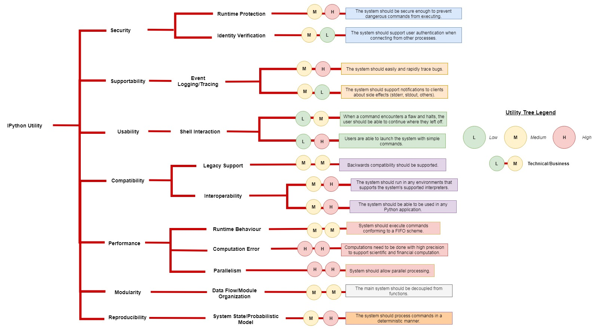
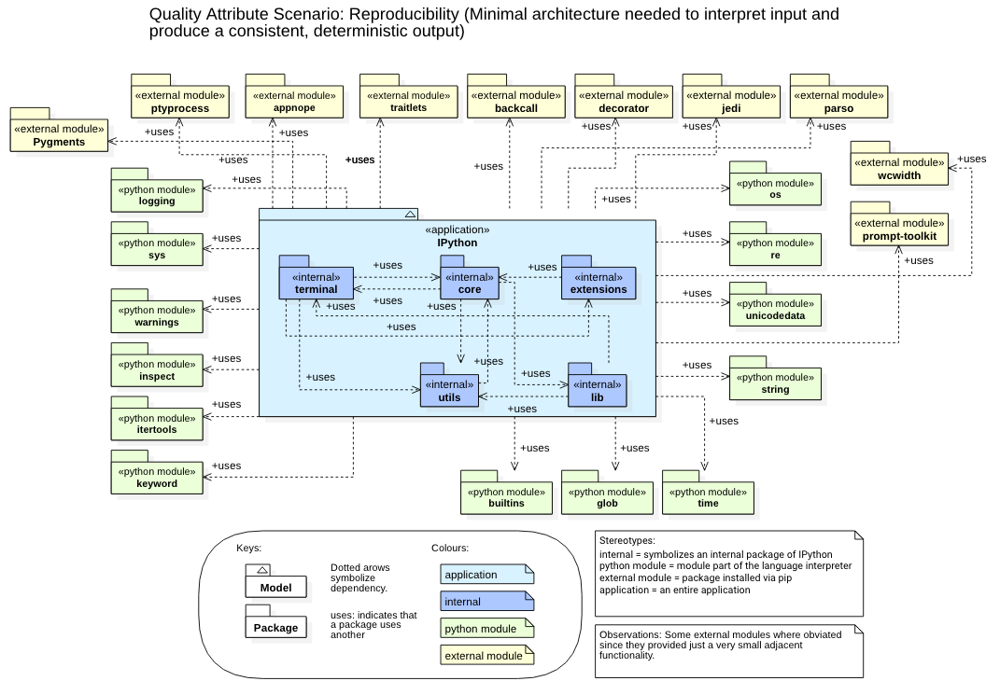
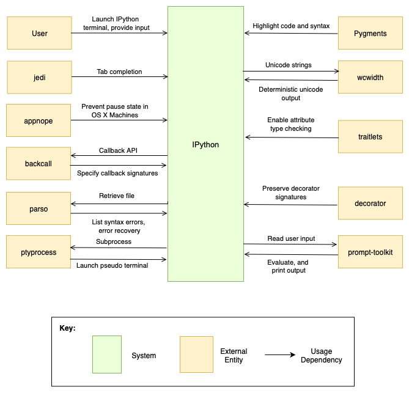
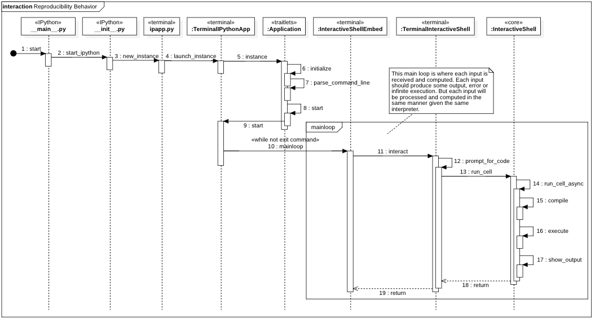
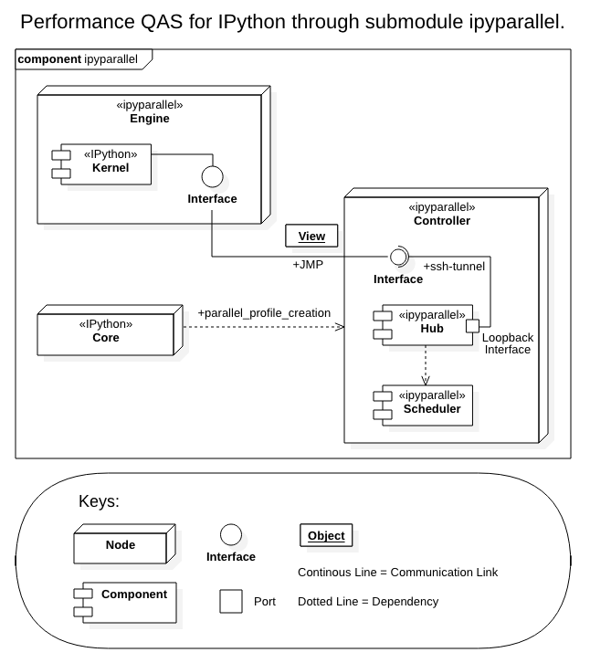
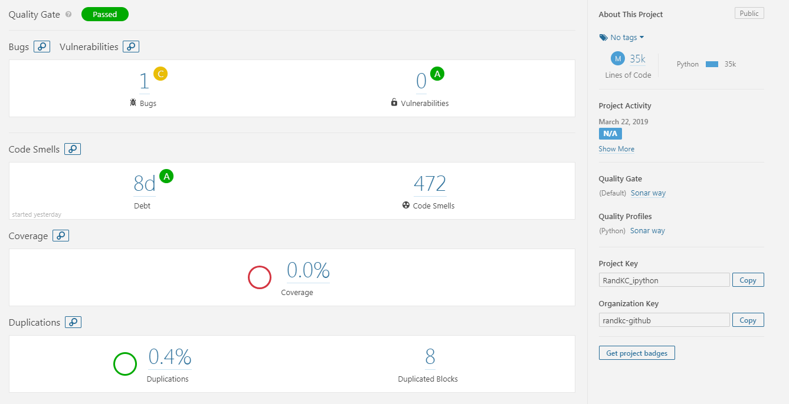
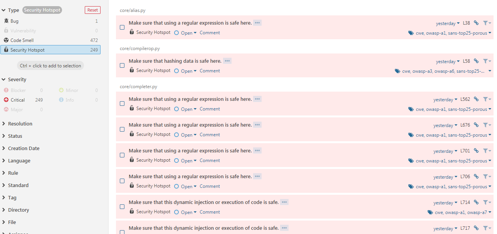
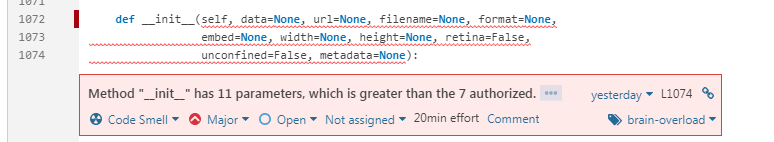
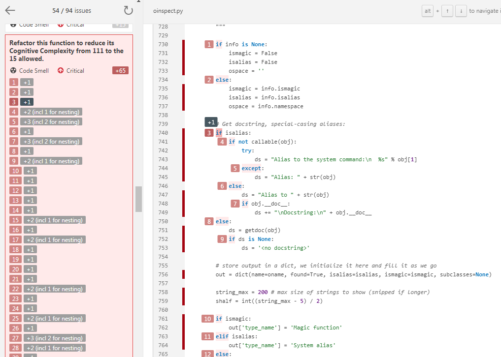
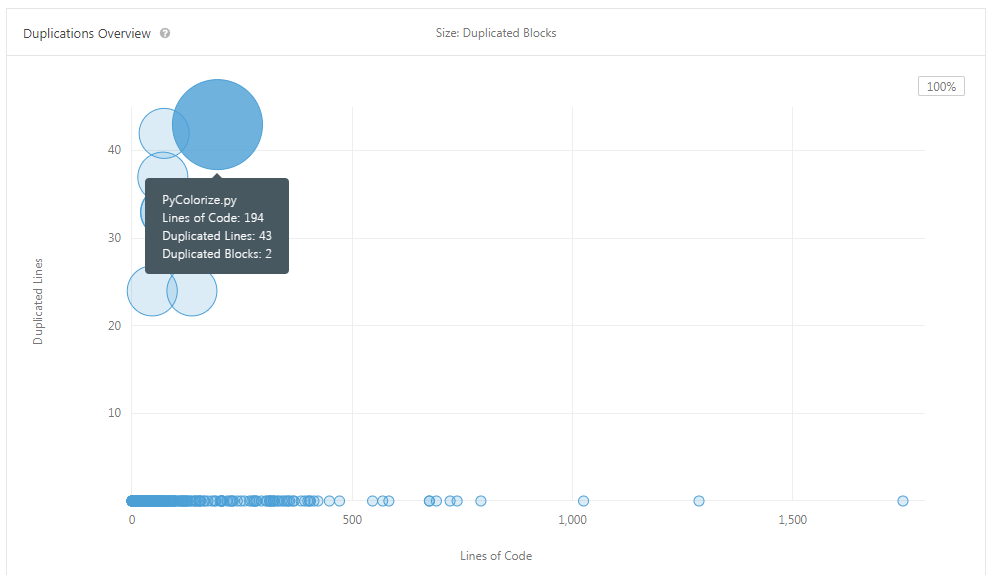

# IPython: Python Interactive Console

## 1.0 Introduction

 IPython is an open source project that was originally developed by Fernando Perez in 2001 while completing his graduate degree \[1\]. The main feature of IPython is its interactive interpreter. This was created to provide a comprehensive environment that improves interactive and exploratory computing. IPython's objective is to provide a superior interactive shell, serve as an embeddable interpreter, offer a flexible framework for working with other systems, and allow interactive testing of threaded graphical toolkits \[2\].

IPython was originally created with three main components \[2\]:

* An enhanced interactive Python shell
* A decoupled two-process communication model
* An architecture for interactive parallel computing

These components have been expanded upon and modularized with the evolution of IPython.  Although IPython still provides the base for interactive shells, the parallel computing aspect has been separated from the main IPython application into ipyparallel. The decoupled two-process model has also remained a large part of IPython. However, most of this is now part of the Jupyter project \[2\].

IPython has been developed to run on Linux, Mac OS X, Windows, and other Unix-like OSs. It just requires that the system have Python installed \[2\]. In this documentation, we discuss the stakeholders for IPython in Section 2.0, IPython's business goals in Section 3.0, and privacy and ethics related to the system in Section 4.0. Then in Section 5.0 we detail the architecturally significant requirements and key quality attributes relevant to the system. Section 6.0 presents the module view of the system, including a primary presentation, element catalog, context diagram, behaviour diagram, and rationale. Section 7.0 presents the component and connector view of the system and includes the same subsections as Section 6.0 plus interface documentation and a variability guide. In Section 8.0 we analyze the technical debt of the system. Finally, in Section 9.0 we detail the pull request made for IPython.

## 2.0 Stakeholders

This section presents the stakeholders for the IPython system.

**Definition.** A stakeholder in the architecture of a system is an individual, team, organization, or classes thereof, having an interest in the realization of the system. ~ Software Systems Architecture \(Rozanski, Woods\)

The stakeholders of the system were classified according to the following guides:

* Software Systems Architecture \(Rozanski, Woods\) / Stakeholders / Stakeholder Categorization
* Item _3.5. Stakeholders_ of the textbook.

<table>
  <thead>
    <tr>
      <th style="text-align:left">Role</th>
      <th style="text-align:left">Concerns</th>
      <th style="text-align:left">Instances</th>
    </tr>
  </thead>
  <tbody>
    <tr>
      <td style="text-align:left">Acquirers</td>
      <td style="text-align:left">Oversee the procurement of the system or product</td>
      <td style="text-align:left">Not available for this project</td>
    </tr>
    <tr>
      <td style="text-align:left">Assessors</td>
      <td style="text-align:left">Oversee the system&#x2019;s conformance to standards and legal regulation</td>
      <td
      style="text-align:left">From a legal perspective, Project Jupyter and hence IPython is part of
        the NumFOCUS Foundation, a 501(c)3 organization dedicated to support research,
        development and education in open source scientific computing and data
        science. NumFOCUS provides legal structure and fiscal sponsorship for small
        amounts of community-focused project funds. <em>Source: Project Jupyter: Computational Narratives as the Engine of Collaborative Data Science (Grant Proposal).</em>
        </td>
    </tr>
    <tr>
      <td style="text-align:left">Communicators</td>
      <td style="text-align:left">Explain the system to other stakeholders via its documentation and training
        materials</td>
      <td style="text-align:left">We have identified one main communicator for this project, and that is
        Matthias Bussonnier (Carreau). A communicator is someone that explains
        the system to others, now this project doesn&apos;t have someone that holds
        this position officially, but analyzing contributions (commits) to the <code>ipython/doc</code> folder
        we could count <b>78</b> contributions in the form of commits by this user
        alone from 01 Jan 2018 to 24 Jan 2019. Exceeding by far other users in
        documentation contributions.</td>
    </tr>
    <tr>
      <td style="text-align:left">Developers</td>
      <td style="text-align:left">Construct and deploy the system from specifications (or lead the teams
        that do this)</td>
      <td style="text-align:left">For this category we used the top 20 committers for the project since
        its inception. The list is as follows: @minrk (4,150), @takluyver (2,249),
        @Carreau (1,787), @jdfreder (1,746), @ellisonbg (1,359), @fperez (1,016),
        @ivanov (572), @jhamrick (209), @damianavila (191), @vivainio (178), @bfroehle
        (144), @tkf (135), @jasongrout (134), @SylvainCorlay (133), @srinivasreddy
        (91), @GaelVaroquaux (88), @ssanderson (78), @rgbkrk (70), @Zsailer (61),
        @juliantaylor (52). Now this list does not differentiate between committers
        of code, documentation or other type.</td>
    </tr>
    <tr>
      <td style="text-align:left">Maintainers</td>
      <td style="text-align:left">Manage the evolution of the system once it is operational</td>
      <td style="text-align:left">The maintainers of this project which belongs to a set of what the developers
        call an &quot;umbrella&quot; of projects surrounding the IPython project,
        is the <b>Jupyter Steering Council</b>, whose role is to ensure, through
        working with and serving the broader Jupyter community, the long-term well-being
        of the project, both technically and as a community. The Jupyter Steering
        Council currently consists of 16 members. The full list can be found
        <a
        href="https://jupyter.org/about.html">here</a>.</td>
    </tr>
    <tr>
      <td style="text-align:left">Production Engineers</td>
      <td style="text-align:left">Design, deploy, and manage the hardware and software environments in which
        the system will be built, tested, and run</td>
      <td style="text-align:left">Not available for this project.</td>
    </tr>
    <tr>
      <td style="text-align:left">Suppliers</td>
      <td style="text-align:left">Build and/or supply the hardware, software, or infrastructure on which
        the system will run</td>
      <td style="text-align:left">Not available for this project.</td>
    </tr>
    <tr>
      <td style="text-align:left">Support Staff</td>
      <td style="text-align:left">Provide support to users for the product or system when it is running</td>
      <td
      style="text-align:left">
        
This would be the community of users:

        <ul>
          <li><a href="http://stackoverflow.com/questions/tagged/ipython">http://stackoverflow.com/questions/tagged/ipython</a>
          </li>
          <li><a href="https://mail.python.org/mailman/listinfo/ipython-dev">https://mail.python.org/mailman/listinfo/ipython-dev</a>
          </li>
          <li><a href="https://github.com/ipython/ipython/issues">https://github.com/ipython/ipython/issues</a>
          </li>
          <li><a href="http://www.reddit.com/r/IPython">http://www.reddit.com/r/IPython</a>
          </li>
        </ul>
        </td>
    </tr>
    <tr>
      <td style="text-align:left">System Administrators</td>
      <td style="text-align:left">Run the system once it has been deployed</td>
      <td style="text-align:left">Not available for this project.</td>
    </tr>
    <tr>
      <td style="text-align:left">Testers</td>
      <td style="text-align:left">Test the system to ensure that it is suitable for use</td>
      <td style="text-align:left">This would be the same as the <a href="https://github.com/SENG480/project-team-8/blob/master/MS01.md#developers">Developers</a> and
        <a
        href="https://github.com/SENG480/project-team-8/blob/master/MS01.md#maintainers">Maintainers</a>.</td>
    </tr>
    <tr>
      <td style="text-align:left">Users</td>
      <td style="text-align:left">Define the system&#x2019;s functionality and ultimately make use of it</td>
      <td
      style="text-align:left">
        
There are different types of users for this system:

        <ul>
          <li>Programmers: Provides a fast medium for testing and debugging Python code.</li>
          <li>Data Scientist: Provides an interface for exploratory programming, especially
            when combined with other project, Jupyter Project.</li>
          <li>Any user who wants to experiment with Python&apos;s REPL (Read-Eval-Print-Loop)
            environment.</li>
        </ul>
        </td>
    </tr>
    <tr>
      <td style="text-align:left">Sponsors</td>
      <td style="text-align:left">Provide monetary support in the form of grants.</td>
      <td style="text-align:left">
        
The following institutions provide funding for the Jupyter Project, and
          consequently the IPython project.

        <ul>
          <li>The Leona M. and Harry B. Helmsley Charitable Trust</li>
          <li>Alfred P. Sloan Foundation</li>
          <li>Gordon and Betty Moore Foundation</li>
          <li>Google</li>
          <li>rackspace</li>
          <li>fastly</li>
          <li>Horizon 2020 European Union funding for Research &amp; Innovation</li>
          <li>Microsoft</li>
        </ul>
      </td>
    </tr>
    <tr>
      <td style="text-align:left">Institutional Partners</td>
      <td style="text-align:left">Institutional Partners are organizations that support the project by employing
        Jupyter Steering Council members.</td>
      <td style="text-align:left">
        
Current Institutional Partners include:

        <ul>
          <li>Anaconda</li>
          <li>Bloomberg</li>
          <li>Netflix</li>
          <li>Cal Poly</li>
          <li>Berkeley University of California</li>
          <li>QuantStack</li>
          <li>JPMorgan Chase &amp; Co.</li>
          <li>Two Sigma</li>
        </ul>
      </td>
    </tr>
  </tbody>
</table>## 3.0 Business Goals

This section presents IPython's business goals. Business goals represent the expectations and requirements needed to satisfy the various objectives of stakeholders within an organization. The following goals are within the interests of IPython’s stakeholders:

* Provide an improved interactive Python shell environment for code developers. \[2\]
* Support explorative features suited for scientific computation tasks such as data analysis, and data visualization. \[2\]
* “Offer a flexible framework which can be used as the base environment for working with other systems”. \[2\]
  * Most notably, IPython supplies computation and communication with front-end interfaces and acts as a kernel for Jupyter. \[3\]
* Provide facilities for distributed & parallel computing. \[3\]
  * Specifically, allow users to develop, test, debug, execute, and observe parallel and distributed applications interactively. \[4\]
* Compete with existing scientific computation environments as an open-source and free alternative. \[5\]
* Allow reproducible and collaborative research computation to be conducted. \[6\]
  * Includes data comparison, organization, and modularity of code. \[6\]
  * Give a _computational narrative_; allow collaborators to understand code and provide context to target audience \[7\]
* Maintain and manage the quality of IPython \(via [Maintainers](https://github.com/SENG480/project-team-8#maintainers) and [Support Staff](https://github.com/SENG480/project-team-8#support-staff)\).

## 4.0 Privacy and Ethics

This section presents an ethical analysis of the IPython system. This includes a discussion of potential privacy and security concerns and ethical dilemmas presented by the system. These were evaluated for accordance with the ACM Code of Ethics and Professional Conduct.

### 4.1 Introduction

IPython is a software system that began development in 2001. It’s goal is to provide an environment that combines shell-like features with MatLab numerics as well as object introspection. The original goal was to combine and improve upon IPP \(Interactive Python Prompt\) and LazyPython to create a more unified and flexible system \[8\]. As IPython has continued development, it has become open source and allowed for multiple contributors. Throughout this report we will evaluate and comment on the developers adherence to the ACM Code of Ethics and Professional Conduct \[9\]. This will determine how the computing professionals have adhered to the fundamental ethical principles and provided ethical remedies where necessary.

### 4.2 Potential Privacy and Security Concerns

This section of the report will evaluate IPython’s accordance to Section 1.6 and Section 1.7 of the ACM Code of Ethics and Professional Conduct. These sections of the code consider privacy and confidentiality. Specifically, that computing professionals should “respect privacy” \[9\] and “honour confidentiality” \[9\]. Additionally, any security concerns with IPython will be addressed and how these concerns relate to the ACM Code of Ethics and Professional Conduct \[9\].

IPython is an open source project, meaning it pertains to “software whose source code is available free of charge to use, copy, modify, sublicense, or distribute” \[10\]. Thus, a number of different people contribute to this project. Each of these contributors need to follow the licenses for the software, and the IPython team needs to ensure that the licenses and policies are followed. The IPython team also need to determine how much monitoring of the system is necessary to ensure proper functionality and security of the system. Due to the open source nature of IPython, the developers must take into consideration the international nature of the internet and ensure that security and privacy is maintained across borders.

Other concerns that may have been encountered include deciding which bugs were relevant. As bug reports get submitted on GitHub, the IPython team must decide whether these bugs impact the system’s security/privacy and determine if they should be fixed. As IPython grew, a security model was developed to “prevent the execution of untrusted code without explicit user input” \[11\]. The developers of IPython ensured they were transparent and documented these issues online in accordance with Section 1.3 of the ACM Code of Ethics and Professional Conduct. In this documentation, IPython stated that the developers hoped to create an environment that allowed for arbitrary code execution and desired to reduce impact on the systems utility caused by limiting functionality. This raised security concerns as the popularity of IPython rose as the possibility for users with malicious intent increased \[11\].

Additional information about security concern for IPython has been documented heavily by the IPython team. This documentation is available online and states both the concerns as well as their solutions \[12\].

### 4.3 Ethical Dilemmas

This section of the report will evaluate IPython’s accordance with Section 1.1 through 1.5 of the ACM Code of Ethics and Professional Conduct. These sections of the code consider general ethical principles. These include how the project will contribute to society and human well-being while recognizing the stakeholders, as well as minimizing harm, and being honest, fair, trustworthy, respectful, and non-discriminatory.

IPython is open source software, and it provides technology for free to everyone with access to the internet. By providing a platform for interactivity and collaboration with others in the Python environment, IPython creators took an idea that existed across separate platforms and combined it to create a unified system \[8\]. Thus, the IPython team provides technology that benefits people in a way that is also accessible. This is in accordance with Section 1.1 which states that computing professionals should use their skills to benefit the environment and the people in it by minimizing threats to health, safety, personal security, and privacy \[9\].

Various people can work on IPython which raises some ethical concerns and considerations. First, there is the question of the integrity of those who work on the project. To follow the code, Section 1.3 states that each individual should be honest about their qualifications and limitations with respect to a task, reveal all conflicts of interest, honor commitments, and must not misrepresent IPython or speak for IPython if not authorized to do so \[9\]. IPython creator Fernando Perez has stated that he had no software background \[13\]. Thus, he was upfront about his own education and limitations. Every other member who contributes to the project must also follow this Section to be in accordance with the code.

Second, since it is open source, there is the question of who is able to work on the project. This should be fair, non discriminatory, and avoid harm to be in accordance with Section 1.2 and Section 1.4 of the code \[9\]. All proposed contributions for IPython are subject to a peer-review process and all code must pass almost 1600 tests before being committed \[12\]. Even members of the core IPython team must go through this process \[12\], which implies this process is fair and does not provide advantage to one person over another. However, each individual must ensure when peer-reviewing that they are not discriminating against the creator of an idea.

Lastly, as with any open source work, the authorship of code must be considered. IPython’s policy is to use a shared copyright model. This means that each contribution, which is usually just a change to the code, is copyrighted by its author. However, the source code is copyrighted by the whole IPython Development Team \[14\]. This is in accordance with Section 1.5 of the code, which states that when a person adds value to society they should acquire value as a result by giving the creator of the work credit. Additionally, when work has been made a public resource, the computing professional should not claim ownership \[9\]. This is exactly what IPython did.

### 4.4 Summary

Overall, IPython, like all software systems, has most likely run into privacy and ethical concerns throughout development. This report has mentioned some privacy concerns and ethical dilemmas that IPython may have faced throughout the development process. It then related these to the sections of the ACM Code of Ethics and Professional Conduct to see if IPython is in accordance with the code.

## 5.0 Architecturally Significant Requirements

This section presents the architecturally significant requirements \(ASRs\) for the system. It then presents the key quality attributes determined from these ASRs and quality attribute scenarios for these quality attributes. These are summarized in a utility tree which includes a rating for each QAS's technical and business priority. 

### 5.1 Listing of ASRs

The table below lists the architecturally significant requirements for IPython, derived from the business goals. These fall into the categories of system constraints, functional requirements, and quality attribute requirements.

| ASR |
| :--- |
| The system should be able to support multiple interpreters. |
| The commands should be executed in sequence conforming to a FIFO scheme. |
| The system should allow parallel processing. |
| A language independent data format should be used to pass data and metadata. |
| The system should be secure enough to prevent dangerous commands from executing. |
| The system should support user authentication when connecting from other processes. |
| Backward compatibility should be supported. |
| The system should allow to easily and rapidly trace bugs. |
| Computations need to be done with high precision to support scientific and financial computation. |
| The user should be able to try different parameters easily. |
| The system should run in any environment that supports the system's supported interpreters. |
| The system should support notifications to clients about side effects \(stderr, stdout, others\). |
| Execution of commands should be signed. |
| The system should be able to be used in any Python application. |
| Executed commands should be stored in a database. |
| The system should be setup in a way that allows to rapidly add new functions. |
| The main system should be decoupled from functions. |
| When a command encounters a flaw and halts, the user should be able to continue where he left off. |
| The system should process commands in a deterministic manner. |
| The user should be able to launch the system with simple commands. |
| The system should be easily maintainable. |

### 5.2 Quality Attribute Scenarios

Below is a list of seven of the quality attribute scenarios \(QASs\) derived from the above ASRs.

* **Security**
  * The system prevents the ability to execute dangerous commands 99.99% of the time
* **Supportability**
  * Developers should be able to diagnose/solve issue reports in less than 1 person week
* **Usability**
  * A user in a particular context searches for help and the system provides it
* **Compatibility**
  * A user running Python 3 on VAX is able to deploy and execute IPython with no atypical packaging problems
* **Performance**
  * A cell begins execution within 500 milliseconds
* **Modularity**
  * Split IPython core into decoupled external packages in &lt; 3 person months
* **Reproducibility**
  * When the system is provided the same input, the system must create the same output 100% of the time.

Three of the above QAS will be be expanded below in template form. There are seven components to each of the scenarios in template form.

1. **Scenario name** - the name of the scenario
2. **Business goals** - the impacted business goals
3. **Quality attributes** - the key quality attribute involved in the scenario
4. **Stimulus** - a condition that affects the system
5. **Stimulus source** - an entity that generates a stimulus
6. **Response** - the activity that results because of the stimulus
7. **Response measure** - the measure by which the system's response will be evaluated

#### Reproducibility

| Aspect | Details |
| :--- | :--- |
| Scenario Name | Reproduce Code Output |
| Business Goals | Allow reproducible and collaborative research computation to be conducted. |
| Quality Attributes | Reproducibility |
| Stimulus | Users should be able to introduce Python code. |
| Stimulus Source | User executes code and views the output. |
| Response | Output of running the code previously introduced. |
| Response Measure | Same output for the same input. |

#### Performance

| Aspect | Details |
| :--- | :--- |
| Scenario Name | Parallel Processing |
| Business Goals | Provide facilities for distributed & parallel computing, and support explorative features for scientific computation tasks \(data analysis/visualization. |
| Quality Attributes | Performance |
| Stimulus | Users should be able to introduce Python code. |
| Stimulus Source | Users executing computational intensive tasks. |
| Response | Divide the work into clusters \(parallel processing\) and process it, generating a single response. |
| Response Measure | Integrity of the data resulting from the computation. |

#### Usability

| Aspect | Details |
| :--- | :--- |
| Scenario Name | Usable Environment |
| Business Goals | Provide an improved interactive Python shell environment for code developers. |
| Quality Attributes | Usability |
| Stimulus | Users should be able to introduce Python code. |
| Stimulus Source | Users wanting to execute any type of Python code, from simple ones to more complex functions. |
| Response | Able to provide an interface that is simple to use. |
| Response Measure | The ability for a user to successfully interact with IPython and execute Python code. |

### 5.3 Utility Tree

## 6.0 Module View

This section presents the module view for the system. This includes a primary presentation diagram, an element catalog, a context diagram, a behaviour diagram, and rationale for why we believe the developers designed the system this way.

### 6.1 Primary Presentation

A module view shows the elements of a system, their relations, and their usage. This demonstrates what dependencies exist between packages and which packages are necessary to perform an operation. To narrow the scope from the entire project, we built our primary presentation while considering the quality attributes we determined were important to IPython. Specifically, we were thinking about reproducibility when this diagram was created.

### 6.2 Element Catalog

Below are descriptions of the main elements in the primary view presented above.

#### IPython 

IPython stands for Interactive Python. The main logic of the program is implemented in this module. This module provides the following functionality:

* Logs history of input and ensures consistency across sessions
* Provides tab completion for python variables, keywords, etc.
* Caches output results
* Ease of interaction for switching between setups

IPython is the main application which interacts with the external libraries pictured in the diagram.

#### core 

This package contains the core implementation of IPython. This includes [interactiveshell.py](https://github.com/ipython/ipython/blob/master/IPython/core/interactiveshell.py) which is the main IPython class. The core interacts with other packages within the IPython module.

#### utils 

This package contains utility classes utilized by the IPython module. These include utilities for version comparison, for gathering information about IPython and the system its running in, as well as many others. Each sub-module in this package should contain functions and classes that have a singular purpose and do not depend on components of the rest of IPython.

#### lib 

This package contains extended capabilities of IPython which do not have to adhere to the official IPython extension API. This includes classes that allow for demonstrations of iPython, lexers to highlight python code, as well as tools for handling LaTex.

#### terminal 

The terminal package contains another implementation of [interactiveshell.py](https://github.com/ipython/ipython/blob/master/IPython/terminal/interactiveshell.py) that provides a terminal interface using prompt\_toolkit.

#### extensions 

The extensions package contains extensions that are used by the IPython application. This includes the extensions [autoreload.py](https://github.com/ipython/ipython/blob/master/IPython/extensions/autoreload.py), which automatically reloads modules before executing code typed on the IPython prompt, and [storemagic.py](https://github.com/ipython/ipython/blob/master/IPython/extensions/storemagic.py), which stores variables, aliases, and macros in IPython's database.

### 6.3 Context Diagram

Following the SEI view documentation, this context diagram illustrates the IPython system in relation to an environment presented in the previous primary view. In this instance, the context diagram demonstrates IPython's interaction with its external modules depicted as entities and their corresponding relationships. The IPython system relies on the user to launch the IPython terminal and provide input before calling on the modules, parso, wcwidth, prompt-toolkit, jedi, etc. in order to create reproducible output.

### 6.4 Behaviour Diagram

A behaviour diagram helps us reason about the interaction between elements and allows us to draw a direct relation between the code and a use case. For IPython, we have chosen to use a trace-based notation, specifically a sequence diagram, which describes the system's response to a specific stimulus. Our sequence diagram closely follows the following quality attribute scenario for reproducibility.

#### Reproducibility QAS 

| Aspect | Details |
| :--- | :--- |
| Scenario Name | Reproduce Code Output |
| Business Goals | Allow reproducible and collaborative research computation to be conducted. |
| Quality Attributes | Reproducibility |
| Stimulus | Users should be able to introduce Python code. |
| Stimulus Source | User executes code and views the output. |
| Response | Output of running the code previously introduced. |
| Response Measure | The same output should result every time the same input is run. |

#### Reproducibility Sequence Diagram

### 6.5 Rationale

This section presents an explanation for why we think the designers organized the system’s modules the way that they did.

IPython provides a comprehensive environment for interactive computing. Since the beginning, the goal of IPython has been to create an environment for both regular and scientific computing. With this in mind, IPython needs to be capable of producing the same output repeatably when it takes in the same input. IPythons design aims for high reproducibility in order to create a reliable system for its users. As identified in our QAS for the project, IPython also needs to be modular, secure, compatible on all systems, and usable.

IPython is built around five main packages. As seen in our primary view, these packages are terminal, core, extensions, utils, and lib. By splitting IPython into these packages, the developers created a distinction between sections of the code and the codes purpose. As stated in our element catalog, the terminal package is used for interactions with the user on the terminal, while the main functionality of IPython is implemented in the core package. The utils, lib, and extensions packages each contain distinct "helper" classes and utilities which can be used by the core. For example, the utils package contains sub-modules which do not rely on the rest of the IPython application. This allows these sub-modules to stand on their own and be used by other packages in IPython. Thus, it is much easier to add new sub-modules as needed and easier to work with the code for developers.

Our behaviour diagram also demonstrates this distinction. In the diagram, interactions with the terminal and user involve the terminal package while the main processing of the input occurs in the core package. It makes sense to place these capabilities into separate modules as the code has different purposes. In this diagram, we are able to see that to solve problems involving reproducibility developers would need to turn to the core package implementation, whereas if there was an issue with terminal unresponsiveness, developers would need to look in the terminal package.

Additionally, considering the quality attribute security, these five packages easily allow the developer to consider security in different parts of the system. For example, for security of data the developers could consider how the data is processed which is encompassed in the core package. When the core uses extensions or additional packages from util, the developers can consider whether distinct security measures are needed or how security might differ for each of these classes.

Considering usability from the user perspective, the ability to add extensions and additional packages can greatly enhance user experience. When usability issues for the users arise, extensions to IPython can be added to the appropriate package and then can be more seamlessly integrated into the overall application. Contrast this with trying to directly add extensions to the core package, which would likely be much more difficult.

Overall, we believe that the developers organized their code into these distinct modules to aid in achieving the quality attributes important to their application. Additionally, the module setup of this application makes logical sense and segregates code with different purposes into distinct packages within the application.

## 7.0 Component and Connector View

This section presents the component and connect view for the system. This includes a primary presentation diagram, an element catalog, a context diagram, a behaviour diagram, interface documentation, a variability guide, and rationale for why we believe the developers designed the system this way.

### 7.1 Primary Presentation

The style used in this C&C diagram is Pub-Sub one, which depicts the architecture better. IPython offers parallelization capabilities throught a submodule called **ipyparallel**. This submodule follows a Pub-Sub architecture, where each processing engine \(kernel\) reports to a single Hub, which _observes_ all engines. So, one can consider that the Hub is subscribed to each engine and they in contrast publish results and other artifacts using JMP \(Jupyter Messaging Protocol\) messages. Also there is another component which can be considered a subscriber, and this is the Client \(an IPython client\). This client can also receive results and artifacts from each engine, but only through the Hub, it can not subscribe itself to receive updates directly from engines. In reverse all engines are also at the same time subscribers, since they can receive commands to be executed by the Schedulers, also only through the Hub.

All interaction between IPython and ipyparallel is done from within IPython through the creation of a parallel profile. This allows IPython interactive shell to receive the results of the computations submitted.

### 7.2 Element Catalog

Below are descriptions of the main elements in the primary view presented above

#### Engine \(ipyparallel\)

* **Relations**
  * Kernel \(IPython\), Controller \(ipyparallel\)
* **Useful For**
  * The IPython engine is an extension of the IPython kernel for Jupyter. The engine listens for requests over the network, runs code, and returns results. IPython parallel extends the Jupyter messaging protocol to support native Python object serialization and add some additional commands. When multiple engines are started, parallel and distributed computing becomes possible.
* **Quality Attributes Affected**
  * Performance & Modularity
* **Properties**
  * Queue size
  * Communication timeout
* **Element Interfaces**
  * Connector to ZeroMQ, where this component handles input & output. This component receives messages in the form of messages in an external queue component \(ZeroMQ\), and consequently returns messages via this interface as well.
  * `ipcontroller-engine.json`: This JSON file has the information necessary for an engine to connect to a controller.
  * The two primary models for interacting with engines are:
    * A Direct interface, where engines are addressed explicitly
    * A LoadBalanced interface, where the Scheduler is entrusted with assigning work to appropriate engines
* **Element Behavior**
  * Can run locally or in a distributed mode. The location of each engine is irrelevant, as long as the controller can communicate with this component, usually through a SSH-Tunnel.

#### Kernel \(IPython\)

* **Relations**
  * Engine \(ipyparallel\)
* **Useful For**
  * IPython kernel. Its tasks is to serve as a base for the engine \(ipyparallel\).
* **Quality Attributes Affected**
  * Performance, Modularity, Inheritance

#### Controller \(ipyparallel\)

* **Relations**
  * Hub \(ipyparallel\)
  * Scheduler \(ipyparallel\)
  * Engine \(ipyparallel\)
* **Useful For**
  * The IPython controller processes provide an interface for working with a set of engines. At a general level, the controller is a collection of processes to which IPython engines and clients can connect. The controller is composed of a Hub and a collection of Schedulers. These Schedulers are typically run in separate processes on the same machine as the Hub. The controller also provides a single point of contact for users who wish to access the engines connected to the controller. There are different ways of working with a controller. In IPython, all of these models are implemented via the `View.apply()` method, after constructing View objects to represent subsets of engines.
* **Quality Attributes Affected**
  * Performance & Modularity
* **Element Interfaces**
  * The two primary models for interacting with engines are:
    * A Direct interface, where engines are addressed explicitly
    * A LoadBalanced interface, where the Scheduler is entrusted with assigning work to appropriate engines

#### Hub \(ipyparallel\)

* **Relations**
  * Scheduler \(ipyparallel\)
  * Engine \(ipyparallel\)
* **Useful For**
  * The center of an IPython cluster is the Hub. This is the process that keeps track of engine connections, schedulers, clients, as well as all task requests and results. The primary role of the Hub is to facilitate queries of the cluster state, and minimize the necessary information required to establish the many connections involved in connecting new clients and engines.
* **Quality Attributes Affected**
  * Performance & Modularity
* **Properties**
  * Queue size
  * Communication timeout
* **Element Interfaces**
  * There is one primary object, the Client, for connecting to a cluster.
  * `ipcontroller-client.json`: The client’s connection information. This may not differ from the engine’s, but since the controller may listen on different ports for clients and engines, it is stored separately.
* **Element Behavior**
  * Allows connections and queries to request the state of the cluster.

#### Scheduler \(ipyparallel\)

* **Relations**
  * Hub \(ipyparallel\)
  * Engine \(ipyparallel\)
* **Useful For**
  * All actions that can be performed on the engine go through a Scheduler. While the engines themselves block when user code is run, the schedulers hide that from the user to provide a fully asynchronous interface to a set of engines.
* **Quality Attributes Affected**
  * Performance & Modularity
* **Element Interfaces**
  * A LoadBalanced interface, where the Scheduler is entrusted with assigning work to appropriate engines

#### Core \(IPython\)

* **Relations**
  * Controller \(ipyparallel\)
  * Hub \(ipyparallel\)
  * Scheduler \(ipyparallel\)
  * Engine \(ipyparallel\)
* **Useful For**
  * Creating parallel IPython profiles, which are needed to run IPython in distributed mode.
* **Quality Attributes Affected**
  * Performance & Modularity
* **Element Behavior**
  * Creates a IPython parallel profile via the `TerminalIPythonApp` class and the `traitless` module. See behavior diagram for more information on exactly how this process works.
* **Element Interfaces**
  * ProfileApp
  * ProfileCreate

#### View \(ipyparallel\)

* **Relations**
  * Core \(IPython\)
  * Hub \(ipyparallel\)
  * Scheduler \(ipyparallel\)
  * Engine \(ipyparallel\)
* **Useful For**
  * Views allow users to interact with a set of engines through the interface.
* **Quality Attributes Affected**
  * Performance & Modularity
* **Element Interfaces**
  * The DirectView class for explicit addressing.
  * The LoadBalancedView class for destination-agnostic scheduling.
* **Element Behavior**
  * For each execution model, there is a corresponding `View`.

### 7.3 Context Diagram

As a follow-up to the primary C&C presentation and according to SEI view documentation, this context diagram illustrates the IPython system in relation to an environment with respect to performance and parallel processing for scientific data. For demonstration purposes, the diagram will refer to both terminal and kernel processes as part of the same IPython system.

Here, the context diagram shows the IPython system as the primary point of execution, with all necessary computational packages used internally, and the ipyparallel components used to send and receive data to a Jupyter Notebook invoked by the user\(s\) or client\(s\).

### 7.4 Behaviour Diagram

A behaviour diagram helps us reason about the interaction between elements and allows us to draw a direct relation between the code and a use case. For IPython, we have chosen to use a trace-based notation, specifically a sequence diagram, which describes the system's response to a specific stimulus. Our sequence diagram closely follows the following quality attribute scenario for performance.

#### Performance QAS  

| Aspect | Details |
| :--- | :--- |
| Scenario Name | Parallel Processing |
| Business Goals | Provide facilities for distributed & parallel computing, and support explorative features for scientific computation tasks \(data analysis/visualization\). |
| Quality Attributes | Performance |
| Stimulus | Users should be able to introduce Python code. |
| Stimulus Source | Users executing computational intensive tasks. |
| Response | Divide the work into clusters \(parallel processing\) and process it, generating a single response. |
| Response Measure | The correct answer is delivered and the user is not made aware of how the parallelism was implemented. |

#### Performance Sequence Diagram

### 7.5 Interface Documentation

This section details two interfaces of IPython. It outlines the way that Jupyter interfaces with IPython, as well as ipyparallel.

#### 7.5.1 Interface One 

#### Interface Identity 

Kernel creation in ipykernel

#### Resources 

The independent application ipykernel works with ipython to interact with Jupyter. To do this, ipykernel utilizes the `ipython.core.InteractiveShell` module. Within `InteractiveShell` ipykernel has a class `IPython.core.interactiveshell.InteractiveShellABC` that is used by ipykernel.

**Resource Syntax** 

`Ipython.core.interactiveshell.InteractiveShellABC`   
Bases: object

**Resource Semantics** 

`InteractiveShellABC` uses abc from Python’s io library which creates an abstract base class of InteractiveShell.

**Resource Error Handling** 

Because this is an abstract class definition, no errors are handled here. However, when defining elements for the abstract class, errors are handled by the class itself.

#### Data Types and Constants 

The `InteractiveShellABC` class creates an abstract base class for `InteractiveShell`. This creates an object that has access to the methods within `InteractiveShell`. Within these methods, there are many different data types used. For example there are objects such as `loop_runner_map` that has the variables `'asyncio':(_asyncio_runner, True), 'curio':(_curio_runner, True), 'trio':(_trio_runner, True), 'sync':(_pseudo_sync_runner, False)`.

#### Error Handling 

Error handling is done independently in the different methods which can be inherited by the abstract class from `InteractiveShell`. If they are not overridden, the methods in `InteractiveShell` handle the errors. If they are overridden by a class which uses `InteractiveShell` as a base class, the written code should implement its own error handling.

#### Variability 

The specific resources used by ipykernel allow for some variability. Within ipykernel there is a module `ipykernel.ipykernel.zmqshell` that is meant to refactor the base InteractiveShell into something with a cleaner architecture for 2-process use. This module creates a subclass to override what it wants to fix. For example, `ipython.ipython.zmqshell.KernelMagics(Magics)` overrides magics that exist within `InteractiveShell`. This is heavily documented within zmqshell.py.

#### Quality Attribute Characteristics 

This interface concerns several quality attributes. Firstly, it allows ipykernel to create a shell object which is given `shell_class = Type(ZMQInteractiveShell)`. This sets up the interactive shell so that ipykernel can talk to Jupyter. Thus, this concerns performance, because talking with Jupyter is necessary to perform computations. It also concerns security because of the use of ZeroMQ to exchange messages over the network. IPython does not yet support ZeroMQ's encryption and authentication. Therefore, no IPython connections are encrypted. This means it does not provide significant security.

#### Rationale and Design Issues 

By abstracting out ipykernel from ipython, it allowed the developers to more easily refactor the base InteractiveShell. Specifically, by implementing the ZMQ-based subclass of InteractiveShell within ipykernel it enabled a cleaner architecture for 2-process use, without actually breaking InteractiveShell itself. However, this is not the prettiest approach, since it requires subclassing and overriding select methods. Until the base class can be refactored for cleaner inheritance this does still let IPython remain independently fully working.

#### Usage Guide 

To use `IPython.core.interactiveshell.InteractiveShellABC`, the following assignment can be made:      `Instance('IPython.core.interactiveshell.InteractiveShellABC', allow_none=True)`.

This creates an instance of `IPython.core.interactiveshell.InteractiveShellABC`. By assigning this to a variable, the developer can now access the methods and variables within `IPython.core.interactiveshell.InteractiveShellABC` and override them as necessary.

#### 7.5.2 Interface Two 

#### Interface Identity 

Client creation in ipyparallel

#### Resources 

IPython and ipyparallel communicate via the ipyparallel client creating a profile which is then used by ipyparallel applications ipclusterapp.py, ipcontrollerapp.py, and ipengineapp.py.

There are two main places that this process occurs in IPython. The first main module that IPython provides to ipyparallel is `core.profiledir`. This module contains two classes, `IPython.core.profiledir.ProfileDir` and `IPython.core.profiledir.ProfileDirError`. Within the `IPython.core.profiledir.ProfileDir` class there are two methods that are utilized by ipyparallel. These methods are `find_profile_dir` and `find_profile_dir_by_name`. The second main module that IPython provides to ipyparallel is IPython.paths.py. Within this module, we are concerned with the method `get_ipython_dir`.

**Resource One: get\_ipython\_dir** 

1. **Resource Syntax**: `get_ipython_dir()`
2. **Resource Semantics**: This gets the IPython directory for this platform and user. This uses the logic in `get_home_dir` to find the home directory and then adds .ipython to the end of the path. It returns the result.
3. **Resource Error Handling**: While there is no explicit error handling in this function, the function does exhibit warnings using the `warn` method which is imported from `warnings`.

**Resource Two: find\_profile\_dir** 

1. **Resource Syntax**: `find_profile_dir(<path of profile directory>, config=None)`
2. **Resource Semantics**: This resource allows ipyparallel to access IPython and find or create a profile dir. If a profile directory does not exist, it will create one. The method then returns the found/created ProfileDir to ipyparallel.
3. **Resource Error Handling**: If it does not find the path of the directory it raises a `ProfileDirError`.

**Resource Three: find\_profile\_dir\_by\_name** 

1. **Resource Syntax**: `find_profile_dir_by_name(<IPython directory to use>, <name of the profile>, config=None)`
2. **Resource Semantics**: This resource finds an existing profile dir by profile name, and returns it ProfileDir. This searches through a sequence of paths for a profile dir. If it does not find the name, a `ProfileDirError` exception will be raised. The search path algorithm is: 1. `os.get_cwd()` 2. `ipython_dir`.
3. **Resource Error Handling**: As stated above, if the name is not found, a `ProfileDirError` exception will be raised.

#### Data Types and Constants 

The `get_ipython_dir` in IPython returns `py3compat.cast_unicode(ipdir, fs_encoding)`. Within the ipyparallel client, this is assigned to the variable `ipython_dir` and is used as a parameter for `find_profile_dir_by_name`. Both the methods `find_profile_dir` and `find_profile_dir_by_name` return `cls(location=profile_dir, config=config)`. The return type of `find_profile_dir` and `find_profile_dir_by_name` is assigned to `self._cd`, which is then used in `__init__` within the ipyparallel Client class to create a url\_file by joining this to the client\_json object.

#### Error Handling 

The only error condition that is raised by the resource on the interface is implemented in the class `IPython.core.profiledir.ProfileDirError`. Throughout `IPython.core.profiledir.ProfileDir` the ProfileDirError is called with an exception as the parameter. This is then passed through by the `ProfileDirError` class. All other resources handle the errors themselves by, for example, creating a new profile\_dir if the profile does not exist already.

#### Variability 

The specific resources used in `ipyparallel.client` do not allow the element to be configured in any way. The profile\_dir object is maintained in IPython and is only retrievable by ipyparallel. However, IPython does provide a method `create_profile_dir_by_name` which does allow users to assign a name to the profile\_dir. This method takes in two parameters: path : unicode - The path \(directory\) to put the profile directory in. name : unicode - The name of the profile. The name of the profile directory will be "profile\_&lt; profile &gt;". This shows that some variability does exist and could be used by ipyparallel.

#### Quality Attribute Characteristics 

The quality attribute characteristic that this interface makes known to it’s element’s users is performance. This interface allows IPython to work with ipyparallel to create a parallel computing environment. By creating this interface it allows for performance to increase drastically.

#### Rationale and Design Issues 

Ipyparallel is an independent package which was separated from the IPython library, but is still connected to IPython via the client interface. A client is created in the client class within ipyparallel and is then used in the application within ipyparallel to connect with external applications, such as Jupyter. This architecture abstracts out parallelism in a general way, enabling IPython to support many styles of parallelism including single program multiple data parallelism, multiple program multiple data parallelism, and many others. Interfacing with IPython enables a variety of parallel applications to be developed, executed, debugged, and monitored. Thus, improving performance.

The methods we discussed in this section help initialize and create the client. They help standardize the way that profiles are created. Therefore, they can easily be found when used.

Although there does not appear to be a significant design issue with interfacing between IPython and ipyparallel, there is a security flaw in ipyparallel when using the received information from IPython. Specifically, when a client connects and authenticates to a controller, the client needs some information which is stored in a JSON file on the controller. IPython uses ZeroMQ for networking and IPython does not yet support ZeroMQ's encryption and authentication. Therefore, no IPython connections are encrypted. This means it does not provide significant security.

#### Usage Guide 

To use the above interface, we need to consider how to use each of the resources.

**Resource One: get\_ipython\_dir** 

`get_ipython_dir()`

**Resource Two: find\_profile\_dir** 

`find_profile_dir(profile_dir, config=None)`

_Parameters:_

* _profile\_dir_ \(unicode or str\) – The path of the profile directory.

**Resource Three: find\_profile\_dir\_by\_name** 

`find_profile_dir_by_name(ipython_dir, name='default', config=None)`

_Parameters:_

* _ipython\_dir_ \(unicode or str\) – The IPython directory to use.
* _name_ \(unicode or str\) – The name of the profile. The name of the profile directory will be “profile\_&lt; profile &gt;”.

### 7.6 Variability Guide

Since IPython is to be used for a variety of different computational tasks, under different circumstances, it is important to consider that behaviour and performance may alter depending on the input and computing environment.

**Custom Configurations**

In IPython, users are able to create and load multiple profiles with different configurations and histories based on the `traitlets` package. If a profile is unspecified, IPython will always execute using the `default` profile. All profiles are usually stored within IPython’s directory, but may also be placed within a working directory for distribution purposes. Multiple custom configurations may be set inside a file named `ipython_config.py`; Or alternatively, through the command line like so: `ipython --ClassName.attribute=value`. For example, you may set the shell to run specific code on startup using `c.InteractiveShellApp.exec_lines =[‘some code’]`, or modify tab completion to behave greedily: `c.IPCompleter.greedy = True`, or even specify the time to wait for messages when aborting queued requests after an error: `IPythonKernel.stop_on_error_timeout = 0.1`.

### 7.7 Rationale

This section presents an explanation of why we believe that the designers organized the system the way that they did.

The primary objective of IPython is to provide a comprehensive computing environment. The main uses of IPython include integration in other applications, namely Jupyter. Recall, one key business goal included the integration of IPython as a base environment in other applications. As Jupyter was derived from IPython, it shares similar values in creating an environment for users to collaborate, and reproduce scientific data computations; thus IPython was utilized as the ‘underlying bridge’ for Jupyter. To integrate these two systems, the applications need access to the `InteractiveShell` within IPython. With ipyparallel and ipykernel as the main interface of IPython, it increases both modularity and performance. As noted in the primary presentation and context diagram, the ipyparallel package in combination with Jupyter, enables IPython to achieve our performance quality attribute of parallelization and distributed computing capabilities in a interactive environment. Ipyparallel offers asynchronous communication between multiple front end clients and IPython’s data computation.

Splitting IPython into a variety of separate components, namely ipykernel and ipyparallel, has allowed for the same functionality to be maintained with communication between the interfaces. Dividing IPython into multiple packages created a clear separation of concerns between projects. For example, for implementing parallelism, developers can now focus solely on ipyparallel, and for interacting with Jupyter via the kernel, developers can now focus solely on ipykernel.

This also concerns our quality attributes. Consider that by placing most of the more complex computational aspects, i.e. parallelism, into one place, the developers can focus here for improvements and for increasing speed or accuracy with which computations occur. This enables the developers to improve performance. Our behaviour diagram also outlines in greater detail how this process would work. It clearly demonstrates the separation between processes that occur in IPython and ipyparallel. From this we can see why the developers would want to separate these processes as it would provide ease of development and maintainability.

Other quality attributes to consider are reproducibility, security, and modularity. The quality attribute reproducibility is involved because both IPython and ipyparallel are used to perform computations and should produce the same input for the same output. When the computation involves parallelism, any issues with reproducibility can be confined to ipyparallel. Additionally, ipykernel allows the connection to Jupyter to be contained in one place. Thus, any issues with security in the connection can be addressed within ipykernel. Finally, IPython has increased their modularity by decoupling their system and segregating the different components. With increased modularity, the system components are able to be independent yet still recombined to create a more organized and efficient system for maintainability.

Overall, the developers have organized the IPython and IPython related code into distinct applications which each contain distinct modules. Some of the modules for IPython were discussed in greater detail in the module view. As the scope of IPython grows, it makes sense to look at it as distinct parts for the sake of modularity, performance, security, and reproducibility. Thus, the separation of IPython, ipykernel, and ipyparallel also makes sense.

## 8.0 Code Quality and Technical Debt

This section presents an analysis of IPython's code quality and technical debt. 

### 8.1 Code Quality Report

#### 8.1.1 Tools Used 

This section will detail the results and analysis of using SonarQube and Pylint to evaluate the quality of the code.

#### 8.1.2 SonarQube 

To examine IPython’s code quality, we used SonarQube to help identify potential technical debt that needs to be addressed. SonarQube is an automated code analysis tool used to identify bugs, vulnerabilities, code smells, coverage, and duplications within a project. SonarQube provides an overview outlining these issues, and a Quality Gate of whether or not the project’s status passes its set of Boolean-based measures in order to be ready for deployment. While this gate may be adjusted according to the project’s requirements, SonarSource provides its own default Quality Gate, 'sonar way' which checks the project against coverage, duplication, maintainability, reliability, and security thresholds. Specifically, the metrics will reduce the project’s rating if the coverage is less than 80%, duplicated lines are greater than 3%, and if the maintainability, reliability, and security metrics fall below an ‘A’ standard. Maintainability rating is based on the ratio of the project’s code base size to estimated time needed to fix the technical debt issues \(all code smells\). Reliability and security ratings are based on the threat level of open issues discovered by SonarQube’s analysis in the project \(vulnerabilities for security, bug issues for reliability\).

**Overview** 

After running the analysis, SonarQube detected and categorized issues accordingly, as shown above. IPython passed the Quality Gate, with a rating of ‘A’ in both security and maintainability and a ‘C’ in reliability due to a detected bug. Overall, IPython was reported to have: 1 Bug, 0 Vulnerabilities, roughly 8 days to resolve technical debt, 472 Code Smells, 0% Coverage, 0.4% Duplications, and 8 Duplicated Blocks.

A SonarCloud instance of the report can be accessed [here](https://sonarcloud.io/dashboard?id=RandKC_ipython).

**Bugs & Vulnerabilities** 

One bug was reported on line 297 in in the `core/magics/basic.py` file. The cause of this is: “Identical expressions should not be used on both sides of a binary operator”. Because the same args was used on both sides of the `and`operator, it was detected as a bug which results in either wasted code, or indicates the need for simplification. The potential cause of the bug may suggest a copy/paste error, however, it appears to be intentional, as the args variable is parsing potentially multiple options provided by an argument string.

While there were no vulnerabilities in the code, 249 Security Hotspots, were found. Within SonarQube’s documentation, Security Hotspots are defined as “security-sensitive pieces of code that should be carefully reviewed by someone with a security auditor hat”. This means that it is recommended that either members of the development team primarily working with the security aspect of the project or contracted reviewers should observe this part of the code to ensure safety. Most of these hotspots regard the sensitivity of regular expressions when used to validate user input, primarily in the context of Regular expression Denial of Service \(ReDoS\) attacks. Other hotspots include dynamic injection, code/OS command execution, and data hashing. The estimated time given by SonarQube to resolve these issues is roughly 3 days and 6 hours.

**Code Smells** 

Code Smells in SonarQube depict maintainability related issues within the codebase; for IPython, the project was analyzed to have 472 Code Smells. Of these Code Smells, 94 were reported as Critical, 195 as Major, and 183 as Minor. Minor issues were often related to renaming variables, classes, etc. to match a consistent regex naming convention for development purposes, or removing unused variables.

Major issues included removing commented code/merging code for readability, renaming functions, taking action for “FIXME” comments, but most notably, functions and methods with a large number of parameters. This is evident mostly in `core/display.py`, and suggests that a function is doing too much or requires a new structure for some parameters.

Critical Code Smells referred entirely to the refactoring of code in order to reduce its ‘Cognitive Complexity’. ‘Cognitive Complexity’, defined by SonarQube, measures the difficulty in understanding the control flow of a function. Thus, making it hard to maintain. The rubric used to assess this is based on nesting control structures and nesting increments within these structures. Each control structure jump adds one to the score, and an additional point may be added according to the degree of nesting. This can be illustrated in the function: `def_info` in `core/oinspect.py`, for its heavy usage of control structures.

**Coverage** 

While the testing coverage is reported to be at 0%, IPython in fact contains its own testing suite, all conducted through the `IPython.testing` subpackage. The `iptest.py` module in particular, holds all the logic necessary to run the testing suite and ensures all dependencies meet the minimum requirements. In addition, each subpackage \(`core`, `extensions`, `lib`, `terminal`, `testing`, `utils`\) has its own tests directory containing tests needed to handle exceptions and cases for their respective package.

**Duplications** 

Duplications in project code may affect project performance, increasing compile time, cognitive load, and even duplication of unwanted bugs if overlooked. Using SonarQube, IPython was found to have some duplicated code, but only at a small percentage. Of all the files within the project, `PyColorize.py` was found to have the highest percentage of duplicate code, with 43 duplicated lines and 2 duplicate blocks. Other files with at least 20 lines of duplication included: `Inputhookglut.py`, `glut.py`, `wx.py`, `_decorators.py`, and `decorators.py`.

**Summary** 

In conclusion, after running an analysis with SonarQube, the recommended areas of focus for IPython to improve code quality are improving readability by reducing the complexity of control flow in the project, ensuring consistency in naming conventions for developers, and removing unnecessary code or comments. Clarification around the detected bug in `core/magics/basic.py` may be valuable to help maintainers understand the logic for magic functions within IPython. On a final note, as one of our identified quality attributes for IPython, security is a concern when executing commands in IPython. The security hotspots may be a point of observation for security developers to ensure the safety of code under different circumstances and conditions; a relevant example, since IPython is used for the Jupyter Notebook web application, attackers may consider ReDoS as a method for resource overflow.

#### 8.1.3Pylint 

This report is concentrated around the five most important packages in IPython, the ones shown in the [Primary View](https://github.com/SENG480/project-team-8/blob/master/Primary_View.png) of [Milestone 3](https://github.com/SENG480/project-team-8/blob/master/MS03.md). These are:

* `core`
* `extensions`
* `lib`
* `terminal`
* `utils`

We used Pylint to analyze possible design problems within the system. As outlined in the [Pylint Docs](https://docs.pylint.org/en/1.6.0/features.html), these correspond to messages of the following type:

* **too-few-public-methods \(R0903\):** Used when a class has too few public methods, so be sure it’s really worth it. The error basically says that classes are not meant to just store data. Classes should have at least a few methods to operate on the data that they contain.
* **too-many-ancestors \(R0901\):** Used when a class has too many parent classes. Try to reduce this to get a simpler \(and so easier to use\) class.
* **too-many-arguments \(R0913\):** Used when a function or method takes too many arguments. Generally, functions should receive a small amount of arguments. If many arguments are needed, maybe that function can be broken down into other functions.
* **too-many-boolean-expressions \(R0916\):** Used when an if-statement contains too many boolean expressions
* **too-many-branches \(R0912\):** Used when a function or a method has too many branches, making it hard to follow. This means that there are many conditional statements or nested loops inside a function. Functions should be kept simple. Again, maybe the function can be broken down into others, or use another approach like recursion.
* **too-many-instance-attributes \(R0902\):** Used when a class has too many instance attributes. Try to reduce this to get a simpler \(and so easier to use\) class. This means that some classes contain too many attributes. Maybe the solution is to break down the class, or use some other data structure to encapsulate variables together.
* **too-many-locals \(R0914\):** Used when a function or a method has too many local variables. This is an indication that the function may be too complex.
* **too-many-public-methods \(R0904\):** Used when a class has too many public methods. Try to reduce this to get a simpler \(and so easier to use\) class. This means that the module or class contains too many outside interfaces. This can be reduced or the module can be broken into smaller ones, each with an acceptable number of interfaces.
* **too-many-return-statements \(R0911\):** Used when a function or a method has too many return statements, making it hard to follow. Functions should have a single return statement.
* **too-many-statements \(R0915\):** Used when a function or a method has too many statements. You should then split it in smaller functions/methods.

Pylint design analysis was done with the following parameters:

* **max-args:** Maximum number of arguments for function/method \(Default: 5\)
* **ignored-argument-names:** Argument names that match this expression will be ignored. Default to name with leading underscore \(Default: \_.\*\)
* **max-locals:**Maximum number of locals for function/method body \(Default: 15\)
* **max-returns:** Maximum number of return/yield for function/method body \(Default: 6\)
* **max-branches:** Maximum number of branch for function/method body \(Default: 12\)
* **max-statements:** Maximum number of statements in function/method body \(Default: 50\)
* **max-parents:** Maximum number of parents for a class \(see R0901\) \(Default: 7\)
* **max-attributes:** Maximum number of attributes for a class \(see R0902\) \(Default: 7\)
* **min-public-methods:** Minimum number of public methods for a class \(see R0903\) \(Default: 2\)
* **max-public-methods:** Maximum number of public methods for a class \(see R0904\) \(Default: 20\)
* **max-bool-expr:** Maximum number of boolean expressions in a if statement \(Default: 5\)

We consider these errors to be more important than others when it comes to design and architecture, since they outline the need for _modularity_, _modifiability_, _maintainability_, _inspectability_, _learnability_, and _simplicity_.

**Results on package "core"**

* **too-few-public-methods \(R0903\):** 95 instances of this design problem were found.
  * **Top offenders:**
    * `core/tests/test_formatters.py`
    * `core/prefilter.py`
    * `core/tests/test_debugger.py`
* **too-many-ancestors \(R0901\):** No instances found!
* **too-many-arguments \(R0913\):** 41 instances of this design problem were found.
  * **Top offenders:**
    * `core/ultratb.py`
    * `core/interactiveshell.py`
    * `core/history.py`
* **too-many-boolean-expressions \(R0916\):** No instances found!
* **too-many-branches \(R0912\):** 37 instances of this design problem were found.
  * **Top offenders:**
    * `core/interactiveshell.py`
    * `core/completer.py`
    * `core/ultratb.py`
* **too-many-instance-attributes \(R0902\):** 9 instances of this design problem were found.
  * **Top offenders:**
    * `core/inputsplitter.py`
    * `core/history.py`
    * `interactiveshell.py`
* **too-many-locals \(R0914\):** 30 instances of this design problem were found.
  * **Top offenders:**
    * `core/completer.py`
    * `core/magics/execution.py`
    * `core/ultratb.py`
* **too-many-public-methods \(R0904\):** 5 instances of this design problem were found.
  * **Top offenders:**
    * `core/interactiveshell.py`
    * `core/prefilter.py`
    * `core/debugger.py`
* **too-many-return-statements \(R0911\):** 5 instances of this design problem were found.
  * **Top offenders:**
    * `core/interactiveshell.py`
    * `core/completerlib.py`
    * `core/inputsplitter.py`
* **too-many-statements \(R0915\):** 16 instances of this design problem were found.
  * **Top offenders:**
    * `core/magics/execution.py`
    * `core/interactiveshell.py`
    * `core/ultratb.py`

**Results on package "extensions"**

* **too-few-public-methods \(R0903\):** 1 instance of this design problem were found.
  * **Top offender:**
    * `extensions/autoreload.py`
* **too-many-ancestors \(R0901\):** No instances found!
* **too-many-arguments \(R0913\):** No instances found!
* **too-many-boolean-expressions \(R0916\):** No instances found!
* **too-many-branches \(R0912\):** 2 instances of this design problem were found.
  * **Top offenders:**
    * `extensions/storemagic.py`
    * `extensions/autoreload.py`
* **too-many-instance-attributes \(R0902\):** No instances found!
* **too-many-locals \(R0914\):** 1 instance of this design problem were found.
  * **Top offender:**
    * `extensions/storemagic.py`
* **too-many-public-methods \(R0904\):** No instances found!
* **too-many-return-statements \(R0911\):** No instances found!
* **too-many-statements \(R0915\):** 2 instances of this design problem were found.
  * **Top offenders:**
    * `extensions/storemagic.py`
    * `extensions/tests/test_autoreload.py`

**Results on package "lib"**

* **too-few-public-methods \(R0903\):** 28 instances of this design problem were found.
  * **Top offenders:**
    * `lib/tests/test_pretty.py`
    * `lib/display.py`
    * `lib/pretty.py`
* **too-many-ancestors \(R0901\):** No instances found!
* **too-many-arguments \(R0913\):** 5 instances of this design problem were found.
  * **Top offenders:**
    * `lib/display.py`
    * `lib/demo.py`
    * `lib/pretty.py`
* **too-many-boolean-expressions \(R0916\):** No instances found!
* **too-many-branches \(R0912\):** 4 instances of this design problem were found.
  * **Top offenders:**
    * `lib/deepreload.py`
    * `lib/demo.py`
    * `lib/lexers.py`
* **too-many-instance-attributes \(R0902\):** 6 instances of this design problem were found.
  * **Top offenders:**
    * `lib/display.py`
    * `lib/pretty.py`
    * `lib/lexers.py`
* **too-many-locals \(R0914\):** No instances found!
* **too-many-public-methods \(R0904\):** No instances found!
* **too-many-return-statements \(R0911\):** No instances found!
* **too-many-statements \(R0915\):** No instances found!

**Results on package "terminal"**

* **too-few-public-methods \(R0903\):** 6 instances of this design problem were found.
  * **Top offenders:**
    * `terminal/tests/test_interactivshell.py`
    * `terminal/interactiveshell.py`
    * `terminal/ipapp.py`
* **too-many-ancestors \(R0901\):** No instances found!
* **too-many-arguments \(R0913\):** 2 instances of this design problem were found.
  * **Top offender:**
    * `terminal/embed.py`
* **too-many-boolean-expressions \(R0916\):** No instances found!
* **too-many-branches \(R0912\):** No instances found!
* **too-many-instance-attributes \(R0902\):** 2 instances of this design problem were found.
  * **Top offenders:**
    * `terminal/embed.py`
    * `terminal/interactiveshell.py`
* **too-many-locals \(R0914\):** No instances found!
* **too-many-public-methods \(R0904\):** No instances found!
* **too-many-return-statements \(R0911\):** No instances found!
* **too-many-statements \(R0915\):** 1 instance of this design problem were found.
  * **Top offender:**
    * `terminal/tests/test_embed.py`

**Results on package "utils"**

* **too-few-public-methods \(R0903\):** 16 instances of this design problem were found.
  * **Top offenders:**
    * `utils/coloransi.py`
    * `utils/tests/test_dir2.py`
    * `utils/_process_win32_controller.py`
* **too-many-ancestors \(R0901\):** No instances found!
* **too-many-arguments \(R0913\):** 1 instance of this design problem were found.
  * **Top offender:**
    * `utils/PyColorize.py`
* **too-many-boolean-expressions \(R0916\):** No instances found!
* **too-many-branches \(R0912\):** 3 instances of this design problem were found.
  * **Top offenders:**
    * `utils/_process_win32_controller.py`
    * `utils/py3compat.py`
    * `utils/tokenutil.py`
* **too-many-instance-attributes \(R0902\):** 1 instance of this design problem were found.
  * **Top offender:**
    * `utils/capture.py`
* **too-many-locals \(R0914\):** 2 instances of this design problem were found.
  * **Top offenders:**
    * `utils/tokenutil.py`
    * `utils/PyColorize.py`
* **too-many-public-methods \(R0904\):** No instances found!
* **too-many-return-statements \(R0911\):** No instances found!
* **too-many-statements \(R0915\):** 1 instance of this design problem were found.
  * **Top offender:**
    * `utils/_process_win32_controller.py`

### 8.2 Analysis of Potential Debt

"Technical debt occurs when a design or construction approach is taken that's expedient in the short term, but that creates a technical context that increases complexity and cost in the long term" [\[1\]](https://github.com/SENG480/course/blob/master/lectures/10-td.md).

The following section will discuss our findings on technical debt that has accumulated in the IPython code base. IPython has been well maintained with quick responses to issues that have been tracked within GitHub. The developers of IPython discuss and determine if the issues are prominent enough to require a fix and if so, implement that fix. In our analysis of potential debt we will discuss debt separated into two main categories: code debt and documentation debt. We will discuss both of these in relation to the architecture and design of the system.

#### Code Debt 

This section will outline the technical debt in relation to the core components of IPython.

An area of potential technical debt is accrued by manually fixing problems as opposed to finding the source of the problem. By manually fixing issues, the developers are simply applying a bandaid. However, they are not remedying the actual issue and therefore other potential side effects from the source of the problem can arise. Instances of these can be found by searching the codebase for the keywords "FIXME" or "TODO". Instances of "FIXME" in the code are often paired with a work around patch for a problem. This means that although the current code is working, it could be implemented in a better way. Additionally, "FIXME" comments often include a statement of what "should" be done, indicating that what is currently done is not ideal or is not fully comprehensive. The same is true of "TODO" comments. These generally act as a marker for something that needs to be implemented in the code to either replace what is currently there or add to it.

An example of a "FIXME" instance is present in [ipython/IPython/core/interactiveshell.py](https://github.com/ipython/ipython/blob/f0f6cd8b8c9f74ea8b2c5e37b6132212ce661c28/IPython/core/interactiveshell.py). A comment at the top of the `init_create_namespaces` method states that "\_\_ builtins \_\_ is showing up at a user level as a dict instead of a module." The developer then acknowledges that they should find the source of the issue, but for now have implemented this manual fix. The developers made this statement ten years ago, and the manual fix is still in place, implying that the source problem was never remedied.

Another "FIXME" instance regards code duplication. Replication of code that offers the same functionality is another key area of potential technical debt within the IPython code base. Code duplication can be useful when attempting to get things done quickly, but this causes technical debt for the project as modification of the code base becomes more complex. An example of code duplication in IPython exists within [ipython/IPython/core/completerlib.py](https://github.com/ipython/ipython/blob/master/IPython/core/completerlib.py). There is reimplementation of logic that is present in the run, cd, and builtin file completers. Because this logic differs slightly, or there was not clear documentation that this logic had already been implemented, the same logic exists for all three completers.

An example of a "TODO" instance is present in [ipython/IPython/core/displayhook.py](https://github.com/ipython/ipython/blob/a2685d78f2403f84e6cb915ae11a4f6033ccc5f6/IPython/core/displayhook.py). Here they state that there are various objects which "should be on ONE object only and other objects should ask that one object for their values." Again, this implies that there is a better and more cost efficient way to implement this portion of the code.

Overall, there are many instances throughout IPython's code base that constitute code debt. As the size of the project grows, the code debt usually increases with it. Dealing with code debt as soon as possible reduces the possible impact on the rest of the code.

#### Documentation Debt 

This section will detail the technical debt accrued by IPython in relation to its documentation.

IPython hosts it's documentation from version 6.0 and higher on the [Read the Docs](https://ipython.readthedocs.io/en/stable/) service. This documentation helps other developers to understand how the code works in order to be able to contribute to the project. IPython also provides documentation for the users of IPython on how to install and run the program. When documentation is not comprehensive it can result in wasted time spent by developers trying to understand the system.

IPython provides a very in depth API specification within their 'Guide for IPython Developers'. Although this documentation clearly indicates what the methods are within IPython it does not provide a comprehensive explanation of how the aspects of IPython are related. The ["How IPython works"](https://ipython.readthedocs.io/en/stable/development/how_ipython_works.html) documentation is quite minimal. The two diagrams on this page are the only diagrams in the IPython documentation. These are very simplistic visuals and provide almost no detail on the inner workings of IPython. Rather, the first diagram shows at a very high level how the IPython Kernel and the Terminal IPython are connected. The second diagram shows the difference between a wrapper kernel and a native kernel. There are no visuals showing the architecture of IPython. There is also no documentation explaining how the main packages of IPython are connected. That is how core, utils, terminal, extensions, and lib are related to one another. This can make it more difficult for new developers to understand how the system was designed and get a handle on the overall architecture of the system.

Additionally, in the beginning of IPython, the kernel and parallel processing were done within the IPython project. However, this functionality was abstracted out in version 4.0. These components are now called ipyparallel and ipykernel. Also, what is now known as the Jupyter Notebook used to be contained in IPython, but is now separate. As discussed in our component and connector view, ipyparallel and ipykernel interface with IPython, and the ipykernel interfaces with Jupyter. However, there is no documentation showing how this interfacing occurs. To fix technical debt as a result of the code, discussed in the previous section, developers must understand the overall architecture. Currently, to determine the architecture of the system developers need to search through the source code wasting time that they could spend fixing issues or implementing new features. If the architectural design were clearly displayed for developers then it would be easier to see design flaws and tradeoffs that exist within the current system.

### 8.4 Conclusion

Through the examination of the IPython codebase, we have determined instances of technical debt. These instances included debt within the code as well as the documentation.

Our analysis has uncovered mostly instances of "Code Smells", which are comprised of overloaded functions and complex conditional statements. These types of potential problems add to technical debt by contributing to the complexity of the code base over time, but do not incur any performance issues or any type of runtime and operational issues. This may be why these issues remain in the code.

We uncovered mostly debt related to the following quality attributes: _modularity_, _modifiability_, _maintainability_, _inspectability_, _learnability_ and _simplicity_. Addressing these issues before the codebase grows is essential for uncovering bugs and helping newcomers understand the code better.

This project also suffers from documentation debt, since it's an OS project, most developers tend to write code and leave documentation for later. This attitude contributes to debt in the documentation. We encountered only two diagrams while we were inspecting this project, which made it quite difficult to understand the codebase at first. In these cases documentation is necessary to guide newcomers. The lack of comprehensive and visual documentation contributes to IPython's technical debt.

Overall, having inspected this project, it is our final analysis that most technical debt is only superficial and does not affect the correct use of IPython. This could also be addressed without the need to rebase the entire system. Minor changes would suffice to solve most of the system's issues. On the other hand, the true debt of this system is in documentation, which is paramount for the complete and easy understanding of such a complex codebase.

## 9.0 Pull Request

[Pull Request](https://github.com/ipython/ipython/pull/11672)

To enhance the original Python syntax, IPython introduces magic commands. These are prefixed by the `%` character for line magics \(single line of input\), and `%%` for cell magics \(multiple lines of input\). This allows for a more efficient terminal experience. An example of a magic function is`%paste`, which enables the user to paste and execute code directly into IPython, regardless of line count, and ignore additional markup or prompt characters.

In our pull request, we extended the `%psearch` magic function. This function allows the user to search for objects in namespaces by wildcard; essentially matching objects according to their type, pattern, and options specified by the user. This pull request addresses the **usability** QAS aspect and **learnability debt** we discovered in the IPython system by providing a command for users of the system to quickly determine which object types are available for filtering. This improves the overall efficiency at which users can find the object they are searching for.

## 10.0 Conclusion

IPython is a commonly used program that provides an enhanced interactive shell. IPython's main goals are to provide a superior interactive shell, serve as an embeddable interpreter, offer a flexible framework for working with other systems, and allow interactive testing of threaded graphical toolkits. These are realized throughout this documentation. Our team looked at the architecturally significant requirements of IPython and then determined IPython’s quality attributes. From there, we focused on reproducibility and performance to create our primary presentations. Through investigation of IPython we were able to understand the five main core modules of IPython and how they interacted with each other and other systems. This gave us greater insight into the architecture of IPython, why it was designed the way that it was, and what technical debt has accumulated as a result.

## 11.0 References

\[1\]  F. Pérez, 'The IPython Notebook: a historical retrospective', _Fernando Perez._ 2012 \[Online\]. Available: [http://blog.fperez.org/2012/01/ipython-notebook-historical.html](http://blog.fperez.org/2012/01/ipython-notebook-historical.html). \[Accessed: 03-Apr-2019\]

\[2\] Overview - IPython 7.2.0 documentation. \[Online\]. Available: [https://ipython.readthedocs.io/en/stable/overview.html](https://ipython.readthedocs.io/en/stable/overview.html). \[Accessed: 03-Feb-2019\].

\[3\] “How IPython and Jupyter Notebook work,” How IPython and Jupyter Notebook work - Jupyter Documentation 4.1.1 alpha documentation. \[Online\]. Available: [https://jupyter.readthedocs.io/en/latest/architecture/how\_jupyter\_ipython\_work.html](https://jupyter.readthedocs.io/en/latest/architecture/how_jupyter_ipython_work.html). \[Accessed: 03-Feb-2019\].

\[4\] F. Perez and B. E. Granger. IPython: a system for interactive scientific computing. Comput. Sci. Eng., 9\(3\):21–29, May 2007.

\[5\] F. Pérez and B. Granger, “The state of Jupyter,” O'Reilly \| Safari, 26-Jan-2017. \[Online\]. Available: [https://www.oreilly.com/ideas/the-state-of-jupyter](https://www.oreilly.com/ideas/the-state-of-jupyter). \[Accessed: 03-Feb-2019\].

\[6\] Adam, Amanda, Zuniga, Huang, Shih-Cheng, Rob, Moshiri, Nguyen, Mai, Rosenthal, S. Brin, Pérez, Fernando, Rose, and P. W., “Ten Simple Rules for Reproducible Research in Jupyter Notebooks,” \[astro-ph/0005112\] A Determination of the Hubble Constant from Cepheid Distances and a Model of the Local Peculiar Velocity Field, 13-Oct-2018. \[Online\]. Available: [https://arxiv.org/abs/1810.08055](https://arxiv.org/abs/1810.08055). \[Accessed: 31-Jan-2019\]

\[7\] Perez, F, . & Granger, B. E. \(2015\). Project Jupyter: Computational Narratives as the Engine of Collaborative Data Science.

\[8\] IPython Development Team, “IPython Documentation Release 7.3.0.dev”. Available at: [https://media.readthedocs.org/pdf/ipython/latest/ipython.pdf](https://media.readthedocs.org/pdf/ipython/latest/ipython.pdf)

\[9\] Acm.org. \(2018\). ACM Code of Ethics and Professional Conduct. \[online\] Available at: [https://www.acm.org/code-of-ethics](https://www.acm.org/code-of-ethics) \[Accessed 29 Jan. 2019\].

\[10\] [www.dictionary.com](http://www.dictionary.com/). \(2019\). The definition of open-source. \[online\] Available at: [https://www.dictionary.com/browse/open-source](https://www.dictionary.com/browse/open-source) \[Accessed 2 Feb. 2019\].

\[11\] Ipython.org. \(2014\). Security details of IPython. \[online\] Available at: [https://ipython.org/ipython-doc/2/notebook/security.html](https://ipython.org/ipython-doc/2/notebook/security.html) \[Accessed 30 Jan. 2019\].

\[12\] Ipython.org. \(2019\). An Open Source Framework for Interactive, Collaborative and Reproducible Scientific Computing and EducationOpen Source Tools for Interactive, Collaborative and Reproducible Computing. \[online\] Available at: [https://ipython.org/\_static/sloangrant/sloan-grant.html](https://ipython.org/_static/sloangrant/sloan-grant.html) \[Accessed 1 Feb. 2019\].

\[13\] python.org. \(2019\). An Open Source Framework for Interactive, Collaborative and Reproducible Scientific Computing and EducationOpen Source Tools for Interactive, Collaborative and Reproducible Computing. \[online\] Available at: [https://ipython.org/\_static/sloangrant/sloan-grant.html](https://ipython.org/_static/sloangrant/sloan-grant.html) \[Accessed 29 Jan. 2018\].

\[14\] Ipython.readthedocs.io. \(2019\). Licenses and Copyright — IPython 7.2.0 documentation. \[online\] Available at: [https://ipython.readthedocs.io/en/stable/about/license\_and\_copyright.html](https://ipython.readthedocs.io/en/stable/about/license_and_copyright.html) \[Accessed 2 Feb. 2019\].
