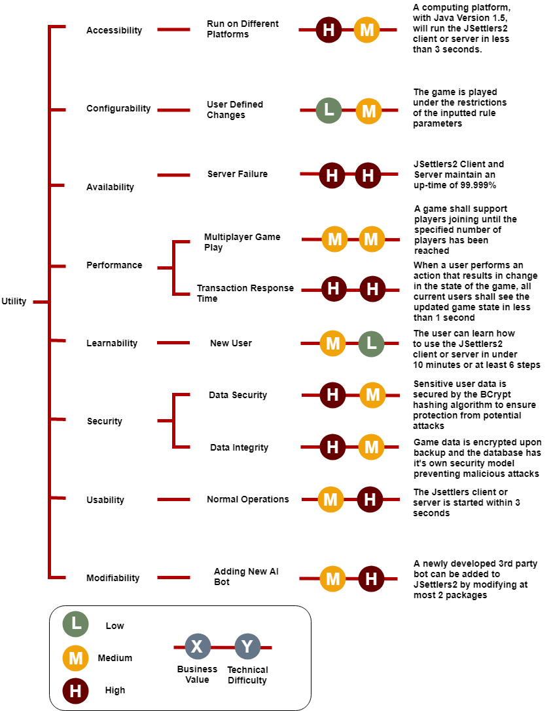
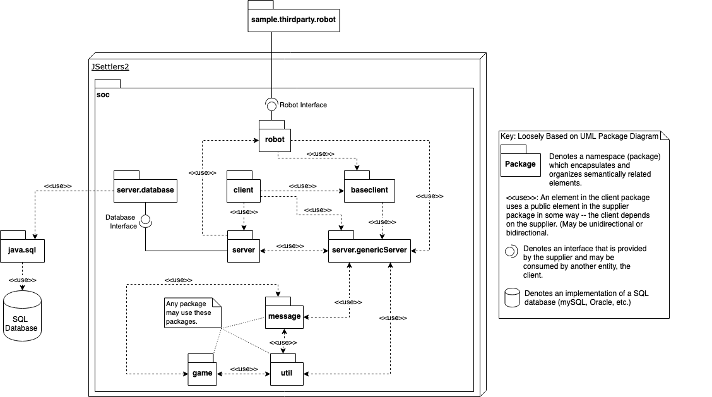
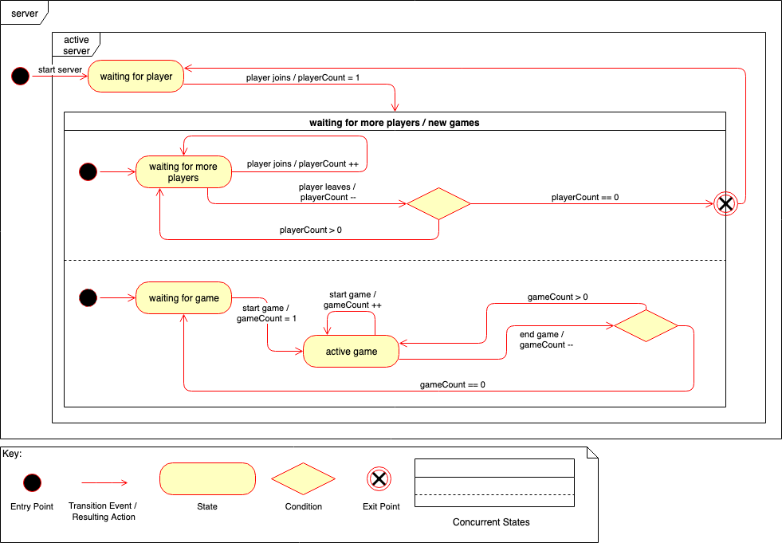
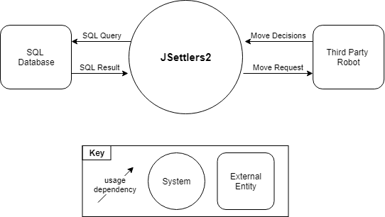
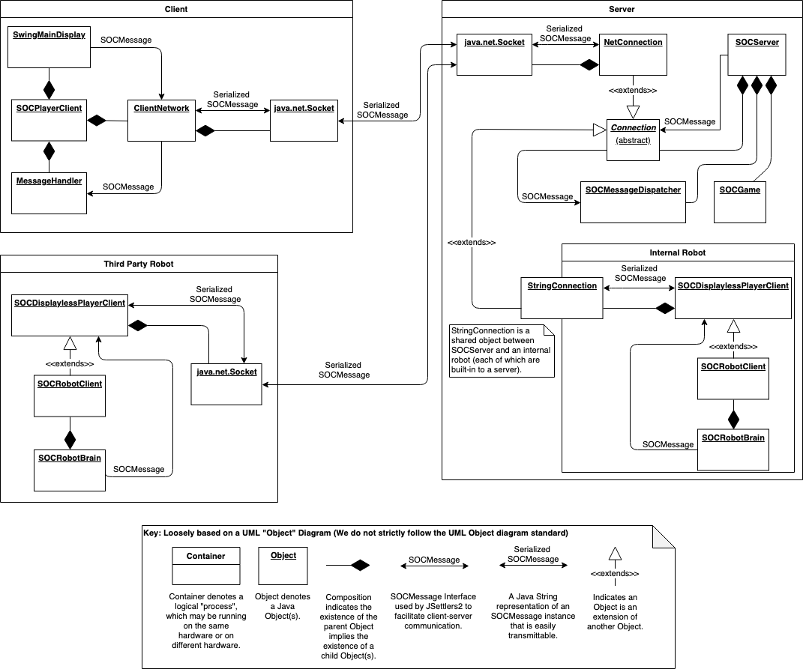
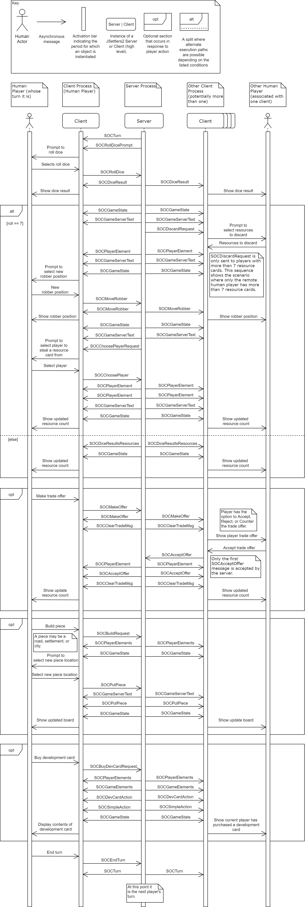
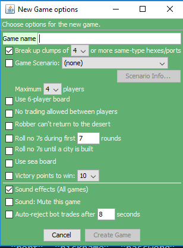
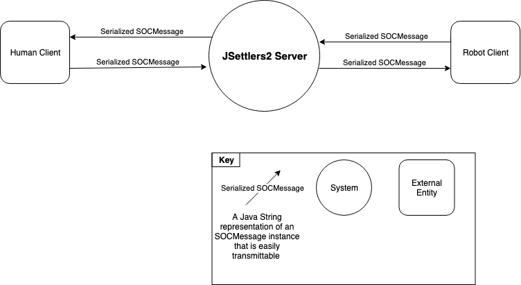

# [JSettlers2](https://github.com/jdmonin/JSettlers2/) - Architecture and Documentation

## Table Of Contents

 1. [Introduction](#purpose-section)
 2. [About JSettlers2](#about-section)
 3. [Stakeholders](#stakeholders-section)
 4. [Business Goals](#business-goals-section)
 5. [Architecturally Significant Requirements](#asrs)
 6. [Utility Tree](#utility-tree)
 7. [Quality Attribute Scenarios (QAS)](#qas)
 8. [Module View](#module-view)
    * [Primary Presentation](#prim-pres)
    * [Element Catalog](#ele-cat)
      + [Elements](#ele-mod)
      + [Relationships](#rel-mod)
    * [Behaviour](#beh-mod)
    * [Interfaces](#int-mod)
    * [Context Diagram](#con-dia)
    * [Rationale](#rationale)
 9. [Component and Connector View](#candc-view)
    * [Primary Presentation](#prim-pres-candc)
    * [Element Catalog](#ele-cat-candc)
      + [Elements](#ele-candc)
      + [Relationships](#rel-candc)
    * [Behaviour](#beh-candc)
    * [Interfaces](#int-candc)
    * [Context Diagram](#context-candc)
    * [Variability Guide](#var-guide-candc)
    * [Rationale](#rationale-candc)
 10. [Code Quality and Technical Debt](#debt)
 11. [Pull Requests](#prs)
 12. [Conclusion](#conclusions)
 13. [References](#references-section)

## Team

Proudly brought to you by:


* [Colin Werner](https://github.com/colinwerner)
* Zane Li
* Peter Hillar
* [Joel Cribby](https://github.com/joelyou20)
* Brian Pattie

## 1. Introduction <a name="purpose-section"></a>

[JSettlers2](https://github.com/jdmonin/JSettlers2/), a Java implementation of the popular board game [Settlers of Catan](https://www.catan.com/), was chosen by our team to document and understand due to the project's potential for being both fun and challenging. JSettlers2's artifical intelligence and the comprehensive codebase were appealing aspects, which led to a widely unanimous decision to choose JSettlers2 as our project. Since every member of our team can understand Java resonably well, the fact that JSettlers2 is written almost entirely in Java, allowed us better analyze and comprehend the various aspects of the code.

In this document, we began by identifying the key [stakeholders](#stakeholders-section) and [business goals](#business-goals-section) of the JSettlers2 project.  We then provide a list of [quality attribute scenarios (QAS)](#qas) to evaluate JSettlers2's architecture and identify the [architecturally significant requirements (ASR)](#asrs). In the [module view](#module-view), we provided a "uses" diagram that describes the dependencies between the Java packages in JSettlers2. We also outlined the behavior of an active server as it responds to players connecting and starting new games. Furthermore, the [third party robot interface](#robo-int) and the [database connection and storage interface](#dc-and-si) are both discussed in detail.

The [component and connector view](#candc) provides insight into the runtime behavior the application. It begins with a client-server diagram that shows the relationships between runtime objects in the client, server, and third party robots. We analyze the SOCMessage interface, used in all interprocess communication. A sequence diagram of a player's turn demonstrates how the [SOCMessage interface](#socm-int-candc) is used to synchronize the game state across player clients. We also discuss the [GameOptions interface](#game-opt-int-candc), which allows users to configure a game with special rules.

Next, we analyzed the [code quality and technical debt](#debt) accrued by JSettlers2 over the course of its development. We used four tools, SonarQube, Solarlint, IntelliJ IDEA, and Infer to identify code smells, security vulnerabilities, and bugs affecting the system. We also discussed areas of technical debt that may become hurdles for future development. These topics include the use of an outdated version of Java, the concentration of functionality in bloated God classes, and the use of custom serialization over Java's built-in serialization.

In the last section, we provided a brief overview of the [pull requests](#prs) submitted by our team to contribute to the JSettlers2 codebase.

## 2. About JSettlers2 <a name="about-section"></a>
JSettlers2 is an open-source Java software project based on the popular board game, Settlers of Catan (https://www.catan.com/). The JSettlers2 project was originally conceived as an artificial intelligence PhD dissertation for Robert Thomas. Since then JSettlers2 has matured into a fully-functioning online game, which allows up to six distributed players to connect over a TCP/IP network. JSettlers2 is now hosted and maintained on Jeremy Monin's (jdmonin) GitHub repository, in collaboration with a handful of other GitHub users. The purpose of this document is to give an overview of the potential privacy, security, and ethical concerns with respect to JSettlers2.

## 3. Stakeholders <a name="stakeholders-section"></a>

| Role | Concerns | Instances | Explanation |
|-----|----------|-----------|------------|
| Acquirers |	Oversee the procurement of the system or product | Jeremy Monin | Jeremy oversees and facilitates the success of the JSettlers2 Project.
| Assessors |	Oversee the system’s conformance to standards and legal regulation | Jeremy Monin | Jeremy handles the licensing of the project as he was the one who set the license of JSettlers2 as GPL-3.0. Furthermore, Jeremy updated the Readme.md in the repo for JSettlers2 with the copyright reference of the creators of third party libraries and images created by artists.
| Communicators |	Explain the system to other stakeholders via its documentation and training materials | Jeremy Monin | Through the continuous work of documenting aspects of JSettlers2 (i.e. guides on JSettlers2 release versions and installing the software) in the repository on Github, it appears that Jeremy Monin is the stakeholder in charge of communicating JSettlers2's documentation. In addition, Jeremy Monin manages the website [http://nand.net/jsettlers/devel/](http://nand.net/jsettlers/devel/) that is meant to inform developers on the downloads and resources, as well as communicate the release information of the JSettlers2 project |
| Developers |	Construct and deploy the system from specifications (or lead the teams that do this) | The 7 contributors to the JSettlers2 GitHub Repository. GitHub Accounts: jdmonin, paulbilnoski, alesky78, generateui, lartkma, seemikehack, olivierdeckers | As shown in the contributors tab in GitHub Repository for JSettlers2, there have been 7 contributors to the JSettlers2 project from the start of the project to now. While jdmonin (Jeremy Monin) has been the primary developer in this project as shown by the numerous commits by him, the other six contributors to the project are still regarded as developers because they have helped to build and deploy the software. |
| Maintainers |	Manage the evolution of the system once it is operational | Jeremy Monin | Any GitHub users can create pull requests or issues in the JSettlers2 GitHub repository, but Jeremy oversees the direction of the software and decides if proposed changes to the software are accepted. Furthermore, the predominant contributor to the JSettlers2 project is Jeremy himself, which means he has a significant impact on how the software is developed and how the the software will evolve over time. |
| Production Engineers |	Design, deploy, and manage the hardware and software environments in which the system will be built, tested, and run | Any developer of JSettlers2 and any GitHub user who downloads the JSettlers2 and run the game are considered Production Engineers | Since JSettlers2 does not require any specialized software or hardware to run, there is not a specific need for production engineers as opposed to some embedded systems. Nonetheless, any developer who contributes to JSettlers2 will need to manage their own development, testing, and running environments (i.e. operating system, text editor, testing framework, programming language version, etc) so that JSettlers2 is working optimally for both him and future users of the system. Similarly, any user who plays JSettlers2 will need to manage their running environment (ie. operating system, version of Java, etc) to ensure the game runs as desired. |
| Suppliers |	Build and/or supply the hardware, software, or infrastructure on which the system will run | Image Creators: Xuan Che, Jeremy Monin, Ruud Poutsma | Since JSettlers2 does require specific hardware or software other than the ability to run Java 5 and an one of three operating systems (Windows, MacOS, and Linux), JSettlers2 do not have suppliers that JSettlers2 would significantly affect. The only potential suppliers that would be affected by JSettlers2 include the three artists who are referenced by name in GitHub repository for JSettlers2. |
| Support Staff |	Provide support to users for the product or system when it is running | Jeremy Monin | When a user is playing JSettlers2 and encounters a bug or a problem, the user can seek help by posting the issues page in GitHub repository for JSettlers2 GitHub Repository or emailing Jeremy directly. Since the JSettlers2 Project is mostly run by Jeremy, questions will have to be relayed to Jeremy to receive explanation and support. |
| System Administrators	| Run the system once it has been deployed | 1) Any GitHub user who downloads JSettlers2 and runs the game. 2) Jeremy Monin | If a user runs JSettlers2 offline on their own server, then the user running the game would be the system administrator because the user has final say on when the game begins and ends; the user would also have control on who can play the game and where and how information collected in the game is stored. On the other hand, if a user plays JSettlers2 using the server hosted by Jeremy Monin, then Jeremy Monin is considered the system administrator because he has executive decision on what and how game information is collected, who can play the game, start and end of games. |
| Testers |	Test the system to ensure that it is suitable for use | Any user who plays the game and reports bugs to the JSettlers2 repository is a tester. Furthermore, any JSettlers2 developer who runs tests on JSettlers2 and reports bugs to the JSettlers2 repository is considered to be tester. | The developers of JSettlers2 are considered testers because testing is a significant part of their duties. A developer will test the software to see that his code change did not cause any bugs in the software; when a developer is trying to fix a reported bug, they will test the software to see if he can replicate the bug. Similar to developers, a user who runs JSettlers2 is also considered a tester because the user can report bugs and issues in the software that they experienced while playing JSettlers2. As long as a user reports any issues or bugs that cause the JSettlers2 to be unsuitable for use, the user is considered a tester because the user is actively trying improve the quality of JSettlers2.
| Users |	Define the system’s functionality and ultimately make use of it | Anyone who plays the JSettlers2 game is considered to be a user. | In order to be considered as a user of JSettlers2, one has to play JSettlers2. The developers of JSettlers2 are considered users because they have to play the game in order test whether or not they implemented the software's functionality correctly. Anyone who runs JSettlers2 is a user because running the game implies playing the game. Finally, anyone who does not run JSettlers2, but still plays the game is also considered a user because playing JSettlers2 is considered making use of the game.|

Note: A GitHub user is anyone who can access the JSettlers2 GitHub Repository or JSettlers2 Sourceforge Repository.
## 4. Business Goals <a name="business-goals-section"></a>

The business goals of JSettlers2 can be broken down into three categories, namely individual, system, and portfolio. The individual goals are those of Jeremy Monin (JDMonin), the system goals consist of what JSettlers2 was created to accomplish, and lastly, the portfolio goals are what the contributors to the project are hoping to accomplish.

#### 4.1 Individual Goals:
1. For the system being developed, increasing the customer satisfaction to achieve at least an 80% in the context of game reviews and achieve a customer satisfaction rating of at least 20% more than the original Settlers of Catan board game.[1]
   * The original Settlers of Catan board game received a good rating of 7.2 [1], but in order to attract people to play JSettlers2, users have to be satisfied with JSettlers2 and ratings provide a way to measure user satisfaction.


#### 4.2 System Goals:
1. For the system being developed, turning the game into an accessible format desires that the system achieve a fully functional version of the Settlers of Catan board game and will be satisfied if the system completely emulates the table-top the experience of Settlers of Catan.
   * The original Settlers of Catan board game is a game that requires participants to be in the same vicinity in order to play the game. The goal of creating a software based version of the game will allow people to experience Settlers of Catan and in any location that they desire.
2. For the system being developed, allow a user to start a new game with the ability to easily modify or tweak various rules.
3. Allow users to play together without being co-located by connecting people with a game that is rapidly rising as one of the most popular games.[2]
4. Allow users to easily and efficiently start a new game.
5. All sensitive data must be kept secure by the system.
6. A malicious user shall not be able to alter the system.

#### 4.3 Portfolio Goals:
1. For the system being developed, contributing to a modifiable and accessible platform that is familiar and provides an enjoyable user experience and will be satisfied if their contributions lead to an impactful improvement on the system by providing new features or updates.

## 5. Architecturally Significant Requirements <a name="asrs"></a>
In order to derive the architecturally significant requirements (ASR) we developed a series of quality attribute scenarios based on the business goals, which were developed based on existing documentation and a brief overview of the code. The ASRs for JSettlers2 are fundamental components that will have a large impact on the architecture of the software.
* JSettlers2 must allow users to play the game in an online and offline environment.
* JSettlers2 must allow multiple player game play (including AI bots).
* JSettlers2 server data must comply to the security standards outlined in the ACM.
* JSettlers2 users must find the operation of the JSettlers2 client or server an easy to learn task.
* JSettlers2 input and output processing times must be acceptable to end users.
* JSettlers2 must handle crashes and generate a bug report.
* JSettlers2 must run on any machine with at least Java v1.5
* JSettlers2's game play must be easily modifiable by end users.

## 6. Utility Tree <a name="utility-tree"></a>


## 7. Quality Attribute Scenarios <a name="qas"></a>
As part of the development of our quality attribute scenarios (QAS), we performed a comprehensive review of the key elements required to ensure JSettlers2 is a success. Each QAS defines a key behavioural component and includes a measurable metric, which will be used to verify that the QAS has been met.

### QAS Templates
#### QAS 1 - Playing Settlers on any Computing Platform <a name="qas-1"></a>
|Aspect|Details|
|------|-------|
|Scenario Name | Play Settlers of Catan on any Computing Platform |
|Business Goals| For the system being developed, turning the game into an accessible format desires that the system achieve a fully functional version of the Settlers of Catan board game and will be satisfied if the system completely emulates the table-top the experience of Settlers of Catan. |
|Quality Attributes| Accessibility |
|Stimulus Source| A user |
|Stimulus| The user desires to run the JSettlers2 client or server on any computing platform. |
|Response| The computing platform, with Java version 1.5, will successfully run JSettlers2. |
|Response Measure| The computing platform, with Java Version 1.5, will run the JSettlers2 client or server in less than 3 seconds. |
#### QAS 2 - Visually Responsive and Low Latency <a name="qas-2"></a>
|Aspect|Details|
|------|-------|
|Scenario Name | Visually Responsive and Low Latency |
|Business Goals| For the system being developed, turning the game into an accessible format desires that the system achieve a fully functional version of the Settlers of Catan board game and will be satisfied if the system completely emulates the table-top the experience of Settlers of Catan. |
|Quality Attributes| Performance |
|Stimulus Source| A user (human or AI) |
|Stimulus| An action is performed to update the state of a game of JSettlers2 (player joining or leaving, request to trade, building, moving the robber, etc.) |
|Response| All current users in the instance of the game are able to see the updated game state. |
|Response Measure| All current users shall see the updated game state in less than 1 second. |
#### QAS 3 - Security of Data <a name="qas-3"></a>
|Aspect|Details|
|------|-------|
|Scenario Name | Security of Data |
|Business Goals| All sensitive data must be kept secure by the system. |
|Quality Attributes| Security |
|Stimulus Source| A user |
|Stimulus| User inputs sensitive data. |
|Response| Sensitive data is secured by JSettlers2 |
|Response Measure| Sensitive user data is secured by the BCrypt hashing algorithm to ensure protection from potential attacks. |
#### QAS 4 - Integrity of Data <a name="qas-4"></a>
|Aspect|Details|
|------|-------|
|Scenario Name | Confidentiality of Data |
|Business Goals| A malicious user shall not be able to alter the system. |
|Quality Attributes| Security |
|Stimulus Source| A malicious attacker |
|Stimulus| Malicious attacker attempts to modify sensitive user data. |
|Response| Unauthorized data modification is resisted by JSettlers2 |
|Response Measure| Game data is encrypted upon backup and the database has its own security model preventing malicious attacks. |
#### QAS 5 - Integrity of Game <a name="qas-5"></a>
|Aspect|Details|
|------|-------|
|Scenario Name | Integrity of Game |
|Business Goals| A malicious user shall not be able to alter the system. |
|Quality Attributes| Security |
|Stimulus Source| A malicious attacker |
|Stimulus| Malicious attacker attempts to modify a current instance of a game of JSettlers2. |
|Response| Unauthorized game modification is resisted by JSettlers2. |
|Response Measure| Unauthorized game modification is resisted by JSettlers2 by utilizing SSL java sockets to prevent the malicious attacker from connecting to the game. |
#### QAS 6 - Client and Server Availability <a name="qas-6"></a>
|Aspect|Details|
|------|-------|
|Scenario Name | Client and Server Availability |
|Business Goals| For the system being developed, turning the game into an accessible format desires that the system achieve a fully functional version of the Settlers of Catan board game and will be satisfied if the system completely emulates the table-top the experience of Settlers of Catan. |
|Quality Attributes| Reliability, Availability |
|Stimulus Source| A user |
|Stimulus| The user runs JSettlers2 client or server. |
|Response| The server and client continuously run. |
|Response Measure| JSettlers2 client and server maintain an up-time of 99.999%. |
#### QAS 7 - Multiplayer Capability <a name="qas-7"></a>
|Aspect|Details|
|------|-------|
|Scenario Name | Multiplayer Capability |
|Business Goals| Allow users to play together without being co-located by connecting people with a game that is rapidly rising as one of the most popular games. |
|Quality Attributes| Performance |
|Stimulus Source| A user |
|Stimulus| The user specifies the number of players and creates an instance of the game on a server. |
|Response| Additional players are able to join a game on a remote server. |
|Response Measure| A game shall support players joining remotely until the specified number of players has been reached. |
#### QAS 8 - Starting a Client or Server <a name="qas-8"></a>
|Aspect|Details|
|------|-------|
|Scenario Name | Starting a Client or Server |
|Business Goals| Allow a user to easily and efficiently start a new game. |
|Quality Attributes| Usability |
|Stimulus Source| A user |
|Stimulus| The user attempts learn how to use the JSettlers2 client or server. |
|Response| A JSettlers2 client or server is started. |
|Response Measure| The JSettlers2 client or server is started within 3 seconds. |
#### QAS 9 - User Training <a name="qas-9"></a>
|Aspect|Details|
|------|-------|
|Scenario Name | User Training |
|Business Goals| Allow a user to easily and efficiently start a new game. |
|Quality Attributes| Learnability |
|Stimulus Source| A user |
|Stimulus| The user attempts learn how to use the JSettlers2 client or server. |
|Response| The user learns how to use the JSettlers2 client or server. |
|Response Measure| The user can learn how to use the JSettlers2 client or server in under 10 minutes or in at least 6 steps. |
#### QAS 10 - Ability to Configure Rules of a New Game <a name="qas-10"></a>
|Aspect|Details|
|------|-------|
|Scenario Name | Ability to Configure Rules of a New Game | For the system being developed, allow a user to start a new game with the ability to easily modify or tweak various rules. |
|Business Goals | For the system being developed, allow a user to start a new game with the ability to easily modify or tweak various rules. |
|Quality Attributes| Configurability |
|Stimulus Source| A user |
|Stimulus| The user configures the desired rule parameters (number of players, number of points to win, etc) when creating a new game. |
|Response| A game is created with a set of defined rule parameters. |
|Response Measure| The game is played under the restrictions of the inputted parameters. |
#### QAS 11 - Support Artificial Intelligent Bots <a name="qas-11"></a>
|Aspect|Details|
|------|-------|
|Scenario Name | Support Artificial Intelligent Bots (Built-In or Third Party) |
|Business Goals| For the system being developed, contributing to a modifiable and accessible platform that is familiar and provides an enjoyable user experience and will be satisfied if their contributions lead to an impactful improvement on the system by providing new features or updates. |
|Quality Attributes| Modifiability |
|Stimulus Source| A developer |
|Stimulus| The developer wishes to develop their own artificial intelligent bot to join the game. |
|Response| JSettlers2 server allows the newly developed bot to connect and join a game. |
|Response Measure| A newly developed third party bot can be added to JSettlers2 by modifying at most 2 packages. |

## 8. Module View <a name="module-view"></a>
A module view represents the static structure of an architecture. In particular, a module view represents the elements, relationships between elements, and usage of the architecture[7]. As part of our analysis of JSettlers2 we created a module view using the "uses" style[4].
(Note: we have chosen not to investigate the net.nand.util.* packages as they form a separate utility application to aid in string localization -- aka internationalization and not necessarily related to the current business goals.)

### 8.1 Primary Presentation <a name="prim-pres"></a>
The uses diagram below depicts JSettlers2 at a package level, outlining the components most relevant to the project's [Quality Attribute Scenarios](#qas). The uses diagram demonstrates the separation of concerns within the application, and shows where JSettlers2 interacts with external entities, namely third party robots and SQL database software. Some dependencies, such as those depending on message, game, and util, are omitted as they are used by most packages. The presence of such overbearing dependencies would dilute the diagram and distract from more insightful relationships.



### 8.2 Element Catalog <a name="ele-cat"></a>
#### 8.2.1 Elements <a name="ele-mod"></a>
##### JSettlers2
JSettlers2 stands for Java Settlers 2, as this is the "second" Java implementation of Settlers of Catan (the first of which is presumably [JSettlers](https://github.com/jsettlers/settlers-remake), which is based on an entirely different game). The JSettlers2 application contains all of the functionality in order to play a virtual game of Settlers of Catan.

##### [soc](http://nand.net/jsettlers/devel/doc/soc/)
The soc (Settlers of Catan) package encapsulates all packages in the JSettlers2 application.

##### [util](http://nand.net/jsettlers/devel/doc/soc/util/package-summary.html)
The util package contains common utility classes that are used by almost every single other package in JSettlers2. The util package includes string localizations and custom data structures, among others.

##### [message](http://nand.net/jsettlers/devel/doc/soc/message/package-summary.html)
The message package is a pivotal framework forming the basis for JSettlers2's inter-process communication protocol. The message package is used extensively to support [QAS 7](#qas-7) by providing a messaging framework to allow client-server communication. For example, the message package allows a client to receive a server's game list and to join a game. In addition, game-specific messages are used to pass game state information, such as turn order, trade offers, and results from rolling the dice. The message framework is used for both online play and local practice.

In addition, the message package provides support for [QAS 10](#qas-10) (ability to configure rules of a new game), as an extended message type is used to create a game with a specific set of options compared to creating a default game. Likewise, the server sends a different message to update the client game list, as the client version may not support an option set.

##### [game](http://nand.net/jsettlers/devel/doc/soc/game/package-summary.html)
The game package contains the "business" logic for the rules of Settlers of Catan, which represent the physical elements of the real board game. For example, the game package includes classes that represent such pertinent game elements such as [rules](https://www.catan.com/en/download/?SoC_rv_Rules_091907.pdf) (also known as game options), [resource cards](https://catan.fandom.com/wiki/Resource_card), [the robber](https://catan.fandom.com/wiki/The_Robber), various sized [boards](https://catan.fandom.com/wiki/Hex_tiles) (none of which are static), [development cards](https://catan.fandom.com/wiki/Development_card), [settlements](https://catan.fandom.com/wiki/Settlement), and [cities](https://catan.fandom.com/wiki/City) among others. Overall, the game package enables [QAS 10](#qas-10) by supporting a variety of options, such as the number of players and the number of [victory points](https://catan.fandom.com/wiki/Victory_point) required to win.

##### [server.genericServer](http://nand.net/jsettlers/devel/doc/soc/server/genericServer/package-summary.html)
The server.genericServer package introduces the fundamental framework used to build the server management process. This package manages all TCP connections, which administers all client-server message passing. This functionality directly supports [QAS 6](#qas-6) and [QAS 8](#qas-8) in establishing server quality and reliability.

The [genericServer.Server](http://nand.net/jsettlers/devel/doc/soc/server/genericServer/Server.html) class is the main server class that handles establishing and authorizing new connection attempts. This class holds the code that monitors the number of connections and will either accept or reject a new client connection attempt for various reasons, including too many connections. The monitoring of the number of connections directly relates to [QAS 7](#qas-7), which pertains to multiplayer capability.

##### [server](http://nand.net/jsettlers/devel/doc/soc/server/package-summary.html)
The server package is used to host games and clients, along with utilizing information from the server.database package such as passwords, usernames, and saved games. Once a server is running it listens for connections so players are able to connect. This package aids in the support of [QAS 2](#qas-2), [6](#qas-6), [7](#qas-7), [8](#qas-8), and [9](#qas-9). [QAS 2](#qas-2) is supported by the [GameHandler](http://nand.net/jsettlers/devel/doc/soc/server/GameHandler.html) class which relays messages from the client to the server in realtime to allow for low visual latency. [QAS 6](#qas-6) is supported by the [SOCServer](http://nand.net/jsettlers/devel/doc/soc/server/SOCServer.html) class which interfaces with members of the server.genericServer package, resulting in a server that is alive as long as the host remains online. [QAS 7](#qas-7) is supported by allowing a client-server connection, players can engage in multiplayer games with other players who are remotely located from the host. [QAS 8](#qas-8) is supported by the ease of being able to start a server in under 3 seconds. Lastly, [QAS 9](#qas-9) is supported as the server is self-setup after a user performs 2 to 3 steps in order to get the server started and no further knowledge or action is needed.

##### [server.database](http://nand.net/jsettlers/devel/doc/soc/server/database/package-summary.html)
The server.database package is to help a server connect and manipulate data in a SQL database instance. In addition, it contains BCrypt, which is an implementation of password hashing in order to thwart password cracking. In particular, this package provides support for [QAS 3](#qas-3) and [QAS 4](#qas-4).

##### baseclient
The baseclient package represents a display-less client that is able to connect to a JSettlers2 server and forms the basis of an underlying client (whether that be a robot or a human). For the clarity of this section, we will refer to both a human player and robot player as a "player". This package aids in the support of [QAS 2](#qas-2), [6](#qas-6), [7](#qas-7), and [11](#qas-11).

[baseclient.SOCDisplaylessPlayerClient](http://nand.net/jsettlers/devel/doc/soc/client/SOCDisplaylessPlayerClient.html) is a versatile class that handles a large amount of player specific functions such as how to handle certain actions in the game. In particular, this class helps manages the pertinent information required when a certain action or event occurs. For example, connection rejection messages, game relevant consequences of connection and disconnection, player information, and resetting the game. This class supports both [QAS 2](#qas-2) and [6](#qas-6) due from its monitoring of how connection and disconnection affect the consistency of the game and the servers response. In addition, this class also supports [QAS 7](#qas-7) and [11](#qas-11), since baseclient is responsible for handling the structure of the player interactions with the GUI as well as the system's methods for displaying the actions of the robot to the user.

##### [client](http://nand.net/jsettlers/devel/doc/soc/client/package-summary.html)
The client package contains the main GUI for a human player to connect to a JSettlers2 server. In particular, the client aids in the support of [QAS 1](#qas-1), [2](#qas-2), [5](#qas-5), [6](#qas-6), [7](#qas-7), [8](#qas-8), [9](#qas-9), and [10](#qas-10).

The package supports [QAS 2](#qas-2) by providing a responsive UI using the Java Swing GUI toolkit. As per [QAS 8](#qas-8), the client opens in under 3 seconds. The opening window provides options for starting or connecting to a server, which can be done in 2 and 3 steps respectively, supporting [QAS 9](#qas-9). Once connected, the player may join a game from the game list to engage in multiplayer ([QAS 7](#qas-7)) or the game creation dialogue provides several options for configuring the game rules, supporting [QAS 10](#qas-10). [QAS 1](#qas-1) is supported by the client package, as a user only requires Java v1.5 to successfully run JSettlers2 on a computing device. [QAS 6](#qas-6) is also supported as the client package uses the connection provided by the server package, which is known to be live as long as the host remains online.

##### [robot](http://nand.net/jsettlers/devel/doc/soc/robot/package-summary.html)
The robot package has three purposes: 1.) adds the ability to have a robot player, 2.) implements a number of strategies for a robot to take on, and 3.) provides an interface to enable a third party developer to implement their own strategy. This package aids in the support of [QAS 7](#qas-7), as empty spots in a multiplayer game may be filled with a robot player. This package also supports [QAS 11](#qas-11), as a developer is able to create his or her own robot implementation and connect such an implementation to a JSettlers2 instance.

#### 8.2.2 Relationships <a name="rel-mod"></a>
This section gives a high level description of the relationships between packages from the [primary presentation](#prim-pres).

##### client Uses baseclient
The client package uses a variety of static methods from the baseclient package, which update various elements of JSettlers2 using the message package. Ideally, the a class in the client package should extend a class in the baseclient package; however, this not the case.

##### robot Uses baseclient
A class in the robot package directly extends a class in the baseclient package, interestingly it is the only package to directly extend a class in the baseclient package. Much like the client package, the robot package utilizes the same static methods from the baseclient package, which update various elements of JSettlers2 using the message package.

##### client Uses server
The client package uses the server package to start a local server. The server may be a practice server for local play with robots, or a standard networked server, which allows remote clients to connect.

##### client Uses server.genericServer
The client package interacts with socket connections using the connection objects defined in server.genericServer.

##### server Uses server.genericServer
The server package uses the server.genericServer package to manage each connection to a client, as well as send and receive messages over a connection. A message received from any connection is added to the same message queue maintained by the server.genericServer package.

##### baseclient Uses server.genericServer
The baseclient package exchanges messages with a server using the socket connection defined in server.genericServer.

##### robot Uses server.genericServer
The robot package exchanges messages with a server using a socket connection defined in server.genericServer. In a local practice game, a robot uses the generic server to connect to a local stringport. A stringport is a connection that uses Java synchronization tools for message passing between local threads. A stringport implements the same interface as TCP connections.

##### server Uses robot
The server package uses the robot package to start a robot thread that may be used in practice games or multiplayer games.

##### server Uses server.database
The server.database package provides methods used by the server package for initializing a database, connecting to the database, and manipulating data in the database.

##### server.database Uses java.sql
The server.database package uses the API provided by java.sql to interface with a local SQL database instance.

##### java.sql Uses SQL database
JSettlers2 interfaces with an optional SQL database using Java's SQL API. A SQL database provides a location to store account information and game statistics.

##### message Uses server.genericServer
When converting a message object to a string, the message package uses server.genericServer to identify the name associated with a connection.

##### util Uses server.genericServer
The game board reset utility uses the connection objects defined in the server.genericServer package to ensure that all human players are still connected to the game instance after resetting a game.

##### message
Any package may use the message package to either de-serialize a message into a message Object or serialize a message Object into a string to transmit over a socket connection.

##### game
Any package may use the game package to query the state of the game. For example, the client package can query the game state to update an element of the user interface, such as building placements and resource counters. Requests to modify the state of the game are mostly made by message handler functions in the baseclient package.

##### util
The util package contains a variety of utility classes used across JSettlers2. As such it is available to all packages.

### 8.3 Element Behaviour <a name="beh-mod"></a>
The server state diagram was created to show the various states of starting and running a JSettlers2 server. Once a server is started, the server enters an initial "waiting for player", state where it will remain until a player joins. After one player has joined the playerCount becomes 1 and the server transitions into a composite state "waiting for more players / new games". The server will remain in this state until the playerCount reaches 0 (when it returns to the initial "waiting for player" state) or the server is ultimately shutdown. As part of the composite state the server tracks the number of players and games. In particular, as a player is connected or disconnected to the server, the playerCount is incremented or decremented, as appropriate. Finally, as part of the composite state a player is able to create a new game (or games) and the server tracks each game.



(Note: that a player is a human player, a local robot, or a third party robot.)

### 8.4 Interfaces <a name="int-mod"></a>
#### 8.4.1 Interface Identity -- Third Party Robot Interface <a name="robo-int"></a>
The third party robot interface provides the ability for a developer to create his or her own robot that can connect to a JSettlers server and play JSettlers2 potentially with humans and other robots.

##### 8.4.1.1 Resources Provided

_Syntax_

The syntax to create a third party robot client:
```java
public SOCRobotClient(final String hostname, final int port, final String nickname, final String password, final String cookie)
```
Note: a developer needs to extend SOCRobotClient.


The syntax to connect a third party robot client:
```java
Sample3PClient cli = new Sample3PClient(args[0], Integer.parseInt(args[1]), args[2], args[3], args[4]);
cli.init()
```

The syntax to create a third party robot brain:
```java
public SOCRobotBrain(SOCRobotClient rc, SOCRobotParameters params, SOCGame ga, CappedQueue<SOCMessage> mq)
```
Note: a developer needs to extend SOCRobotBrain.


A developer may override numerous strategy related methods to achieve the desired level of artificial intelligence. However, a developer may consider modifying a subset of methods, including these three important methods:
+ `protected boolean makeOffer(SOCPossiblePiece target)` -- deciding whether to make a trade offer to another player or not make a trade offer.
+ `protected int considerOffer(SOCTradeOffer offer)` -- deciding whether to accept, reject, ignore or counter a trade offer from another player.
+ `private void buildOrGetResourceByTradeOrCard()` -- deciding to build next planned piece or use cards to trade for resources to build next piece.

Note: This is not an exhaustive list of syntax related to the robot interface.

_Semantics_

The robot interface allows a developer to create a unique JSettlers2 artificially intelligent robot and connect this robot to a JSettlers2 server to play against a combination of human and robot players. For example, the robot interface allows a third party robot to make trading decisions according to the robot’s implementation, among other features (e.g. decide what to build and where, communicate with other human players). However, a third party robot must input a correct set of parameters to successfully connect to a JSettlers2 server (as defined in the syntax above). Before a third party robot is connected to the robot interface, players in a JSettlers2 game may consist of human players and default robots that come with JSettlers2. Once a third party robot is connected through the robot interface, a JSettlers2 game may consist of human players, default robots that come with JSettlers2, and the third party robot. Furthermore, each third party robot can be differently configured (i.e. plays JSettlers2 with developer designed strategies such as a robot only collecting sheep resources). In short, connecting a third party robot will allow human players to play with robots that do not come as default in JSettlers2.

_Error Handling_

Please see [Error Handling](#robot-int-err).

##### 8.4.1.2 Data Types <a name="robot-data-types"></a>
+ {hostname}: A Java [String](https://docs.oracle.com/javase/8/docs/api/java/lang/String.html) that uniquely represents a JSettlers2 server that a third party robot will attempt a connection. (E.g. “localhost”, “192.168.1.100”)
+ {port}: A Java primitive [int](https://docs.oracle.com/javase/tutorial/java/nutsandbolts/datatypes.html) that defines the logical connection (in combination with hostname) that represents a JSettlers2 server that a third party robot will connect server host that a third party robot will attempt a connection. (E.g. 8880).
+ {nickname}: A Java [String](https://docs.oracle.com/javase/8/docs/api/java/lang/String.html) that represents the name of a third party robot, which is also displayed in the GUI during a game. (E.g. “Bob”).
+ {password}: A Java [String](https://docs.oracle.com/javase/8/docs/api/java/lang/String.html) that represents the password used when there is a database tracking unique username (nickname) and password pairs. (E.g. “p@$$w0rd”) This variable is stored as a Java [String](https://docs.oracle.com/javase/8/docs/api/java/lang/String.html).
+ {cookie}: A Java [String](https://docs.oracle.com/javase/8/docs/api/java/lang/String.html) that specifies a third party robot’s connection cookie.
+ {params}: This is the variable that stores a third party robot’s characteristics. (E.g. “tradeFlag =0” means the robot will not trade with anyone). This is a custom object with the following variables: {
  "mgl": "Java primitive int",
  "me": "Java primitive int",
  "ebf": "Java primitive float",
  "af": "Java primitive float",
  "laf": "Java primitive float",
  "dcm": "Java primitive float",
  "tm": "Java primitive float",
  "st": "Java primitive int",
  "tf": "Java primitive int"
}
+ {mq}: This variable stores the game message queue which contains game data and events. The game message queue is a synchronized queue of [SOCMessage](http://nand.net/jsettlers/devel/doc/soc/message/SOCMessage.html) objects, which is a Java abstract class.
+ {ga}: This variable stores the game that a third party robot is playing. This variable is an instance of the [SOCGame](http://nand.net/jsettlers/devel/doc/soc/game/SOCGame.html) class.
+ {rc}: This variable stores the third party robot client. This variable is an instance of the [SOCRobotClient](http://nand.net/jsettlers/devel/doc/soc/robot/SOCRobotClient.html) class.

Note: These are the main variables related to the robot interface, but does not include all of the variables related to the robot interface.

##### 8.4.1.3 Error Handling <a name="robot-int-err"></a>
* If the cookie is invalid a command line error is printed. For example, if the passed-in cookie parameter does not match the cookie of the server (defined by the hostname and port) then the interface returns the following error:
```java
System.out.println("Rejected robot " + botName + ": Wrong cookie");
return "Cookie contents do not match the running server.";
```

* If the server host name or port number is invalid, the interface returns the following error:
```java
catch (Exception e)
{
    ex = e;
    System.err.println("Could not connect to the server: " + ex);
}
```

* If a third party robot is disconnected from a game server, the third party robot has three attempts to reconnect:
```java
ex = e;
System.err.println("disconnectReconnect error: " + ex);
if (attempt > 0)
    System.err.println("-> Retrying");
```
After three opportunities, if the robot is still unable to connect, the robot is removed from the current game:
```java
System.err.println("-> Giving up");
// Couldn't reconnect. Shut down active games' brains.
for (SOCRobotBrain rb : robotBrains.values())
    rb.kill();
```
If a third party robot encounters an error while trying to connect to a game server, the server removes the third party robot from all games and attempts to reconnect the robot. If errors persist, the third party robot is terminated from the server.
```
if (ex != null)
System.err.println("Reconnect to server failed: " + ex);
```

Note: This is not an exhaustive list of error handlers related to the robot interface.

##### 8.4.1.4 Variability
The robot interface allows a third party robot to input a variety of SOCRobotClient parameters. Recall the parameters from the [data types](#robot-data-types) section pertaining to SOCRobotClient (hostname, port, nickname, password, and cookie). For example a third party robot can change the hostname and port to connect to a different JSettlers2 server. Similarly, a third party robot can change its nickname so that the robot will have a different name displayed in game.

A third party robot can also input a variety of SOCRobotBrain parameters. Recall the parameters from the [data types](#robot-data-types) section pertaining to SOCRobotBrain (params, rc, mq, and ga). For example a third party robot can change params so that the third party robot applies a smart strategy instead of a fast strategy when building pieces. Furthermore, a developer can configure how a third party robot handles gameplay. For example the third party robot can have a different strategy for making trades and building pieces. Recall the three SOCRobotBrain methods from the Syntax section. The makeOffer method can be modified:
```java
boolean result = false;
SOCTradeOffer offer = null;
ourPlayerData.setCurrentOffer(offer);
negotiator.resetWantsAnotherOffer();
...
```
As a result, the third party robot will never attempt to make a trade offer.

The considerOffer method can be modified:
```java
int response = 0;
return response;
```
As a result, the third party robot will reject every trade offer by any other player.

The buildOrGetResourceByTradeOrCard() can be modified:
```
...
if (gameStatePLAY1 && ! waitingForTradeResponse) {
    /**
    * trade with the bank/ports
    */
    if (tradeToTarget2(targetResources){
        counter = 0;
        waitingForTradeMsg = true;
        pause(1500);
    }
}

if (gameStatePLAY1 && (! doneTrading) && (! ourPlayerData.getResources().contains(targetResources))) {
    waitingForTradeResponse = false;

    if (robotParameters.getTradeFlag() == 1) {
        makeOffer(targetPiece);
        // makeOffer will set waitingForTradeResponse or doneTrading.
    }
}
...
```
As a result, the third party robot will try to trade with the bank before trying to trade with other players.

Note: This is not an exhaustive list of configurations that a developer can conduct in relation to the robot interface.

##### 8.4.1.5 Quality Attributes
Extensibility: This robot interface facilitates [QAS 11](#qas-11), as a developer can create his or her own third party robot and the third party robot should be able to connect and join a JSettlers2 game. The response measure for this quality attribute scenario is that a newly developed third party robot can connect this interface by modifying at most 2 JSettlers2 packages.

##### 8.4.1.6 Rationale
The developers of JSettlers2 have created a system where a developer may create a third party robot to play JSettlers2 against other human players and robots. A developer may use this interface to connect his or her own JSettlers2 robot instead of playing with the default robots. Developers may modify how a robot considers trades, make trades, and builds roads, among other configurations. The interface has been built with the *extensibility* quality attribute in mind so that a developer may create a basic robot and use this robot interface by changing only 2 classes. However, this robot interface was not well designed because a developer has to override methods from SOCRobotClient and SOCRobotBrain to create a third party robot. The developers of JSettlers2 should have been more explicit as to which parts are part of the robot interface.

##### 8.4.1.7 Usage Guide
For a developer’s third party robot to connect to a JSettlers2 server, the third party robot has to provide correct parameters to SOCRobotClient that would allow the robot to connect to a JSettlers2 server. The parameters are “hostname”, “port”, “nickname”, “password”, and “cookie”. If the parameters passed by the third party robot are correct, then the third party robot can join the server. If a parameter is incorrect or missing, the third party robot would not be able to use this interface and cannot connect to the JSettlers2 server. An example of correct parameters that allow a third party robot to connect to a JSettlers2 server would be[5]:
```java
Sample3PClient cli = new Sample3PClient(args[0], Integer.parseInt(localhost, 8880, samplebot1, x, bottest97481483);
cli.init();
```
(Refer to section 8.4.1.3 [Error Handling](#robot-int-err) for more details on potential errors and error messages printed when an error occurs.) A developer also has the option of configuring how the third party robot plays a game. By configuring SOCRobotBrain’s methods, a developer can configure the strategy used by the third party robot. Examples include:
Changing the makeOffer class would affect whether the robot makes a trade offer or not.
Changing the considerOffer class would affect whether the robot accepts, ignores, counters, or rejects a trade offer. For example[6]:
```java
@Override
protected int considerOffer(SOCTradeOffer offer)
{
    if (! offer.getTo()[getOurPlayerNumber()])
    {
        return SOCRobotNegotiator.IGNORE_OFFER;
    }

    final SOCResourceSet res = offer.getGiveSet();
    if (! (res.contains(SOCResourceConstants.CLAY) || res.contains(SOCResourceConstants.SHEEP)))
    {
    return SOCRobotNegotiator.REJECT_OFFER;
}

    return super.considerOffer(offer);
}
```
Changing the chooseFreeResources class would affect which resource is most prized by the robot.

Note: This is not an exhaustive list of usage examples for the robot interface.

#### 8.4.2 Interface Identity -- Database Connection and Storage Interface <a name="dc-and-si"></a>
The database connection and storage interface provides the ability for a user to connect JSettlers2 to a database and store a user's account, game scores, and robot parameters.

##### 8.4.2.1 Resources Provided
_Syntax_

To connect to a database:
`connect(user, pswd, prop_dbSetupScript);`

This method is used to authenticate a user’s nickname and password by matching them to an entry in a database:
```java
public static String authenticateUserPassword(final String sUserName, String sPassword, final AuthPasswordRunnable authCallback)
```

This method is used to create a new user’s account and store the user’s nickname and password:
```java
public static boolean createAccount(String userName, String host, String password, String email, long time)
```

This method is used to update a user’s password:
`public static boolean updateUserPassword(String userName, final String newPassword)`

Note: This is not an exhaustive list of syntax related to the database interface.

_Semantics_

The database interface allows a server to connect a database to JSettlers2, so that account information, game score history, and robot parameters can be stored in the database. If a database is not connected to a JSettlers2 server, human players would not be able to store user accounts nor store the history of games. After a database is connected to a JSettlers2 server, a human player can store his or her account information in the database along with game score history. When a database is connected, the database interface will conduct both read and write operations. In order for JSettlers2 to connect to a database, JSettlers2 has to invoke the correct syntax shown above (i.e. must have the correct database username and database password to connect to the database). Once the database is connected, JSettlers2 can access the database to authenticate a user. A user who successfully authenticates will be able to play JSettlers2 with their user nickname. When a new user’s information is stored in a database, JSettlers2 will improve the confidentiality of the user’s password through encryption. When a user updates his or her password, JSettlers2 will encrypt the user’s new password and store the password in the database.

_Error Handling_

Please see [Error Handling](#database-interface-error).

##### 8.4.2.2 Data Types -- the following is a list of important data types for the Database Connection and Storage Interface
* {user}: A Java [String](https://docs.oracle.com/javase/8/docs/api/java/lang/String.html) that stores a database username to connect to a database.
* {pswd}: A Java [String](https://docs.oracle.com/javase/8/docs/api/java/lang/String.html) that stores the database password corresponding to a username necessary to connect to a database.
* {prop_dbSetupScript}: A Java [String](https://docs.oracle.com/javase/8/docs/api/java/lang/String.html) that stores the path to the script that is run to create a table. This variable can be null or store properties that instantiate Java's Properties class. (e.g. A property may be "PROP_JSETTLERS_DB_URL")
* {sUserName}: A Java [String](https://docs.oracle.com/javase/8/docs/api/java/lang/String.html) that stores the username that is trying to authenticate its corresponding password.
* {sPassword}: A Java [String](https://docs.oracle.com/javase/8/docs/api/java/lang/String.html) that stores the password to be authenticated.
* {authCallback}: A Java [Interface](https://docs.oracle.com/javase/tutorial/java/concepts/interface.html) that represents an optional callback that runs when an a user successfully or unsuccessfully authenticates.
* {userName}: A Java [String](https://docs.oracle.com/javase/8/docs/api/java/lang/String.html) that stores a new username that will be added to a database.
* {host}: A Java [String](https://docs.oracle.com/javase/8/docs/api/java/lang/String.html) that that stores the client hostname or IP address.
* {password}: A Java [String](https://docs.oracle.com/javase/8/docs/api/java/lang/String.html) that stores the new user’s password.
* {email}: A Java [String](https://docs.oracle.com/javase/8/docs/api/java/lang/String.html) that is an optional field that contains a new user’s password.
* {time}: A Java primitive [long](https://docs.oracle.com/javase/tutorial/java/nutsandbolts/datatypes.html) that stores the account creation time.
* {userName} (updateUserPassword): A Java [String](https://docs.oracle.com/javase/8/docs/api/java/lang/String.html) that stores the username (nickname) whose password will get updated.
* {newPassword}: A Java [String](https://docs.oracle.com/javase/8/docs/api/java/lang/String.html) that stores the new password for a user (cannot be empty or null).

Note: These are the main variables related to the database interface, but does not include all of the variables related to the database interface.

##### 8.4.2.3 Error Handling <a name='database-interface-error'></a>
* When trying to connect to a database with an incorrect user parameter an SQLException will be thrown.
```java
SQLException sx = new SQLException("Unable to initialize user database");
sx.initCause(x);
throw sx;
```

* When trying to create a new user account and the password is either null, too short, or too long an IllegalArgumentException will be thrown.
```java
if (! isPasswordLengthOK(password))
    throw new IllegalArgumentException("password");
```

* When trying to update the password of a user account and the username or password is null, too short, or too long an IllegalArgumentException will be thrown.
```java
if (userName == null)
    throw new IllegalArgumentException("userName");
if (! isPasswordLengthOK(newPassword))
    throw new IllegalArgumentException("newPassword");
```

* When trying to authenticate a user’s password and a problem occurs with the database (e.g. disconnection), an SQLException will be thrown.
```java
catch (SQLException sqlE)
{
    errorCondition = true;
    sqlE.printStackTrace();
    throw sqlE;
}
```

*  During authentication of a password, if the password to be authenticated does not match or meet the conditions of the database’s encrypted password, an IllegalArgumentException will be thrown.
```java
if (salt.charAt(0) != '$' || salt.charAt(1) != '2')
    throw new IllegalArgumentException ("Invalid salt version");
if (salt.charAt(off + 2) > '$')
    throw new IllegalArgumentException ("Missing salt rounds");
if (rounds > GENSALT_MAX_LOG2_ROUNDS) {
    throw new IllegalArgumentException("rounds exceeds maximum (" + GENSALT_MAX_LOG2_ROUNDS + ")");
```

Note: This is not an exhaustive list of error handlers related to the database interface.

##### 8.4.2.4 Variability
Overall, the database interface does not contain many configurable options. Nonetheless, here are a few:
* A developer can modify the number of hashing rounds conducted by BCrypt. The default number of hashing rounds is 2<sup>12</sup>, but a developer could increase bcryptWorkFactor to increase the difficulty for a brute force attack.
```java
private static int bcryptWorkFactor = BCRYPT_DEFAULT_WORK_FACTOR;
```

* A developer can modify the code in updateUserPassword to ensure that an updated password contains at least one number, one lower case character, and one upper case character.
```java
if (userName == null)
    throw new IllegalArgumentException("userName");
if (! isPasswordLengthOK(newPassword))
    throw new IllegalArgumentException("newPassword");
if (newPassword.matches(“^(?=.*[a-z])(?=.*[A-Z](?=.*[0-9])(?=\S+$)$”))
    throw new IllegalArgumentException("newPassword");
```

* A developer can modify the code in createAccount to ensure that a new user account’s password is between 8 and 20 characters long and contains at least one number, one lower case character, and one upper case character.
```java
if (! isPasswordLengthOK(password))
    throw new IllegalArgumentException("password");
if (password.matches(“^(?=.*[a-z])(?=.*[A-Z](?=.*[0-9])(?=\S+$).{8,20}$”))
    throw new IllegalArgumentException("password");
```

Note: This is not an exhaustive list of configurations related to the database interface.

##### 8.4.2.5 Quality Attributes
Data Security: A database may contain sensitive user information such as a user’s nickname and password. The database interface facilitates [QAS 3](#qas-3). Since a user may use his or her full name as a username and use a similar password to other important account passwords in other applications, JSettlers2 needs to ensure that each password stored in a database is secure. If not, a malicious user can find a user’s password and match it with the user’s account in other applications. The response measure for this quality attribute scenario is “Sensitive user data is secured by the BCrypt hashing algorithm to ensure protection from potential attacks".

##### 8.4.2.6 Rationale
The developers of JSettlers2 created the database interface to allow the access and storage of data. A user may optionally use a database to store user information (username and password), game score history, and robot parameters. By using a database, a user can store a game score so that the user can revisit game scores at a later time. When a user creates an account with a nickname and password, another user cannot join with the same nickname. This interface was built with security in mind so that each user’s password would be encrypted using the BCrypt library.

##### 8.4.2.7 Usage Guide
For a user to connect a JSettlers2 server to a database, the user has to provide the correct parameter for a JSettlers2 server to connect. The parameters are “user”, “pswd”, and “prop_dbSetupScript”. If the parameters are correct, then the database will be connected with a JSettlers2 server. If either the “user” or “pswd” parameter is incorrect or missing, the database will not be connected (Refer to section [Error Handling](#database-interface-error) for more details on the error messages). For example, a user can connect to the database through these parameters:
`connect('socuser', 'socpass', null);`
A user also has the option of configuring the database interface so that passwords can be encrypted to improve the security of a user’s password. Examples of configurations include: adjusting password length, alphanumeric capability, and number of hashing rounds. If a user wants to update his or her password, he or she can update the password with the method:
`updateUserPassword('bob', 'BobbyClarke1974')`

Note: This is not an exhaustive list of usage examples for the database interface.

### 8.5 Context Diagram <a name="con-dia"></a>
JSettlers2 has very few logical external entities, as most of the external interactions involve a human. However, JSettlers2 enables a third party developer to implement their own artificially intelligent robot through the robot interface (see primary presentation), which can then join a game. In addition, JSettlers2 has the ability to store user information in a SQL database, which is not part of the internal code structure.



### 8.6 Rationale <a name="rationale"></a>
Although any online multiplayer video game may follow a similar architecture, each video game has unique major architectural considerations. In particular, the JSettlers2 architecture follows a stereotypical old-fashioned client-server architecture in order to allow online play as outlined by [QAS 7](#qas-7) (as opposed to a distributed peer-to-peer or block chain network), along with being able to run on any computing platform [QAS 1](#qas-1). Thus, architecturally speaking, it makes sense to logically separate and containerize as much of the client logic in its own container (or package) and similarly with the server logic. Furthermore, any component that is used by both a client or server should be packaged in a shared library that can be access by both (util, message, and game).

In addition, extracting some of the underlying low-level server components (e.g network connections, sockets, queues) into a base package (soc.server.genericServer) helps create a layered architecture to separate the low-level framework from the business (or game) logic to that of the actual server. Although, surprisingly soc.server.genericServer's package name does not follow standard Java package naming conventions [3] (it contains a capital letter); and not so surprisingly the package's name is perhaps misleading, as it's not really a generic server (it is more of a base server or underlying server framework). This stems from [QAS 8](#qas-8) and [QAS 9](#qas-9) as any user of JSettlers2 just needs the given jar file and the base client and server is installed and ready for use, which is helpful for a user who lacks knowledge about configuring and running a server.

The various player packages (soc.client, soc.baseclient, and soc.robot) indicate that JSettlers2 was setup with an ideal hierarchical client-server architecture in mind, where each player implementation (e.g. soc.client and soc.robot) extend the base client (soc.baseclient). In fact, the creators have stated that even the standard GUI client (soc.client) is, in fact, designed to be extended (to what purpose we cannot yet fathom). However, upon a deeper code inspection we unraveled that the ideal hierarchical architecture was not actually implemented. In particular, soc.client does not actually extend soc.baseclient -- it simply reuses static methods. That being said, it would not be overly difficult to refactor the code to conform to an ideal hierarchical architecture. However, the soc.robot package is designed to allow a third party developer to develop their own artificially intelligent robot. As stated in [QAS 11](#qas-11) a third party developer would only have to change at most 2 packages in order to get their robot running in JSettlers2. Once integrated, the third party robot can join an instance of JSettlers2 and compete with other players, including a combination of both humans and robots.

Finally, JSettlers2 suffers from excessive coupling despite the fact the overbearing architecture resembles a standard server-client architecture, to the extent that cyclic dependencies exist, although some of these have been removed by our research team ([Remove Cyclic Dependency](https://github.com/jdmonin/JSettlers2/pull/54)). In addition, currently a client-only binary cannot be built that does not include server components, as there is simply too much coupling between packages (in particular multiple server packages must be included). This ensures that when a user runs an instance of a JSettlers2 server, it is online as long as their game is running [QAS 6](#qas-6).

## 9. Component and Connector View <a name="candc-view"></a>
A component and connector view represents the runtime structure of an architecture. In particular, a component and connector view represents a set of elements that have runtime behaviour (component) and interactions (connectors). As part of our analysis of JSettlers2 we created a component and connector view using the client-server style[7].

### 9.1 Primary Presentation <a name="prim-pres-candc"></a>
The client-server diagram below depicts the component and connector view of JSettlers2, which primarily supports [QAS 2](#qas-2) and [QAS 7](#qas-7). The diagram shows the various processes (client, third party robot, and server) that may be created when running JSettlers2. In particular, one or more client processes may run at any time (even on the same hardware). Similarly, one or more third party robot processes may run at any time. However, a client or robot process may connect to only a single server process, specified by an IP and port. A server process is run by a host machine and includes several built-in robots, which can participate in any game on that particular server instance. A server process can communicate with multiple, possibly distributed, client or robot connections.



Note: In order to keep the diagram as simple as possible we only included major Objects for each process. Also, we omitted the database interface, as it is optional and not required to run JSettlers2.

### 9.2 Element Catalog <a name="ele-cat-candc"></a>
#### 9.2.1 Elements <a name="ele-candc"></a>

##### [java.net.Socket](https://docs.oracle.com/javase/8/docs/api/java/net/ServerSocket.html)
A java.net.Socket is found within a client, third party robot, or a server. A socket is responsible for connecting a client or third party robot to a server. The use of java.net.Sockets supports [QAS 2](#qas-2) and [QAS 7](#qas-7), since without the use of sockets there would be no client-server architecture. In addition, outlined in the java documention, java.net.Sockets connections are kept alive as long as the client and server are running, enabling [QAS 6](#qas-6).

##### Client
A client contains all the necessary components, including a GUI, to enable a player to communicate with an instance of SOCServer and play JSettlers2. Each client is composed a SOCPlayerClient, which is composed of a.) SwingMainDisplay, b.) MessageHandler, c.) ClientNetwork, which is composed of a java.net.Socket. A client helps support [QAS 2](#qas-2), [QAS 7](#qas-7), [QAS 8](#qas-8), as each client has the ability to connect to a server, which enables multiplayer gameplay. An infinite number of clients can be run at any one time, thus enabling multiplayer gameplay.

##### [SOCPlayerClient](http://nand.net/jsettlers/devel/doc/index.html?soc/client/SOCPlayerClient.html)
SOCPlayerClient is the central class for each client, as it connects all of the various components required in the client process and contains the `public static void main(String[] args)` method to start a client process. SOCPlayerClient is composed of a.) single SwingMainDisplay, b.) a single MessageHandler, and c.) a single ClientNetwork.

A SOCPlayerClient is responsible for prompting a user to login and displaying the available games and channels to join. This directly supports [QAS 7](#qas-7) as without the client, multiplayer games with human players would not be possible. In addition, [QAS 8](#qas-8) is supported when a user starts up their JSettlers2 client to join a game.

##### MessageHandler
There is one MessageHandler per SOCPlayerClient. A MessageHandler's responsibility is to process incoming SOCMessages from the ClientNetwork, which typically passes them off to other various classes to handle.

##### SwingMainDisplay
There is one SwingMainDisplay per SOCPlayerClient. A SwingMainDisplay is the main GUI component for a client process, which enables a human player to easily interact with JSettlers2 in order to connect to a server, start or join a game, and contribute to various chat channels. The vast majority of the SOCMessages sent by a client originate from SwingMainDisplay.

##### [ClientNetwork](http://nand.net/jsettlers/devel/doc/index.html?soc/client/SOCPlayerClient.ClientNetwork.html)
There is one ClientNetwork per SOCPlayerClient. A ClientNetwork is composed of a java.net.Socket, which facilitates transmission of a serialized SOCMessage. A ClientNetwork object has two responsibilities: 1.) taking an SOCMessage, serializing it, and sending it to the server and 2.) receiving a serialized SOCMessage, deserializing it, and sending it to the MessageHandler.

##### Third Party Robot / Internal Robot
Both the third party robot and internal robot contain a SOCRobotClient, SOCRobotBrain, and SOCDisplaylessPlayerClient. However, the difference between the third party robot and the internal robot is how each communicates with a server. An internal robot utilizes a StringConnection. A third party robot uses a java.net.Socket, much like regular clients. Third party and internal robots support [QAS 7](#qas-7), as without the robots, a user would not be able to play a local multiplayer game.

##### [SOCDisplaylessPlayerClient](http://nand.net/jsettlers/devel/doc/index.html?soc/client/SOCDisplaylessPlayerClient.html)
SOCDisplaylessPlayerClient consists of either a java.net.Socket or StringConnection depending on the type of robot, which is used as the underlying communication mechanism to a server. The SOCDisplaylessPlayerClient is responsible for serializing, sending,  receiving, and deserializing SOCMessages for the entire robot process, most of which come from the SOCRobotBrain.

##### [SOCRobotClient](http://nand.net/jsettlers/devel/doc/index.html?soc/robot/SOCRobotClient.html)
SOCRobotClient extends SOCDisplaylessPlayerClient, so SOCRobotClient inherits all of the functionality from SOCDisplaylessPlayerClient. In addition, an SOCRobotClient has one other main component, which is a list of SOCRobotBrains (one brain per game). The SOCRobotClient also contains the `main()` method, which is used to start a third party robot.

##### [SOCRobotBrain](http://nand.net/jsettlers/devel/doc/index.html?soc/robot/SOCRobotBrain.html)
SOCRobotBrain is primarily responsible for sending an SOCMessage to the SOCDisplaylessPlayerClient. Each SOCMessage allows a robot to communicate with a server to gather information about the current board, and what a robot will do on their turn. A robot client may have multiple different brains, where each brain implements a different strategy; however, a robot will only have at most one brain per game. The SOCRobotBrain helps support [QAS 11](#qas-11) as without the SOCRobotBrain, a third party robot would not be able to play JSettlers2.

##### Server
The server contains all the necessary packages to ensure a client-server connection, in addition to third party robots. The client-server architecture directly supports [QAS 2](#qas-2) and [QAS 7](#qas-7) by allowing multiple clients to connect to a single server, and ensuring messages are efficiently delivered to and from each client. Also contained within the server are the local robots which communicate with the server through a StringConnection, unlike clients and third party robots which utilize NetConnection via java.net.Sockets, both of which facilitate in supporting [QAS 6](#qas-6).

##### [StringConnection](http://nand.net/jsettlers/devel/doc/index.html?soc/server/genericServer/StringConnection.html)
StringConnection extends Connection using a shared synchronized Vector of Strings, meaning that it does not require or send network traffic. StringConnection is required for local robots to communicate with a game server by sending SOCMessages to StringConnection which forwards to the messages to Server's SOCMessageHandler.

##### NetConnection
A NetConnection is used by a third party robot or client to communicate with a server via a java.net.Socket. NetConnection extends Connection and implements the underlying functionality using java.net.Sockets to establish a connection outside a server to a client or third party robot via TCP. Thus, NetConnection aids in the support of [QAS 2](#qas-2), [QAS 6](#qas-6), and [QAS 7](#qas-7). Without NetConnection, clients and third party robots would not have a way to connect to the server and the Connection framework would only be able to support the local robots through StringConnection.

##### [SOCServer](http://nand.net/jsettlers/devel/doc/index.html?soc/server/SOCServer.html)
SOCServer is the main class for the server process. An SOCServer object is composed of a Connection, used for client-server communication, an SOCMessageDispatcher, used for handling incoming SOCMessages, and a list of SOCGames, as the server manages all of games hosted on the server.

##### [Connection](http://nand.net/jsettlers/devel/doc/index.html?soc/server/genericServer/Connection.html)
The abstract Connection class exists to provide the same interface for both local and remote connections, with subclasses (StringConnection and NetConnection) responsible for implementing the details of each connection type.

##### SOCMessageDispatcher
Each SOCServer has one SOCMessageDispatcher. A SOCMessageDispatcher is responsible for recieveing incoming an SOCMessage from a client, robot or third party robot and sending it to the appropriate entity to handle.

##### [SOCGame](#http://nand.net/jsettlers/devel/doc/index.html?soc/game/SOCGame.html)
Each instance of an SOCServer can have multiple, concurrent games. An SOCGame is created when a user hosts a new game on a JSettlers2 server. SOCGame directly supports [QAS 8](#qas-8) since you need a server to host a game, in addition to being able to host multiple games to play with multiple players.

#### 9.2.2 Relationships <a name="rel-candc"></a>

##### 9.2.2.1 SOCMessage and Serialized SOCMessage Relationships

###### SwingMainDisplay sends SOCMessage to ClientNetwork
User input captured through SwingMainDisplay is packaged in an SOCMessage object and passed to a ClientNetwork for serialization and transmission.

###### ClientNetwork sends SOCMessage to MessageHandler
A ClientNetwork object receives an incoming serialized SOCMessage string, deserializes the string into an SOCMessage object, and passes the SOCMessage object to a MessageHandler.

###### ClientNetwork exchanges Serialzied SOCMessage with java.net.Socket
A ClientNetwork object both reads and sends serialized SOCMessage strings through a java.net.Socket.

###### NetConnection exchanges Serialzied SOCMessage with java.net.Socket
A NetConnection object both reads and sends serialized SOCMessage strings through a java.net.Socket.

###### java.net.Socket exchanges Serialized SOCMessage with java.net.Socket
The underlying TCP transportation mechanism is depicted by both sides using a java.net.Socket. A SOCMessage string is serialized and written to one end of a socket and subsequently read from the other.

###### Connection sends SOCMessage to SOCMessageDispatcher
A Connection object sends an incoming SOCMessage object to the single SOCMessageDispatcher, which routes the SOCMessage to the appropriate entity.

###### SOCServer sends SOCMessage to Connection
A SOCServer object sends an outgoing SOCMessage object to a Connection object for delivery to the appropriate client or internal robot.

###### SOCDisplaylessPlayerClient exchanges Serialized SOCMessage with StringConnection
An internal robot uses a StringConnection object to communicate with the local server process. An incoming serialized SOCMessage strings is passed from a StringConnection object to a SOCDisplaylessPlayerClient object. An outgoing message takes the reverse direction.

###### SOCRobotBrain sends SOCMessage to SOCDisplaylessPlayerClient
A SOCRobotBrain object sends outgoing an SOCMessage object to a SOCDisplaylessPlayerClient, which will transmit the serialized message through either a java.net.Socket or StringConnection object.

###### SOCDisplaylessPlayerClient exchanges serialized SOCMessage with java.net.Socket
A third party robot transmits serialized SOCMessage strings using java.net.Socket.

##### 9.2.2.2 Extends Relationships

###### NetConnection extends Connection
The NetConnection class extends the abstract class Connection and implements functionality using a java.net.Socket to enable a connection with a remote client.

###### StringConnection extends Connection
The StringConnection class extends the abstract class Connection using Java synchronization tools (ie. shared memory) to enable communication between a server and internal robot threads.

###### SOCRobotClient extends SOCDisplaylessPlayerClient
The SOCRobotClient class extends the SOCDisplaylessPlayerClient class, facilitating communication between the base client and the robot brain.

##### 9.2.2.3 Composition Relationships

###### NetConnection Composed of java.net.Socket
A NetConnection object contains one socket, used to exchange messages with a client or third party robot.

###### SOCServer composed of Connection
A SOCServer object contains one Connection object, which supports multiple player clients/robots for each game.

###### SOCServer composed of SOCMessageDispatcher
A SOCServer object contains one SOCMessageDispatcher object through which every incoming SOCMessage object is sent through.

###### SOCServer composed of SOCGame
A SOCServer object is composed of many SOCGame objects, one for every game running on the server.

###### SOCRobotClient Composed of SOCRobotBrain
A SOCRobotClient object is composed of multiple SOCRobotBrain objects, one for each game the robot is playing.

###### SOCDisplaylessPlayerClient Composed of java.net.Socket or StringConnection
A SOCDisplaylessPlayerClient object contains one socket (for a third party robot) or a StringConnection (for a internal robot) used to connect to a server.

### 9.3 Element Behaviour <a name="beh-candc"></a>



The communication between the server process and each client process is performed through the [SOC Message Interface](#socm-int-candc), as each asynchronous message (within the system) is represented by a child class of SOCMessage (e.g. SOCTurn, SOCRollDicePrompt). In this sequence diagram we have reduced all client related classes into a single client process (although there may be more than one client process on any given server) and all server related classes into a single server processes.

The sequence diagram depicts the primary flow of a particular user's turn. It begins with the current player (the player whose turn it is) rolling the dice. If the dice add up to seven, then discard requests are sent to all active players with over seven resource cards. Once all affected players have discarded, the current player must move the robber to a new location and choose a player with a settlement or city on that location from which to steal a random resource card. Each client resource totals are updated with SOCPlayerElement messages, which is also broadcast to each player. If dice do not add up to seven, then each player collects the earned resources, which are updated with a broadcast SOCDiceResultsResources message.

Once the current player has rolled the dice, the current player may perform a variety of optional actions. Each option may occur multiple times before the turn ends. The sequence diagram depicts the message exchanges for three scenarios: making a player-to-player trade, building a piece, and buying a development card. Note that the sequence diagram does not include all possible execution paths, only a selection of the most common player actions are illustrated. Use of development cards, bank/port trades, and all actions associated with the Seafarers are excluded.

A player-to-player trade begins with a trade offer initiated by the current player. A SOCTradeOffer message is broadcast to all selected clients, as the offer may only be directed at a subset of players (chosen by the player issuing the trade offer). A SOCClearTradeMsg message is also broadcast to remove any old trade offers or a "No Thanks" response. Players offered a trade may choose to accept, reject, or propose a counter-offer. The rejection and counter-offer scenarios are not illustrated in the sequence diagram. Once accepted, another SOCClearTradeMsg is broadcast to clear the trade offer for players who did not accept the trade.

The current player may build a piece (road, settlement, or city), which occurs in two steps. First the current player sends a SOCBuildRequest message and the server responds by subtracting the resource cost. Next the current player's client sends a SOCPutPiece message which is broadcast by the server, updating the game board for each client.

To buy a development card, the client sends a SOCBuyDevCardRequest message. The server responds by broadcasting several messages which update resource totals, update the deck of development cards, and add the development card to the current player's inventory.

The turn ends when the current player clicks "Done", sending a SOCEndTurn message to the server. The server broadcasts a SOCTurn message, beginning the next player's turn.

The sequence diagram shows how the JSettlers2 supports [QAS 7](#qas-7) by demonstrating client-server communciation. The server synchronizes the game state across all clients by broadcasting all game state updates. Most messages sent to a single client are those prompting user input.

[QAS 2](#qas-2) is supported by the simplicity of the message exchanges. Most message exchanges consist of a single message from client to server, followed by a series of broadcast messages from the server to all clients. Since messages are relatively small (no more than a few kilobytes), transmission delay is negligible compared to propagation delay, thus we can assume all messages broadcast by the server are sent simultaneously. This means the time it takes for all players to see the updated game state is equal to the round trip time (RTT) between the server and the most distant client. Under normal network conditions, the RTT will easily be under 1 second, thus meeting the response measure for [QAS 2](#qas-2).

### 9.4 Interfaces <a name="int-candc"></a>
#### 9.4.1 Interface Identity -- SOCMessage Interface <a name="socm-int-candc"></a>
The SOCMessage interface, used by almost every package in JSettlers2, provides the message passing framework to enable client-server communication. The communication includes the ability to create a game, join a game, and communicate amongst player, along with other important game functionality. In the [GameOption Interface](#game-opt-int-candc) section, we describe a specific instance of the SOCMessage interface.

##### 9.4.1.1 Resources Provided <a name="socmessage-syntax"></a>
_Syntax_

SOCMessage is an abstract class that forms the basis of client-server communication. The SOCMessage class uses a default constructor and requires the following abstract method to be implemented by any child class `public abstract String toCmd();`. `toCmd()` is used to serialize the SOCMessage object into a [String](https://docs.oracle.com/javase/8/docs/api/java/lang/String.html), which can then be transported over TCP. Finally, each child must also implement a static method to de-serialize a String into a particular SOCMessage (e.g. `public static SOCMovePiece parseDataStr(String s)`).

SOCJoinChannel extends SOCMessage to allow a player to join or create a chat channel:
`public class SOCJoinChannel extends SOCMessage`

SOCMakeOffer extends SOCMessage to allow a player to propose a trade:
`public class SOCMakeOffer extends SOCMessage implements SOCMessageForGame`

SOCRollDice extends SOCMessage to create a request from a player telling the server that the player opts to roll a dice:
`public class SOCRollDice extends SOCMessage implements SOCMessageForGame`

SOCNewGame extends SOCMessage to send message to other players that a new game was created:
`public class SOCNewGame extends SOCMessage implements SOCMessageForGame`

Note: This is not an exhaustive list of syntax related to the SOCMessage interface. Moreover, these are some examples of common uses of the SOCMessage interface.

_Semantics_

The SOCMessage interface provides the foundation for JSettlers2's functionality as SOCMessage interface handles almost every aspect of JSettlers2. Communication through the SOCMessage interface includes a number of game-specific messages, such as player position, trade offers, rolling the dice, and results from rolling the dice. More importantly, the SOCMessage interface allows a player to acquire a list of current games from a server, join a current game, and start a new game on a server. Without the SOCMessage interface, none of the basic functionality in JSettlers2 would be possible. While a developer can still connect a database and connect a third party robot to a server, the third party robot's brain cannot be created without SOCMessage and no JSettlers2 game can be started without the SOCMessage interface. When the SOCMessage interface is extended by a child class, the child class must serialize the contents of the message into a [String](https://docs.oracle.com/javase/8/docs/api/java/lang/String.html) by extending the toCmd method. The String can then be sent to the server or player, which can then de-serialize the String into a SOCMessage Object. For example, when a trade offer is made, the trade offer will first be serialized by the `toCmd()`:
```java
public String toCmd()
{
    return toCmd(game, offer);
}
```
```java
public static String toCmd(String ga, SOCTradeOffer of)
{
    String cmd = MAKEOFFER + sep + ga;
    cmd += (sep2 + of.getFrom());

    boolean[] to = of.getTo();

    for (int i = 0; i < to.length; i++)  // length should be == game.maxPlayers
    {
        cmd += (sep2 + to[i]);
    }

    //... some more code
    return cmd;
}
```
To de-serialize the message, the static method `parseDataStr(String data)` can be called:
```java
case MAKEOFFER:
    return SOCMakeOffer.parseDataStr(data);
```
to re-construct the SOCMakeOffer Object from the serialized String.
```java
public static SOCMakeOffer parseDataStr(String s)
{
    String ga; // the game name
    int from; // the number of the offering player
    boolean[] to; // the players to which this trade is offered
    SOCResourceSet give; // the set of resources being asked for
    SOCResourceSet get; // the set of resources that the offerer wants in exchange

    give = new SOCResourceSet();
    get = new SOCResourceSet();

    StringTokenizer st = new StringTokenizer(s, sep2);

    //... some more code
    return new SOCMakeOffer(ga, new SOCTradeOffer(ga, from, to, give, get));
}
```

_Error Handling_

Please see [Error Handling](#socmessage-interface-error).

##### 9.4.1.2 Data Type
+ {NEWGAME}: A Java primitive [int](https://docs.oracle.com/javase/tutorial/java/nutsandbolts/datatypes.html) that stores the message ID number for a new game message.
+ {STARTGAME}: A Java primitive [int](https://docs.oracle.com/javase/tutorial/java/nutsandbolts/datatypes.html) that stores the message ID number for a start game message.
+ {JOINCHANNELAUTH}: A Java primitive [int](https://docs.oracle.com/javase/tutorial/java/nutsandbolts/datatypes.html) that stores the message ID number for a join channel authorization message.
+ {DICERESULT}: A Java primitive [int](https://docs.oracle.com/javase/tutorial/java/nutsandbolts/datatypes.html) that stores the message ID number for the result of a dice roll message.
+ {MAKEOFFER}: A Java primitive [int](https://docs.oracle.com/javase/tutorial/java/nutsandbolts/datatypes.html) that stores the message ID number for a player making a trade offer message.
+ {ACCEPTOFFER}: A Java primitive [int](https://docs.oracle.com/javase/tutorial/java/nutsandbolts/datatypes.html) that stores the message ID number for an accept trade offer message.
+ {s} (SOCMessage toMsg): A Java [String](https://docs.oracle.com/javase/8/docs/api/java/lang/String.html) that stores a serialized message to be de-serialized by a method such as SOCMakeOffer.parseDataStr().

Note: This is not an exhaustive list of the variables used by the SOCMessage interface, but this list does describe some of the frequently used variables.

##### 9.4.1.3 Error Handling <a name="socmessage-interface-error"></a>
Although SOCMessage is an important interface, there are very few errors to be handled in the SOCMessage abstract class. In fact, there are only four errors to handle in the SOCMessage `toMsg()` method.
+ If the SOCMessage interface tries to de-serialize a message that has an unidentifiable message ID, the interface will print an error message and the serialized message would not be parsed back into its orginal message Object.
```java
System.err.println("Unhandled message type in SOCMessage.toMsg: " + msgId);
return null;
```
+ If the SOCMessage interface encounters only a single parameter (i.e. a simple notification with no data), the interface will set multiData to null.
```java
catch (NoSuchElementException e)
{
    multiData.add(null);
}
```

+ If the SOCMessage interface encountered an error when parsing parameters, the interface will set the serialized message's data segment to an empty string (i.e. "")
```java
catch (NoSuchElementException e)
{
    data = "";
}
```
+ If the SOCMessage interface encounters an error not covered by any of three error handlers above, the interface will print an error message and return null.
```java
catch (Exception e)
{
    System.err.println("toMsg ERROR - " + e);
    e.printStackTrace();

    return null;
}
```

Note: The above error handlers only covers the error handlers in the SOCMessage abstract class. Due to the number of SOCMessage child classes, we have omitted specific error handlers.

##### 9.4.1.4 Variability <a name="socmessage-variability"></a>
The SOCMessage interface can be configured in a few ways. The most common configuration is setting up a new type of message that will be used in JSettlers2 by extension the SOCMessage interface. There are four steps required to extend the SOCMessage interface.
1. Add a new message ID for the new type of message. When a developer adds a new type of message, he or she has to add a constant to SOCMessage abstract class:
```java
public static final int TRADEVALUE = 1104;
```
2. Set up a new case in the switch statement for SOCMessage's `toMsg()` method.
```java
case TRADEVALUE:
    return SOCTradeValue.parseDataStr(data);
```
While the developer would need to add additional code to the actual SOCTradeValue class, that code is specific to the action of the particular class and cannot be generalized.
3. Implement the methods in the class to serialize and de-serialize messages. A developer can serialize a message by creating a class that extends SOCMessage and implement the `toCmd()` method:
```java
public static String toCmd(String ga, value) {
    String cmd = TRADEVALUE + sep + ga;
    cmd += (sep2 + of.getFrom());
    boolean[] to = of.getTo();
    for (int i = 0; i < to.length; i++)  {
        cmd += (sep2 + to[i]);
    }
    cmd += (sep2 + value);
    return cmd;
}
```
4. The developer must create a `parseDataStr(String s)` method to deserialize a serialized message such as:
```java
public static SOCTradeValue parseDataStr(String s){
    String ga; // the game name
    int from;
    boolean[] to;
    StringTokenizer st = new StringTokenizer(s, sep2);
    try
    {
        ga = st.nextToken();
        from = Integer.parseInt(st.nextToken());
        to = new boolean[numPlayerTokens];

        for (int i = 0; i < numPlayerTokens; i++) {
            to[i] = (Boolean.valueOf(st.nextToken())).booleanValue();
        }
        int value = st.countTokens() - (2 * 5);
    }
    return new SOCTradeValue(ga, from, to, value);
}
```

Note: This is not an exhaustive list of configurations related to the SOCMessage interface.

##### 9.4.1.5 Quality Attributes
Performance is an important quality attributes for JSettlers2. The SOCMessage interface faciliates [QAS 2](#qas-2). When a player is playing JSettlers2, any state changes in a game whether a player rolled a dice or a player received a resource should be quickly updated on the new game state [QAS 2](#qas-2). If the performance of JSettlers2 is inadeuqate, a player would not be able to resonably play JSettlers2 because any move that he or she makes would have a delayed reaction and prevent JSettlers2 from emulating the table-top experience of the original Settlers of Catan. Therefore, the SOCMessage interface helps JSettlers2 achieve [QAS 2](#qas-2) by allowing JSettlers2 to rapidly serialize and de-serialize game messages. The response measure for this quality attribute scenario is "All current users (players) shall see the updated game state in less than 1 second".

##### 9.4.1.6 Rationale
The SOCMessage interface was created to quickly serialize and de-serialize JSettlers2 game messages. Whenever a JSettlers game experiences a change in game state, one or more game messages encapusalating the change are transmitted by JSettlers2 from a player client to a server or vice versa. This interface was designed with performance in mind as game messages can quickly be serialized and de-serialized by this interface. However, the customized serialize and de-serialize process currently used by this interface is complex. There is no need to use this customized process because the standard Java [serialization mechanism](#https://docs.oracle.com/javase/7/docs/platform/serialization/spec/serial-arch.html#4176) would suffice.

##### 9.4.1.7 Usage Guide
The JSettlers2 experience includes functionality such as player-to-player chat, trade offers, player order, and build requests, among others. The SOCMessage interface accomodates the vast diversity of options by helping to serialize and deserialize game messages that are sent between a client and the server. Since the SOCMessage interface is an abstract class that is extended by many child classes, the SOCMessage interface does not have too many error handlers. Nonetheless, the interface has four error handlers. Please refer to section [Error Handling](#socmessage-interface-error) for more details on error handling.
When a developer wants to add a new type of game message that will be serialized and de-serialized by the SOCMessage interface, the developer will have to adopt a similar approach to the class SOCMakeOffer. For example, SOCMakeOffer's messsage ID is declared:
```java
public static final int MAKEOFFER = 1041;
```
Within SOCMessage's `toMsg()` method, the switch case to de-serialize SOCMakeOffer's message is added:
```java
case MAKEOFFER:
    return SOCMakeOffer.parseDataStr(data);
```
Inside the SOCMakeOffer class, the `parseDataStr()` method is implemented to de-serialize a SOCMakeOffer message:
```java
public static SOCMakeOffer parseDataStr(String s)
{
    String ga; // the game name
    int from; // the number of the offering player
    boolean[] to; // the players to which this trade is offered
    SOCResourceSet give; // the set of resources being asked for
    SOCResourceSet get; // the set of resources that the offerer wants in exchange

    give = new SOCResourceSet();
    get = new SOCResourceSet();

    StringTokenizer st = new StringTokenizer(s, sep2);

    try
    {
        // ... more code here
    }
    catch (Exception e)
    {
        return null;
    }

    return new SOCMakeOffer(ga, new SOCTradeOffer(ga, from, to, give, get));
}
```
Similarly, the SOCMakeOffer class also declares the `toCmd()` method where a SOCMakeOffer message is serialized:
```java
public static String toCmd(String ga, SOCTradeOffer of)
{
    String cmd = MAKEOFFER + sep + ga;
    cmd += (sep2 + of.getFrom());

    boolean[] to = of.getTo();

    for (int i = 0; i < to.length; i++)  // length should be == game.maxPlayers
    {
        cmd += (sep2 + to[i]);
    }

    SOCResourceSet give = of.getGiveSet();

    for (int i = SOCResourceConstants.CLAY; i <= SOCResourceConstants.WOOD; i++)
    {
        cmd += (sep2 + give.getAmount(i));
    }

    SOCResourceSet get = of.getGetSet();

    for (int i = SOCResourceConstants.CLAY; i <= SOCResourceConstants.WOOD; i++)
    {
        cmd += (sep2 + get.getAmount(i));
    }

    return cmd;
}
```

Note: This is not an exhaustive list of usage examples for the SOCMessage interface.

#### 9.4.2 Interface Identity -- GameOptions Interface <a name="game-opt-int-candc"></a>
The GameOptions interface extends on the SOCMessage interface, as described in [section 9.4.1](#socm-int-candc). Specifically, the GameOptions interface is used by a player to create a new JSettlers2 game with specific user defined rule parameters, such as number of players, board layouts, and dice options.

##### 9.4.2.1 Resources Provided

_Syntax_ <a name="gameoptions-syntax"></a>
The GameOptions interface involves three classes  (SOCNewGameWithOptionsRequest, SOCNewGameWithOptions, and SOCMessage) that enables a client to define specific rules in a JSettlers2 game. In section [SOCMessage Syntax](#socmessage-syntax), we have already provided important sample syntax for SOCMessage, thus we will not elaborate further on SOCMessage syntax. SOCNewGameWithOptionsRequest and SOCNewGameWithOptions both have methods, `toCmd()` and `parseDataStr(String s)`, which are paramount for the GameOptions interface.

First, a SOCNewGameWithOptionsRequest object must first be instantiated using one of two constructors:
```java
public SOCNewGameWithOptionsRequest(String nn, String pw, String hn, String ga, String optstr)
```
Once the SOCNewGameWithOptionsRequest has been instantiated, it must be serialized for transmission:
```java
public String toCmd()
{
    return toCmd(nickname, password, host, game, optsStr);
}

public static String toCmd(String nn, String pw, String hn, String ga, String optstr)
{
    if (pw.length() == 0)
        pw = EMPTYSTR;

    return NEWGAMEWITHOPTIONSREQUEST + sep + nn + sep2 + pw + sep2 + hn + sep2 + ga + sep2 + optstr;
}
```
Once the transmission has occured, one must convert the serialized string back into a new SOCNewGameWithOptionsRequest:
```java
public static SOCNewGameWithOptionsRequest parseDataStr(String s)
```
The server will then create a SOCNewGameWithOptions instance to announce a new game with rule options:
```java
public SOCNewGameWithOptions(final String ga, final String optstr, final int minVers)
```
Next the server will serialize the object for transmission:
```java
public static String toCmd(final String ga, final String optstr, final int minVers)
```
Finally, to convert a serialized string back into a server new game message:
```java
public static SOCNewGameWithOptions parseDataStr(String s)
```

Note: This is not an exhaustive list of syntax related to the GameOptions interface. Moreover, specific syntax related to the GameOption class will be discussed in the [Variability section](#gameoptions-variability).

_Semantics_
The GameOptions interface allows a new game to be created with customized rules, such as the number of victory points required to win a game or the maximum number of players allowed to join a game. Without the GameOptions interface, a player would not be able to decide on specific rules for a game. In fact, a developer can modify the GameOptions class in JSettlers2 and add new configurable rules so that a player can have even more options when starting a new game. We will elaborate more on configurations in the [variability section](#gameoptions-variability). In short, the GameOptions interface provides the ability for a player to play JSettlers2 based on his or her specified rules, if the GameOptions interface is used.

_Error Handling_
Please see [Error Handling](#gameoptions-interface-error).

##### 9.4.2.2 Data Type
+ {NEWGAMEWITHOPTIONSREQUEST}: A Java primitive [int](https://docs.oracle.com/javase/tutorial/java/nutsandbolts/datatypes.html) that stores the message ID number for a new game with options request message.
+ {NEWGAMEWITHOPTIONS}: A Java primitive [int](https://docs.oracle.com/javase/tutorial/java/nutsandbolts/datatypes.html) that stores the message ID number for a new game with options message.
+ {nn}: A Java [String](https://docs.oracle.com/javase/8/docs/api/java/lang/String.html) that stores the nickname of the player using the GameOptions interface to configure rules.
+ {ga}: A Java [String](https://docs.oracle.com/javase/8/docs/api/java/lang/String.html) that stores the name of the game that will be played.
+ {optstr} (SOCNewGameWithOptionsRequest toCmd): A Java [String](https://docs.oracle.com/javase/8/docs/api/java/lang/String.html) that stores a player specified game options as a string name-value pairs.
+ {s} (SOCNewGameWithOptionsRequest parseDataStr): A Java [String](https://docs.oracle.com/javase/8/docs/api/java/lang/String.html) that stores a serialized message to be de-serialized by a method such as SOCMakeOffer.parseDataStr().

Note: This is not an exhaustive list of the variables used by the GameOptions interface, but this list does describe some of the frequently used variables.

##### 9.4.2.3 Error Handling <a name="gameoptions-interface-error></a>
Since we already covered the error handlers for SOCMessage in [section 9.4.1.3](#socmessage-interface-error), we will not discuss those error handlers again. Nonetheless, we will present the important error handlers found in SOCNewGameWithOptionsRequest and SOCNewGameWithOptions.
+ If an error occurs when the GameOptions interface is de-serializing a string into a SOCNewGameWithOptions message inside SOCNewGameWithOptions class's `parseDataStr` method, null will be returned.
```java
try
{
	// ... some code here
}
catch (Exception e)
{
	return null;
}
```
+ If an error occurs when the GameOptions interface is de-serializing a string into a SOCNewGameWithOptionsRequest message inside SOCNewGameWithOptionsRequest class's `parseDataStr` method, an error message will be printed and null will be returned.
```java
catch (Exception e)
{
    System.err.println("L168 NGWOR.parseDataStr failed for \"" + s + "\": " + e);
    e.printStackTrace();
    return null;
}
```

Note: This is not an exhaustive list of error handlers related to the GameOptions interface.

##### 9.4.2.4 Variability <a name="gameoptions-variability"></a>
As the configurations for SOCMessage have already been covered in [SOCMessage Variability](#socmessage-variability), we will not present those configurations again. Instead, we will discuss configurations that a developer can make on the SOCNewGameWithOptionsRequest and the SOCGameOption classes.
+ If a developer wants to modify the serialization of a SOCNewGameWithOptionsRequest message into a string, the developer can modify the `toCmd` method. Instead of using the default serialization, a developer can add customized ids. For example:
```java
public static String toCmd(String nn, String pw, String hn, String ga, String optstr, String requestid)
{
    if (pw.length() == 0)
        pw = EMPTYSTR;

    return NEWGAMEWITHOPTIONSREQUEST + sep + nn + sep2 + pw + sep2 + hn + sep2 + ga + sep2 + optstr + requestid +sep2;
}
```
+ The developer also has the ability to modify the de-serialization of a string into a a SOCNewGameWithOptionsRequest message. Instead of using the `parseDatastr` method, the developer can de-serialize the string based on customized tokens. For example:
```java
public static SOCNewGameWithOptionsRequest parseDataStr(String s)
{
    String nn;
    String pw;
    String hn;
    String ga;
    String optstr;
    String requestid;
    StringTokenizer st = new StringTokenizer(s, sep2);
    try
    {
        nn = st.nextToken();
        pw = st.nextToken();
        hn = st.nextToken();
        ga = st.nextToken();
        optstr = st.nextToken();
        requestid = st.nextToken(sep);

        if (pw.equals(EMPTYSTR))
            pw = "";
    }
    catch (Exception e)
    {
        System.err.println("L168 NGWOR.parseDataStr failed for \"" + s + "\": " + e);
        e.printStackTrace();
        return null;
    }
    return new SOCNewGameWithOptionsRequest(nn, pw, hn, ga, optstr, requestid);
}
```
+ If a developer wants to add a new specifiable game option at the beginning a of a game, the developer would need to modify the SOCGameOption class. For example, if a developer wanted to add the option of setting the maximum number of resource cards a player can hold at a time:
```java
public static Map<String, SOCGameOption> initAllOptions()
{
    HashMap<String, SOCGameOption> opt = new HashMap<String, SOCGameOption>();
    final SOCGameOption pl = new SOCGameOption("PL", -1, 1108, 4, 2, 6, 0, "Maximum # players");
    opt.put("PL", pl);
    final SOCGameOption plb = new SOCGameOption("PLB", 1108, 1113, false, FLAG_DROP_IF_UNUSED, "Use 6-player board");
    opt.put("PLB", plb);
    opt.put("SBL", new SOCGameOption("SBL", 2000, 2000, false, FLAG_DROP_IF_UNUSED, "Use sea board"));  // see also SOCBoardLarge
    // ...some more code
    opt.put("MR", new SOCGameOption("MR", 2000, 2000, false, 12, 8, 20, FLAG_DROP_IF_UNUSED, "A Player's Maximum Number of Resource Cards"));
    // ...some more code
}
```

Note: This is not an exhaustive list of configurations related to the GameOptions interface.

##### 9.4.2.5 Quality Attributes
Configurability is the main quality attribute considered by the GameOptions interface. Hence, the GameOptions interface aids the achievement of [QAS 10](#qas-10). When a player starts a new game in JSettlers2, it is important for the player to have the ability to specify rules and gameplay parameters that suit his or her needs. If a group of human players are together and want to play JSettlers2, it is important that up to six people can play JSettlers2 as opposed to the default four players. Similarly, if a player wants to play a longer JSettlers2 game (i.e. a higher number of victory points are required to win the game), he or she should have the option of starting a game with specific victory conditions. As such, a player's capability to change rule parameters is critical to the configurability of JSettlers2. The response measure of [QAS 10](#qas-10) is "the game (JSettlers2) is played under the restrictions of the inputted parameters."

##### 9.4.2.6 Rationale
The purpose of the GameOptions interface is to allow a JSettlers2 game to be played with different rules and game settings. In particular, a player starting a game will have the option of selecting specific rule parameters in the new game. As a result, this interface was designed with configurability in mind. In fact, a developer can add his or her own rule parameters by modifying the GameOption class (please see the [variability section](#gameoptions-variability) for more information). Overall, the GameOptions interface makes configuring rule parameters relatively simple. As long as a player does not try to add a drastically different game option (i.e. ability for 20 players to a JSettlers2 game at the same time), a player has the option of specifying default game options and/or adding his or her own options.

##### 9.4.2.7 Usage Guide
The GameOptions interface allows a player to play a JSettlers2 game under rules set by the creator of a game. For example, a creator of a game can choose to allow upwards of 6 players in a game. Furthermore, a developer can extend the GameOptions interface so that new game options are available in addition to the default game options. For more information on the configurability aspect of the GameOptions interface, please see the [Variability Section](#gameoptions-variability). In general, a player can access the GameOptions interface with the player starts a new game. As seen in the screenshot:



a player starting a new game will be prompted with a popup, where the player may choose a game name and specific game rules. After deciding on the rules that the player wants to play, a new game is created when the player clicks "Create Game". The actual game options are transmitted between a player's client and a JSettlers2 server and vice versa using the SOCMessage interface, SOCNewGameWithOptionsRequest, and SOCNewGameWithOptions [classes](#gameoptions-syntax).

Note: This is not an exhaustive list of usage examples for the GameOptions interface.

### 9.5 Context Diagram <a name="context-candc"></a>
During runtime, a JSettlers2 server does not interact with external entities, other than human and robot clients. Therefore, we show the external entities in a typical JSettlers2 game during runtime (i.e. human client and robot client). Since JSettlers2 sends serialized SOCMessages between entities to transmit game messages, we label serialized SOCMessage as the data flowing in our context diagram.



### 9.6 Variability Guide <a name="var-guide-candc"></a>
The variability guide is used to describe the areas of potential change within the JSettlers2 system with relation to the component and connector view. This section will delve into how these potential changes might affect performance, cost, and functionality, as well as how a developer could make these changes. This section will also consider areas of the system that are not subject to change and have no forecasted possibility of any changes.

There are two main areas that could cause this component and connector view to change. In particular, they are the SOCMessage structure and client-server architecture.

#### 9.6.1 SOCMessage Structure
The SOCMessage interface structure is designed to allow communication between subsystems, such as a server and a client. A change to the SOCMessage interface could be costly due to the SOCMessage interface being used in almost every aspect of JSettlers2. For example, a change to the SOCMessage structure, such as a change to the parameters for `toCmd()`, would currently require an update to 123 Java files and precisely 620 lines of code. Proper precaution must be taken prior to performing a change to the SOCMessage interface. In particular, implementation specifications within the SOCMessage class state that no objects can be sent through the network, only strings and integers. It also states that no strings may contain any separator characters. The method below is used to check the validity of a message being sent;
```java
public static final boolean isSingleLineAndSafe(final String s, final boolean allowSepChars)
{
    if (s == null)
        return false;
    if ((! allowSepChars)
       && ((-1 != s.indexOf(sep_char))
       || (-1 != s.indexOf(sep2_char))))
        return false;

    int i = s.length();
    if (i == 0)
        return false;

    --i;
    for (; i>=0; --i)
    {
        final char c = s.charAt(i);
        if (Character.isISOControl(c) ||
           (Character.isSpaceChar(c) && (Character.getType(c) != Character.SPACE_SEPARATOR)))
            return false;
    }
    return true;
}
```
From the [primary presentation](#prim-pres-candc) it is obvious how each component relies either directly, or indirectly, upon SOCMessage as a means of communication and data handling. Variation could affect whether or not these connections and the effective data flow continue to function properly. The effects of variation could also restrict valuable information from being able to reach its desired destination. An example would be if the code were changed to allow for objects to be sent through SOCMessage, but the destination component does not properly support receiving objects. This variation mechanism supports [QAS 2](#qas-2) by creating a means for sending game data to and from the client(s) and the server. Variation within this structure could affect the efficacy of the response measure of [QAS 2](#qas-2) if performance is affected through variation.

#### 9.6.2 Variation of Client-Server System Architecture
The current system is a centralized client-server architecture. A client makes a request to a server and the server responds. The [primary presentation](#prim-pres-candc) indicates that a server could potentially be a large bottleneck and risk for system errors. If a connection to the main server is lost, JSettlers2 cannot function. Moving to a decentralized architecture (such as peer-2-peer) would remove the server as central point of failure and would cause the component and connector view to substantially change. However, even with a decentralized architecture it would still be possible to maintain [QAS 2](#qas-2) and [QAS 7](#qas-7), although perhaps even a blockchain architecture may be required in order to ensure [QAS 4](#qas-4), which might be overkill. Nonetheless, a change from the fundamental centralized server to a distributed server would definitely cause the component and connector view to change.

### 9.7 Rationale <a name="rationale-candc"></a>
At runtime, JSettlers2 behaves like many other online multiplayer games, with clients (human and robot) sending and receiving messages to and from a server. We chose a client-server runtime architecture view as we believe a client-server architecture is the primary catalyst behind [QAS 2](#qas-2) and [QAS 7](#qas-7). In particular, a JSettlers2 server is able to quickly and efficiently distribute game state updates to affected clients through the SOCMessage interface. Although other distributed architectures could support QAS 2, the designers have implemented a classic client-server pattern. Furthermore, JSettlers2 utilizes the SOCMessage interface to communicate with distributed clients. Each SOCMessage is then sent or recieved through a java.net.Socket (or StringConnection), which aids in [QAS 2](#qas-2), as each client or third party robot utilizes the SOCMessage to quickly and efficiently provide GUI updates based on a player's action in a JSettlers2 game. Similarly, [QAS 7](#qas-7) is supported by this client-server architecture, as without it, multiplayer games would not be supported.

In addition to the SOCMessage interface, a JSettlers2 server utilizes a built-in abstract Connection, which is implemented using either a NetConnection (for clients and third party robots outside of the server) or a StringConnection (for local robots). A StringConnection is important as it transmits SOCMessages from a SOCDisplaylessClient to a SOCMessageHandler of the server without using a network connection, which allows local robots to quickly process and issue moves in JSettlers2 game without clogging up network traffic. A NetConnection, unlike StringConnection, utilizes network traffic from a client or third party robot in order to communicate with a JSettlers2 server. This traffic is routed from a NetConnection to a SOCMessageHandler and then processed in the same manner as the traffic from a StringConnection. It is important to note that a NetConnection utilizes a java.net.Socket, which is responsible for maintaining a connection to the server as outlined by [QAS 6](#qas-6), and as stated in the element catalog that a java.net.Socket remains alive as long as the host machine is on.

Finally, the sequence diagram in [element behaviour](#beh-candc) helps display the SOCMessage interface behaviour, which directly supports [QAS 2](#qas-2) and [QAS 7](#qas-7) as they show how JSettlers2 maintains visual feedback and low latency in addition to supporting multiple players playing on a single JSettlers2 game server.

## 10 Code Quality and Technical Debt <a name="debt"></a>
The code quality in any software project is paramount, especially if the software is destined to evolve over time. However, even if the software itself may not evolve over time, the software's usage environment may evolve over time and may have an effect on the software itself. In order to assess code quality and technical debt, we will first look at the quality of code using various open-source tools and then perform some analysis on areas of the code that we feel require the most attention.

### 10.1 Code Quality Report <a name="code-quality-report"></a>
In order to perform analysis on the code quality we used four different tools, namely Sonarqube, Sonarlint, IntelliJ IDEA, and Infer. For each tool we examined the results and provided a summary.

#### 10.1.1 Sonarqube
We configured a Sonarqube instance for our fork of JSettlers2, which can be accessed at https://sonarcloud.io/dashboard?id=colinwerner_JSettlers2.

SonarQube detected 195 bugs, 255 vulnerabilities, 5687 code smells (equating to 129d of person-hours), 62 unit tests (representing 0.0% coverage), 53 security hotspots, 105 duplicated blocks of code (representing 1.7%).

Bugs

|Severity|# of Bugs|Percentage|
|:-:|:-:|:-:|
|Blocker|30|15%|
|Critical|4|2%|
|Major|141|72%|
|Minor|20|10%|
|Info|0|0%|
||||
|**TOTAL**|**195**||

Of the 30 "Blocker" bugs, 29 of the 30 bugs are potential resource leaks. In all 29 cases the resource is closed; however, Sonarqube is suggesting the close is performed in a `finally` block as part of a try-catch block. The other blocking issue is a suggestion to use `wait()` instead of `Thread.sleep()`, as it could lead to performance and scalability issues. Nonetheless, these issues are easy to resolve.

Vulnerabilities

|Severity|# of Bugs|Percentage|
|:-:|:-:|:-:|
|Blocker|10|4%|
|Critical|0|0%|
|Major|245|96%|
|Minor|0|0%|
|Info|0|0%|
||||
|**TOTAL**|**255**||

Of the 10 "Blocker" vulnerabilities, all 10 complain of a password being hard-coded in the source code. However, upon examination the 10 instances all represent a logging statement, which does not log the password, it logs `password=empty` for an empty password or `password=***` for a non-empty password. Thus, all 10 instances are red herrings.

Code Smells

|Severity|# of Bugs|Percentage|
|:-:|:-:|:-:|
|Blocker|20|0%|
|Critical|841|15%|
|Major|2182|38%|
|Minor|2462|43%|
|Info|182|3%|
||||
|**TOTAL**|**5687**||

Of the 20 "Blocker" code smells, there are 2 instances where a case statement in a switch block is not proceeded by a break, which may be the source of an issue. It is typically good practice to avoid having case statements flow into one another. In addition, there are 2 complaints of using a `clone(...)` method, which is considered difficult to master, whereas using a copy constructor is typically easier. Finally, there are 16 instances of variable names that may either may conflict with a variable name in the super class or be too similar to another variable name (e.g. `kept` versus `KEPT`). All of these "Blocker" code smells should be relatively easy to remedy.

Security Hotspot

|Severity|# of Bugs|Percentage|
|:-:|:-:|:-:|
|Blocker|0|0%|
|Critical|53|100%|
|Major|0|0%|
|Minor|0|0%|
|Info|0|0%|
||||
|**TOTAL**|**53**||


#### 10.1.2 Sonarlint
[SonarLint](https://www.sonarlint.org/eclipse/) is developed by the same organization as SonarQube; however, we used both in order to compare the two tools. There were 1910 issues identified by SonarLint. We evaluated each issue and found that 36% of the identified issues like represent a valid code smell, as seen in the table below:

|Issue|# of Issues|Percentage|
|:-:|:-:|:-:|
|Code Smell|686|36%|
|Cleanup|352|18%|
|Good Practice|338|18%|
|Analytics|278|15%|
|Optimization|110|6%|
|Documentation|82|4%|
|TODO|64|3%|
||||
|**TOTAL**|**1910**||

Furthermore, we evaluated the source of the issues and found that the server path has the most issues (albeit with the most lines of code as well). In addition, the genericserver package had the most issues per line of code (0.094).

|Path|# of Issues|LOC|Issues / LOC|
|:-:|:-:|:-:|:-:|
|JSettlers2/src/main/java/soc/server|869|16733|0.052
|JSettlers2/src/main/java/soc/client|225|24493|0.009
|JSettlers2/src/main/java/soc/baseclient|120|1473|0.081
|JSettlers2/src/main/java/soc/robot|287|11665|0.025
|JSettlers2/src/main/java/soc/server/genericServer|159|1683|0.094
|JSettlers2/src/main/java/soc/game|206|13008|0.016
|JSettlers2/src/main/java/soc/message|24|8148|0.003
|JSettlers2/src/main/java/soc/util|20|1428|0.014
|||||
|**Total**|**1910**|**78631**|**0.037 (Avg)**|

#### 10.1.3 IntelliJ IDEA
IntelliJ breaks down the code analysis into three parts: errors, warnings, and typos. Note that JSettlers2 typos are omitted as they do not necessarily contribute to technical debt. Each category listed below can be further broken down to better assess the technical debt highlighted by IntelliJ IDEA's code analysis.

|Properties|Errors/Warnings|
|:-:|:-:|
|Ant|11 errors|
|General|2 errors, 8 warnings |
|HTML|233 warnings|
|Java|240 errors, 5862 warnings, 27 weak warnings|
|Properties Files|841 errors, 481 warnings|
|Spelling|11160 Typos|
|XML|7 Errors, 9 warnings|

The Ant property contains 11 errors, but none are related to techinical debt. Moreover, Ant errors relate closely to file properties and file path. The general property contains 2 syntax errors, but upon further inspection these errors are from HTML files contained in JSettlers2 and have little significance for technical debt as they highlight font tags which are not closed. The warnings highlighted under General are also HTML warnings and overlap with those warnings listed under the HTML analysis. The HTML property contains 233 warnings, with 138 being related to technical debt. These 138 warnings come from deprecated HTML code which can be seen as technical debt since the tags used are obsolete and can potentially be used for malicious purposes. The Java property contains 240 errors and 5862 warnings, with a large amount of errors/warnings that contribute to JSettlers2's technical debt. Based on IntelliJ's analysis, these highlighted errors and warnings may potentially affect JSettlers2's error handling, performance, and data flow. Upon further inspection, the majority of the errors and warnings are for deprecated code structures, code redundancies, incorrect boolean assignments, and empty catch and try blocks.

Properties Files contains the most errors among all properties (i.e. 841 errors and 481 warnings), however, IntelliJ refers to the errors as 'Inconsistent Resource Bundle'. Upon further inspection, these errors and warnings are simply due to unused variables and variables getting overridden with the same value. The reason for Properties Files errors not being seen as technical debt, is simply due to the fact that any variable used during a game of JSettlers2 would most likely be overridden with the same value as each player's turn passes and their respective resources or dice rolls are stored. XML is last property reported by IntelliJ and it contains 7 errors and 9 warnings. These issues do not contribute to technical debt as they are simply situational like the errors highlighted in the Ant property. Overall, the majority of the errors and warnings highlighted do not affect JSettlers2 nor do they incur technical debt as JSettlers2's main technical debt can be attributed to outdated code, empty try and catch blocks, minor issues in data flow, and performance as highlighted under the Java property.

#### 10.1.4 Infer
[Infer](#https://fbinfer.com/), a static analysis tool popularized by Facebook, helps to catch an assortment of software bugs, such as concurrency race conditions, null pointer exceptions, and resource leaks. After running Infer on JSettlers2's code, Infer reported 2304 total issues.

|Issue|# of Issues|Percentage|
|:-:|:-:|:-:|
|Parameter Not Nullable|760|33.0%|
|Thread Safety Violation|520|22.6%|
|Field Not Initialized|336|14.6%|
|Field Not Nullable|299|13.0|
|Null Method Call|143|6.20%|
|Return Not Nullable|141|6.11%|
|Null Dereference|62|2.69%|
|Null Field Access|42|1.82%|
|Resource Leak|1|.043%|
||||
|**TOTAL**|**2304**||

The most reported issue by Infer is Parameter Not Null (760 instances), which is an issue where a method parameter may be null, but the parameter is not annotated with `@Nullable`. An example of this issue in the JSettlers2 code is
```java
try
{
    sc = new SOCScenario("SC_TEST", 2000, -1, "desc", null, "-"); //issue in this line
}
catch (IllegalArgumentException e) {
```
where SOCScenario is not expecting `null` as the 5th parameter. Ostensibly, the Parameter Not Null issues should not be too difficult to resolve and are not considered to be a major technical debt.

The second most reported issue by Infer is Thread Safety Violation (520 instances), which is an issue where data is accessed by two threads that can run in parallel. This is a problem if a thread modifies that data without synchronizing the data access (i.e. method is not declared with `synchronized`). If thread safety violations are not addressed, threads may have consistency or interference problems. An example of a Thread Safety Violation in JSettlers2 is
```java
getPasswordFields();  // set password, password2 from JPasswordFields pass, pass2
emailAddress = email.getText().trim(); //issue in this line
```
Therefore, Thread Safety Violations need to managed and documented to reduce the chance of thread race conditions. While Thread Safety Violations are not a major source of technical debt, this type of issue needs to be addressed; Infer recommends adding a synchronization to the read access to data.

The third most reported issue by Infer is Field Not Initialized (336 instances), which is an issue where a variable is not initialized in a class's constructor and is not declared `@Nullable`. Similar to Parameter Not Null issues, Field Not Intialized issues should be easy to fix and are not major technical debt.

The fourth most reported issue by Infer is Field Not Nullable (299 instances), which is an issue where a variable can be null, but is not annotated `@Nullable`. For example,
```java
else
{
    parent = null;
}
```
the variable parent can be null, but is not annoated as `@Nullable`. This issue is very similar to Paramter Not Nullable and Field Not Initialized. Therefore, this type of issue is not considered to be major technical debt.

The fifth most reported issue by Infer is Null Method Call (143 instances), which is an issue where an object can make a method call, but the value of the object is null. If the object is null and the called method is not static, a `NullPointerException` will be thrown. For example,
```java
} else {
    pl.getInventory().addItem(SOCInventoryItem.createForScenario(ga, -ptype, true, false, false, ! placeNow));
    srv.messageToGame(gaName, new SOCInventoryItemAction
```
the value of pl could be null.

The sixth most reported issue by Infer is Return Not Nullable (141 instances), which is an issue where a method may return null, but the method is not annotated with `@Nullable`. For example,
```java
 * @see soc.game.SOCGame#resetAsCopy()
 */
public SOCGameBoardReset resetBoard(String gaName) //this method is not annotated with @Nullable
{
    SOCGame oldGame = gameData.get(gaName);
```
This issue is similar to Field Not Initialized and Field Not Nullable. Therefore, this type of issue is not considered to be a major technical debt.

The seventh most reported issue by Infer is Null Dereference (52 instances), which is an issue where a reference that potentially does not point to any object is accessed. For example,
```java
add(hp);
ColorSquare blank = hp.getBlankStandIn();
blank.setSize(hp.getSize()); //blank may be null
add(blank);
```
To prevent null dereferences, JSettlers2's code can increase the number of null checks and error handling to resolve this type of issue. Nonetheless, null dereferences are not considered to be a major source of technical debt.

The eigth most reported issue by Infer is Null Field Access (42 instances), which is an issue where an object may be null when accessing the object's fields. For example,
```java
if (addedPsList)
    lan[0] = null;  // lan may be null when index 0 is accessedif (gameData.isGameOptionSet(SOCGameOption.K_SC_CLVI))
```
This type of issue is not a difficult issue to fix and is not a technical debt.

The nineth most reported issue by Infer is Resource Leak (1 instance), which is an issue where an error handler occurs before a file is released. For example,
```java
    if (! destExists)
        dest2.delete();
} catch (Exception e) { // file is not released
    // IOException, SecurityException, etc
    JOptionPane.showMessageDialog
```
This type of issue is not too difficult to fix and is not a technical debt.

Overall, the issues found by Infer are generally not considered to be technical debt as these issues do not impede long term maintainability nor development of JSettlers2. For the most part, the issues reported by Infer are bugs that may cause problems during runtime such as null dereferences or thread safety violations. If these references are fixed, the chances of encountering memory inconsistency or `NullPointerException` when a player is playing JSettlers2 will be reduced. Nonethless, while Infer found over 2000 issues, most of the issues are relatively simple to fix. Therefore, Infer was useful for detecting bugs in the code, but did not help with uncovering technical debt.

### 10.2 Technical Debt Analysis
In this section we discuss the technical debt accrued by JSettlers2 over the course of its development. Technical debt refers to design decisions that provide a short term benefit at the risk of slowing or increasing the cost of development in the future. The discussion will focus on three areas. (1) JSettlers2 uses an old version of Java, which exposes the application to known security vulnerabilities. (2) JSettlers2 also contains some large, bloated classes that have become catch-alls for methods without a clear place. Finally, (3) JSettlers2 aspects of the SOCMessage interface are missing standard Java serialization, which will greatly limit the systems ability to store information properly.

#### 10.2.1 Java v1.6
One trade off of JSettlers2 is the use of an older version of Java instead of opting to update the system to the newest version of Java. (However, it should be noted that our group was responsible for updating the compiled version of Java from v1.5 to v1.6). JSettlers2 is full of deprecated code causing a large amount of technical debt. Currently JSettlers2 is running Java v1.6, which is behind the newest released version of Java by 6 generations. A trade off involved is whether it is better to continue developing JSettlers2 using the deprecated code in favour of consistency, or would it be more beneficial to update to the latest version of Java and work to replace the deprecated code with the currently supported version.

After running jdeprscan, which is a tool used to identify deprecated code defined by Java SE, 48 individual instances of deprecated code were identified within the JSettlers2 code base. Instances of extending deprecated classes, deprecated methods, and utilizing deprecated classes are present. The primary developer, jdmonin, has labelled a total of 6 individual methods and parameters as deprecated and has opted to leave the code in the system and documenting the sections as deprecated as is the case for a number of methods in the SOCBoardLarge class. An example of one such class is:

```java
    @Override
    @Deprecated
    public int[] getHexLayout()
        throws UnsupportedOperationException
    {
        throw new UnsupportedOperationException();
    }
```

JSettlers2 is a large project with 80,000 LOC and 19 full version releases, as such the technical debt that has accumulated up to this point may be substantial. Updating to a newer version of Java would be beneficial, but may require a considerable time investment. In addition, updating the Java version may alienate a user who is using an older version of Java. An issue related to using an older version of Java is the potential security risks and confidentiality issues that were solved in later versions. The Common Vulnerabilities and Exposures system references 53 individual vulnerabilities in Java v1.6. Many of these vulnerabilities are ranked as high risk and could pose serious problems for the users of JSettlers2.[8]

References to technical debt with relation to obselete or deprecated code have also been discovered by the static analysis tools list in the previous [section](#code-quality-report). IntelliJ located 138 warnings related to deprecated HTML tags for example, and there is likely more deprecated code not caught by IntelliJ. In fact, there would have been more if not for a pull request made by a Git R Dun team member that identified and resolved a number of improper usages of an Integer constructor.

#### 10.2.2 Large Classes
SOCServer fits the definition of what Fabio Palomba et al describe as a God Class, a complex and centralized class with diverse behavior that uses associated classes as nothing more than data holders [9]. God Classes are problematic because they may enable tight coupling of the code within the offending class. In turn, a God Class might make modifying the code more difficult. As a class becomes larger, the scope of its responsibility may expand beyond the original purpose. A class with ill-defined borders may be difficult to document and reason about, which facilitates the introduction of new bugs. In their study of 30 open source projects, Palmoba et all found that classes fitting their criteria for God Class were 283% more prone to change than the median value, suggesting that these classes are prone to bugs, and overloaded with functionality. Often a God Class results from an accumulation of small shortcuts taken, rather than a deliberate decision. A unit of functionality that is too small to justify its own class must go somewhere, and the central class of a package is a convenient place to put it.

For example, the SOCServer class has 4412 LOC, excluding comments, and contains a variety of methods, some of which could be refactored into separate classes to reduce the scope of SOCServer. The [checkNickname](https://github.com/jdmonin/JSettlers2/blob/1c7a4793f5903417272fe8829ad837993cf00be2/src/main/java/soc/server/SOCServer.java#L4531) family of functions could be separated into a utility class. Its reliance on the SOCServer class is limited to public method calls to `getConnection` and `isDebugUserEnabled` and public or protected static variables. Many of these static variables, such as `NICKNAME_TAKEOVER_SECONDS_SAME_PASSWORD` are specific to this family of functions and could be moved with them to the separate class.

Likewise, all channel-related methods (eg. [messageToChannel](https://github.com/jdmonin/JSettlers2/blob/1c7a4793f5903417272fe8829ad837993cf00be2/src/main/java/soc/server/SOCServer.java#L3187), [connectToChannel](https://github.com/jdmonin/JSettlers2/blob/1c7a4793f5903417272fe8829ad837993cf00be2/src/main/java/soc/server/SOCServer.java#L1979)) could be separated into a dedicated channel manager. These functions are only dependent on each other, the protected `channelList` member of SOCServer, and the public `broadcast` method of SOCServer's parent class. `channelList` is primarily used by the channel methods, and could migrate with them to the channel manager. Doing so would reduce the size of SOCServer by approximately 170 LOC, and help to narrow its scope.

While the individual impact of these fixes would be small, when packaged with other refactors they could return SOCServer to a more maintainable state. Given the central nature of the server package, many conceivable feature additions would require changes to this class. Addressing this technical debt would require a sizeable effort, but may pay off in saved development hours.

#### 10.2.3 Serialization
The [SOCMessage](#socm-int-candc) interface in JSettlers2 does not use Java serialization and instead opts for custom serialization as a way to store and reuse information. The SOCMessage class is a hierarchy of classes, each of which implement the `toString()` and `toCmd()` methods used by a majority of the system to serialize and deserialize data. This method of serialization is largely error prone and could be a serious security risk for the system. At no point does JSettlers2 utilize Java serialization though many of the classes implement the Serializable interface. Data is passed through sockets and sent to the database as a formatted string when data storage is required.

There is one occurrence of a gameRecord object using Java serialization in the SOCServer class but it is commented out and never used by the system. Instead, immediately following the commented out code, there is a method called storeGameScores that will save a game record to the database. Also, the database is not capable of storing objects, only strings and integers which limits the range of data able to be properly stored. Without properly serializing objects the system loses out on Java integrated authentication, encryption and data compression which all would directly support [QAS 2](#qas-2), [QAS 3](#qas-3), and [QAS 4](#qas-4) in regards to system performance, security and integrity.

## 11 Pull Requests <a name ="prs"></a>
As part of our evaluation and assessment of JSettlers2, we submitted a number of pull requests to help improve JSettlers2. All of the pull requests were accepted with minimal change required by the owners. Most of these pull requests aided in our ability to understand the JSettlers2 code base.

* Our first pull request was adjusting the Java version from v1.5 to v1.6. This was done as the code would not compile with a Java 11 compiler. In addition, Java v1.5 is no longer support by Oracle. (https://github.com/jdmonin/JSettlers2/pull/49)
* Our next pull request cleaned up the scope of many classes in JSettlers2. In Java, the default scope is package; however, this is not explicitly apparent and therefore it is good style to put `/*package*/` in front of every default scope class. In addition, many other classes were public that did not need to be, so those classes were changed to package scope. (https://github.com/jdmonin/JSettlers2/pull/50)
* The next pull request was to use `Integer.valueOf()` instead of the Integer constructor (which was deprecated). The `Integer.valueOf()` method should also yield better performance as it caches many commonly (or expected) Integer objects in memory. (https://github.com/jdmonin/JSettlers2/pull/52)
* Our next pull request was the most significant as we moved a large piece of embedded functionality out of an overly large class into its own Java file. (https://github.com/jdmonin/JSettlers2/pull/53)
* Our subsequent pull request was very small; however, it removed a cyclic dependency from JSettlers2, whereby the robot package depended on the baseclient package and the baseclient package depended on the robot package. (https://github.com/jdmonin/JSettlers2/pull/54)
* Our next pull request simply involved making small changes to an assortment of methods and classes to make the code easier to read. In addition, a few of our changes were intended to slightly optimize the software. (https://github.com/jdmonin/JSettlers2/pull/55)
* Our next pull request removed an unused method and used StringBuilder instead of StringBuffer. StringBuffer is thread-safe whereas StringBuilder is not. However, multiple threads were not accessing the StringBuffer. Therefore, there it was needless to use StringBuffer so we used StringBuilder instead. (https://github.com/jdmonin/JSettlers2/pull/59)
* Our last pull request was relatively trivial, as we removed two unused constructors. (https://github.com/jdmonin/JSettlers2/pull/61)

## 12 Conclusions <a name ="conclusions"></a>
The analysis of JSettlers2 and its architecture gave insight into how understanding and documenting a software project can enable better design decisions and improvements on the software. From reading JSettlers2's code and its related documentation, we learned about the design and purpose of the software. As the software originally built with the intention of exploring the design of artificially intelligent robots, the creators and maintainers of JSettlers2 have successfully developed a fun replica of the original Settlers of Catan board game using Java. In particular, players interested in playing Settlers of Catan on any computing device can quickly install and start playing JSettlers2. On the other hand, JSettlers2 has a few [technical debt issues](#debt), such as continual use of a deprecated Java version and convoluted God classes, that hinder maintainability; [static code analysis services](#code-quality-report) have also identified a number of bugs and issues, albeit many of which are trivial. Nonetheless, JSettlers2 is an enjoyable game playable across a multitude of computing devices. Moving forward, the maintainers of JSettlers2 will need to work on reducing the technical debt of the system to ensure the continual growth and success of the software project.

## References <a name="references-section"><a/>
[1]: Anon. Catan. Retrieved February 3, 2019 from <https://boardgamegeek.com/boardgame/13/catan>

[2]: Scott Keyes. 2011. Settlers of Catan: How a German Board Game Went Mainstream. (June 2011). Retrieved February 3, 2019 from <https://www.theatlantic.com/entertainment/archive/2011/06/settlers-of-catan-how-a-german-board-game-went-mainstream/239919/>

[3]: Naming a Package. Retrieved March 4, 2019. <https://docs.oracle.com/javase/tutorial/java/package/namingpkgs.html>

[4]: Top Level Module Uses View. Retrieved March 4, 2019. <https://wiki.sei.cmu.edu/sad/index.php/Top_Level_Module_Uses_View>

[5]: 2 lines of code (lines 132-133) from <https://github.com/jdmonin/JSettlers2/blob/master/src/main/java/soc/robot/sample3p/Sample3PClient.java>

[6]: 15 lines of code (lines 80-96) from <https://github.com/jdmonin/JSettlers2/blob/master/src/main/java/soc/robot/sample3p/Sample3PBrain.java>

[7]: L. Bass, P. Clements 1955 and R. Kazman, Software Architecture in Practice. (Third ed.) Upper Saddle River, NJ: Addison-Wesley, 2013.

[8]: CVE Details Java v1.6 Security Vulnerabilites <https://www.cvedetails.com/vulnerability-list/vendor_id-5/product_id-1083/version_id-104592/SUN-JDK-1.6.0.html>

[9]: Palomba, F., Bavota, G., Di Penta, M., Fasano, F., Oliveto, R. and De Lucia, A., 2018. On the diffuseness and the impact on maintainability of code smells: a large scale empirical investigation. Empirical Software Engineering, 23(3), pp.1188-1221.
