# 0. Introduction

## 0.1 Group Members

1. Cameron Zarubiak
2. Yige Tang
3. Jiawen Jiang
4. Mauricio de Paula
5. Abhishake Kumar Bojja

## 0.2 Projects

| Project Name | URL | Language | KSLOC | Activity |
| :--- | :--- | :--- | :--- | :--- |
| **Pillow** | [https://github.com/python-pillow/Pillow](https://github.com/python-pillow/Pillow) | Python | 58343 | 74 |

Pillow is a Python Imaging Library that adds the **image processing** capabilities to the Python Interpreter.

# 1. Stakeholders

## 1.1 Stakeholder Profile Table

| Role | Concerns | Instances |
| :--- | :--- | :--- |
| Acquirers | Oversee the procurement of the system or product | Developers, Researchers and anyone who would like to do image related operations using Python. One can install the software directly from Github or through Python Package Index \(PyPI\). |
| Assessors | Oversee the system’s conformance to standards and legal regulation | Alex Clark and the other open source contributors have the responsibility to conformant the project according to the standards and licenses. They need to make sure that the newly added changes would not trouble the users by creating new issues. |
| Communicators | Explain the system to other stakeholders via its documentation and training materials | Alex Clark and the other open source developers provided the documentation for installing and running the software through website and GitHub. The literature also includes a detailed explanation on using different modules of the software. |
| Developers | Construct and deploy the system from specifications \(or lead the teams that do this\) | The project was originally called as PIL and was developed by Fredrik Lundh and some open source contributors and the development was discontinued in 2011. The development of the project was continued by Alex Clark and some open source developers by forking the PIL repository and adding many functionalities with support to python3. |
| Maintainers | Manage the evolution of the system once it is operational | The project is also maintained by Developers. New features ideas or any suggestions to the original implementations are done through github issues. |
| Production  Engineers | Design, deploy, and manage the hardware and software environments in which the system will be built, tested,  and run | The end users are responsible to maintain their own build, test environments. |
| Suppliers | Build and/or supply the hardware, software, or infrastructure on which the system will run | Other software package suppliers on which the Pillow software is dependant. |
| Support  Staff | Provide support to users for the product or system when it is running | The support is provided by the open source community through stackover flow and github issues. |
| System Administrators | Run the system once it has been deployed | Individual user who uses the system. |
| Testers | Test the system to ensure that it is suitable for use | The system is tested for continuous integration by Travis CI and AppVeyor before relasing the software. The source code is also tested by the main contributors of Pillow. |
| Users | Define the system’s functionality and ultimately make use of it | Developers, Researchers, Engineers and Students and anyone who is interested in working with images. |

## 1.2 Business goals

1. **To serve as a replacement of the older version of PIL \(Python Imaging Library\), which was created by Fredrik Lundh and other open source contributors.**
   * Pillow has been adopted as a replacement for the original PIL in Linux distributions including Debian and Ubuntu. \[5\]
2. **Make image processing easy for users with different backgrounds and technical skill levels to analyze images and convert them into different formats.**
   * Pillow has been widely adopted by the computer vision community.
   * It is one of the best open source image processing library available to use.
   * PyTorch, one of the best deep learning library uses Pillow for basic image related operations.
   * Python web- framework Django uses Pillow to represent an ImageField in a database \[8\]\[13\].
3. **Try to make image processing accessible across different Systems and platforms, and develop applications for mobile devices that helps users to manipulate images from anywhere in the world.**
   * Pillow is available for Windows, Mac OS X and Linux.\[5\]
   * Many users have implemented Pillow in to mobile python interpreters, such as Termux and Kivy on their android phones.
4. **Achieve the integration of image processing in python interpreter.**
   * Pillow is a library for the Python programming language that adds support for opening, manipulating, and saving many different image file formats\[5\].
   * Some image manipulations functions offered by pillow: \[5\]
     * Per-pixel manipulation
     * Masking and transparency handling
     * Image filtering \(blurring, contouring, smoothing, and edge finding\)
     * Image enhancing \(sharping, adjusting brightness, contrast or colour\)
     * Adding text to images
5. **Further development and goals.**
   * To integrate continuously by testing via Travis CI and AppVeyor\[4\].
   * To release regularly through the Python Package Index\[4\].

## 1.3 Privacy and Ethics concerns

### 1.3.1 Introduction

Every software project should follow the code of ethics as given by the Association for computing machinery \(ACM\) \[1\]. By following the code ethics, the project ensures that it is safe to the society and also helps the development team to analyze the concerns the project might face beforehand and mitigate the risks. As there is a considerable demand for image processing across various industries, an open source project like Pillow plays a crucial role in developing image related products. The License file in the Pillow GitHub repository tells us that the project Pillow has a concern towards ethics \[2\]. However, there is no specific code to which the developers should follow while using the software. There are many ways to misuse the software; as an example, one can easily morph the images of others to destroy someone's reputation, which might lead to a severe loss of the affected person \[6\]. So, we think that the developers of Pillow should also provide an ethical code.

### 1.3.2 Potential Privacy and Security concerns

When creating software, privacy and security concerns are usually one of the most critical aspects of the entire process. A company/developer who has programmed software that has security flaws can lose all of its credibility and users. These issues are so severe that they can even lead to irreparable damage to the company’s/developer’s image, even for free open source projects like Pillow. Pillow has had 240 members of the community contributing to it and when a project has that many eyes looking at it, security flaws and privacy concerns, although not entirely avoidable, are easier to avoid. There have been issues that potentially allowed DDoS attacks via Django, which uses Pillow as a dependency \[9\], and other potential private security issues \[10\] but both were fixed on the following project release. Currently, there are many small opened issues with the project but only a few are regarding security, such as an issue where memory is not deallocated \[11\], and a bus error \(SIGBUS\) is thrown \[12\]. These are recent problems that have also been identified to be potential security faults and are being looked at by the project contributors.

### 1.3.3 Ethical Dilemmas

Ethical dilemmas are when ethical standards from two separate scenarios conflict with each other. One of the ethical dilemmas we encounter is where we want to give our users more privacy, but in return, users provide us with more access. It’s difficult to ethically decide which choice will improve the user's privacy more. Another example we encounter is that we want to give users an experience that is simple, efficient, and fast while using Pillow, but to provide this, multiple necessary modules may be deleted. These improvisions may optimize the interface, but may also require much painful restructuring.

### 1.3.4 Summary

To summarize, we identified various ethical dilemmas and privacy/security concerns that exist in the current architecture. We believe that the developers of Pillow should provide ethical code, which would reduce the possibility of misusing the product. Potential privacy and security concerns that we found included memory not being deallocated \[11\], DDoS vulnerabilities via Django \[9\], as well as various smaller issues related to manipulating images. One ethical dilemma we found was the issue of providing the most privacy. Does more access to user information lead to more or less privacy? We believe that if every software project \(including Pillow\) followed a code of ethics, then ethical dilemmas and privacy/security concerns would be identified appropriately earlier. Pillow would benefit from a code of ethics.

## 1.4 References

1. [https://www.acm.org/code-of-ethics](https://www.acm.org/code-of-ethics)
2. [https://github.com/python-pillow/Pillow/blob/master/LICENSE](https://github.com/python-pillow/Pillow/blob/master/LICENSE)
3. [https://stackoverflow.com/questions/tagged/python-imaging-library](https://stackoverflow.com/questions/tagged/python-imaging-library)
4. [https://pillow.readthedocs.io/en/stable/handbook/overview.html](https://pillow.readthedocs.io/en/stable/handbook/overview.html)
5. [https://en.wikipedia.org/wiki/Python\_Imaging\_Library](https://en.wikipedia.org/wiki/Python_Imaging_Library)
6. [https://timesofindia.indiatimes.com/city/chandigarh/Net-threat-Morphing-pictures-for-revenge/articleshow/47981141.cms](https://timesofindia.indiatimes.com/city/chandigarh/Net-threat-Morphing-pictures-for-revenge/articleshow/47981141.cms)
7. [https://docs.python-guide.org/scenarios/imaging/\#python-imaging-library](https://docs.python-guide.org/scenarios/imaging/#python-imaging-library)
8. [https://www.pyimagesearch.com/2014/01/12/my-top-9-favorite-python-libraries-for-building-image-search-engines/](https://www.pyimagesearch.com/2014/01/12/my-top-9-favorite-python-libraries-for-building-image-search-engines/)
9. [https://www.djangoproject.com/weblog/2015/jan/02/pillow-security-release/](https://www.djangoproject.com/weblog/2015/jan/02/pillow-security-release/)
10. [https://github.com/python-pillow/Pillow/issues/3610](https://github.com/python-pillow/Pillow/issues/3610)
11. [https://github.com/python-pillow/Pillow/issues/2105](https://github.com/python-pillow/Pillow/issues/2105)
12. [https://github.com/python-pillow/Pillow/issues/3496](https://github.com/python-pillow/Pillow/issues/3496)
13. [https://code.djangoproject.com/ticket/19934](https://code.djangoproject.com/ticket/19934)

# 2.Architecturally significant requirements and utility tree

## 2.1 Architecturally Significant Requirements

| Quality | ASR | Description |
| :---: | :---: | :---: |
| Extensibility | Documentation | Pillow should follow some sort of documented versioning so users know when upgrading the library could introduce breaking changes. |
| Extensibility | Library Extension | Should allow users to extend the library by implementing new features \(done through GitHub via pull requests\). |
| Maintainability | Detecting Bugs | The system should generate bug reports if a failure occurs. |
| Maintainability | Detailed Documentation | A clear explanation for a depreciated function in a later released version and a link to the document of newly built function. |
| Performance | Operation Speed | The system should respond in a quick manner when the library is referenced and utilized in code. Should support to read various file formats and write to various file formats. |
| Portability | Operating System Compatibility | For displaying images, Pillow should support operating systems such as Windows, Mac OS, and Linux. |
| Reliability | Data Reliability | Pillow must assure that the result of an operation must be efficient, consistent and accurate. |
| Security | Authorization | Should be very careful approving pull requests for code changes because it is an open source project, widely used as a dependency by many frameworks. |
| Security | Authentication | Pillow should ensure that every call to its library is properly authenticated to reduce vulnerabilities. It should be easily accessible in Python environments. |
| Testability | System Testing | We can test our system to determine whether it is operating properly or not. |
| Maintainability | Configuration Readability | The API should be easy to interact with. |
| Usability | User Satisfaction | Should contain modules which support transforming between different color spaces. |
| Usability | Raster Image Input | Pillow should be able to handle raster images as input. \(Rectangles of pixel data\) |
| Usability | File Format Conversion | Pillow should be able to handle to convert/read/write different file formats. |

## 2.2 List of Architecturally Significant Requirements.

1. Pillow should support to read various file formats and write.
2. The result of an any image processing operation must be efficient, consistent and accurate
3. Pillow should be an accessible library in the Python environment.
4. The Pillow API should be easy to interact with.
5. It should support all sorts of image processing operations like image resizing, rotation and arbitrary affine transform.
6. Pillow must enable continuous integration and testing
7. Conversion between file formats must be consistent and should not fail.
8. All image operations must be fast
9. As pillow supports batch processing applications, they must be parallelized. \(Must be scalable\)
10. For displaying images, the library should support all interfaces like Windows, Linux
11. The library/ code written on one platform like windows should work on the other platform like Linux.
12. The library should contain modules which describe the statistics of an image \(like mean , median, histogram bins etc..\).
13. Pillow should contain modules which support transforming between different color spaces.
14. Pillow should be very careful approving pull requests for code changes because it is an open source project, widely used as a dependency by many frameworks.
15. Pillow should follow some sort of documented versioning so users know when upgrading the library could introduce breaking changes.
16. The library should allow users to extend the library by implementing new features \(done through GitHub via pull requests\).
17. The code syntax must be clear and non-confusing.
18. Pillow should be able to handle raster images as input

## 2.3 List of Quality Attributes with Scenarios

### 2.3.1 Performance

* Operation Speed
  * Time taken to perform an image processing operation must be within milliseconds.
    * Business Complexity - H, Technical Complexity - H
* Vectorizing algorithms for high speed
  * Minimize the number of for loops used to create an image processing algorithm and vectorize, where ever possible.
    * Business Complexity - M, Technical Complexity - H

### 2.3.2 Reliability

* Less Error Prone
  * The result of an image processing operation must be efficient, consistent and accurate.
    * Business Complexity - H, Technical Complexity - H

### 2.3.3 Usability

* File Format Conversion
  * A user wants to convert an image from .png format to .jpeg format.
    * Business Complexity -  H, Technical  Complexity - L
* Interaction with GUI     
  * A user wants to display an image from the Pillow library using a GUI on windows.
    * Business Complexity - L, Technical  Complexity - M

### 2.3.4 Extensibility

* New Feature Implementation
  * Should allow users to extend the library by implementing new features \(done through GitHub via pull requests\).
    * Business Complexity - M, Technical Complexity - L
* Versioning System
  * Pillow should follow some sort of documented versioning so users know when upgrading the library could introduce breaking changes.
    * Business Complexity - M, Technical  Complexity - L

### 2.3.5 Usability

* Image Processing Support
  * A user wants to do image processing operations such as image resizing, rotation and arbitrary affine transform.
    * Business Complexity - H, Technical Complexity - H

### 2.3.6 Security

* Authorization
  * Users/Developers want to add code to the library as a pull request and the team has to review the code carefully.
    * Business Complexity - H, Technical Complexity - H

### 2.3.7 Scalability

* Big Data Support  
  * The user wants to apply the same algorithms to a big dataset of images like a 100k number of images.
    * Business Complexity - L, Technical  Complexity - H

### 2.3.8 Portability

* Operating Systems Compatibility
  * The users from different platforms and different system environments need to use PIL, such as Linux and Windows.
    * Business Complexity - H, Technical  Complexity - L
* Device Cooperation
  * Users who have multiple image processing work to do, have to use several devices at the same time. Therefore, when logging in several devices such as iPhone, iPad, and iMac or logging in several computers including ios and Android the system has  to be compatible.
    * Business Complexity - H, Technical  Complexity - L
* Image and File Format Matching
  * Users need to use some of the same image formats in different file formats, so we need to ensure that the same image format is compatible with different file formats.
    * Business Complexity - H, Technical  Complexity - H

## 2.4 Utility Tree

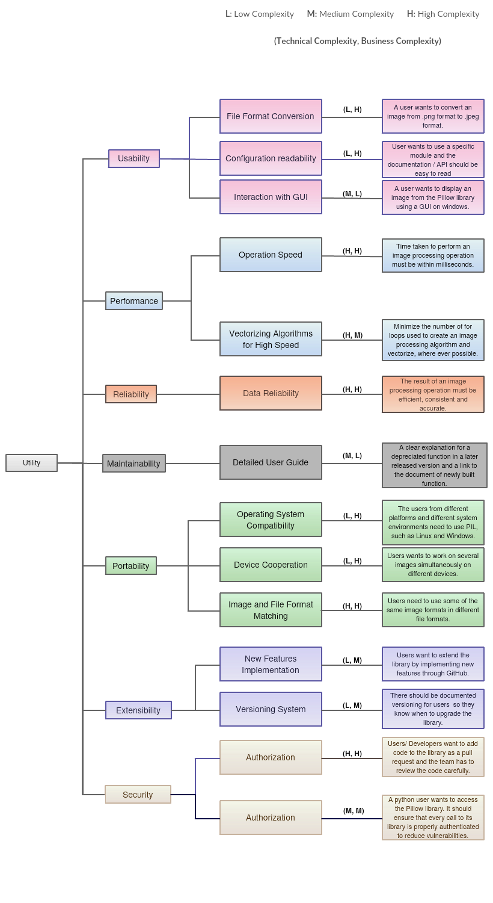

## 2.5 Quality Attribute Scenarios

### 2.5.1 Scenario 1

| Aspect | Details |
| :---: | :---: |
| Scenario Name | Perform image processing on images |
| Business Goals | Make image processing easy for users with different backgrounds and technical skill levels to analyze images by providing efficient and accurate algorithms for doing image processing like Image Rotation, image resizing and affine transforms. |
| Quality Attributes | Performance |
| Stimulus | Need from user to resize the image. |
| Stimulus Source | A user wants to resize an image from 640x480 image resolution to 320x240. |
| Response | Load the input image from the user and produce the resized image as output. |
| Response Measure | Complete operation in &lt; 10 milliseconds. |

### 2.5.2 Scenario 2

| Aspect | Details |
| :---: | :---: |
| Scenario Name | Provide image processing support to PyTorch library. |
| Business Goals | Make image processing easy for users with different backgrounds and technical skill levels to analyze images and convert them into different formats. |
| Quality Attributes | Usability. |
| Stimulus | PyTorch, a deep learning framework wants to use Pillow to blur an image. |
| Stimulus Source | The PyTorch library. |
| Response | Take the input image from PyTorch and apply gaussian filter and return the blurred image. |
| Response Measure | The output image should be returned in &lt; 1 milli second and the output is reliable with almost 100% accuracy. |

### 2.5.3 Scenario 3

| Aspect | Details |
| :---: | :---: |
| Scenario Name | Using Pillow in different operating system environments like Windows, Linux, and Mobile. |
| Business Goals | Try to make image processing accessible across different systems and platforms, and develop applications for mobile devices that helps users manipulate images from anywhere in the world. |
| Quality Attributes | Portability |
| Stimulus | A user wants to enhance an image using the pillow library on Linux, Windows, and on a Mobile Python Interpreter like Termux. |
| Stimulus Source | Any end user or developer. |
| Response | The Pillow library should take an input image on any provided operating system environment and produce the resultant enhanced image. |
| Response Measure | The output image should be returned in &lt; 1 second and the provided result should be consistent on all environments |

# 3.Quality Attribute Scenarios

We use the following two scenarios to complete the primary presentation, context diagram and behaviour diagram.

## Scenario 1

| Aspect | Details |
| :---: | :---: |
| Scenario Name | Provide image processing support to PyTorch library. |
| Business Goals | Make image processing easy for users with different backgrounds and technical skill levels to analyze images and convert them into different formats. |
| Quality Attributes | Usability. |
| Stimulus | PyTorch, a deep learning framework wants to use Pillow to blur an image. |
| Stimulus Source | The PyTorch library. |
| Response | Take the input image from PyTorch and apply gaussian filter and return the blurred image. |
| Response Measure | The output image should be returned in &lt; 1 milli second and the output is reliable with almost 100% accuracy. |

## Scenario 2

| Aspect | Details |
| :---: | :---: |
| Scenario Name | Using Pillow in different operating system environments like Windows, Linux, and Mobile. |
| Business Goals | Try to make image processing accessible across different systems and platforms, and develop applications for mobile devices that helps users manipulate images from anywhere in the world. |
| Quality Attributes | Portability |
| Stimulus | A user wants to enhance an image using the pillow library on Linux, Windows, and on a Mobile Python Interpreter like Termux. |
| Stimulus Source | Any end user or developer. |
| Response | The Pillow library should take an input image on any provided operating system environment and produce the resultant enhanced image. |
| Response Measure | The output image should be returned in &lt; 1 second and the provided result should be consistent on all environments |

## 3.1 Primary Presentation

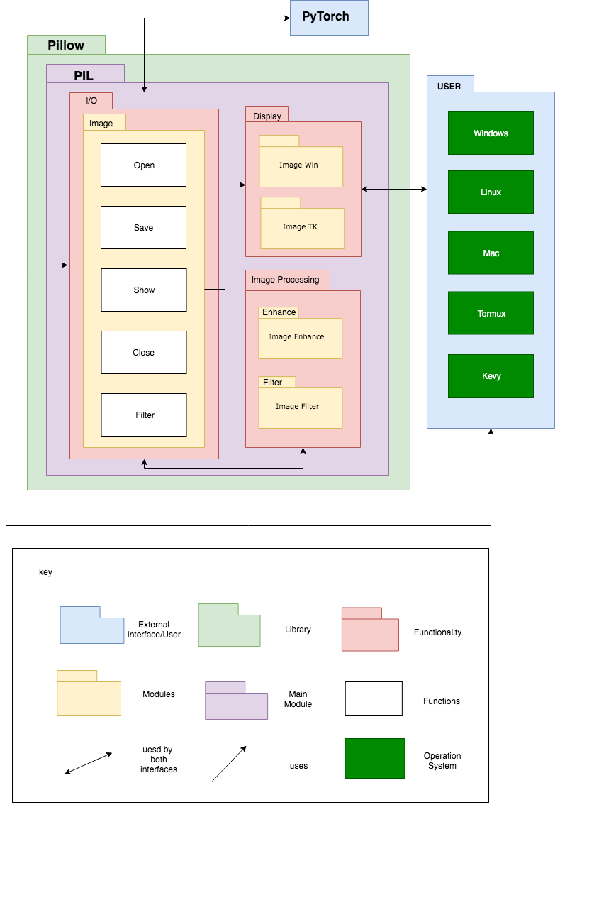

## 3.2 Element Catalog

**1. Pillow:** The Pillow module in the diagram represents a view of the entire library. It contains many modules within itself and these modules might more modules or classes within themselves.

* **PIL:** The PIL module contains all the modules responsible for reading and writing image data, manipulating images, and displaying images.
  * **Input/Output \(I/O\):** The I/O module contains the Image class which is responsible for interacting with the files in the file system.
    * **Image:** The Image class is responsible for opening and closing images using the functions showed in the diagram.
      * **open\(\):** This method is used to reading the image data given an image file.
      * **save\(\):** This method is used to save the image data to an image file given a file name.
      * **show\(\):** This method is used to display images and should be mainly used for debugging purposes.
      * **close\(\):** This method is used to close the pointer to the image file.
      * **filter\(\):** This method is used to filter an image given an ImageFilter object.
  * **Display:** The Display module contains the ImageWin and ImageTK modules.
    * **ImageWin:** The ImageWin module is responsible for creating and displaying images on a Windows operating system.
    * **ImageTK:** The ImageTK module is responsible for modifying TKinter BitmapImage and PhotoImage objects from a PIL Image object.
  * **Image Processing:** The Image Processing module is responsible for processing and modifying images. The diagram shows two modules within this module.
    * **ImageEnhance:** The ImageEnhance module contains a number of classes that can be used to enhance images, including changes in contrast, brightness, sharpness, color, etc.
    * **ImageFilter:** The ImageFilter module is responsible for applying filters to images. The module comes with a number of predefined filters.

**2. User:** These are end users, developers, and anyone using anything that depends on Pillow.

* **Windows:** These are users using Pillow on a Windows Operating System.
* **Linux:** These are users using Pillow on a Linux Operating System.
* **Mac:** These are users using Pillow on a Mac OS Operating System.
* **Termux:** These are users on mobile device using Pillow as a dependency in a terminal emulator.
* **Kivy:** These are users on Linux, Windows, Mac OS, iOS, Android, Raspberry Pi using Pillow as a dependency. Kivy is a cross platform development framework for Python.

**3. Pytorch:** This is deep learning software programs that use Pytorch, which depends on Pillow to manage and manipulate images used by the framework.

## 3.3 Context Diagram

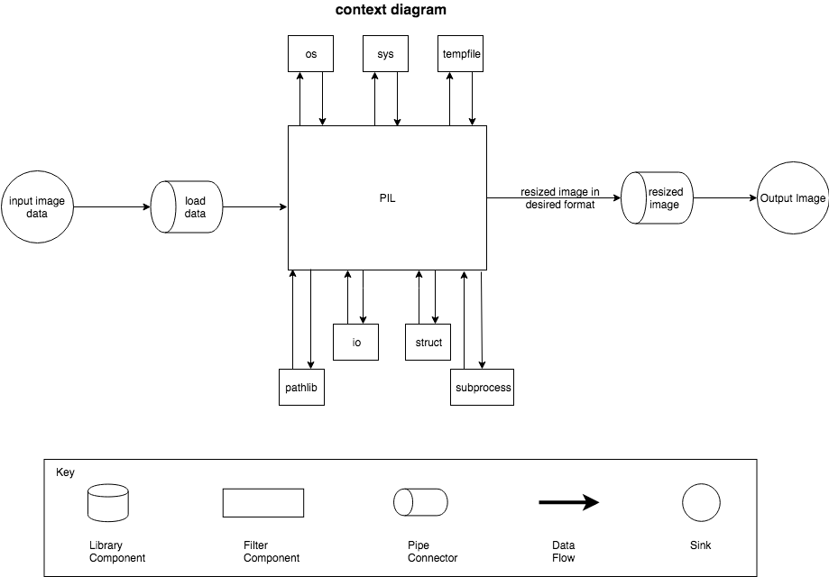

This context diagram shows how the external interfaces interact with the Pillow library. Two quality attribute scenarios namely usability and portability are considered for this diagram.

For the usability quality attribute, the scenario here is a PyTorch user wants to blur an image. So, here PyTorch is an external interface to Pillow and provides an input image to the Pillow, which reads the image data and returns the final blurred image as output.

And for the portability quality attribute, the scenario we deal here is for any user who would like to use pillow from any operating system environment to enhance the color of the image. So, the User is an external interface to the library Pillow. The user can be using any operating system environment like Windows, Linux, Mac, Termux, Kivy. The user will provide an input image data and the pillow should read it and return enhance the image as output. Regardless of the environment, Pillow should work as the same and should produce the same output.

## 3.4 Behaviour Diagram


This behaviour diagram shows the sequence of steps the PyTorch framework would take in order to blur an image.

**1.** PyTorch calls on the `open()` method found in the Image class in order for Pillow to read the image data.

**2.** PyTorch calls on the `blur()` method found in the Image class in order for Pillow to apply a blur effect on the image.

**3.** PyTorch calls on the `save()` method found in the Image class in order for Pillow to write the new image data to a file path and format.

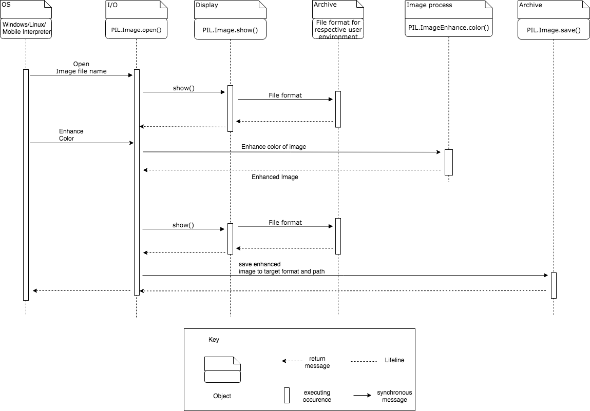

This behaviour diagram shows the sequence of steps a user would do on different operating systems such as Windows, Linux, and Mobile Interpreter, to run a command to enhance the colour of an image.

**1.** User opens the image they would like to enhance.

* In the background:
  * a call to the `open()` method found in the Image class is made in order for Pillow to read the image data.
  * a call to the `show()` method found in the Image class is made in order to display the image to the user.

**2**. User chooses to enhance the colour of the image.

* In the background:
  * A call to the `color()` method found in the ImageEnhance class is made in order for the enhancement to be made to the image.
  * A call to the `show()` method found in the Image class is made in order to display the changes to the image to the user.

**3.** User chooses to save the new image.

* In the background:
  * A call to the `save()`method found in the Image class is made in order for Pillow to write the new image data to a file path and format.

## 3.5 Interfaces

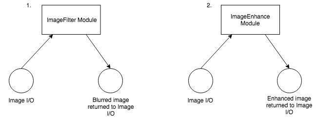

### 3.5.1 Blurring an Image Interface

1. Identity:

   Blurring the image

2. Resources:

   Syntax Resources: Using Pillow, more specifically the ImageFilter Module.

   Syntax Semantics: Pre-Condition: Image must be valid file format. Post-Condition: Blurred image returned to Image I/O.

3. Datatype:

   The input image file will be a PNG, JPEG, BMP, or other image types.

4. Error Handling:

   The interface will return the original image if there are errors when attempting to blur.

5. Variability:

   This interface could change if the ImageFilter Module was called to do something other than blur an image.

6. Rationale:

   This interface was designed to ensure the image returned to Image I/O is the proper image we want returned.

### 3.5.2 Enhancing an Image Interface

1. Identity:

   Enhancing the image

2. Resources:

   Syntax Resources: Using Pillow, more specifically the ImageEnhance Module.

   Syntax Semantics: Pre-Condition: Image must be valid file format. Post-Condition: Enhanced image returned to Image I/O.

3. Datatype:

   The input image file will be a PNG, JPEG, BMP, or other image types.

4. Error Handling:

   The interface will return the original image if there are errors when attempting to enhance.

5. Variability:

   This interface could change if the ImageEnhance Module was called to do something other than enhance an image.

6. Rationale:

   This interface was designed to ensure the image returned to Image I/O is the proper image we want returned.

## 3.6 Rationale

Pillow library is a forked version of PIL, Python Imaging library, which has the main aim to make image processing easy for users with different backgrounds and technical skill levels. The library was designed to be extremely simple to use by anyone wanting to work with image processing, or, any developer wanting to contribute to it. The PIL library contains many modules for supporting different kinds of image processing operations. But all the modules come under three categories namely, Image Archiving, Image Processing, and Image Displaying. Among all the modules, the Image module is one of the most important ones, as all basic operations were included in it. We would like to explain the design choices according to the two quality attribute scenarios namely usability, and portability below.

1. Scenario Name: Provide image processing support to PyTorch library.

In the PIL library, the Input/Output \(I/O\) block plays a key role to interact with external libraries or users. With the help of this module, one can send the input image data to the library and get the final processed image as output through the same block. We think this as an ideal way because the users need not worry about dealing with different modules for each operation. Moreover, the I/O block contains the Image Module which has all necessary functions a basic user wants. In the quality attribute scenario usability, the PyTorch library sends an input image with the corresponding filter name to blur the input image. The I/O block takes the image and loads it through the open function in the Image module and calls the filter function by providing the selected filter name from the ImageFilter module. The authors of the library have made a good design by keeping the ImageFilter module as a separate one, as it supports many types of filters. If they don't design this way and keep all the kinds of filters in the image module, then they must place a separate function for each filter name in the Image module itself, which would be hard to write and is a bad design choice.

1. Scenario Name: Using Pillow in different operating system environments like Windows, Linux, and Mobile.

In the Quality Attribute Scenario Portability, a user using any operating system should be able to use Pillow for enhancing an Image. The resultant image should be consistent on all the platforms and should be produced within a second. The pillow library supports any given platform. In order to make this possible, the authors took a great decision by providing the functionality to open, show, save images on any platform by internally converting them into a specified file format that is compatible with the corresponding platform environment. Once a user provides the image data as input, the Image module opens it irrespective of the environment and sends the image to ImageEnhance module to perform the enhancing operation. By providing ImageEnhance as a separate module, the authors made a good design choice because now, all operation related to enhancing image like brightness, contrast, color, and adjustment are now under one module, which is easy to identify. The processed image is then saved using the save function under the Image module. If the user wants to display the image, he can just call the show method under the Image module. The method takes care of the environment and automatically converts it to a supporting file format to display on the corresponding environment. The Pillow library also supports to manipulate images interactively. For supporting Windows, a separate module was kept for opening and work interactively with it. The library also has ImageTK module to serve the same purpose for Linux and Mac users. By keeping these as separate modules, the users can easily use the respective modules depending upon their environment.

The modules implemented into Pillow were done so in a way to provide a solid image processing tool with enhanced capabilities as it’s the main focus. In the above two scenarios, we explained how Pillow provides image processing support to the PyTorch library and how Pillow can be used on various operating systems. Both of these easy interactions between Pillow’s modules and each respective user \(PyTorch and the aforementioned operating systems\) reiterate why the designers chose to design Pillow in this specific way.


## 4.0 Quality Attribute Scenario for this Milestone.

| Aspect | Details |
| :---: | :---: |
| Scenario Name | Perform image processing on images |
| Business Goals | Make image processing easy for users with different backgrounds and technical skill levels to analyze images by providing efficient and accurate algorithms for doing image processing like Image Rotation, image resizing and affine transforms. |
| Quality Attributes | Performance |
| Stimulus | Need from user to resize the image. |
| Stimulus Source | A user wants to resize an image from 640x480 image resolution to 320x240. |
| Response | Load the input image from the user and produce the resized image as output. |
| Response Measure | Complete operation in &lt; 10 milliseconds. |

## 4.1 Primary Presentation

The primary presentation uses the Component and Connector view to represent the run time behavior of resizing an input image. The diagram captures how the input image data flows from through several pipes and filters to produce the output resized image. With the help of the tutorial implemented in the Jupyter notebook below, we have drawn the diagram.

### a. Code Tutorial for Resizing an Image

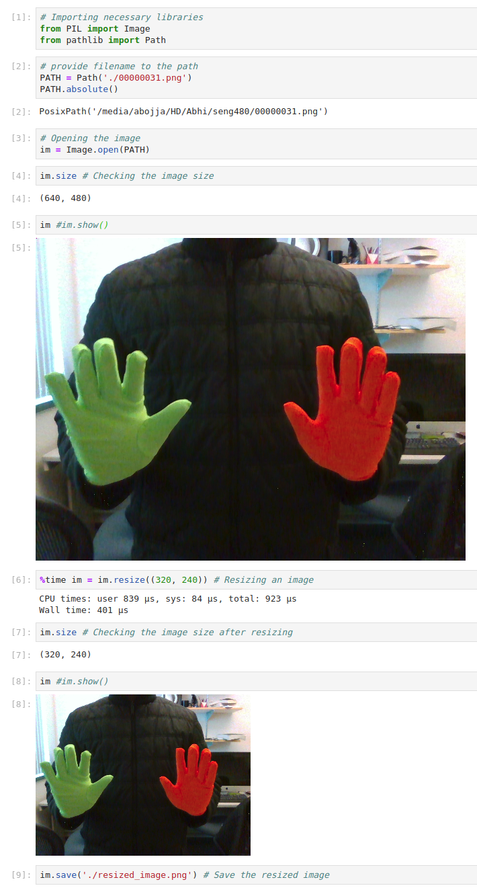

### b. Component and Connector View

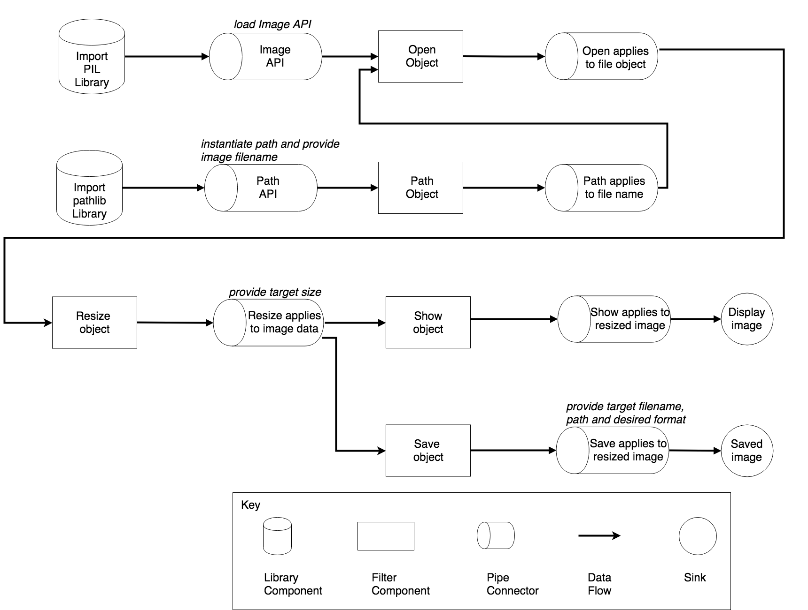

## 4.2 Element Catalogue

#### Image API:

```text
   This is an `Image` module that contains a number of functions and classes used to interact and manipulate the image data.
```

#### Path API:

```text
   This is a `pathlib` object that contains a number of classes and class functions used to interact with the file system and file paths.
```

#### Path:

```text
   In this scenario, a `Path` object is initialized with the image file path. Path is a subclass of the pathlib object.
```

#### Open:

```text
   This is a function of the `Image.Image` object. It is used in order to open files and takes two parameters, fp as the image path and mode as access mode. `Image.open(fp, mode=r)`. The call to this function returns a `Image.Image` object.
```

#### Resize:

```text
   This is a function from the `Image.Image` object that resizes the opened image. It takes in three parameters, size as a width & height 2-tuple, resample as an optional resampling filter, and box as an optional region that should be resized. `Image.resize(size, resample=0, box=None)`. It returns a new `Image.Image` object.
```

#### Show:

```text
   This is a function from the `Image.Image` object that is used to display its own instance to the user. It takes in two parameters, title as a window title and command as an optional command to show the image.
```

#### Save:

```text
   This is a function from the `Image.Image` object that is used to save the image to the users file system. It takes in one or more parameters, fp as the image path, format as optional format/extension override, and extra parameters \( **params\) specific to the image writer. \`\`\`Image.save\(fp, format=None,**  params\)\`\`\`.
```

#### Display Image:

```text
   The resized image displayed to the user.
```

#### Saved Image:

```text
   The resized image saved to the user's computer.
```

## 4.3 Interfaces

### 4.3.1 Image API Interface

**1. Interface Identity:** The **Image Module** is a convenient API for generating or manipulating images using Python code. Users can make direct calls to the functions within this module which outputs the image using ImageWin or ImageTK depending on the environment of the user.

**2. Resources Provided:** There are many functions in the Image module which are divided into 3 subcategories: Image Processing, Constructing Images, and Registering Plug-Ins. We will use Image.blend\(image1, image2, alpha\) for our example interface.

```text
  Image.blend(image1, image2, blend);
```

* **Pre-conditions:**
  * Import all Pillow libraries and necessary Python libraries
  * Parameters for the call must have two images \(image1 and image2\) as well as an alpha value between 0.0 and 1.0. This alpha value is used to determine how we will blend our images.
* **Post-conditions:**
  * If proper inputs were put into the parenthesis when the function call was made, the blended image is returned, else, the original image image1 is returned.

**3. Data Types:** The data types for the the two input images must have the same mode and size.

**4. Error Handling:** Pillow will check the modes and size of the images. If they are not the same, image1 will be returned as output.

**5. Variability:** N/A

**6. Quality Attributes:**

* **Usability:** A user can blend two images of same mode and size into one output image.

**7. Rationale:** This convenient API allows the user to create and manipulate various images. It utilizes the Pillow library efficiently to when making calls to the Image Module. This Image Module will allow processing and construction of desired images.

**8. Usage Guide:**

```text
image1.load()
image2.load()
return image1._new(core.blend(image1.im, image2.im, alpha))
```

The above code creates a new image by interpolating between two input images\(image1 and image2\), using a constant alpha.

### 4.3.2 Resize Method Interface

**1. Interface Identity:** The **Resize Method** is a function from the Image.Image object that resizes on input image. The three parameters it takes in are size \(width & height 2-tuple\), resample as an optional resampling filter, and box as an optional region that should be resized. Image.resize\(size, resample=0, box=None\). It returns a new Image.Image object.

**2. Resources Provided:** Image.resize is selected to be the study case for this interface. This resize function has the role of resizing an image.

```text
  Image.resize(size, resample=0, box=None)
```

* **Pre-conditions:**
  * Import all Pillow libraries and necessary Python libraries
  * Parenthesis conditions:
    * **size:** The requested size in pixels, as a 2-tuple: \(width, height\).
    * **resample:** An optional resampling filter. This can be one of PIL.Image.NEAREST, PIL.Image.BOX, PIL.Image.BILINEAR, PIL.Image.HAMMING, PIL.Image.BICUBIC or PIL.Image.LANCZOS. If omitted, it will be set to PIL.Image.NEAREST.
    * **box:** An optional 4-tuple of floats giving the region of the source image which should be scaled. The values should be within \(0, 0, width, height\) rectangle. If omitted, then entire source is used.
* **Post-conditions:**
  * The resized image will be returned to the user.

**3. Data Types:** The data types for this scenario are valid Image modes which are read and understood by the Image module.

**4. Error Handling:** Pillow will attempt to resize the image and return it to the user. If the alteration is not possible, the original image will be returned to the user.

**5. Variability:** N/A

**6. Quality Attributes:**

* **Performance:** A user can resize an image in &lt; 10 milliseconds.

**7. Rationale:** The resize function inside the Image Module allows users to quickly resize their image in &lt; 10 milliseconds. This included with various other image processing functions make Pillow one of the best image processing libraries available.

**8. Usage Guide:** Returns a resized copy of this image. The code below does not include resample or box as they are optional parameters. This code will resize an image to 320 x 240 pixels.

```text
outputImage = im.resize((320, 240))
```

## 4.4 Context diagrams


This context diagram shows how the external interfaces interact with the Pillow library. The performance quality attribute scenario is considered for this diagram.

For the performance quality attribute, the scenario here is to resize an image to the target size and save it in the desired format. Here, the user provides input image data by providing a file name to PIL. Then the system loads the image with the help of other external libraries like “os”, “sys”, “tempfile”, “pathlib”, “io”, “struct” and “subprocess” and returns the resized image.

## 4.5 Behaviour diagram


The diagram above is an activity diagram that presents a series of actions in the system when the user wants to perform resize operation on image data. This diagram shows the interactions between the user and the system during the execution and the internal connections of source files. In order to resize an image, the user first needs to provide the path of the image file, then the system will check and open the file if the path exists. Then, based on instructions given by the user like the target image size, resampling filter, and the target image file format, Pillow resizes the image and saves it to the target directory provided. This entire process should take less than 10 ms on any operating system.

## 4.6 Variability guide

The component & connector diagram for the Pillow system shown above is very sensitive with the input and output data formats. In our scenario, the user provides the filename and it’s path to the PIL system. But, if the user provides the input information in the form of bytes, then PIL loads the image by the function “PIL.Image.frombytes”. Also, the user can provide the image data as numpy.ndarray, for which PIL should use “PIL.Image.fromarray” to open an image. The user can also save the output image in different file formats like BMP, GIF, JPEG, PNG for which a different function is required internally. The user has an option to chose the _resampling filter_ for resize operation, which changes the runtime behaviour slightly by choosing a different filter.

## 4.7 Measured performance

The code for resizing an image in this scenario was ran on two different computers and two different operating systems. The same image exact was used for both tests and the same code was written.

| Operating System | Processor | Memory | Graphics | CPU Time |
| :---: | :---: | :---: | :---: | :---: |
| Mac OS High Sierra \(V10.13.6\) | 2.3 GHz Intel Core i5 | 8 GB 2133 MHz LPDDR3 | Intel Iris Plus Graphics 640 1536 MB | 490 µs |
| Ubuntu 18.04.1 LTS | Intel Core i7-4790K CPU @ 4.00GHz x 8 | 15.5 GiB | GeForce GTX 980 Ti/PCle/SSE2 | 585 µs |

Looking at the measured performances, we can conclude that the scenario business goals were met on these two specific tests using a specific image. The scenario required that operations happened in under 0.01 seconds. These tests were able to run operations in less than 0.0006 seconds, which is over 16 and a half times faster than required by the scenario response measure.

## 4.8 Rationale

Pillow is an excellent Image processing library which can support various file formats. Although Pillow is not an excellent library for real-time image processing, it provides significantly fast operations. A variant of Pillow called Pillow-SIMD supports real-time Image processing. One main reason for PIL to be able to speed up the operations and provide better performance is because of the lazy loading operation for opening an image, where the image data is not loaded until a call to the actual image processing operation is initiated. This helps to speed up the operations a bit. The image processing operations are implemented in C language and are optimized to run at the system level to achieve high speed. Moreover, Pillow doesn’t depend too much on the external libraries for completing the operations so, and this makes the library dependent only the user’s machine during runtime for taking an image file input and provide a processed image as output.

The core image processing operations are kept under different modules so that they won’t interfere with python functions, through which a user interacts the library. By this way, the library uses optimized computations and able to provide better performance. All the most commonly used image operations are kept under the module _Image_, which make it more user-friendly for the users.

The context diagram shows how Pillow library interacts with the external libraries for opening files and checking for correct file formats while loading them. It uses the library _tempfile_ for creating a temporary file for displaying an image instead of creating an actual image. The library _pathlib_ is used for providing an absolute path for the files. The library _os_ is used to identify the operating system of the user to convert the image into a specified file format for saving the image. Additionally, it is also used to determine the system path of the file. Thus it makes use of the external libraries to complete the image processing operations as fast as possible.

The behaviour diagram shows that the library requires the user just need to provide the input image data and the desired format in which the file needs to be saved. It shows that the library is designed in a very flexible way so that user need to do as less work as possible and the library completely takes care of the rest of the process. The _show_ method automatically creates a temporary file object and convert it to the desired format based on the user’s operating system and display’s output image. By this way, the user can easily display the image irrespective of the operating system. The _resize_ method takes care of loading the opened _Image_ object and resizes it to the desired size provided by the user.

The current implementation is highly optimized for our quality attribute scenario Performance. Here a user wants to resize an image and the Pillow can complete the operation in the desired time by taking minimal inputs from the user. The PIL is organized so well to provide the optimized performance.

# 5.Code Quality and Technical Debt

## 5.0 Introduction

Technical debt is the extra time and effort required for completing software development, which is a long term consequence for taking a shortcut path to reach short term goals. We have studied the code quality in detail for the project Pillow by using the code quality checking tools SonarQube, CodeScene and explained the report in detail. We looked into the Pillow’s code base and open issues in GitHub and described the possible technical debt and also provided the necessary recommendations to reduce it.

## 5.1 CodeScene Analysis

CodeScene is a behavioural code analysis tool that supports the project in different languages, provides code visualizations, and helps to identify and to prioritize technical debt in software systems. CodeScene makes software development more efficient by showing technical debt with most returns.

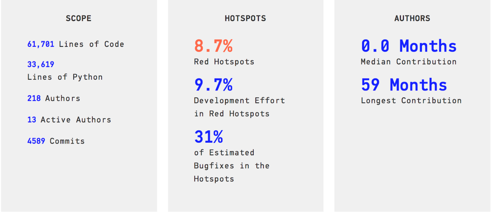

From the dashboard, we can see from the scope section that Pillow has 61701 lines of code and with a majority of 33619 lines of python code. Also, in total 218 authors contributed to the project, and 13 are still active. This number of users reflects that there is a huge variety of knowledge bases when building and maintaining the system, which could make code maintenance possibly a nightmare in the future.

### 5.1.1 Hotspots

A hotspot is the files or module that consumes most of the time and with most development activities. From the hotspots section in the dashboard, we can see that prioritized hotspots make up to 8.7% of the total database, 9.7% of the development efforts were in these hotspots, and 31% of the bugs detected and fixed are in these hotspots. Based on the hotspots report, we know that both the cost of the system and returns from refactoring of these hotspots will be tremendous because, in the most database, red hotspots are responsible for an even larger percentage of fixed defects, which means 31% is on the lower end.  

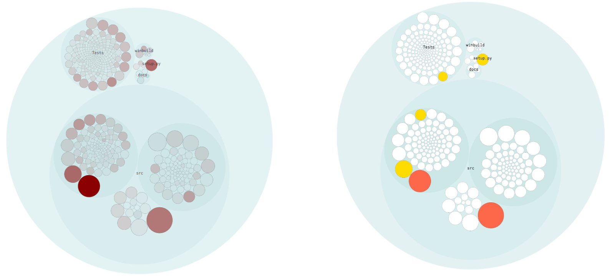

On this hotspots analysis map, each large blue circle represents a folder in the database. The left diagram shows the files with most development activities, and the right diagram shows the refactoring targets based on the following three conditions: The hotspot has to be changed together with several other modules. The hotspot affects many different developers on different teams. The hotspot is likely to be a coordination bottleneck for multiple developers. There are two red targets on the refactoring target diagram, which are image.py and \_image.c, that will give a substantial return on investment.

### 5.1.2 Refactoring Targets

In Pillow, the module _Image_ in PIL/Image.py is responsible for all the critical operations, including reading and writing images, and other major image processing operations.

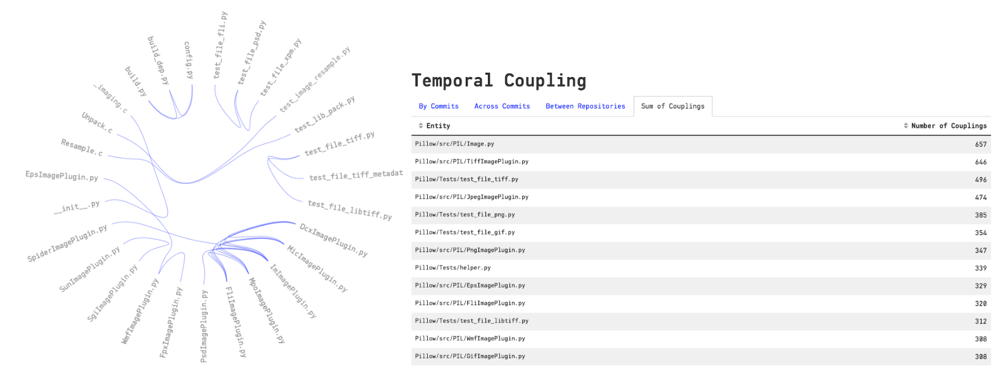

On the left is the Temporal Coupling of files in Pillow depend on if the same programmer modifies them within a specific period. Combined with the sum of couplings list on the right, PIL/Image.py is the primary file to obtain technical debt and bring the most returns of investment.

### 5.1.3 Complexity Trend

A Complexity Trend is calculated by fetching each old version of a Hotspot and calculating the code complexity of those historical versions.

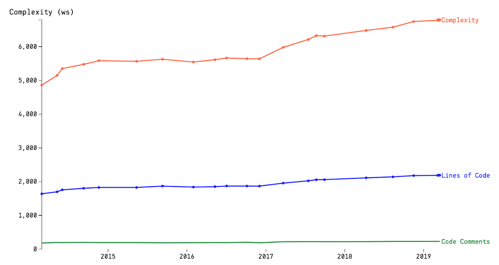

From the complexity trend diagram, we can see that the growths of lines of code and complexity are matching, and complexity increased faster than the lines of code after 2017, which is a bad sign that tells us that without refactoring, the difficulty of maintenance will keep increasing in the future.

### 5.1.4 X-ray

X-Ray is an analysis that operates on the function/method level of different files. It provides detailed information on what’s happening inside a Hotspot and gives an idea of the construction of large files and get specific recommendations on the parts to improve. Moreover, X-Ray shows how a cluster of files is temporally coupled.  

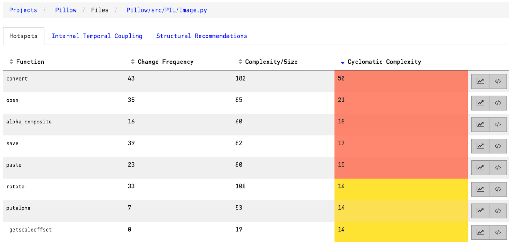

This is the x-ray result of image.py. The higher the change frequency, the more likely the return of investment on these functions will be immediate. Moreover, the complexity gives us an idea of the effort we need to put into refactoring the function. For cyclomatic complexity, usually, any section with a value higher than ten means this function is problematic and higher than 25 means it will become a nightmare in future maintenance. In Image.py, there are five functions with red colour, which means these are the functions we should start refactoring first and will bring the most return on investment.

## 5.2 SonarQube Analysis

SonarQube provides extensive analysis of source code using common technical debt measures. Issues within the lines of code are highlighted and then seven measures of the system are analyzed to give insight on potential operational risks. These measures are reliability, security, maintainability, coverage, duplications, size and complexity. The SonarCloud report generated for Pillow indicates that the system failed SonarQube’s Quality Gate for having a low reliability rating \(Requires an A\).

**Overview**

SonarQube categorizes issues found as either Bugs, Vulnerabilities or Code Smells. Issues found in the code are seen as having an impact on the maintainability of the system. SonarQube estimates that Pillow has 6 days and 6 hours of technical debt. This is the time that it would take to refactor the source code based on the issues and measures generated from the report.

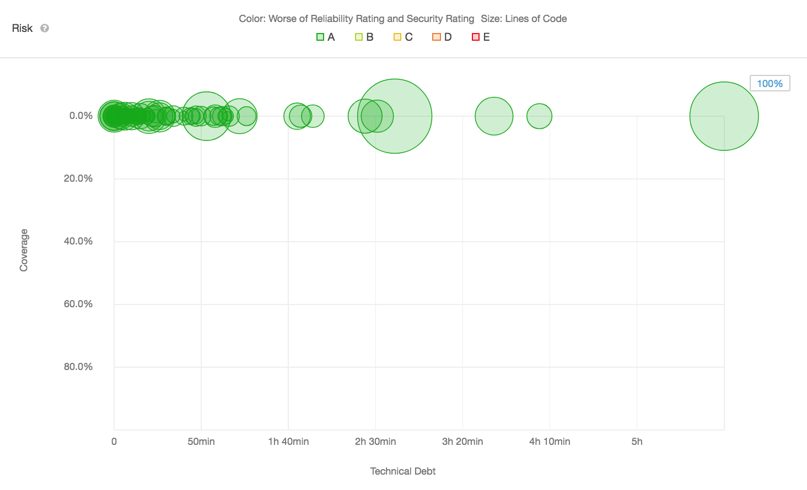

**112 Bugs**

Bugs are code that is considered to be “wrong" and could cause system failure. Pillow’s source code contained 112 bugs. All of these bugs come from a specific HTML file called bmpsuite.html. Out of the 112 bugs, there were only 2 distinct bugs, advising the coder to replace i tag by em tag and add an alt attribute to this image.

**0 Vulnerabilities**

Vulnerabilities are security related issues that mark potential weaknesses to hackers. Pillow had no vulnerabilities found.

**428 Code Smells**

Code smells are issues that could lead to problems arising in the future. The severity of these code smells can be categorized into Blocker, Critical, Major, and Minor. The source code contained 6 Blocker code smells, 69 Critical code smells, 158 Major code smells and 26 Minor code smells. Each of these categorizes has a different degree of severity and likelihood of the worst thing happening. Blocker is considered high impact & high likelihood, Critical is high impact & low likelihood, Major low impact & high likelihood, and Minor is low impact & low likelihood. Similarly to before, a lot of these code smells have multiple of the same issues in different files.

**Reliability Rating: B**

SonarQube gives the system a reliability rating of B, which is because of the 112 bugs in the bmpsuite.html file. The remediation effort is 1 day and 1 hour for this file.

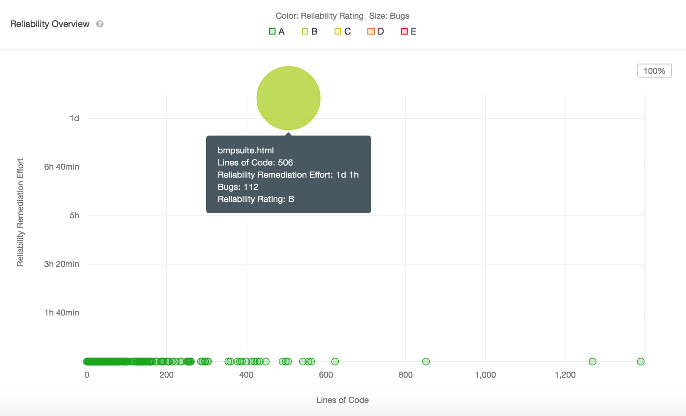

**Security Rating: A**

The system received a Security rating of A based on the number of vulnerabilities found and their degrees of severity. No vulnerabilities means no remediation effort.

**Maintainability Rating: A**

SonarQube gives the system a maintainability rating of A, which is to say that the outstanding remediation cost is less than or equal to 5% of the time that has already gone into the application. Pillow is estimated to require 6 days and 6 hours of code refactoring and has a Debt Ratio of 0.4%.

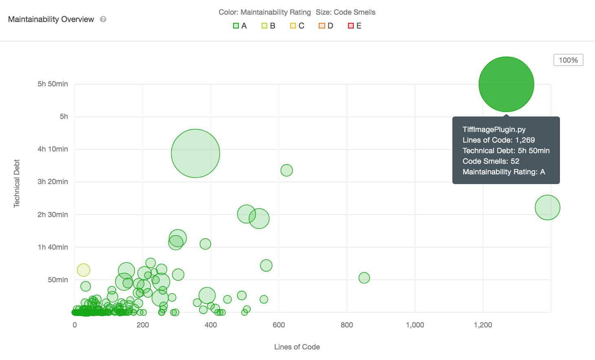

**0% Coverage**

This measure is based on how much of the source code has been covered by the system unit tests. No lines of code were found to be covered during unit tests execution.

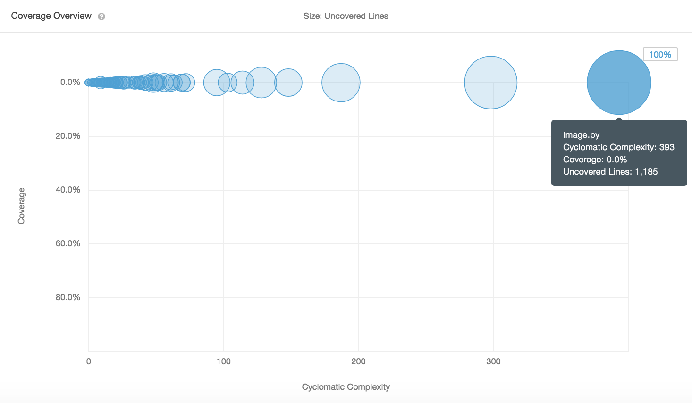

**Duplications**

This is a measure of the total number of lines, files, and blocks of code considered to be duplicated. The analysis says there is 436 duplicated lines, 10 duplicated files, and 16 duplicated blocks of code. The system has 0.9% density of duplication, which is duplicated lines divided by total lines.

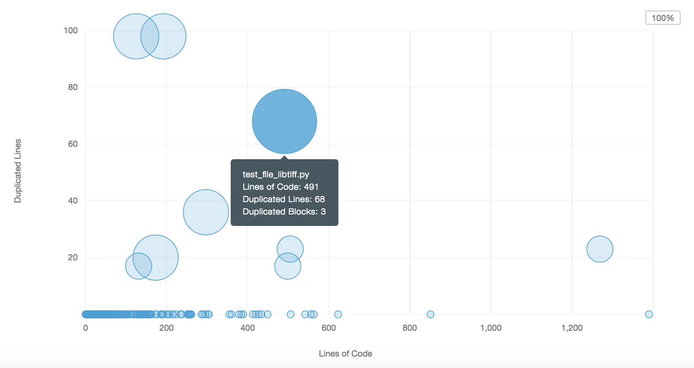

**Size**

LOC \(lines of code\) is a typical measure of the size of a system used by most technical debt analysis tools. Pillow has a total of 49,799 lines, 31,153 of which are lines of code. Pillow also has 24,239 statements, 2,701 functions, 400 classes, 276 files, and 8 directories. There is 8,885 comment lines meaning the system is 22.2% comments.

**Complexity**

Complexity determines how complex the control flow of the system is. Pillow has a Cyclomatic Complexity of 5,788 and a Cognitive Complexity of 5,752. Cyclomatic Complexity determines the minimum number of test cases required for full test coverage. Cognitive Complexity is a measure of how difficult the application is to understand. SonarQube calculates this number based on the number of paths through the code. The complexity counter increases by 1 when the control splits. The file with the highest complexity is Image.py which has a Cyclomatic Complexity of 393.

## 5.3 Technical Debt

### 5.3.1 **Function Recommendation**:

After testing in the SonarQube to find the current and possible technical debts, the code has some issues related to the names of the function, variable, and class. For example, the method name, variable name, and class name should be in the same type of format. In this case, the name of the method should be in lowercase letters without and capitalized letters. Method and variable names can have the same format, but for class name will be in different formats.

_**Technical debts**_: These situations usually make the user unclear, and in the end will lead to misunderstanding and misuse of some methods. The misunderstanding and use of these mistakes will cause subsequent people to continue the previous mistakes, and will also lead to a series of related problems that are inconvenient for group cooperation and communication. Of course, for future software development, it is also very difficult to maintain format consistency. At the same time, the software development process is a process for repairing existing system vulnerabilities, which requires developers to maintain consistency in the various names. If there is no way to manage these names in a unified manner, there will be snowball-like system vulnerabilities, which will delay development time and hinder the resolution of the problem.

The links are here for the local [variable name](https://sonarcloud.io/project/issues?id=zarubiak_Pillow&open=AWmeNs3f3Z451D_2aEwR&resolved=false&types=CODE_SMELL), the [class name](https://sonarcloud.io/project/issues?id=zarubiak_Pillow&open=AWmeNsz63Z451D_2aEtt&resolved=false&types=CODE_SMELL) and the [function name](https://sonarcloud.io/project/issues?id=zarubiak_Pillow&open=AWmeNs2K3Z451D_2aEwB&resolved=false&types=CODE_SMELL).

_**Recommendation**_: The recommendation should be unified and expressive and consistent management for different situations, such as variable names, class names, and method names.To sum up, either variable name, function name or class name should follow the regular expressions to make the format consistent.

### 5.3.2 **Length and Complexity Issues**:

Currently, many files have a relatively excessive length that we can shorten. According to CodeScene complexity trend, the complexity of the system now increases linearly with the growth of the year, the much more linear line representing the line of codes. That’s to say, now it won’t have the huge technical debts in the near future.

_**Technical debts**_: However, If the complexity of some small files rises. For example, if we want to add new variable, new function or even new data structure, there would be more complex for the current file. As a consequence, if we don’t control the length of a small file, it will cause some other issues in the long term. It means that when other files call this small file, the complexity of other files will increase. This trend will have a profound impact due to a small change. The complexity of these files will directly affect the developer's development efficiency because they need to repeatedly use some small files but with excessive length in the methods or variables, when its inconsistency occurs, other files will not run normal results, thus affecting the entire system. operating efficiency. At the same time, system vulnerabilities will increase a lot with these minor changes, which is obviously not imaginable by developers, which greatly reduces the efficiency of developers.

_**Recommendation**_: The recommendation for this issue is to see the table temporal coupling and X-Ray report and according to the data shown in the table, make more adjustments in the less-coupling files. From the temporal coupling table, the larger number shows more relativity among different files, which is more likely to influence the future complexity of the system. For the cyclomatic table, the number which is greater than 10 shows the function is problematic, and the number which is greater than 25 means that there will be larger difficulty to do the maintenance job in the future.

### 5.3.3 “Fixme” Search and Analysis:

The string “Fixme” occurs at 63 instances in the Pillow repository. By searching the keyword “Fixme” provide these [results](https://github.com/python-pillow/Pillow/search?q=fixme&type=Code). The fixes are related to [memory support](https://github.com/python-pillow/Pillow/search?q=fixme+memory&unscoped_q=fixme+memory), confusing error [messages](https://github.com/python-pillow/Pillow/search?q=fixme+confusing+error&unscoped_q=fixme+confusing+error), compiler [issues](https://github.com/python-pillow/Pillow/blob/57807e9ce21535010199be975479c87810c876bf/src/PIL/ImageCms.py#L934) and some design related issues.

_**A. Buffer Size**_:  

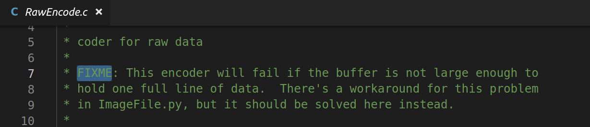

a. Code screenshot for a class in RawEncode.c

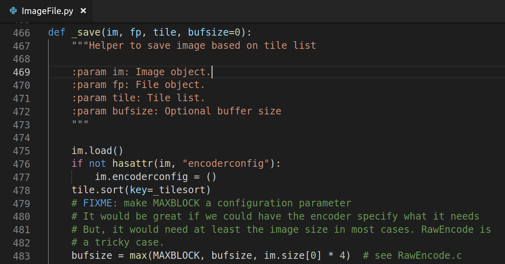

b. Code screenshot for a class in ImageFile.py

The code screenshot b is for a class level function in ImageFile.py. Here we see the comment _“ FIXME: make MAXBLOCK a configuration parameter. It would be great if we could have the encoder specify what it needs. However, it would need at least the image size in most cases. RawEncode is a tricky case”._ The module _ImageFile_ uses the functions in _RawEncode.c_, which are implemented at the system level to speed up the operations and improve the performance. In the screenshot, a, _RawEncode.c_, the comment _“FIXME: This encoder will fail if the buffer is not large enough to hold one full line of data. There's a workaround for this problem in ImageFile.py, but it should be solved here instead.”_, states that the encoder will fail to work if the buffer size is not enough to hold one full line of data. In general, there is no limit on the size of the image resolution data people can use. Rather than fixing this bug, the PIL developers used a small hack for defining buffer size in ImageFile.py itself and sent the value to the C functions. Here it is a minute hack, which is a design flaw in the system, and issues like this can accumulate and lead to technical debt.

_**B. Compiler issue**_:

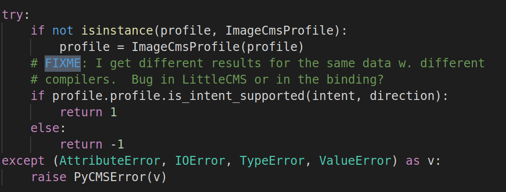

a. Code screenshot for a method in ImageCms.py

The above image is a screenshot of a method taken from the ImageCms.py. Here we see a comment “I get different results for the same data with different compilers. Bug in LittleCMS or in the binding?”. The main purpose of this module is to support the conversion of images between different color spaces, and accurate reproduction of images from different digital devices. But, because of the above-said issue, Pillow is losing its purpose, when used on different devices using different compilers. This module might be of less use in normal purpose but if they want to extend its capabilities and add more functionalities, it will become a huge technical debt over time.

_**C. Reading file issue:**_


a. Code screenshot for a method in ImtImagePlugin.py

This image screenshot is taken from a class level function of ImtImagePlugin.py. Here, the comment is “dangerous, may read whole file”. The module ImtImagePlugin supports processing of IM Tools images. The comment says that the whole file will be loaded if the file is not a text file, which is dangerous. If these kinds of functionalities are used then the program might even crash if the file is very huge. So, at first, the program should check the existence of text in the file otherwise it is useless. These kinds of issues may accumulate and lead to huge technical debt.

### 5.3.3 Other Strings Search and Analysis

Other strings, "hack", "quick fix", "change later" were searched for and analyzed in comments, the table below displays this. These comments are sometimes a sign of poor programming. When you look at these terms in comparison to the "fixme" term written about in section 5.3.2, only "hack" was found. With half of these being part of the change log, which tends to show code that has been fixed already.

| String | In-comment instances found |
| :---: | :---: |
| "fixme" | 63 |
| "hack" | 22 |
| "quick fix" | 0 |
| "change later" | 0 |

### 5.3.4 Issue search: “Hasn't worked in 20 years”

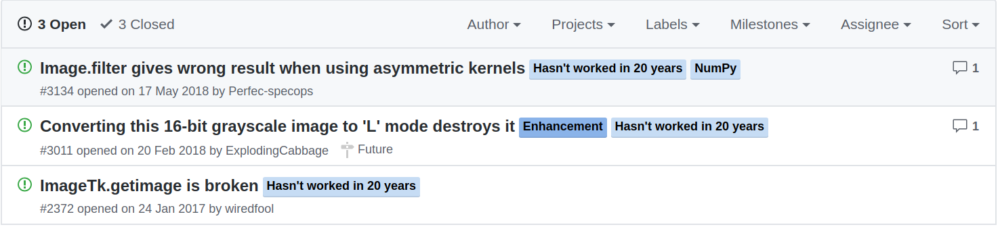

a. Screenshot from open issues

By searching “Hasn't worked in 20 years” in the Pillow issues, we found the above three important problems for which Pillow faces the technical debt now. The first issue says that the module _Image.Filter_ doesn’t support asymmetric kernels. Ideally, the Image filter should support any kernel size. However, currently the \*Image.Filter only supports symmetric kernels. This is a design flaw in the Image.Filter module. The second issue states that Pillow fails to convert a grayscale image to ‘L mode. The pillow documentation provided at this [link](https://pillow.readthedocs.io/en/4.2.x/handbook/tutorial.html#converting-between-modes) clearly states the following statement:

> The library supports transformations between each supported mode and the “L” and “RGB” modes.

But, Pillow failed to convert grayscale image to ‘L’ mode, which is a design flaw and even the provide the wrong documentation. The third issue states that the function call _ImageTk.getImage_ does not return anything. By carefully looking at the code attached below, it states that the function is not implemented but it is not throwing any error, which misguides the user by also calling to other function.

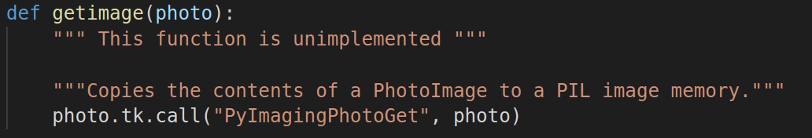

### 5.3.5 Issue Opened: "Eliminate Python 2 Support" and Recommendation

In the Pillow Github repository, there is one issue \([\#3642](https://github.com/python-pillow/Pillow/issues/3642)\) that was open in the beginning of 2019, and is still open. This issue says that Pillow should drop support for Python 2. This issues has been made aware and will be looked at for the next major release in 2020. As the years go by, the use of Pillow use has been mostly made by Python 3 users. Below is an image and a table from PyPI that shows the decline of Python 2 users.

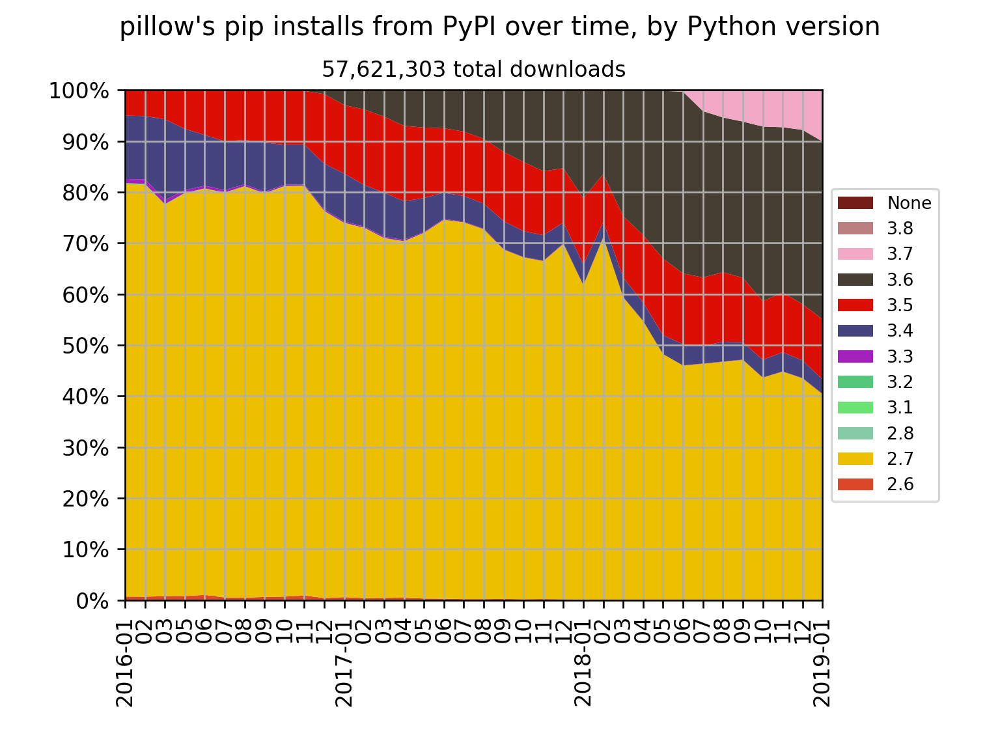

PyPI stats for January 2019:

| Python Version Category | Percent | Downloads |
| :---: | :---: | :---: |
| 3 | 59.17% | 3,138,659 |
| 2 | 40.03% | 2,123,506 |
| null | 0.79% | 42,021 |
| total |  | 5,304,186 |

_**Technical Debt**_

There is a large cost in writing code that is backwards compatible Python 2. Python 3 was considered to be vastly changed from Python 2, hence why many libraries only support one version of the programming language. When developers have to think about how to write code that will be compatible with both versions of Python, it adds a burden on them. One more thing that they have to think about and one more point of failure in the code. This can slow down development times, slow down performance times, and create a larger library.

_**Recommendation**_

The recommendation is that Pillow officially drops support for Python 2 on their next major version release, which is set to occur in 2020. This would only affect new features implemented with Python3 in mind. It would allow majority of users to benefit from it \(refer to table above\) and not prevent uses of Python 2 to use an older version of Pillow. As the years go by, the use of Python 3 over Python 2 will only grow and the implementation of this recommendation could serve as a major factor in making Pillow even better.

## 5.4 Conclusion

Our team found Pillow to be a project with a somewhat large number of technical debts, but also somewhat an acceptable number of technical debts. The technical debts found were not considered vulnerabilities. And for it being open source and community development driven project, we deemed those technical debts acceptable. The CodeScene analysis made it clear that there were only two main files that were clearly visible in the hotspot map, these could be looked into in the future but should not be a priority since it was not considered much in terms of debt. The SonarQube analysis, estimated that Pillow has 6 days and 6 hours worth of technical debt, with most of it being code smells and bugs but 0 vulnerabilities. It also obtained a reliability rating of B, security rating of A, and maintainability rating of A. The manual search for technical debts, that included searching through reported issues on GitHub and comments in the source code that indicate some sort of issue, found some issues but nothing major and no actual vulnerabilities. To conclude, we believe that Pillow should fix some of the technical debts reported in this report but is not required to do it immediately. This can be done over a planned period of time as it requires no urgency.

## 7.0 Pull Request:

The pull request is available at this link:

https://github.com/python-pillow/Pillow/pull/3776

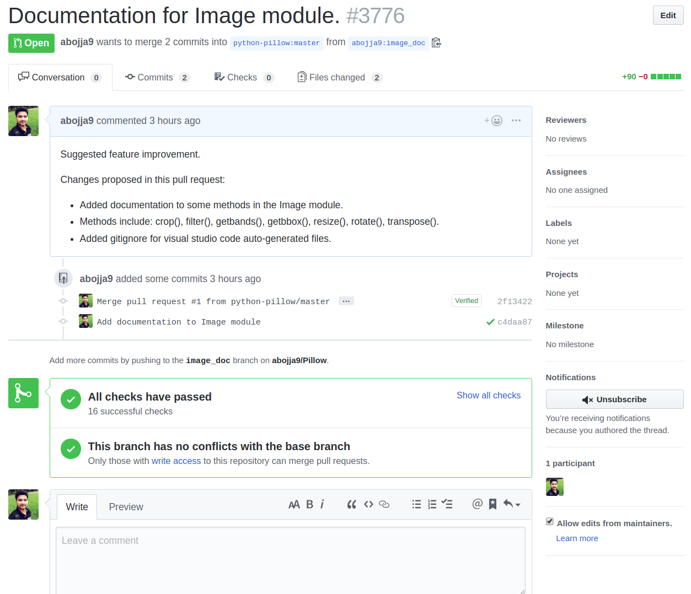

## 7.1 Problem Description:

On the Pillow documentation page, the authors provide only a small description of how different methods work. But for many functions, it is not clear how to use them properly. And there are many issues related to it in the Pillow GitHub repository.


## 7.2 Proposed Solution:
We have taken seven essential and most commonly used functions and provided some examples with helpful comments on explaining how to use that particular method properly. As an example, we have attached a small picture below.

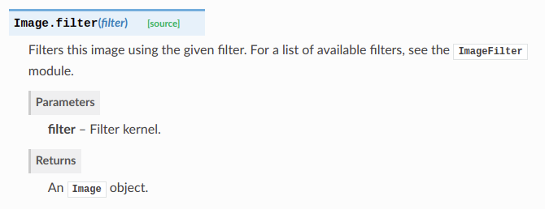

The above image is from the Pillow documentation page. Here it just describes that the method is used to filter an image. It would be helpful to users if they could provide an example of how to use it.

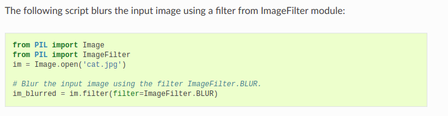

So, we added this above code block, which shows how to blur an image using the method filter.

Similarly, we have added the code documentation to seven essential functions and added as a pull request. The methods include: crop(), filter(), getbands(), getbbox(), resize(), rotate(), transpose().
