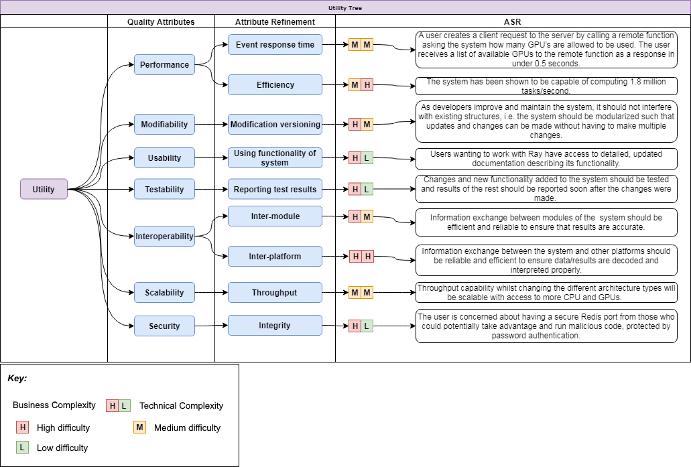
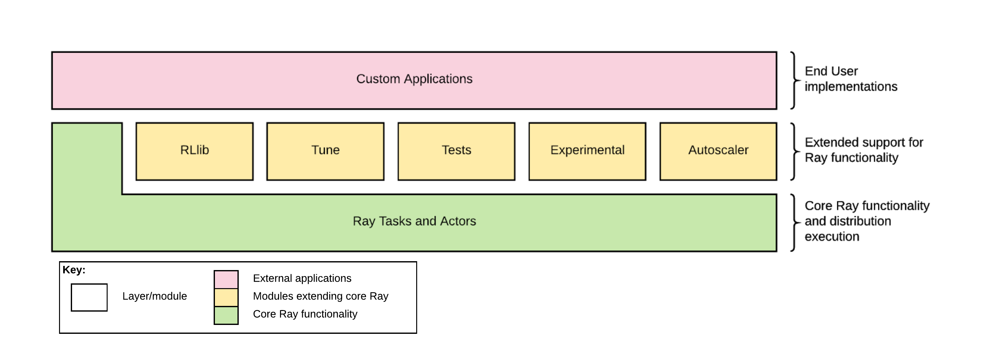
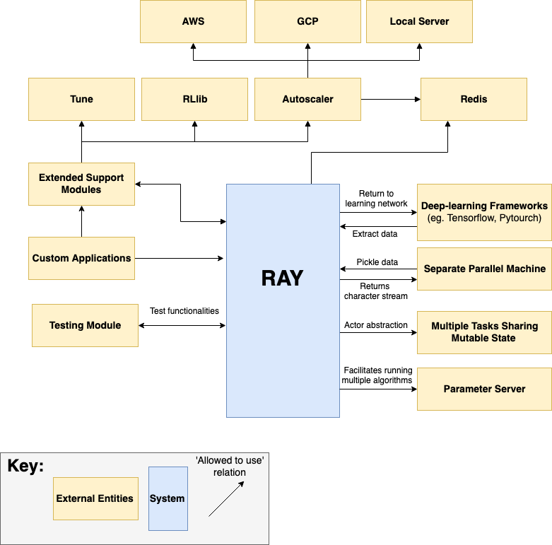
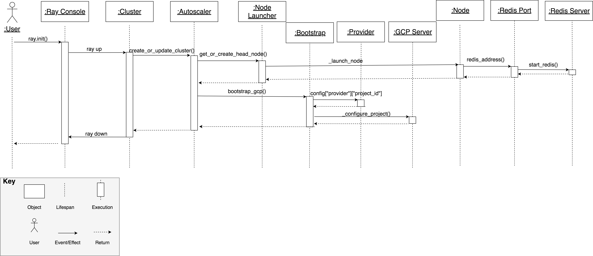
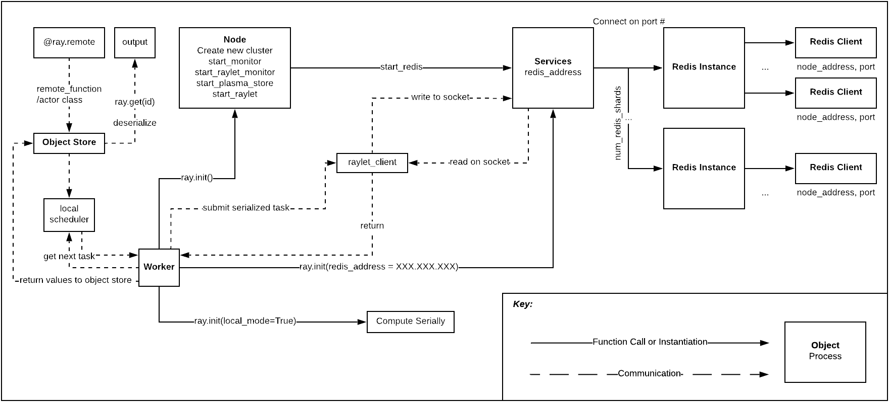
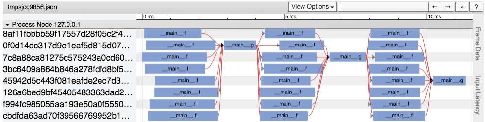
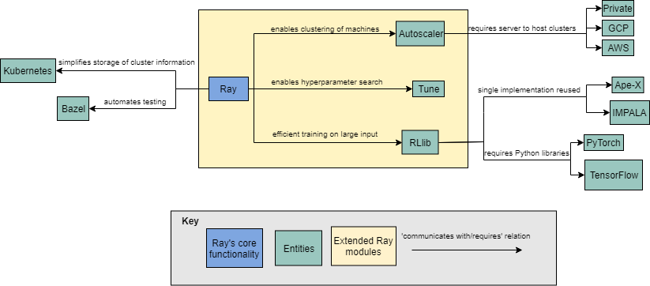
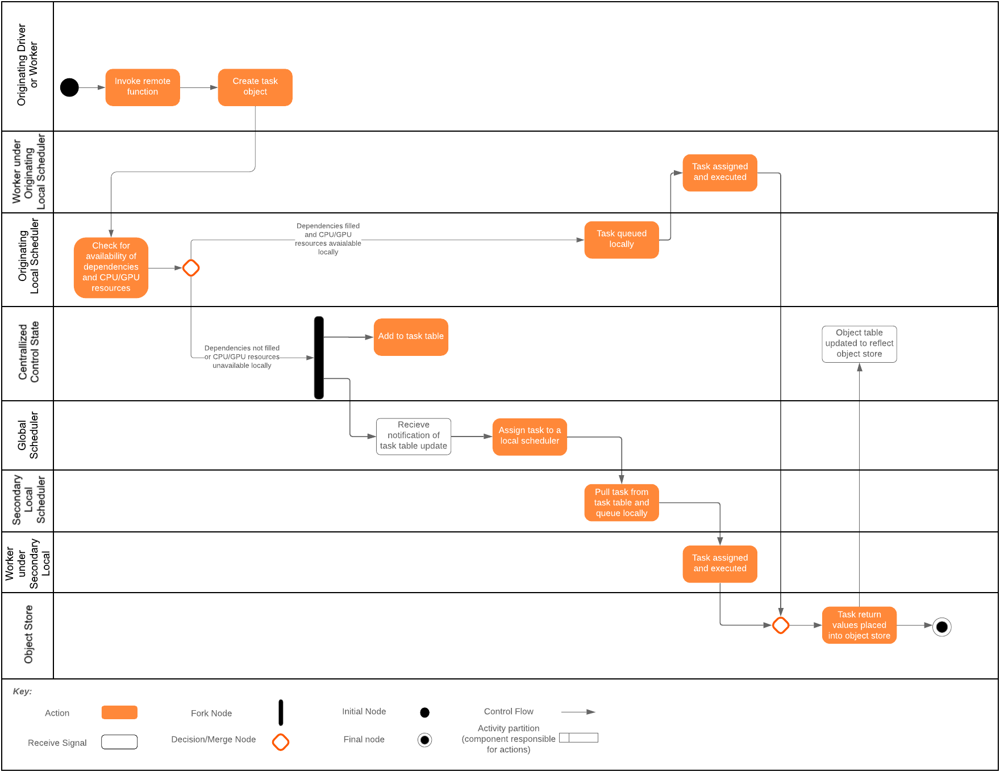

## Table Of Contents

 0. [Introduction](#0-introduction)
 1. [Purpose](#1-purpose)
 2. [About Ray System](#2-about-ray-system)
 3. [Stakeholders](#3-stakeholders)
 4. [Business Goals](#4-business-goals)
 5. [Privacy and Ethics](#5-privacy-and-ethics)
 6. [Architecturally Significant Requirements](#6-architecturally-significant-requirements)
 7. [Quality Attributes](#7-quality-attributes)
 8. [Utility Tree](#8-utility-tree)
 9. [Module View](#9-module-view)
    * Primary Presentation
    * Element Catalog
      + Elements and Properties
      + Relations and Properties
      + Element Behaviour
    * Context Diagram
    * Rationale
 10. [Component and Connector View](#10-component-and-connector-view)
  * Primary Presentation
    * Element Catalog
      + Elements and Properties
      + Relations and Properties
      + Element Behaviour
    * Interfaces
    * Context Diagram
    * Rationale
 11. [Code Quality and Technical Debt](#11-code-quality-and-technical-debt)
 12. [Git Issues and Pull Requests](#12-git-issues-and-pull-requests)
 13. [Conclusion](#13-conclusion)
 14. [References](#14-references)
 
## Team 
| Lucky #13 | 
| --- |
| Ben Smith |
| David Toole |
| Devin Hewett | 
| Hannah Raju | 
| Kun Ye (Dropped Feb, 28) |

--- 

# 0. Introduction

As more and more machine learning and deep learning applications are built in an ubiquitously connect world, we need to consider the limitations of tasks into feasible realities. Powerhouse companies like [GCP](https://cloud.google.com/) and [AWS](https://aws.amazon.com/) offer to abstract away the server side of applications in an attempt to free up developer time and go serverless. Ray attempts to add that type of service in respect to distribution of AI application tasks - they abstract the distribution away from the developers so they can focus more on the application itself. This allows developers to work in high specificity areas (serverless, distribution, application, etc) and refine their respective fields with trust that the outsourced services they depend on are doing the same. 

The following report details a thorough investigation into the architecture and function of Ray.


--- 
# 1. Purpose
[Ray](https://github.com/ray-project/ray) is a flexible, high-performance distributed execution framework.
# 2. About Ray System
The Ray system was created with the goal of parallelizing AI applications in order to reduce computational expense and improve system performance and flexibility. In order to accomplish this task, Ray implements a unified interface that expresses both task-parallel and actor-based computations. A single dynamic execution engine supports these computations. Since AI applications are computationally expensive, Ray tackles this task by employing a distributed scheduler of the parallelized tasks and a distributed fault-tolerant store to manage the system's control state. Ray has been shown to scale beyond 1.8 million tasks per second and has better performance than existing specialized systems for reinforcement learning applications. 

| Version of Ray Analyzed |
| --- |
| 0.6.2 |

# 3. Stakeholders

| Role | Concerns | Instances |
|-----|----------|-----------|
| Acquirers |	Oversee the procurement of the system or product | AI Application Developers|
| Assessors |	Oversee the system’s conformance to standards and legal regulation |  AI Application Developers / Company Lawyers|
| Communicators |	Explain the system to other stakeholders via its documentation and training materials | Ray Developers / Software Engineers |
| Developers |	Construct and deploy the system from specifications (or lead the teams that do this) | AI Application Project Teams|
| Maintainers |	Manage the evolution of the system once it is operational | Ray Programmers  / Open Source Community|
| Production  Engineers |	Design, deploy, and manage the hardware and software environments in which the system will be built, tested,  and run | Ray Software Developers / AI Application Developers|
| Suppliers |	Build and/or supply the hardware, software, or infrastructure on which the system will run | Microsoft / MacOS / All computer manufacturers / NVIDIA |
| Support Staff |	Provide support to users for the product or system when it is running | AI Application Developers |
| System Administrators	| Run the system once it has been deployed | AI Application Developers|
| Testers |	Test the system to ensure that it is suitable for use | Open Source Community |
| Users |	Define the system’s functionality and ultimately make use of it | AI Application Programmers |

# 4. Business Goals
- Parallelize AI Applications
- Improve end system performance and flexibility
- Abstract distribution from AI Applications so the developers can focus more on the application itself
- Reducing cost and time for end users who utilize Ray
- Contributing to open source software solutions
- Responsibility to society
- Improving business processes
- Managing change in environmental factors

--- 

# 5. Privacy and Ethics

## Introduction
Software systems have become ubiquitous throughout commerce, academia, and industry. As Engineers and Architects of these systems, we need to look at the security and ethical considerations that need to be taken to reach the system goal. If the development of software is not done carefully, that leaves opportunity for employment. When attacks happen, it affects tens of millions of users as described by this [Revision Legal post](https://revisionlegal.com/data-breach/2018-statistics/). Not only are the most significant companies targeted, so are the smaller ones too where 36% of attacks are against companies with fewer than 250 employees ([see this Bently University post](https://www.bentley.edu/impact/articles/big-hackers-target-small-business)). Security goes hand in hand with the ethical decisions to be made about a system. What is the purpose of the system? Will the users of the system be protected? Can the users of the system be exploited? The ethical dilemmas of a system extend back from the users to the developers themselves too. As a developer, are you comfortable building a system that could cause harm to others? These are questions that developers and architects ask themselves when posed with the goals of a new system. 
## Potential Privacy and Security Concerns
Ray is a flexible, high performance distributed execution framework. This means that Ray is capable of distributing workloads over multiple nodes and thus if used maliciously, has the potential to cause harm. A common example of this is for an unauthorised person gaining access through a public network of an instance of Ray to Redis port, to gain access to the shell and run possibly malicious code. 

Ray does not use a database or keep user credentials - that would be a part of the AI applications that utilize Ray. Therefore, privacy is not a concern with this framework. 

Ray has the responsibility to give their users the necessary tools to protect themselves and take the necessary precautions to keep the framework's integrity. They do this with regularly scheduled patches designed to fix exploitable weaknesses in the system. However, to ensure security is not compromised, some responsibility lies with the user. Ray should be run only on secure networks with no public facing ports. The user has the option to set a Redis Port Authentication password or a cloud security may be used by launching Ray clusters on AWS or GCP.
## Ethical Dilemmas
Since Ray is a distributed framework focused on increasing performance for AI applications, the ethical considerations about AI extend to Ray as well. The ethical dilemmas for AI include obvious concerns, like its utility in constructing pervasive surveillance systems, enabling the automation of weapons systems, and choices involving what to do during crisis situations in self driving cars. These are all concerns highlighted by sections of the ACM Code of Ethics. The enabling and creationg of surveillance systems has implications on respecting privacy. All three of these are covered by the broad mandate to avoid harm, and to ensure the public good as the central concern of all professional work. Recent research into community reactions to the Trolley Problem as it relates to self-driving cars suggests that the answers to these problems aren’t universal either, but culturally rooted. It also faces more insidious concerns: last year, Amazon decided to discontinue use of an AI hiring tool when they found it was discriminating against female applicants, a violation of our responsibility to be fair and take action not to discriminate.

These problems show that it is insufficient to attempt to address ethical concerns in the conception and development of AI systems. Rather, their effects should, if possible, be studied prior to implementation to avoid unforeseen negative consequences. Such study should be continuous, and feedback carefully considered to address such concerns, should they arise. Put simply, AI requires careful human oversight wherever its actions may have subtle ethical implications. This is in keeping with our obligation to give comprehensive and thorough evaluations of computer systems and their risks and impacts, per the Code.

These problems are not specific to Ray, but as a supporting framework for AI applications, it inherits them.

## Summary
Ray is a system that helps the development of parallelizing AI applications by reducing the computation cost and increasing the system performance efficiently. Ray uses a consolidated interface to perform task-parallel and actor-based computations. In order to avoid the high computation cost in AI programs. The incredibly high speed of scaling task is a piece of conclusive evidence that proves Ray has the best performance on developing AI application among all existing specialized systems. Additionally, Ray has a long list of stakeholders and potential stakeholders. From acquirers to the commercial users, many people are praticiating in the developing life cycle on this platform. This long list of stakeholder implies that Ray has immense potential in AI learning areas. It can provide many opportunities for AI learning field. Ray will take a significant role in the AI area with the unique and creative AI learning approaches. 

The primary business goal of Ray is advancing and parallelizing the AI applications with minimum computational cost. Security and ethical concerns are two critical problems that all software engineers need to consider thoughtfully. The privacy issue can result in numerously lost credentials from the companies and their users. Therefore it is essential to analyze the privacy and ethics issues in Ray. Ray can be utilized in distributing workloads over multiple nodes and this can be a potential risk to the whole system. Since Ray does not connect directly with the database or cloud space, there is no privacy issue with Ray - that lies within the AI application using Ray. In consideration to the ethical issues, Ray is a framework for developing AI applications and therefore has the ethical problems that rise from AI development. 

Ray is an efficient and robust framework for developing AI learning applications and it has many potential stakeholders of this system. Also, it has few privacy issues; however, it has the ethical issues that are existing in the AI developing areas. 

---
# 6. Architecturally Significant Requirements

Architecturally significant requirements are the core components of any architecture and have a major effect on how the architecture develops. Without them, the structure, if it worked, would likely fail to satisfy the core goals. Missing one or adding in a new ASR can dramatically alter the architecture, possibly creating a completely different system.

## ASRs for Ray

### 1. Low latency
Ray requires low latency in order to efficiently assign, execute, store, and provide for the tasks it is used in support of.

### 2. Accessible reinforcement learning scaling
RLlib enables open source developers to take maximum advantage of Ray in their reinforcement learning projects.

### 3. Parallelization
This is the primary purpose of Ray. Ray is designed to allow developers to accelerate their ML tasks by applying the power of a highly scalable cluster of nodes.

### 4. Scheduling
Ray uses schedulers both within nodes and across the cluster to ensure that tasks are assigned to workers and nodes with the necessary available resources and prerequisites as soon as those prerequisites become available.

### 5. CPU utilization
CPUs offer a powerful and broad instruction set capable of accomplishing any number of different tasks, and anyone using Ray on their personal computer can take advantage of its CPU utilization features to parallelize their tasks or simply to see Ray in operation.

### 6. GPU utilization
GPUs offer an enormous source of processing power for vector math, a massive factor in ML applications. Taking advantage of this power is critical to enabling Ray users to achieve the greatest efficiency in their applications.

### 7. Nodal utilization
Ray distributes its tasks across nodes in a cluster, an abstraction for a particular quantity of processing power. By taking advantage of this nodal architecture, Ray provides its parallel execution, and allows for flexibility in the requirement of CPU or GPU resources alloted to tasks and to the cluster.

### 8. Reduced computational cost
By dividing its work load across a cluster of nodes, Ray reduces the time and computational cost each node incurs in completing tasks.

### 9. Patches to fix exploitable weaknesses
Ray must continually be adapted to vulnerability or oversight in its development, and react to the rapidly evolving ML landscape. To this end, Ray remains under open development.

### 10. Network deployability (AWS, GCP)
In order to provide easy scalability for large tasks with low hardware investment, Ray is built to take advantage of AWS and GCP processing resources.

### 11. Redis functionality
Ray uses Redis to coordinate between its various elements, in order to enable clusters to establish connection between each other and use its parallel nature.

### 12. Object serialization
Ray relies on object serialization to distribute necessary resources as well as the tasks themselves across the nodes in a cluster. Serialization is an essential component of the processes  through which Ray parallelizes task execution.

### 13. Fault Tolerance
Ray is designed to execute massive work loads over potentially long periods of time. Faults in the system cannot be permitted to upset these processes, as the cost of lost work would be intolerable to its users.

# 7. Quality Attributes 
For Ray to satisfy the stakeholders’ needs and expectations, the architecture design must consider specific quality attributes to ensure the system can achieve their business goals. Performance and usability were identified as the two most fundamental attributes for parallelizing AI application. Testability and Interoperability support the goal of managing change in environmental factors. Modifiability of the system is crucial to achieve the goal of contributing to open source software solutions. Although these quality attributes do not cover all the business goals, they ensure the system satisfies all the stakeholders’ needs.

### 1. Performance
When the system is running it must respond to events such as messages and client requests from users in an acceptable amount of time as to not exceed the expectations oft eh stakeholders. When the system generates a response to an event, the processing time for generating this response will define the performance of the system. Usually, a shorter processing time indicates better system performance, i.e. a low-latency system. Ray utilizes clustering to improve the performance of AI application by distributing the computation across a set of nodes or cores.

### 2. Modifiability
The system should be structured in a modular fashion in order to allow for easier system modification. Ray is comprised of a core module containing all its base functionality along with several extended modules that allow additional behavior to be imported. This modularized structure not only ensures that users can import only the functionality they need without the bulk of unnecessary function, but also eases the effort required to modify a specific behavior. 

### 3. Usability 
The system should provide an easy way for the user to achieve their goal. This can be achieved through proper documentation and/or user guides about the system. The learning cost for the new system should be minimized. A system is considered highly usable if users are satisfied with the ease of their interaction.

### 4. Testability
When the developers are testing the system, the system should be able to pass the required test cases provided by general and specific testing approaches. A system with an architecture that can reduce the cost of failed testing can be considered a highly testable system. Ray utilizes Bazel to automate and improve efficiency of testing.

### 5. Interoperability
The system should be able to allow easy interface and exchange information with its own modules and other systems or software running on different platforms. When the system is exchanging information with other programs, it should have the ability to correctly decode and interpret the information correctly. As Ray is a distributed system, interoperability is crucial for efficient communication between nodes of a given cluster.

### 6. Scalability
The system should be extensible, allowing for the addition of more logic units and models. If a new logic unit is added into the system, the system should be able to run efficiently and securely with the new module and with minimal noticeable performance drawbacks. Ray’s modular structure again contributes to its scalability, allowing additional functionality to be added in the form of extended modules. 

### 7. Security
When the system is running, it should have the capacity to protect its data and private information from hacker attacks. However, it should always ensure integrity and should provide secure access to the data and information to properly authorized individuals. Ray utilizes Redis port authentication to improve system security. 

## Quality Attribute Scenarios (QAS)
Quality attribute scenarios are used to qualitatively measure the success of an architecturally significant requirement. 

### Performance

| Aspect | Details |
| --- | --- 
| Scenario Name | Using Tune to improve performance of ML algorithms |
| Business Goals | Improve efficiency of machine learning applications |
| Quality Attributes |Performance |
| Stimulus | User wants to optimize ML algorithm efficiency by identifying hyperparameters for optimal performance |
| Stimulus Source | User creating ML application |
| Response | Tune identifies appropriate hyperparameters to optimize algorithm performance |
| Response Measure | Optimal hyperparameters identified |

### Modifiability

| Aspect | Details |
| --- | --- |
| Scenario Name |Ray Autoscaler has limited cloud service options  |
| Business Goals | Provide users with additional options when using Autoscaler |
| Quality Attributes |Modifiability |
| Stimulus | Neither AWS or GCP are open source cloud service platforms |
| Stimulus Source | User has preference of open source cloud service |
| Response | Incorporate Rackspace Cloud as an additional option for Autoscaler users|
| Response Measure | Rackspace Cloud added without requiring modification in other modules of Autoscaler or Ray |

### Interoperability

| Aspect | Details |
| --- | --- |
| Scenario Name | Inter-node communication in machine cluster |
| Business Goals |Improve communication and information flow between various nodes of a cluster|
| Quality Attributes |Interoperability |
| Stimulus | Parallelized AI application running across a cluster |
| Stimulus Source | User employing Ray’s distributed computing functionality |
| Response | Nodes communicate efficiently |
| Response Measure | Sufficiently low latency between nodes of a machine cluster |

# 8. Utility Tree



Figure 1: Utility Tree outlining Ray's primary ASRs.

---
# 9. Module View

The module view captures some of Ray’s important elements and their relations. Modifiability was selected as the key quality attribute to examine because of the emphasis on modularity throughout Ray’s overall structure.

## Primary Presentation


Figure 2: Primary presentation of Ray's overall structure.

The primary view of Ray represents the modularity layers (and modules in that layer) of the architecture. Each layer captures the primary goal that contributes to the overall working system, as described to the right of the figure above. 

### Bottom Layer
Ray is built to abstract the delegation and distribution of tasks to workers (CPU, GPU, network nodes, etc) away from the user so they can focus on their application. Ray takes care of the intricacies of distributing the workload into workable units and delegating those units to workers/agents. Ray then reassembles the results and delivers them back to the user - the user does not need to do any of this explicitly. 

### Middle Layer
Ray's extended functionality is captured in this layer as described below.

#### Ray
Users are not required to use extended support libraries in order to use Ray. Core Ray functionality can be implemented directly through the Ray application programming interface (API) to develop software of any level of complexity. 

#### RLlib
[RLlib](https://arxiv.org/abs/1712.09381) is an open-source library for reinforcement learning that offers both a collection of reference algorithms and scalable primitives for composing new ones. RLlib extends Ray’s distributive abilities to scale reinforcement learning applications computation to a more efficient state so results can be returned at lower latency. 

#### Tune
[Tune](https://arxiv.org/abs/1807.05118) is a scalable framework for hyperparameter search with a focus on deep learning and deep reinforcement learning. Tune offers two API’s: a user API which selects and trains models, and a scheduling API for researchers interested in increasing the efficiency of the model search processes themselves. Tune is useful for users since the majority of time, complexity, and cost comes from the model selection stage - this is where Tune abstracts this from the user.

#### Tests
This module assures the testability of Ray's core functionality and that each aspect of the core functions reach appropriate benchmark efficiencies.

#### Experimental
The Experimental module contains the in-development functionality being added into Ray. Each functionality is either incomplete and unused in the main functionality, built solely for testing reasons, or is incomplete but included in the main functionality.

#### Autoscaler
This module handles the scaling of node/worker implementation. Through this module, Ray is scaled on AWS (Amazon Web Services), GCP (Google Cloud Platform), or on a local server within the constraints of available resources. Autoscaler is the primary example used in this view for examination of modifiability and modularity.

### Top Layer
End users are free to create their own custom applications and involve Ray functionality based on their needs. Some applications include: [OpenAI Gym](https://gym.openai.com/), [multi-agent systems](https://www.csc2.ncsu.edu/faculty/mpsingh/books/MAS/MAS-Springer/1.pdf), [policy serving](https://medium.com/artificial-intelligence-policy-laws-and-ethics/the-ai-landscape-ea8a8b3c3d5d), and offline data analysis. 


## Context Diagram

The context diagram was designed to provide more detail surrounding the structure of Ray and its behaviour with respect to modifiability. Ray’s set of extended support modules are decomposed into a hierarchical structure to capture the notion of modularity. As described by the QAS, adding another server option to Autoscaler would require only one additional module defining the specific behaviour between Ray and the cloud service. Also outlined by the context diagram are some examples of Ray’s interactions with other entities. For instance, one example is Ray’s use of a parameter server to enable multiple algorithms to run simultaneously. The context diagram and key are provided in Figure 3. 



Figure 3: Context diagram of Ray with emphasis on modularity and modifiability.


## Behavioral View 

The behavior diagram relates a specific sequence of actions within Ray to our modifiability scenario defined in Section 2. Figure 4 demonstrates the steps taken by the user and the interactions throughout the system’s modules to create and host a cluster. By calling **ray.init()**, the user initiates Ray on their personal computer. Next, the user calls **ray up** to start an existing cluster. Once part of a cluster, the user can login to their choice of server (GCP in this case) then can begin using Ray’s functionality on a cluster of machines. The diagram shows the different modules in Ray's architecture and the interaction between them when starting this new cluster. The part of the diagram under the Autoscaler object shows how the bootstrap manages the different ids to make a connection to the cloud service. This step in the sequence would differ should the user choose a different server, including the possibility of newly added server options such as Rackspace Cloud as discussed in the modifiability QAS. The remainder of the steps show the relationships between Ray modules in the system and their interactions in setting up Redis connection. These steps would remain identical regardless of server choice except for specific login requirements of the different servers.



Figure 4: Sequence diagram outlining the process of initilizing a head node for a cluster with Ray's Autoscaler module.

## Rationale

Ray’s structure was designed with the notions of usability and modifiability in mind. Ray’s set of extended support modules enables users to either employ the functionality of Ray alone or add any additional components they may require. This arrangement allows Ray to be easily modified, as each extended component is independent from the others and provides distinct functionality. 

The extended modules are excluded from the core functionality of Ray to allow the user to build simple distributive applications without the overhead of unused functionality being included.  Solutions with unused overhead reduce the lightweight robustness of simple applications. The user can abstract as much as Ray allows with the use of the extended support modules: a user has the option to use Tune to do model selection, or forgo it in favour of their own model. The same concept can be applied to RLlib, as the application can be scaled accordingly to work in a dynamic environment. The Autoscaler module offers both user abstractions for scaling on 3rd-party services such as Amazon Web Services (AWS) and Google Cloud Platform (GCP), and scaling on a local server if the user does not want to be concerned with programming that functionality. In reference to Ray’s interoperability, the functionality and purpose to communicate between distinct logical modules of Ray (core and extended support modules) has been built into Ray’s architecture. This allows for efficient communication throughout the architecture.

The core functionality of Ray is kept separately and can be used in of itself to build full applications. At the core of Ray is distributive functionality, dividing work between worker nodes into workable units and then reassembling them back into usable data. This is achieved by threading and multiprocessing via core Python libraries. Each worker node is given an ID and assigned its workable unit of data and this process is logged by an internal monitor. The worker nodes are distributed over a [Redis](https://redis.io/) local database by worker object (worker.py core module). One of the most powerful attributes of the core Ray functionality is that the user can specify that the application use the CPU or GPU to distribute workloads through the remote function module (remote_function.py). By default Ray uses the CPU, but the user may specify GPUs (and an exact number of them if available) explicitly. However, the GPU access is limited by CUDA enabled devices (NVIDIA graphics cards only). To reach the goal of a high performance quality attribute and low latency benchmarks determined by the testing module, Ray serializes the numerous worker objects when distributing among parallel compute nodes so data transfer is efficient to and from sources. The parallel nodes can be local CPU threads or GPU nodes, or the same across distinct network nodes.

Since Ray is built to abstract the complexity of the distributive process away from end users, it is not surprising that popular machine and deep learning frameworks are compatible with the use of Ray. The functionality of frameworks such as [PyTorch](https://pytorch.org/) and [TensorFlow](https://www.tensorflow.org/) is extended in efficiency by the use of Ray. 

Building the extended modules separately from core Ray also enhances the modifiability of the architecture. The extended modules do inherit some dependencies from core Ray, but this is minimized to reduce the complexity of change dependencies. RLlib inherits from ray_constants.py and Tune inherits from Ray’s core services.py for some functionality. The biggest dependency is between RLlib and Tune inside of RLlib's train.py which uses multiple of Tune’s training methodologies to determine the best algorithm for the tasks at hand. The overall architecture of Ray is loosely coupled allowing for a higher level of modifiability. 

# 10. Component and Connector View

## Primary Presentation


Figure 5: The primary presentation observes the core functionality of Ray.

Before Ray can begin to process data, through 
``ray.init(_)``, a Redis server is either initialized or connected to. If ``local_mode`` is initialized as ``true``, then the data is computed serially. Once a Redis server is up and running or connected to, then Ray can publish the data to be processed to the server and subscribe to the results. 

In reference to performance, Ray achieves low latency by serializing tasks through byte streams when publishing to and from clients and servers. Ray is capable of parallelizing AI applications through multiple Workers and Redis Instances. Multiple local schedulers via Raylet Clients can handle massive datasets from the Plasma Object Store. Paired with low latency, the high-throughput of data enables Ray to reach high-performance standards. 


### Worker
Once a task has been scheduled to a local scheduler, whether by itself or by a global scheduler, the local scheduler queues the task for execution. A task is assigned to a worker when enough resources become available and the object dependencies are available locally, in first-in, first-out order. Each worker process has a separate thread running in the background that listens for the addition of remote functions to the centralized control state. When a new remote function is added, the thread fetches the pickled remote function, unpickles it, and can then execute that function.
The [Worker](https://ray.readthedocs.io/en/latest/internals-overview.html) object is the centralized control plane of Ray. The Worker constantly checks for a new task once one has been processed. Taking in a new task, the Worker publishes this work to the Raylet Client by serializing the task (which could be data, a process, or an object). Serializing the task increases the performance of the system allowing the task to be passed along in a byte stream.   

### Node 
A Node object is an encapsulation of the Ray processes on a single node. This class is responsible for starting Ray processes and killing them. Along with initiating a Redis cluster, the Node object starts the processes for monitoring, the Object Store object via the Plasma Store, and the Raylet Client. 

### Services
The [Services](https://ray.readthedocs.io/en/latest/autoscaling.html) object is responsible for initializing the Redis server(s) and providing a proxy service to and from the Redis server to the Node object and Raylet Client. Services include starting the redis server and instances, starting ray processes on the servers, logging, and handling port and IP server/node addresses. 

### Redis Instance
A Redis Instance is a single Redis server process. It is possible to create multiple Redis instances on one physical/virtual server. The number of instances created is determined by the parameter ``num_redis_shards``

### Redis Client
A Redis Client operates on a Redis Instance and is the process that computes the task delegated to it. 

### Object Store
The Object Store is a [Plasma Store](https://ray.readthedocs.io/en/latest/plasma-object-store.html?highlight=plasma) that is a high-performance shared memory object store originally developed in Ray and now being developed in [Apache Arrow](https://arrow.apache.org/docs/python/plasma.html#the-plasma-in-memory-object-store). 

### Local Scheduler
The [Local Scheduler](https://ray.readthedocs.io/en/latest/internals-overview.html) prioritizes received tasks and passes them on to the Worker requesting the next task. Tasks can also be passed to other local schedulers. If all of the task’s object dependencies are present in the local object store and there are enough CPU and GPU resources available to execute the task, then the local scheduler will assign the task to one of its available workers. If those conditions are not met, the task will be passed on to a global scheduler. This is done by adding the task to the task table, which is part of the centralized control state. 
A global scheduler will be notified of the update and will assign the task to a local scheduler by updating the task’s state in the task table. The local scheduler will be notified and pull the task object. 

### Raylet Client
A combined local scheduler and object manager. Once a task is passed to the Raylet Client from the Worker, it is published to the Redis server which will delegate the task to Redis Instances/Clients - the Raylet Client has no knowledge of what the Redis server does with the task once published. The Raylet Client then listens (subscribes) to the Redis server waiting for results to be published from the server. 

### Compute Serially 
When ``ray.init(local_mode=True)`` is called, the task is computed on the local machine and returned to the Worker to be returned back to the user via the appropriate output stream. 

### Output
The output for the task is presented to the user through the appropriate stream. 

## Interfaces

### The Ray API (ray.init())

**1. Interface Identity:** 

The [Ray API](https://ray.readthedocs.io/en/ray-0.6.0/api.html) version 0.6.2 allows user access to the Ray library modules through either a regular python scripts or an interactive browser notebook environment such as Jupyter notebook. 

**2. Resources Provided:** 

There are 13 different functions available through the interface including *ray.init(), ray.is_initialized(), ray.remote(), ray.get(), ray.wait(), ray.put(), ray.get_gpu_ids(), ray.get_resource_ids(), ray.get_webui_url(), ray.shutdown(), ray.profile() and ray.method().* However, the interface method ```ray.init()``` will be analyzed for simplicity.

**A. Resource Syntax:** 

In order to initialize everything required, the user either connects to an existing Ray cluster or initializes one and connects to it via ray.init(). This method creates a new class called [RayParmas](https://github.com/ray-project/ray/blob/95254b3d717ba6ff432ef715464dc1a21844b991/python/ray/parameter.py#10) which defines a number of arguments listed below from different strings, integers and booleans, which are either required or optional and are listed below.  Also, there is an option in the _internal_Config parameter to change to JSON configuration, from Ray’s default. 

```python
ray.init(redis_address=None, num_cpus=None, num_gpus=None, resources=None, object_store_memory=None, node_ip_address=None, object_id_seed=None, num_workers=None, local_mode=False, driver_mode=None, redirect_worker_output=False, redirect_output=True, ignore_reinit_error=False, num_redis_shards=None, redis_max_clients=None, redis_password=None, plasma_directory=None, huge_pages=False, include_webui=True, driver_id=None, configure_logging=True, logging_level=20, logging_format='%(message)s', plasma_store_socket_name=None, raylet_socket_name=None, temp_dir=None, _internal_config=None, use_raylet=None)
```

**B. Resource Semantics:**
 
 **Pre-conditions:** 

  + Connection to the ray library of modules and functions in the Python environment
  + If connecting to an active server, provide the redis_address. If not provided, a new redis server is connected.

 **Post-conditions:** 
 
  + The command will start Redis, a global scheduler, a local scheduler, a plasma store, a plasma manager, and some workers.
  + The command creates an instance of RayParamas and returns a dictionary structure of address information about the started process.
 
**C. Error Handling:** 

If an incorrect combination of argument error occurs while running ray.init(), an ```Exception``` is raised, all the resources revert back to their previous state, and an error message revealing which arguments were incorrect such as: 
  ```python
  TypeError: init() got an unexpected keyword argument 'wrong_arg'
  ```

**3. Data Types:**

*Ray.init()* takes in 26 different parameters, none of which are required; these paramaters are in the form of classic Python structure data types such as string, integers, booleans, dictionaries and memory amounts (in bytes). However, a few use locally defined data types that will be applicable to the quality attribute being addressed:

**huge_pages and plasma_directory:** These parameters require the creation of a file system and activate huge pages. The huge_page parameter is utilized to increase write throughput on Linux machines. Seen through the [documentation](https://ray.readthedocs.io/en/ray-0.6.0/plasma-object-store.html?highlight=%3Cplasma_directory%3E) and requires the creation of a [plasma store](https://arrow.apache.org/docs/python/plasma.html#the-plasma-in-memory-object-store) which is a shared memory object store being developed in [Apache Arrow](https://arrow.apache.org/).
**redis_address and node_ip_address:**  A container orchestration engine [Kurbernetes](https://kubernetes.io/docs/home/) is needed before these parameters can be used, as a [head.yaml](https://github.com/ray-project/ray/blob/08a476932c19920acac5f70a11fc9d8cd583d973/kubernetes/head.yaml) file keeps metadata information on the various ports connections.
*logging_format and logging_level:*  Logging format default includes a timestamp, filename, line number, and message. It is stored in [ray_constants](https://github.com/ray-project/ray/blob/08a476932c19920acac5f70a11fc9d8cd583d973/python/ray/ray_constants.py#88).

**4. Error Handling (Overall):** 

*Example error 1:* Using ```ray.init()``` when a cluster is already active. 

```python
Exception: Perhaps you called ray.init twice by accident. This error can be suppressed by passing in 'ignore_reinit_error=True' or by calling 'ray.shutdown()' prior to 'ray.init()'.
```

*Example error 2:* Using ```ray.init(redis_address = '1213233:5453')``` and giving an invalid port and ip address
```python
ConnectionError: Error 22 connecting to 0.18.131.49:5453. Invalid argument.
```

 **5. Variability:** 

This interface can vary quite a bit in the underlying parameter information and ultimately performance when creating or connecting to a cluster. By additions such as a [huge page](https://ray.readthedocs.io/en/ray-0.6.0/plasma-object-store.html?highlight=%3Cplasma_directory%3E) which can increase throughput or setting parameters such as *num_cpus* and *num_gpus* which are used to limit the number of cpus or gpus the user wishes all local schedulers to be configured with. Setting maximum memory sizes may also affect the degree of performance, as if limited through the *object_store_memory* and *redis_max_memory* might cause the user to have to break up the number of objects or increase redis share size.

**6. Quality Attributes:**

This interface documentation looks at the interoperability of the system and finds ways to directly improve performance. Either large jobs may have to be broken down into smaller batch process to not acceed the set limit or memory limits must be raised. Also, implementation in other abstract structures such as  *huge_page* could be used to increase throughput.

**7. Rationale**

The Ray API was designed in this way so a user is able to make simple single call, with preset parameters and will be able to easily create a new cluster. This allows the user to focus on the high level decisions and let they system take care of the low level internals. However, the large number of parameters allows the user low-level customization if required. The API is set up in a way that once called a new [object class](https://github.com/ray-project/ray/blob/b9ea821d160fceacfa3cff8e6bd7a3f731aea44c/python/ray/parameter.py) containing all the parameters is created for easy metadata storage for the cluster created.

**8. Usage Guide**

To set up a new cluster successful with the default parameters and it returns a dict of the resulting addressing info.

```python
import ray

ray.init()
```
```python
{'node_ip_address': None,
 'redis_address': '172.17.0.12:42142',
 'object_store_address': '/tmp/ray/session_2019-03-18_04-25-06_727/sockets/plasma_store',
 'webui_url': None,
 'raylet_socket_name': '/tmp/ray/session_2019-03-18_04-25-06_727/sockets/raylet'}
```

### Web UI

**1. Interface Identity:** 

The Ray [Web UI](https://ray.readthedocs.io/en/ray-0.6.0/webui.html) version 0.6.0 allows user access to unique tools for debugging Ray jobs. The UI is set up through the ray.init() function which returns a URL and can be launched through a web browser.

**2. Resources Provided:** 

**A. Resource Syntax:** 

In order to successfully run the Web UI, everything defined in the ```ray.init()``` function must run correctly. Upon completion, a URL of the Web UI will be displayed as an index in the dictionary created, such as:
 ```
 View the web UI at http://localhost:8889/notebooks/ray_ui92131.ipynb→token=89354a314e5a81bf56e023ad18bda3a3d272ee216f342938 
```

This will create a  .JSON file that is required to run the interface and is stored in a ‘tmp’ folder. The modules from Jupyter are required in order to run the UI as shown below.
```
pip install jupyter ipywidgets bokeh 
``` 

If [Ray.remote()](https://github.com/ray-project/ray/blob/739ddfa2290ecbbeeae572a7ab1743055379e3a0/python/ray/experimental/array/remote/linalg.py) is being used then the following will launch the UI 
```
ssh -L <local_port>:localhost:<remote_port> <user>@<ip-address>
```

**B. Resource Semantics:**

  **Pre-conditions:** 

  + Connection to the Ray library of modules and functions in the Python environment and Jupyter’s ipywidgets.
  + Successfully set up a cluster where ```python ray.int(include_webui=True)```.

 **Post-conditions:** 
 
  + A resulting URL and .json file with necessary requirements for operation in web browser.
  + The UI will give more detail search information on task and object IDs, a task timeline, a distribution of task completion times, and time series for CPU utilization and cluster usage. 
 
**C. Error Handling:** 

If the system is unable to produce the url of the Web UI it will return a nonetype object in that section of the *.init()* dictionary such as:
```python
'webui_url': None
```

**3. Data Types:**

**Object and Task ID:** is a hex string of the id which can be determined based with the following: 
```python
Object_id = ray.put(1)
hex_Id = object_id.hex()
```
**Task Timeline:** Each node has this search and query ability, presented in a module type interface representation that shows which tasks or subtasks were completed when.
 
**4. Error Handling (Overall):**
 
The Ray timeline visualisation sometimes simply does not work on Firefox and Safari web browsers. However, there is no adverse effect of the UI not working other than being unable to display the webpage.

 **5. Variability:**

The Web UI displays more detailed information on tasks and their timelines. As more tasks are created, additional nodes are created and processed and an interactive visualisation representation will grow as the number of arrows and task nodes increase. If the system has too many tasks, either a timeout error or an insufficient memory error will occur. 

**6. Quality Attribute:** 

This interface improves visualization and allows the user to more easily improve problems with task management and ultimately improve performance of the jobs completed in the system, as it allows interaction (zoom, pan, pop-up, etc...) on task timeline data. Also, a way of viewing CPU utilization can be used to help increase the scheduled efficiency and performance. 

**7. Rational:**

The interface shows a very detailed representation of tasks completed by the different system nodes. Boxes indicate tasks and arrows indicate data dependencies between tasks. This type of visualization can immediately expose problems with performance, scheduling, and load balancing. Therefore, it is a useful tool for improving implementation of how tasks are managed through the system and allow the user to find intuitive ways to increase the throughput performance.

**8. Usage Guide**
First a cluster instance must be launched, from there *.init* provides a link where the UI can be viewed and interactive such as:
```python
import ray

ray.init(include_webui = True)
```
Next, the user must input the resulting url into their web browser. Then the interface appears (Figure 6) as the controls for the widget are at the top, the timeline itself centre screen, and the details area at the bottom. The user is able to select a task or sub-set, the number of task and the percentage of value.



Figure 6: An example of Web UI showing tasks as module nodes and dependencies and lines between.

## Context Diagram

The context diagram (Figure 7) extends on the primary presentation in order to show external modules that help improve Ray’s performance. As described in section 3, the module view, Ray’s functionality can be employed either on its own or with its extended modules such as Autoscaler and Tune. These extended modules are not part of Ray’s core functionality and exist to provide additional functionality and improve Ray’s overall performance depending on the needs of the user. 



Figure 7: Context Diagram of Ray with emphasis on Performance.

The relations in the context diagram summarize how each entity is used in conjunction with Ray to optimize performance. Ray uses some entities directly to improve performance:

+ Kubernetes provides simplified information storage regarding Ray clusters. Its cluster-based structure allows for efficient utilization of resources and navigation of stored cluster data.This enables improved performance of clustered machines.
+ Bazel helps to enhance performance by automating Ray’s testing process.

Some external entities aren’t used directly by Ray, but are instead employed by the three major extended modules that are built on top of Ray:

+ Autoscaler uses cloud service platforms such as Google Cloud Platform (GCP), Amazon Web Services (AWS) or a private server to host and enable the use of clustering to improve computational efficiency across multiple machines. 
+ RLlib improves training efficiency on larger datasets by allowing a single implementation of complex reinforcement learning structures such as Ape-x and IMPALA to be reused over and over again. RLlib requires the libraries of either PyTorch or TensorFlow in order to function.
+ Tune enables efficient optimization of machine learning algorithms through a hyperparameter search based on pre-set conditions. For instance, a user may want to determine a set of hyperparameters to achieve stopping criteria of 95% accuracy.

## Behaviour Diagram



Figure 8: Behaviour diagram outlining how tasks are executed, queued, and returned in Ray.

## Rationale

The core functionality of Ray utilizes parallel workers to handle tasks passed on by the local scheduler when resources (CPU and GPU requirements) are satisfied for the local node. The workers pass tasks through to raylets, which have their own local schedulers and object managers, which act as a proxy between the worker and the Redis servers. Passing these object tasks between these modules/objects could cause a bottleneck; so Ray serializes these into byte streams to increase the performance of the system and reducing latency. There is an overhead of setting up Redis Servers if none are already available; but once they are initialized then that overhead is overturned by the increased performance of parallelizing tasks across multiple Redis Instances. 

Ray’s primary focus is to provide a high-performance means of parallelizing AI applications. In order to achieve desired performance standards, Ray uses a distributed shared memory system to handle massive datasets. Ray’s bottom-up hierarchical scheduler ensures low latency and high throughput of data. Ray employs Bazel for automation of testing processes. This not only improves the efficiency of the testing process, but allows the developers to focus on other more critical parts of the system that may need attention. Ray’s core functionality can be used on its own or in conjunction with the extended modules built on top of Ray. Tune, Autoscaler, and RLlib each provide distinct services and are imported independently. This design acts to optimize performance, allowing the user to select only the extended modules they require. 

The Ray API allows users to create a cluster with a single call, enabling the user to focus on the high-level aspects of their own application rather than on the inner-workings of cluster generation. The initialization of Ray accepts a large number of optional parameters allowing for user customization depending on their requirements. Again, this allows the user to be selective about the functionality they are importing and improves performance by omitting any unnecessary modules from their Python environment.

Ray’s web UI provides a way of visualizing the breakdown and dependencies of tasks within or across one or more CPUs. By allowing users to see exactly how tasks are being managed and distributed in the system, users can expose issues within the system and ultimately allow them to improve performance and scheduling related issues.

---
# 11. Code Quality and Technical Debt

The [PyLint](https://www.pylint.org/) tool was used to assess Ray against coding standards and produced a report detailing the violations. A full report of the programs findings can be found [here](https://github.com/SENG480/project-team-13/blob/master/PyLintOutput/pylint_output_REPORT.txt), the following sections analyze and summarize these findings.  

### About PyLint
From the PyLint website:
> Pylint is a tool that checks for errors in Python code, tries to enforce a coding standard and  looks for [code smells](https://martinfowler.com/bliki/CodeSmell.html). It can also look for certain type errors, it can recommend suggestions about how particular blocks can be refactored and can offer you details about the code's complexity.
>
> …
>
> What Pylint says is not to be taken as gospel and Pylint isn't smarter than you are: it may warn you about things that you have conscientiously done.


## Code Quality
PyLint was run on core Ray and then again on core Ray and the extended support modules, the following score assessment was given:

|Core Ray | Ext + Core Ray |
| --- | ---|
|7.45/10 | 7.37/10 |

The score provided was determined by evaluating on different areas and calculated as follows:

```python
10.0 - ((float(5 * error + warning + refactor + convention) / statement) * 10)
```

As per the equation PyLint gives for it’s scoring, it is based on different types of information and designates specific flags to the violations or idioms that best references them. The following are the flag types and meaning:
- [I]nformational messages that Pylint emits (do not contribute to your analysis score)
- [R]efactor for a "good practice" metric violation
- [C]onvention for coding standard violation
- [W]arning for stylistic problems, or minor programming issues
- [E]rror for important programming issues (i.e. most probably bug)
- [F]atal for errors which prevented further processing

As indicated in the above table, the score was poorer when the extended modules were included in the assessment but not by much. Since the difference is minute, we can assume that the majority of violations occur in the core of Ray. Asserting this to be true, we will consider the core of Ray for this assessment of the projects code quality and technical debt. The other reason only the core of Ray will be considered is that the main functionality of the system itself is the core of Ray - the extended support modules only offer functionality that extends from the core. Analyzing the extended modules would be analyzing a different type of system (such as RLlib is a reinforcement learning module and Tune is a hyperparameter pipeline for training algorithms whereas Ray is a distributed system for machine learning applications). 

Using the following command in a [CLI](https://en.wikipedia.org/wiki/Command-line_interface) will produce [this report](https://github.com/SENG480/project-team-13/blob/master/PyLintOutput/pylint_output_REPORT.txt) (linked above also) from PyLint about Ray.

```bash
pylint --reports=y --ignore=autoscaler,cloudpickle,core,dataframe,internal,rllib,scripts,tune ray/python/ray >> pylint_output_REPORT.txt
```
The directory ``experimental/`` is included in the assessment of Ray as some of Ray’s core features are implement from this directory. Also, ``test/`` was included to determine if the testing module could be in error. 

### Breakdown of Ray
An overall count of the different violations PyLint found in core Ray after analyzing 6414 statements have been captured in the following report. 

#### Statistics by Type

| Type | Number | % Documented | % Badly Named |
| --- | --- | --- | --- |
| Module | 71 | 21.92 | 0.00 |
| Class | 52 | 69.23 | 0.00 |
| Method | 347 | 79.83 | 0.58 |
| Function | 317 | 59.94 | 1.58 |

The table above shows the number of different programming idioms exist within Ray and of those different types, how much of it is documented. Ideally, each component would be documented 100%, however in business settings it is not always possible due to tight deadlines. Not to blame all the lack of documentation on business practices, some does stem from laziness of the programmers themselves. The lack of documentation could lead to misinterpretation or confusion about the purpose of each type of programming idiom, especially to newer members in the field. The percentage of poorly named functions and methods toll in to the convention violation sum listed below. Badly named methods and functions could potentially lead to misinterpretation of purpose or function. 

#### Raw Metrics

| Type | % of Ray |
| --- | --- |
| Code | 55.89 |
| Docstring | 24.25 |
| Comment | 7.59 |
| Empty | 12.27 |

All of Ray’s 65 modules and 52 classes are composed of the above tables distribution. As a reminder, a [python docstring](https://www.python.org/dev/peps/pep-0257/) is a string literal that occurs specifically as the first statement in a module, function, class, or method definition. A docstring differs from a comment in that comments may occur anywhere within the code file. Together, docstrings and comments make up 31.84% of Ray. 

Without empty space (whitespace) code may as well be minified and unreadable - so having a percentage of the codebase be empty would be considered good. 

#### Duplication

| Focus | Number |
|---|---|
| Duplicated lines | 208 |

Duplicate lines of code show possible redundancy within a system. Though it isn’t clear via PyLint output where these duplicated lines are, we can make some assumptions: 
- Duplicated lines exist between core Ray and inside experimental
- Duplicated lines exist between core Ray and inside tests
- Duplicated lines exist in core Ray modules and are redundant 

#### Messages by Category

| Type | Number |
| --- | --- |
| Convention | 684 | 
| Refactor | 217 |
| Warning | 258 |
| Error | 96 | 
| Fatal | 0 |

In conjunction with the above table, a breakdown percentage of errors are shown [here](pylint_report/percentErrWarnByModule.md) and the number of occurrences for each message type is shown [here](pylint_report/pylintMessageSumm.md).

##### Convention Violations
By far, the coding standard convention violations are where most of the flags are raised. This could demonstrate that the programmers were not practiced in standard coding conventions. This could cause a difficulty in understanding by someone expecting a particular standard and having to interpret the developers' (of Ray) implications. 

The flags for convention violations appear to be distributed fairly evenly across every module as per the percentage breakdown. This supports the claim that the developers were not fluent in proper coding standards. With violations under “invalid-name” (310 occurrences) and “missing-docstring” (270 occurrences) being the most frequent flags thrown by PyLint. ``worker.py`` raised the most convention warnings (7.31%). This could be for two reasons:
1. ``worker.py`` is part of the central plane of control for processes in Ray
2. ``worker.py`` is the largest file in Ray

##### Refactoring
Violations labelled for refactoring imply poor design choices by the developers/contributors. In order to fix these flags would involve reworking the structure/architecture and possibly the purpose of certain modules. 

The topmost refactoring flag thrown was for “too-many-arguments” (37 occurrences) implying that either the developers changed the purpose of some functions/methods, plan to implement features, or simply made the mistake of involving more arguments than necessary. The module that is in need if refactoring the most is ``worker.py`` since it raised the most (10.14%) refactoring flags of all the modules. 

##### Warnings
Warning flags are a sign that a potential error may arise. These warnings imply that Ray was pushed to the open source market before it was complete - it requires reworking sections or services need to be implemented. 

Ray has a total of 51 “fixme” warnings which have all been labelled as “TODO’s” by the developers/contributors. This shows that there is an awareness of Ray’s pitfalls and comments along with it describing the question or action to be solved. ``worker.py`` has the greatest (24.81%) of warning flags out of all the modules. The other modules percentage of warnings are all less than a third of ``worker.py``’s percentage. The top most warning message after “fixme” is “protected-access” which states that a protected member is accessed outside the class or a descendant of the class where it's defined. This could demonstrate a poor understanding of object-oriented programming idioms. 

##### Errors (Bugs)
Error flags are raised for important programming issues - which are potentially bugs. Errors are the most serious, under fatal errors, to be considered for remedy priority. If left unchecked, potential system failures or downfalls may occur that could either corrupt data or crash processes. 

The most common message raised was the “import-error” (46 occurrences) detailing that a module was unable to be imported. If necessary modules are unable to be imported then that could lead to potential failures in the overall system. The most error flags raised (33.33% - one third of all the error messages) inside ``gcs_utils.py``. For a file that is less than 80 lines, this is a lot. This implies that the ``ray.core.generated.*`` modules are not imported - which once looking inside the directory ray/core/generated/ there is only an empty ``__init__.py`` file. This implies that the GCS (Google Cloud Storage) service is unavailable unless manually included. 

##### Fatal Errors
PyLint did not expose any fatal errors within Ray and so it can be assumed that Ray is unlikely to crash when running. This implies that there is good cohesion between modules and coupling within. 

### Summary 
The flags raised by PyLint imply that Ray has a level of technical debt that requires addressing by the developers and the open source community if Ray will continue to be relevant within its niche purpose. 

With the substantial amount of flags coming from ``worker.py`` - this would be the best place to begin. 


## Technical Debt

Technical debt arises when shortcuts are taken during the development process in order to produce fast, convenient, short-term results. These shortcuts can cause major pitfalls in the long run, when maintainers attempt to review the system but find it overly-complex and poorly written, resulting in unnecessary time and money spent on maintenance. 

### Analysis of Technical Debt in Ray

To detect potential technical debt within Ray, the Pylint results from the preceding section were combined with [SonarQube](https://www.sonarqube.org/) output and manual analysis of critical Ray modules. A full report on SonarQube’s findings can be found [here](https://sonarcloud.io/dashboard?id=ray_test). Three modules were selected for analysis based on their size and importance in the functionality of Ray’s core methods:

- [worker.py](https://sonarcloud.io/project/issues?fileUuids=AWmxRtIF5QE9aC-C9HDj&id=ray_test&open=AWmxRtgY5QE9aC-C9HNw&resolved=false): the central control for Ray processes, primary focus of the code quality analysis above.
- [actor.py](https://sonarcloud.io/project/issues?fileUuids=AWmxRtIF5QE9aC-C9HDa&id=ray_test&open=AWmxRtgD5QE9aC-C9HNa&resolved=false): used to schedule tasks and processes in Ray
- [node.py](https://sonarcloud.io/project/issues?fileUuids=AWmxRtIF5QE9aC-C9HD3&id=ray_test&open=AWmxRthG5QE9aC-C9HOW&resolved=false): responsible for starting and killing Ray processes.

SonarQube identified 499 code smells throughout the system, resulting in an estimated technical debt of 11 days (i.e. 88 hours worth of effort to fix all code smells. The code smells and technical debt (in terms of estimated hours and minutes) identified in each of the focus modules are described in the following table:

| Ray Module | Code Smells | Technical Debt | 
| --- | --- | --- |
| worker.py | 12 | 3h 11m |
| actor.py | 2 | 40m |
| node.py | 1 | 20m | 
| TOTAL | 15 | 4h 11m (251m) |

The greater number of code smells and technical debt in ``worker.py`` is likely due to the same reasons it raised the most warnings identified in the Code Quality section: ``worker.py`` is larger and acts as the central control of Ray. A breakdown of the issues identified by SonarQube is provided in the following table:

| Issue | % of Code Smells | % of Technical Debt | 
| --- | --- | --- |
| Cognitive Complexity | 60% (9) | 52% (131m) |
| Excessive Parameters | 40% (6) |  48% (120m) |

Within the three focus modules of Ray, only two specific areas of technical debt were identified using SonarQube. As noted by the above table, Cognitive Complexity and Excessive Parameters comprise 100% of the identified code smells in ``worker.py``, ``actor.py``, and ``node.py``.

### Cognitive Complexity

SonarQube defines [Cognitive Complexity](https://docs.sonarqube.org/latest/user-guide/metric-definitions/) as how difficult it is to understand the control flow of the code. Several instances of overly complex code arise throughout the system. All of the identified instances involve blocks of mostly undocumented, poorly-nested if-statements that require factoring. A few examples within our focus modules are examined here.

#### worker.py

Eight instances of cognitive complexity issues were identified throughout ``worker.py``. 
The [largest area of cognitive complexity](https://github.com/ray-project/ray/blob/master/python/ray/worker.py#L1396)  identified in ``worker.py`` is located in its``init()`` function and requires an estimated 37 minutes to fix. While ``init()`` contains a docstring, its nested conditional statements have little to no inline documentation describing what the conditionals themselves are checking. This makes the control flow incredibly difficult to interpret if you are unfamiliar with the inner-workings of the system and will likely cause tremendous delays if the module requires modification in the future.

#### node.py

The only code smell identified in ``node.py`` is a cognitive complexity issue. Again it consists of a block of conditional statements with minimal inline documentation. Many of the conditional statements in this function could be collapsed to improve readability. For example, in ``node.py``’s ``_kill_process_type()`` function at [line 476](https://github.com/ray-project/ray/blob/master/python/ray/node.py#L476)

``` python
if process.poll() is not None:
  if check_alive:
    raise Exception(“Attempting to kill a process of type “ ‘{}’, but this process is already dead.”.format(process_type())
  else:
    continue
```

could be refactored such as:

```python
if process.poll() is not None and check_alive:
  raise Exception(...)
else:
  continue
```

The discussed instances of cognitive complexity could be attributed to later additions to the code lacking in documentation due to time constraints, laziness of the developers, or assumptions that the code blocks are obvious or easy to interpret. Improving the inline documentation or refactoring blocks of conditional statements are likely not a priority for Ray developers. However, leaving the code undocumented long enough will only make maintenance of the system more difficult. Developers experienced with Ray’s control flow may leave the project, leaving new developers to interpret and understand the code from scratch, an unnecessary and expensive consequence.

### Excessive Number of Parameters

SonarQube defines [functions with more than 7 input parameters](https://docs.sonarqube.org/latest/user-guide/metric-definitions/) as an overly long parameter list. In order to relieve the technical debt, the architect can indicate that a new structure should be created to split up the number of parameters, otherwise the function itself appears to be to complex and is trying to accomplish too many things. These types of debt are labelled as major issues that have quality flaws which can highly impact the developer productivity. The same modules of ``worker.py``, ``node.py``and ``actor.py`` will be reviewed and analysed with the respect to excessive number of parameters that are adding to the total technical debt in the project. 

#### Actor.py

The actor method is used to hold information on the process, however the initialization function in the  ```ActorClass(object)``` has a total of 8 different parameters it asks the user for. The ```ActorHandle(object)``` is used as a handle for storing actors and prefixing the variables with _Ray_ so they are hidden from a user, takes in 12 total parameters with its initialization function

```python 
# ActorClass(object)
def  __init__(self, modified_class, class_id, max_reconstructions, num_cpus, num_gpus, resources, actor_method_cpus):
```
```python
# ActorHandle(object)

   def __init__(self, actor_id, module_name, class_name, actor_cursor, actor_method_names, method_signatures, method_num_return_vals, actor_creation_dummy_object_id, actor_method_cpus, actor_driver_id, actor_handle_id=None):

```
In order to fix this both of these code smells, SonarQube estimates it would take a total of 40 minutes, with 20 minutes worth of effort each. The issue would be best resolved by combining related data into smaller functions. 

#### Worker.py

They ``worker.py`` script has four total instances of excessive parameters at [submit_task](https://github.com/ray-project/ray/blob/master/python/ray/worker.py#556), [init](https://github.com/ray-project/ray/blob/master/python/ray/worker.py#1281), [connect](https://github.com/ray-project/ray/blob/master/python/ray/worker.py#1795) and [register_custom_serializer](https://github.com/ray-project/ray/blob/master/python/ray/worker.py#2171) which have 15, 28, 8 and 8 input parameters respectively. As the central control module for Ray, a lot of data is expected to be processed in this module. Splitting up complex functions into smaller sub-functions would decrease the technical debt observed, taking an estimated total of 80 minutes to complete. However, ``node.py`` does not have any issues of this type. 

### Summary

In order to best illustrate the technical debt identified in Ray, three modules central to Ray’s functionality were selected to focus our analysis: ``worker.py``, ``actor.py``, and ``node.py``. Throughout the three focus modules, SonarQube located fifteen code smells from two categories of issues: cognitive complexity and excessive number of parameters. The nine cognitive complexity issues related to blocks of poorly factored conditional statements with minimal inline documentation, making the code difficult to trace through and interpret. Cognitive complexity issues are especially prevalent in ``worker.py``, the central control module for Ray. This is problematic as ``worker.py`` is likely to require the most modification and upkeep to handle future issues within the system. Additionally, functions with more than seven input parameters should be simplified and well-documented to reduce complexity and improve readability. The consequences of the discussed areas of technical debt are unnecessary difficulties and expense for future Ray developers to fix bugs or make changes to the system.

---
# 12. Git Issues and Pull Requests

| Git Issues | Git Pull Requests |
| --- | --- |
|[Implementation for OpenCL](https://github.com/ray-project/ray/issues/4487) | [OpenCL Object](https://github.com/ray-project/ray/pull/4547)


---
# 13. Conclusion

Ray encapsulates the niche market to abstract the distribution of ML tasks away from the developers, allowing them to focus more on the application itself, thus providing a "serverless" type service to distributive platforms. Having a strong focus on performance and modifiability, Ray's architecture reflects those qualities providing a stable and effective system to ML task distribution. Ray utilizes a publish-subscribe type model focused with a central plane of control allow it to operate dynamically when distributing tasks dependent on the demand of resources. The ability to scale based on these demands without the developer having to explicitly program allows Ray to be highly usable. Aligning with the business goals, the Ray's architecture was developed with an emphasis on performance, modifiability, and scalability, among others. In relation to the architecturally significant requirements, these quality attributes drove the design and implementation of the current architecture. An architecture implementing a central plane of control that allowed for serialized task/message passing between objects store in local Plasma object stores and by the local and global schedulers managing each instance of Ray objects. Task IDs associated with the serialized task objects are monitored to reference submitted and completed tasks to and from the client application. If resources required for a task are not available, the local schedulers submit the task to the global scheduler in turn for a Worker who has the available resources to complete said task. This (also known as the central control state), in conjunction with the publish-subscribe functionality of the Redis instances that tasks are submitted to for processing, is what entails the central plane of control in Ray and can be operated across multiple instances of Ray. 

Though not without fault, there are a few underlying problems with Ray both ethically and structurally. The ethical dilemmas Ray faces are those of the applications it serves. The morality issues of AI development can be extended to Ray since Ray is developed to enhance the efficiency and effectiveness of these AI applications. In regards to structure, Ray suffered the most in regard to convention style. This implies that the developers were not well versed in strict coding standards but ultimately is not a big issue beyond onboarding new developers. When passed through PyLint, the extended+core Ray scored only marginally lower than core Ray itself which implies that core Ray contains the most violations - the most of which exist in ``worker.py`` since it is part of the central plane of control and the biggest file in Ray. There exists just over four hours of technical debt effort to fix these issues as calculated by SonarQube, which in relation to the size of Ray (core Ray Python: 54KLOC and C++: 12KLOC) is reasonably small. 

Ray, though being continuously improved in the open-source community, as per version 0.6.2 is an effective and stable architecture that satisfies the architecturally significant requirements and quality attributes implied by Ray’s business goals. 

---
# 14. References

https://revisionlegal.com/data-breach/2018-statistics/

https://www.bentley.edu/impact/articles/big-hackers-target-small-business

https://www.csc2.ncsu.edu/faculty/mpsingh/books/MAS/MAS-Springer/1.pdf

https://medium.com/artificial-intelligence-policy-laws-and-ethics/the-ai-landscape-ea8a8b3c3d5d

J. Vincent, ‘Artificial Intelligence is Going to Supercharge Surveillance’, 2018. [Online]. Available: https://www.theverge.com/2018/1/23/16907238/artificial-intelligence-surveillance-cameras-security. [Accessed: 3-Feb-2019].

S. Shane and D. Wakabayashi, ‘”The Business of War”: Google Employees Protest Work for the Pentagon’, 2018. [Online]. Available: https://www.nytimes.com/2018/04/04/technology/google-letter-ceo-pentagon-project.html. [Accessed: 3-Feb-2019].

K. Hao, ‘Should a self-driving car kill the baby or the grandma? Depends on where you’re from.’, 2018. [Online]. Available: https://www.technologyreview.com/s/612341/a-global-ethics-study-aims-to-help-ai-solve-the-self-driving-trolley-problem/. [Accessed: 3-Feb-2019].

E. Short, ‘It turns out Amazon’s AI hiring tool discriminated against women’, 2018. [Online]. Available: https://www.siliconrepublic.com/careers/amazon-ai-hiring-tool-women-discrimination. [Accessed: 3-Feb-2019].

P. Moritz et al, "Ray: A Distributed Framework for Emerging AI Applications," 2017. [Online]. Available: https://www.usenix.org/system/files/osdi18-moritz.pdf. [Accessed: 6-Mar-2019].

R. Nishihara and P. Moritz, "Ray: A Distributed System for AI," Berkeley Artificial Intelligence Research, Jan. 9, 2018. [Online]. Available: https://bair.berkeley.edu/blog/2018/01/09/ray/. [Accessed: 6-Mar-2019].

Ray Documentation: https://ray.readthedocs.io/en/latest/index.html
- [Worker](https://ray.readthedocs.io/en/latest/internals-overview.html)
- [Services](https://ray.readthedocs.io/en/latest/autoscaling.html)
- [Plasma Store](https://ray.readthedocs.io/en/latest/plasma-object-store.html?highlight=plasma)
- [Local Scheduler](https://ray.readthedocs.io/en/latest/internals-overview.html)
- [Ray API](https://ray.readthedocs.io/en/ray-0.6.0/api.html)
- [huge page](https://ray.readthedocs.io/en/ray-0.6.0/plasma-object-store.html?highlight=%3Cplasma_directory%3E)
- [Web UI](https://ray.readthedocs.io/en/ray-0.6.0/webui.html)

Ray Functions/Elements:
- [Ray.remote()](https://github.com/ray-project/ray/blob/739ddfa2290ecbbeeae572a7ab1743055379e3a0/python/ray/experimental/array/remote/linalg.py)
- [ray_constants](https://github.com/ray-project/ray/blob/08a476932c19920acac5f70a11fc9d8cd583d973/python/ray/ray_constants.py#88)
- [RayParmas](https://github.com/ray-project/ray/blob/95254b3d717ba6ff432ef715464dc1a21844b991/python/ray/parameter.py#10)
- [object class](https://github.com/ray-project/ray/blob/b9ea821d160fceacfa3cff8e6bd7a3f731aea44c/python/ray/parameter.py)
- [head.yaml](https://github.com/ray-project/ray/blob/08a476932c19920acac5f70a11fc9d8cd583d973/kubernetes/head.yaml)
- [submit_task](https://github.com/ray-project/ray/blob/master/python/ray/worker.py#556)
- [init(...)](https://github.com/ray-project/ray/blob/master/python/ray/worker.py#1281)
- [connect](https://github.com/ray-project/ray/blob/master/python/ray/worker.py#1795)
- [register_custom_serializer](https://github.com/ray-project/ray/blob/master/python/ray/worker.py#2171)


External Elements:
- [Apache Arrow](https://arrow.apache.org/docs/python/plasma.html#the-plasma-in-memory-object-store)
- [Kurbernetes](https://kubernetes.io/docs/home/)
- [OpenGym](https://gym.openai.com/)

[PyLint](https://www.pylint.org/)

[code smells](https://martinfowler.com/bliki/CodeSmell.html)

[CLI](https://en.wikipedia.org/wiki/Command-line_interface)

[python docstring](https://www.python.org/dev/peps/pep-0257/)

[Cognitive Complexity](https://docs.sonarqube.org/latest/user-guide/metric-definitions/)

[functions with more than 7 input parameters](https://docs.sonarqube.org/latest/user-guide/metric-definitions/)

Redis: https://redis.io/

PyTorch: https://pytorch.org/

TensorFlow: https://www.tensorflow.org/

Tune: https://hub.mybinder.org/user/ray-project-tutorial-bcc7pdb7/notebooks/tune_exercises/Tune.ipynb

RLlib: https://www.oreilly.com/ideas/introducing-rllib-a-composable-and-scalable-reinforcement-learning-library

Ray: https://rise.cs.berkeley.edu/projects/ray/

Ape-x and IMPALA: https://rise.cs.berkeley.edu/blog/distributed-policy-optimizers-for-scalable-and-reproducible-deep-rl/

Kubernetes: https://kubernetes.io/docs/concepts/overview/what-is-kubernetes/

SonarQube Definitions: https://docs.sonarqube.org/7.4/user-guide/metric-definitions/

## General Ethical Principles 
from [Code of Ethics](https://www.acm.org/code-of-ethics)

| Ethical Principles |
| --- |
|Contribute to society and human well-being, acknowledging that all people are stakeholders in computing |
| Avoid harm |
| Be honest and trustworthy |
| Be fair and take action not to discriminate |
|Respect the work required to produce new ideas, inventions, creative works, and computing artifacts|
|Respect privacy |
|Honour confidentiality|
