# [Teammates](https://github.com/TEAMMATES/teammates/) - Architecture Documentation

## Table Of Contents

1. [Introduction](#introduction-1.0)
    * [Project](#project)
    * [Team](#team)
    * [Supervisors](#supervisors)
 2. [Stakeholder Analysis](#stakeholders)
    * [2.1  Stakeholders](#2.1-stakeholders)
    * [2.2  Business Goals](#business-goals)
 3. [Architecturally Significant Requirements and Utility Tree](#architecturally-significant-requirements-asr)
    * [3.1  Architectural Significant Requirements\(ASR\)](#architecturally-significant-requirements-asr/3.1-architectural-significant-requirements)
    * [3.2  Utility Tree](#utility-tree)
    * [3.3  Quality Attribute Scenarios \(QAS\)](#quality-attribute-scenarios-qas)
      * [3.3.1  Scenario 1](#scenario-1)
      * [3.3.2  Scenario 2](#scenario-2)
      * [3.3.3  Scenario 3](#scenario-3)
      * [3.3.4  Other Scenarios](#other-scenarios)
 4. [Module view](#module-view)
    * [4.1  Primary Presentation](#primary-presentation)
    * [4.2  Element Catalog](#element-catalog)
    * [4.3  Behaviour Diagram](#behaviour-diagram)
    * [4.4  Context Diagram](#context-diagram)
    * [4.5  Rationale](#rationale)
 5. [Component and Connector View \(C&C View\)](#component-and-connector-view-c-and-c-view)
    * [5.1  Primary Presentation](#primary-presentation)
    * [5.2  Element Catalog](#element-catalog)
    * [5.3  Interface Context Diagram](#interface-context-diagram)
    * [5.3.1  Data Transfer Interface](#data-transfer-interface)
      * [5.3.1.1  SEI Element Interface Specifications](#sei-element-interface-specifications)
    * [5.3.2  Objectify Interface](#objectify-interface)
       * [5.3.2.1  SEI Element Interface Specifications](#objectify-interface-sei)
    * [5.4  Behaviour Documentation](#Behavior_docs)
      * [5.4.1 Variability guide](#variability-guide)
    * [5.5  Rationale](#rationale)
 6. [Code Quality and Technical Debt](#code-quality-and-technical-debt)
    * [6.1  Introduction](#introduction)
    * [6.2  Review Summary](#review-summary)
    * [6.3  Finding Summary](#finding-summary)
      * [6.3.1  Dodgy Code](#dodgy-code)
      * [6.3.2  Internationalization Issues](#internationalization-issues)
      * [6.3.3  Code Vulnerability Warnings](#code-vulnerability-warnings)
  * [6.4  Technical Debt Report](#technical-debt-report)
  * [6.4.1  Using Objectify](#using-objectify)
      * [6.4.1.1  Technical Debt](#technical-debt)
      * [6.4.1.2  Recommendation](#recommendation)
    * [6.4.2  Search Engine Optimization \(SEO\) Friendliness](#search-engine-optimization-seo-friendliness)
      * [6.4.2.1  Technical Debt](#technical-debt-seo)
      * [6.4.2.2  Recommendation](#recommendation-seo)
 7. [Conclusion](#conclusion)
 8. [References](#references)

## 1.0 Introduction 

Teammates strives to provide anonymous peer evaluation and feedback, while also allowing an instructor to share their own comments. It vision was to become the largest student project in the world and also become a model and training ground for Software Engineering\(SE\) students who learn the practice of SE skill set on a non trivial but real SE project.

 According to ACM code of ethics, ethics and privacy are an important aspect for any software may it be open source or licensed. “Teammates” is hosted on Google App Engine and thereby uses the Google servers for storing and managing the data. This means that Teammates uses the same security mechanisms that Google uses to protect the data. The communication between the software components is performed using the inbound bandwidth within the Google Cloud Servers and thereby the data transfer between different software components is securely transported. Understanding the current goals of Teammates, it is clear that the consumer data hosted within the application is not being used for research purposes, none of the developers have access to the consumer data in production. Only the system administrators have access to consumer data for troubleshooting and performance monitoring purposes.

## Project  Teammates: 'https://github.com/TEAMMATES/teammates'

## Supervisors 

1. [Neil Ernst](https://github.com/SENG480-18/USDSA/tree/e0a76c0a779347afde0624005d3b1a7715061245/SwaggerUi/@neilernst/README.md)
2. [Omar Elazhary](https://github.com/SENG480-18/USDSA/tree/e0a76c0a779347afde0624005d3b1a7715061245/SwaggerUi/@omazhary/README.md)

## Team 

1. Adeshina Alani
2. Karan Tongay
3. Jamie Hale
4. Ryan Woodward
5. Paramvir Singh

## 2.0 Stakeholder Analysis 

### 2.1 Stakeholders 

| **StakeHolder** | **Actor\(s\)** | **Interest in the Architecture** |
| :--- | :--- | :--- |
| **Acquirer** | Developers, End-users | Oversee the procurement of the Teammates product. As Teammates is open source software anyone can download the source code from the github repository. The Teammates website does have terms of use agreement that Teammates is to be used at your own discretion and risk and you will be solely responsible for any damages that may arise from such use. As they are protected under the GNU General Public License 2.0, any distributed works must be made available under the same license |
| **Analyst** | System/Product/Business Analyst | Responsible for analyzing the architecture to make sure it meets certain critical quality attribute requirements. Simplicity, Performance, and Flexibility Quality Attributes. |
| **Architect** | Software Architect | It is the responsibility of this stackholder to ensure that elicitated requirements from the other stackholders are well designed and documented. The products produced by this stackholder provides a means of reasoning about the system functionalities |
| **Communicator** | Project Mentor | Responsible for assuring performance to standards and processes to provide confidence in a product’s suitability. |
| **Business Manager** | Project Lead | Although TeamMates is a not for profit business it still needs funding and has business operations costs. The person in charge of dealing with finances would be interested in the architecture to estimate the cost of new development costs in regards to developers, hardware needs and other aspects of the software development life cycle |
| **DevOps/Deployment** | DevOps Manager, DevOps Engineer, Conformance Checkers, Project Mentor | These stakeholders include analyzers and conformance checkers and they are interested in the architecture to ensure developers are developing the software in the way the architecture intended. In a project as big as TeamMates conformance by developers will likely be an issue. These type of stakeholders also involve deployment managers. Deployer is interested in the architecture because build systems, configurations, frameworks and hardware requirements, etc needed to deploy the system are often decided upon with direct correlation with the architecture. Being a web application, deployment is going to be an ongoing task and will likely need to adapt to changes in the software architecture. |
| **Database Administrator** | Database architect, Database Designer, Database Administrator | Most of the software components rely on database for communicating with each other. The architecture uses Google Cloud Datastore. He/She makes sure that the architecture of the software is well designed and optimised for effective communication among several software components. |
| **Designer** | Frontend Developer, UI/UX Engineer | The team of designers build a frontend wireframe architecture and try to make the User Interface as intuitive and user friendly as possible. The frontend and backend of the software architecture go hand in hand, in order to build a useful and smart user interface, it is important for these stakeholders to understand most of the software architecture. |
| **Developers** | Software Engineers, Software Developers | These stakeholders write the code to implement the results solution requirements |
| **Project Manager** | Project Manager/Project Mentor/Project Lead | Project manager manages and plans the execution of the project, build comprehensive plans and make sure the project aligns to the business goals |
| **Supplier** | Google Cloud Platform | Teammates architecture is largely built upon Google Cloud Infrastructure. Therefore, the infrastructure supplier for the architecture for Teammates is Google Cloud Platform |
| **Tester** | Software Tester | Anyone can write tests for Teammates. They have hundreds of TODO tasks and issues. If testers know the architecture, they will be able to write more tests and better tests. This will detect more bugs and improve the overall performance |
| **User** | Instructors, Students | Some users may be interested in the architecture because they have there own ideas of ways to improve Teammates. The users are the teachers and students. They know best what they want Teammates to be. Knowing the architecture will allow them to better describe their ideas in a software development context |

## 2.2  Business Goals 

TEAMMATES is a peer feedback/evaluation tool for student teams while allowing the instructor the ability to oversee and share his/her own comments. It aims to provide a powerful, simplistic, and flexible experience. It has the following business goals

1.  A custom communication portal for university teachers and students that tailors specifically to their needs and desires:

  * Teammates wants to get more user experiences from both teachers and students and make adjustments to the feedback.    This will help make a better product and increase our user base.

2.  Enhances smooth partnerships among the invaluable contributors:

  * Giving contributors recognition has been and will remain a business goal for Teammates. \* Maintaining contributor relations and gaining more contributors is a goal of Teammates.

3.  Front-end and back-end Migration

  * TeamMates wishes to make front-end and back-end development as independent as possible. This includes migrating to Angular 7 as the front end framework and changing the middleware architecture from SSR-based to AJAX call back-end. This is referenced [here ](https://github.com/TEAMMATES/teammates/projects)

4. A web service which is aesthetically appealing by adopting  a much more maintainable front-end development practice as referenced [here](https://github.com/TEAMMATES/teammates/projects)

5. A product which although open source is secure and trustworthy.

There is ongoing discussion regarding security implications of OSS vs CSS particularly with web applications containing personal information as referenced [here](https://courses.cs.washington.edu/courses/csep590/05au/whitepaper_turnin/oss%2810%29.pdf). TeamMates wishes to ensure users that they have made organizational commitment to make TeamMates a leader in OSS security as referenced [here](https://github.com/TEAMMATES/teammates/wiki/Data-Protection). TeamMates will also be transparent in its security practices and concerns.

## 3.0  Architecturally Significant Requirements and Utility Tree

### 3.1  Architectural Significant Requirements\(ASR\) 

| **Quality Attributes** | **Attribute Refinement** | **ASR** |
| :--- | :--- | :--- |
| Performance | Front-End Response Time | A user creates an evaluation for a group member while the system is under peak load. The front end should respond in less than 0.5 seconds. |
| Performance | Page Loading Time | Whenever page is loading, Server should not timeout or freeze. |
| Usability | New user proficiency | Users of Teammates should be able to use the  basic features provided by Teammates tool within 1 hour of usage time and advanced features within 4 hours of usage time |
| Usability | Streamless Display Adjustment | The display should react and adjust to all sizes of media without glitches or bugs |
| Usability | Browser Compatibility | Teammates must be able to run on all modern web browsers |
| Usability | User Interface Enhancement | Users should be able to navigate through basic functionality in a reduced number of clicks |
| Availability | Outright Uptime | Users account should be accessible at all time |
| Modifiability | Improving product structure especially during integration | Developers should be able to add new features to Teammate existing code base  within two\(2\) days. |
| Extensibility | Non-Google based storage options | The software architecture must be able to use other cloud storage options |
| Extensibility | Platform abstraction through deployment of Teammates on another platform  other than Google App Engine | The architecture should be flexible enough to deploy on different infrastructure other than Google App Engine. |
| Security | Data Protection | Meeting current international data protection levels |
| Security | Data Privacy | Whenever evaluation is being done, team members' evaluations should not be revealed to one another within the team or another team |

### 3.2  Utility Tree 

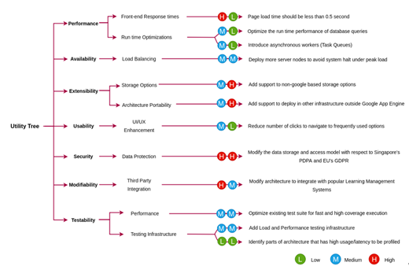

### 3.3  Quality Attribute Scenarios (QAS) 

#### 3.3.1  Scenario 1 

| **Aspect** | **Details** |
| :--- | :--- |
| Scenario Name | Confidentiality, Integrity and availability during data exchange within teammates should be provided |
| Business Goals | Ensured Data trustworthiness. |
| Quality Attributes | Security |
| Stimulus | Data being revealed to unauthorized users. Denial of Service\(DoS\) attack could be activated. |
| Stimulus Source | Human being, it may be internal or external being. Automated Bots can also be a stimulus source |
| Artifact | The target can either be the data exchange within the system or the application services. |
| Environment | Affect the operational system that is online. |
| Response | Data exchange with the system and the external services should be encrypted. File size received by the system should be monitored in order to avoid DoS |
| Response Measure | How many unauthorized access was logged by the system? |

#### 3.3.2  Scenario 2 

| **Aspect** | **Details** |
| :--- | :--- |
| Scenario Name | User defined UI issue resolution |
| Business Goals | Creating a webservice with an emphasis on usability and A webservice which is aesthetically appealing |
| Quality Attributes | Usability, Modifiability |
| Stimulus | **External:** General User |
| Stimulus Source | Negative feedback was received from users regarding a particular aspect of the UI. Issue could be functionality, error, glitch, display, etc. |
| Artifact | Front end java code, HTML, TypeScript and CSS |
| Environment | Runtime, Device display, Browser |
| Response | Analyze the negative feedback and formulate redesign plans. Formulate cost/benefit analysis and decide on plan. Execute plan and modify code/files. Test front end for bowser bugs and media size issues etc. If no problems re-evaluate feedback. Preferably from same source of original negative feedback. Rate the improvement. If unacceptable recycle the process. |
| Response Measure | UI improvements will range in response time: **Small** = 1 page / 2-3 elements = 6 hours, **Medium** = 2-3 pages / 4 - 6 elements = 1-2 days, **Large** = 3-5 pages / 7 - 10 elements = 3-5 days |

#### 3.3.3  Scenario 3 

| **Aspect** | **Details** |
| :--- | :--- |
| Scenario Name | Resolving an issue by introducing new functionality. |
| Business Goals | A product which with ease of adding new features. |
| Quality Attributes | Modifiability |
| Stimulus | Wishes to submit a fix to an existing issue |
| Stimulus Source | Any open-source developer |
| Response | Developer pulls the master github branch. Developer works on own branch and fixes the issue. Developer submits a pull request for review. |
| Response Measure | Code is reviewed by Continuous Integration tools to check for build errors, integration errors, run errors. Core team member assigned to review pull request and final review. If approved code is merged to master Teammates git branch. |

#### 3.3.4  Other Scenarios 

| Quality | Scenario |
| :--- | :--- |
| Availability | Users entering a URL or clicking a button and the service was available for the user |
| Availability | Users browsing through all the pages of the software and pages are not broken |
| Security | Users private information are not displayed within the URL at runtime |
| Security | Confidentiality, Integrity and availability during data exchange within teammates should be provided |
| Usability | User defined UI issue resolution |
| Usability | Users create an anonymous evaluation and he/she finds the process of creating the evaluation easy |
| Modifiability | Resolving an issue by introducing new functionality. |

## 4.0  Module view 

---
Shown in Figure 2.0 is the model view for TEAMMATES with key consideration on storage
---

### 4.1  Primary Presentation 

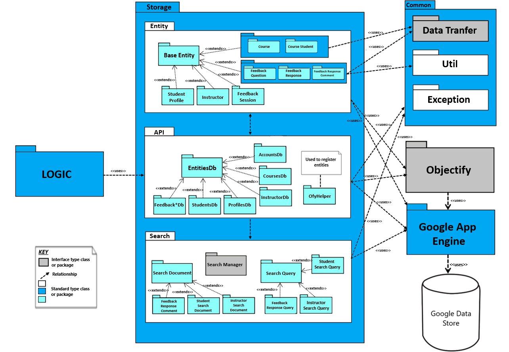

### 4.2  Element Catalog 

**This module contains all the storage logic including the workflow, internal API’s used for communication, interaction with internal search engine, and interaction with Google Cloud Datastore database.**

**Storage**
This module contains all the storage logic including the workflow, internal API’s used for communication, interaction with internal search engine, and interaction with Google Cloud Datastore database.

**Common**
This package contains the common utility classes that are used by the storage module. It also contains the data transfer logic acting as a api between frontend and backend communication and exception handling logic.

**Data Transfer**
This module contains the data transfer logic between the frontend and the storage module.

**Util**
This package contains the utility classes used by the storage module such as data structure for storing array of objects like ArrayLists.

**Exception**
This package is the exception handling module. It contains the logic of handling all the run time exceptions without halting the workflow of storage module.

**Entity**
Entity module represents a record in the database for every data object.

**Base Entity**
This module acts as a common base class for several data objects which can be inherited to reuse common attributes of the data.

**Course**
Represents a course entity. This module acts as a data object and has course specific attributes used to create new entries for courses in the database.

**Course Student**
This package is a data object which has “Student Course” specific attributes i.e. the courses enrolled by the students. It is used to create new entries for student courses in the database.

**Feedback Question**
This module represents the data structure for feedback question. It is used to create new entries for feedback questions in the database.

**Feedback Response**
This module defines the structure for feedback response data object. It is used to create new entries for feedback responses in the database.

**Feedback Response Comment**
This module represents the data object specific to the feedback response specifications. It creates new entries for comments on feedback response in the database and can be generated by student or instructor. It can be represented as: generator -> [comments about] -> feedback response

**Student Profile**
This module represents profile details for the student entities associated with an Account entity. It is used to create new entries for student profiles in the database.

**Instructor**
The instructor module represents the instructor for the specific course. It defines the data structure for storage of instructor data object and is used to create new entries for assignment of instructor to a particular course.

**Feedback Session**
This module represents an instructor created feedback session. It maps the data structure used to represent feedback session in the database and is used to create new database entries for the same.

**API**
This package provides an internal api for the application to communicate with the datastore. It provides functionalities for performing database operations like CRUD (Create, Read, Update, Delete).

**Entities DB**
This module acts as a base class for all classes performing CRUD operations against the datastore.

**Feedback*DB**
Handles the CRUD operations for all the feedback related operations like feedback session, feedback question, feedback response and feedback response comments.

**Students DB**, **Profiles DB**, **AccountsDB**, **CoursesDB**, **InstructorsDB**
These modules handle the CRUD operations for students, profiles, accounts, courses and instructor database.

**Ofyhelper**
This module initializes the Objectify service at the startup of the application and register entity classes in the objectify service. Objectify is the main underlying interface used to communicate with the Google Cloud Datastore.

**Search**
This package defines the logic for the document storage for indexing and/or searching the records in the database.

**Search Document**
This module defines how we store the document for indexing and searching.

**Search Manager**
This module manages the documents and indexes in the datastore for the use of search functions.

**Search Query**
This module defines the structure and method used by the application to query the database.

**Student Search Query**
This module represents a data structure that define how we query for students in the database.

**Student Search Document**
This module defines the structure to represent how the students are stored in the database.

**Instructor Search Document**
This module defines the structure to represent how the instructors are stored in the database.

**Feedback Response Comment Search Query**
This module defines a data structure that defines how we query for feedback response comments.

**Instructor Search Query**
This module defines a data structure that defines how we query for instructors.

**Objectify**
Objectify is a Java data access API for Google Cloud Datastore which is used as an interface between the application storage logic and the underlying datastore.

**Google App Engine**
Google App Engine (GAE) is a platform as a service offering on the Google Cloud Platform which has internal libraries like Objectify to establish connection and perform database transactions with Google Cloud Datastore.

**Google Cloud Datastore**
Google Cloud Datastore is a fully managed database service offered by Google which is an underlying database technology for Teammates.

### 4.3  Behaviour Diagram 

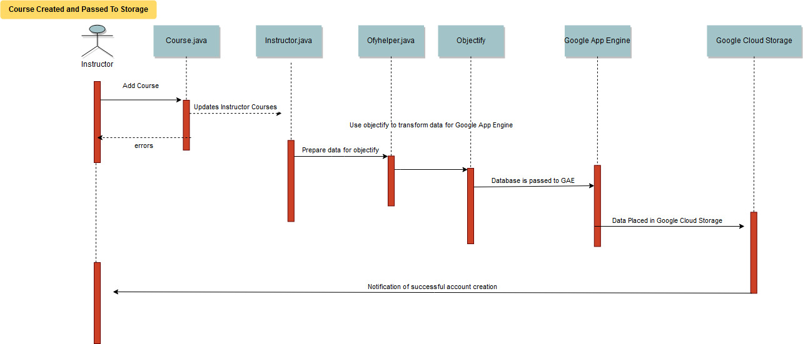

### 4.4  Context Diagram 

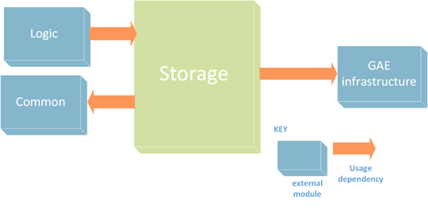

### 4.5  Rationale 

Teammates is a web-based application product which is entirely hosted on Google App Engine Standard Environment. Google App Engine is a platform as a service offering from Google Cloud Platform. Given this, the entire storage infrastructure of the Teammates is built upon Google Cloud Datastore. In order to perform database operations, Teammates uses Objectify which is a Java data access API for Google Cloud Datastore which is used as an interface between the application storage logic and the underlying datastore. One of the Quality Attribute Scenario of the Teammates is ‘Extensibility’ which states that the application must be flexible to host the database on different platforms outside Google Cloud Datastore and therefore, the storage architecture of Teammates is designed to be adaptable to other data storage options. The migration of the storage system is aimed to be achieved in less than 1 hour.

Teammates design aims for high level of portability to make use of several data storage options outside Google Cloud Datastore. The data storage infrastructure of Teammates is built around 4 core modules:

1. The **common module** is the facilitator for frequently used utility classes necessary for data structuring in Java, in-app data transfer APIs and exception handling mechanism to prevent run time breakdowns.

2. Secondly, the **entity module** represents the entire database schema of the Teammates. This module being isolated from rest of the other modules ensures that there is a scope of integrating with other data storage options since the modules that perform the CRUD, search and indexing operations are designed separately.

3. Third, the CRUD operations on the database are taken care by the **API module** in the Teammates architecture. This module acts as an internal API between the application logic and the underlying datastore. Since objectify is the interface between the storage logic and the google cloud datastore, the API module makes use of ofyhelper classes to use Objectify.

4. Finally, the **search module** serves as a information search service in the Teammates and it is also designed to be a separate module. The search module also uses API module in order to perform database operations.

The storage architecture of Teammates is aimed to be designed in a flexible manner even if it is entirely dependent on the Objectify for interfacing with the underlying datastore. Although the architecture currently uses Objectify version 5 which only supports interfacing with Google Cloud Datastore, but the Objectify version 6 extends its support to storage services outside google cloud datastore. It provides built-in facilities to help migrate schema changes forward. Objectify also surfaces all native datastore features, including queries, transactions, asynchronous operations, partial indexes and batch operations.

Another important consideration is that the Google Cloud Datastore uses unstructured No-SQL data storage system. This gives rise to the concern of data storage portability into structured databases. Looking at the architecture of the Teammates and the database schema, it is clear that even if the underlying datastore is is unstructured, the schema of Teammates is in a structured form. This makes the architecture more adjustable for migration to other SQL or No-SQL type of databases.

Modifiability is another important Quality Attribute Scenario for the given primary presentation view. While extending Teammates to other data storage options, some modifications in the existing storage architecture become essential. One of the possible modifications would be migrating from Objectify version 5 to version 6. This may not be a tedious process since the modules are strategically isolated from each other and only the API module will be affected.

## 5.0 Component and Connector View 
---
QAS: Extensibility (The software architecture must be portable to use other storage options outside google cloud datastore)
---

### 5.1 Primary Presentation 

**Description**

The above component and connector view capture one of our Quality Attribute Scenario \(QAS\) “Extensibility” which states that the application must be portable to use different storage options outside the Google environment. Analyzing the run-time behavior of the storage architecture of Teammates, it is known that they use two different storage options, first, Google Cloud Storage for storing the student profile data with blob data \(images\) and the second, Google Cloud Datastore for general purpose database operations.

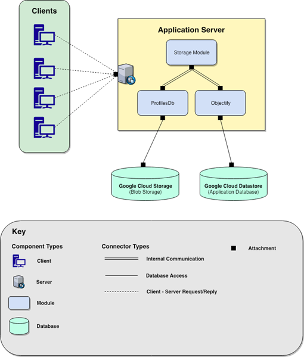

### 5.2 Element Catalog 

**Client:**

All the interactions with the application are initiated by the client terminals. A client can be any device \(mobile, tablet, desktop or laptop\) making a request to the Teammates application through URL.

**Application Server:**

All kinds of requests from clients are handled by the application server. When database operations are requested by the clients, the storage module of the application server activates.

**Storage Module:**

Whenever database operations are requested, the storage module makes a decision if the requested data operation contains blob and is about student profile database, or if it is a general database operation request. For the former, it activates the objectify sub-module and for the latter, ProfilesDb sub-module is activated.

**ProfilesDb:**

All kinds of student profile data or blob operations are carried out through ProfilesDb component. It acts as a bridge between Google Cloud Storage and the application storage module. The ProfileDB is just one of the many objects defined within Teammate to access the storage module. Others includes, AccountDb, CourseDb, FeedbackQuestionDb e.t.c

**Objectify:**

The general database operations except the operations related to student profile data and blob data are carried out through Objectify. It acts as a bridge between Google Cloud Datastore and the application storage module.

**Google Cloud Storage:**

It is a student profile data storage and also blob storage for storing student images for the Teammates application.

**Google Cloud Datastore:**

This component is a main application data storage for the Teammates. It is an unstructured data store and is not used for storing blob data and student profiles data.

**Variability Guide**

\(Changes by Karan: Changed objectify v6 to v5 and v7 to v6\)

**Application Server -** To allow for extensibility internal storage operations should be independent of external google cloud built-in storage functions. This is an area of future improvement for Teammates.

**Objectify -** Dependency on the Objectify 5 interface puts tight constraints on data storage options and the applications extensibility. Objectify forces Teammates to use the google cloud data store. Objectify 6 lessens these constraints and would allow Teammates to use a number of other storage options. Upgrading is a likely future change.

### 5.3 Interface Context Diagram 

Objectify is the convenient interface used by teammates to communicate with Google Data Store through Google App Engine \(GAE\). It helps to persist, retrieve, delete and query own typed objects with GAE. As our collection of elements in Storage API Module is interacting with GAE via Objectify, we are considering a particular example of CourseDB element to define Element Interface Specifications.

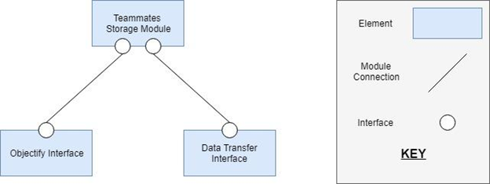

#### 5.3.1  Data Transfer Interface 

Data Transfer interface is another important interface used by Teammates storage module that can impact extensibility. This interface helps in creating the data transfer objects that are used for querying the data in GAE using Objectify. These data transfer objects are called as Data Attributes. There are a lot of elements interacting through this interface and for the Element interface specifications, we consider an example of CourseAttributes element.

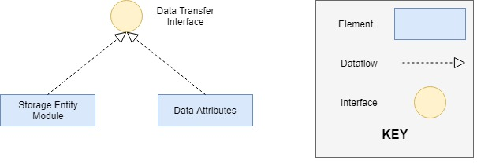

##### 5.3.1.1  SEI Element Interface Specifications 

1. Interface Identity: CourseAttribute Interface

2. Resource Provided:
  a. Resource Syntax: The method is defined named Builder and takes courseId, name and timeZone as a parameter. This method also perform some validation checks on these parameters passed and then create the CourseAttribute.

  b. Resource Semantics: The resource performs the validation checks on the data required for the course and encapsulate them to the data object that can be transferred for the querying.

  c. Error Handling: The resource performs the validity checks on parameter values. The null value exceptions are handled.

3. Data Types: The data types of the variables are as follow:
    a. courseId: String
    b. courseName: String
    c. timezone: ZoneId

4. Error Handling: The data objects generated by interface are the Java objects and if anything goes wrong, it is handled by Java automatically.

5. Variability: The memory of the object generated by an interface is managed by Java Virtual Machine \(JVM\). If a lot of memory is utilized, JVM’s heap size can be increased.

6. Quality Attributes: The interface ensures the quality attribute of Robustness, since it generates the Java objects and Java supports the strong type checking mechanism.

7. Rationale: The interface is designed for the encapsulation of the data into the objects and also perform the validity checks on the data. It is very developer friendly to use the interface and generate the entity attributes.

8. Usage Guide: The interface can be used by passing the values of the required parameters in the builder method and it will return the entity attributes object. Here, the builder method takes courseId, name and timeZone as a parameter input and returns the CourseAttributes object.

#### 5.3.2  Objectify Interface 

---
Objectify is the convenient interface used by teammates to communicate with Google Data Store through Google App Engine (GAE). It helps to persist, retrieve, delete and query own typed objects with GA
---

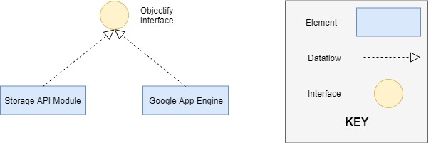

##### 5.3.2.1  SEI Element Interface Specifications 

1. Interface Identity: CourseDB Interface

2. Resource Provided:
  a. Resource Syntax: The method is defined named getCourseEntity and takes courseId as a parameter. It returns load\(\).id\(courseId\).now\(\) .
  
  b. Resource Semantics: The resource performs the functionality of fetching the course details providing the CourseId parameter.
  
  c. Error Handling: DatastoreTimeoutException, ConcurrentModificationException, or DatastoreFailureException are thrown by Objectify if something goes wrong.

3. Data Types: The data types of the variables are as follow:

  a.       courseId: String
  
  b.       courseName: String
  
  c.       createdAt: DateTime
  
  d.       deletedAt: DateTime
  
  e.       timezone: ZoneId

4. Error Handling: In case anything goes wrong, the exceptions are thrown. Some of the exceptions that are handled are DateTimeException, EntityDoesNotExistException, InvalidParametersException.

5. Variability: The interface can be modified to scale up the transactions handling if the peak load is exceeded.

6. Quality Attributes: The interface can impact the performance while querying the data from the data store when the transactions\(queries\) are performed.

7. Rationale: The interface is designed to improve the performance of the transactions performed on the data store. It also provides human friendly query interface and easy-to understand transaction model.

### 5.4  Behaviour Documentation 

The sequence diagram above exemplifies creating a course being created and being sent to storage on the GAE database. Teammates depends primarily on web applets in order to get the code across as seen in the figure above. However, behind the scenes a number of java classes are called in order to service the web applet. Once a course is added, an instructor account needs to be updated with the correct permissions to be associated with the account. After the instructor permissions, the account is added to a course database. From here the entire database is passed to objectify in order to transform the information into data that can be read by the google app engine which can then be passed to the google datastore. The teammates storage operations are focused on CRUD operation \(create, read, update, delete\). Essentially before the data itself reaches objectify these operations are performed internally to ensure that the correct data is being uploaded to the google data store. In order to maintain consistency, add/delete operations wait until data persists in the google data store before returning. An assumption here is made that enough time has elapsed to “persist”, meaning that the data has propagated through all of the google data stores before returning. Certain errors could arise due to this design decision, and as such is under review as transactional control isn’t foolproof.

#### 5.4.1 Variability guide 

Objectify is the convenient interface used by teammates to communicate with Google Data Store through Google App Engine \(GAE\). It helps to persist, retrieve, delete and query own typed objects with GAE. As our collection of elements in Storage API Module is interacting with GAE via Objectify, we are considering a particular example of CourseDB element to define Element Interface Specifications.

### 5.5  Rationale 

The component and connector view of the teammates highlights the "Extensibility" Quality Attribute Scenario for the Teammates application. The view mainly depicts the data storage and retrieval operations of the Teammates during the run-time. It is observed that the Teammates uses two different types of data storage infrastructures. One is Google Cloud Storage which is used for blob data storage and storing the student profile data which holds the student profile picture as the blob data. The second is the Google Cloud Datastore which is used for all the data storage and retrieval operations for the Teammates except blob and student profile data storage. This is because Google Cloud Datastore is not optimized for storing blob data. One of the reasons for choosing two separate data storage infrastructures is the cost of operation during the runtime. Google cloud datastore is relatively a cheaper offering from Google and Google Cloud Storage being a relational and transaction friendly database has a higher cost of operation.

Given such constraints, the QAS of making the application portable to support other data storage options outside Google Cloud Platform is a valid concern. Our component and connector view grips on the run-time behavior of the storage logic of the teammates which clearly documents the storage logic which is the main region of focus with respect to the "Extensibility" QAS.

## 6.0 Code Quality and Technical Debt 

### Code Quality report

### 6.1  Introduction 

A Code Quality Review is a task with the goal of identifying types of weaknesses that exist within a given code base. The task involves both manual and automated review of the underlying source code and identifies specific issues that may be representative of broader classes of weakness inherent in the code. For Milestone 5, we have performed an automated code review of the project “Teammates” using FindBugs code review tool. A Code Review does not attempt to identify every issue in the code but instead attempts to identify types of risk within the code such that mitigation strategies can be devised. It should be noted that while the review process will be as thorough as possible in finding and reporting code weaknesses, it is not guaranteed to always find every possible weakness. If no issues are found, the review does not implicitly certify that the application is 100-percent “hack proof.” A Code Review is a strong part of an overall risk mitigation program to improve the quality of the application.

### 6.2  Review Summary 

The secure code review of the Teammates application was completed on March 23, 2019 by our team “project-team-7”. The review was performed on code obtained from Github repo of Teammates bundled under directory name “teammates.git”. A meeting among our team members was held on March 23, 2019, at which time information about the code structure was presented along with high-level overviews of how things like data validation, performance, and data encoding were implemented in the code. The actual review involved an automated investigation of the Java code using the FindBugs tool. The specific findings after using the FindBugs tool are presented in the subsequent sections.

### 6.3  Finding Summary 

**Table 7.0:  Metrics**

| No | Metric | Total | Density |
| :--- | :--- | :--- | :--- |
| 1 | High Priority Warnings | 4 | 0.13 |
| 2 | Medium Priority Warnings | 80 | 2.60 |
| 3 | Total Warnings | 84 | 2.73 |

**Table 8.0: Warnings Summary**

| No | Warning Type | Number |
| :--- | :--- | :--- |
| 1 | Bad practice Warnings | 4 |
| 2 | Correctness Warnings | 6 |
| 3 | Internationalization Warnings | 3 |
| 4 | Malicious code vulnerability Warnings | 3 |
| 5 | Performance Warnings | 4 |
| 6 | Dodgy code Warnings | 64 |
| 7 | Total | 84 |

For the Teammates application, we found several issues but we would like to discuss the three major findings uncovered after FindBugs analysis. According to FindBugs, some of them have high impact and some have a medium impact on the overall code quality of Teammates.

#### 6.3.1  Dodgy Code 

•          A dodgy code can be understood as a piece of code which has never been used or has no impact on the overall application execution.

•          After the automated investigation using FindBugs, it was found that there were 64 places in the code which had circular dependencies, unused declaration and initialization of variables and one of the places had the loading of Null value into a function.

•          The analysis is presented in the FindBugs report.

#### 6.3.2  Internationalization Issues 

•          While encoding data from string to bytes and vice versa, it is found there is reliance on default encoding and decoding without specifying a charset name.  

•          Given that the application is being used globally and future scope of supporting multiple languages, there is a scope of carefully considering such internationalization issues.

•          These issues are presented in detail in the FindBugs report.

#### 6.3.3  Code Vulnerability Warnings 

•          With respect to data security considerations, some malicious code vulnerability issues were detected. Though they are not many, circumventing them may not be a good decision in the long run.

•          There are 3 places in the code where the internal object representations are exposed. If some untrusted code accesses these instances and introduced unchecked changes to the mutable object would lead to the compromised security or other important properties.

•          The findings are documented in the Find Bugs report.

Although we discussed the top three results of the code review, there are several other findings which were uncovered. Bad coding practice was one of them which the FindBugs reported and most of them deal with performing string operations. The reason behind this is the differences in the use of methods in several Java versions. The second type of warning was Correctness warning which reported certain scenarios in the code that returned unwritten variables and passing null parameters to a non-null method parameter. The final one was the performance warning. There are a few fields in the code which are declared and initialized but never used anywhere. Such occurrences are advised to be removed from all the classes.

### 6.4  Technical Debt Report 

#### 6.4.1  Using Objectify 

##### 6.4.1.1  Technical Debt 

Objectify is identified as the key potential debt considering the Extensibility quality attribute scenario. It is an interface used by teammates to communicate with Google Data Store through Google App Engine \(GAE\). The technical debt of this comes as result of being locked in to the Google App Engine \(Environment\). We have focused on the quality attribute scenario of extensibility which states the ability to adapt the storage platform on data storage options outside of the Google Cloud Datastore. The following pictorial representation illustrates high dependency on objectify for routine database transactions.

Currently, the teammates is using Google cloud service but the extensibility scenario focuses on adding support for other cloud service providers. Whereas, objectify is specifically designed for Google Cloud Datastore and tightly coupled with GAE. Based on the architecture design decisions made for using objectify, it is now hard to add a support to other cloud service providers.

##### 6.4.1.2  Recommendation 

These can be rectified if Teammates would upgrade from objectify version 5, to objectify version 6+. “Objectify v6+ uses the Cloud Datastore API and can be used from anywhere - GAE Standard, GAE Flex, GCE, or outside Google Cloud entirely” \[1\]. This directly addresses the extensibility issues of multiple data storage options within or outside of the Google Cloud Datastore as the new API being used would not rely on the Google App Engine Datastore, but switch to the Cloud Datastore API.

The Teammates development has commented on their own challenges with the Google App Engine as follows: Platform: TEAMMATES is running on Google App Engine cloud platform, which adds the following challenges.

* It is an emerging platform evolving rapidly. We have to keep up.
* It imposes various restrictions on the application, e.g. each request to the app has to be served within 60 seconds.
* It charges us based on usage. We have to optimize usage.

Within Teammates own development comments they state that they have to keep up with the developmental changes of the Google App Engine. However when doing research Google has stated that they are "in the process of replacing this proprietary interface with standards-based \(REST and GRPC\) interfaces to cloud services. This is the new "Google Cloud SDK" which can be used from both outside and inside GAE Standard. This required a rewrite of Objectify, which is v6" \[5\].

Following the link to "[https://github.com/objectify/objectify/wiki/UpgradeVersion5ToVersion6](https://github.com/objectify/objectify/wiki/UpgradeVersion5ToVersion6)" highlights some of the challenges of upgrading from v5 to v6+ for objectify.

When analyzing the codebase of teammates we see that there are some major codebase changes that would have to occur if they intend to keep up with the Google App Engine cloud platform. This would be a massive undertaking however here are some of the technical debts that could be focused on

* "You will need to call ObjectifyService.init\(\), possibly passing in a custom ObjectifyFactory instance. The previous behavior of starting out with a default ObjectifyFactory incurs a connection cost and may fail in environments which require a custom DatastoreService" \[4\].

As evidenced in the ofyhelper.java file snapshot below we see that an instance to the ObjectifyService has already been implemented under the line \(import com.googlecode.ObjectifyService;\)

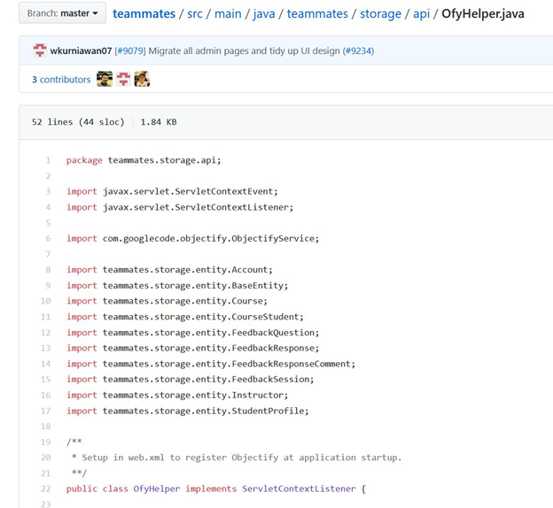

If we analyze this further we can look into the ObjectifyService code and find the following snapshot. We can see that the ObjectifyService.java file is the holder of the master ObjectifyFactory and provider of the current thread-local Objectify instance.

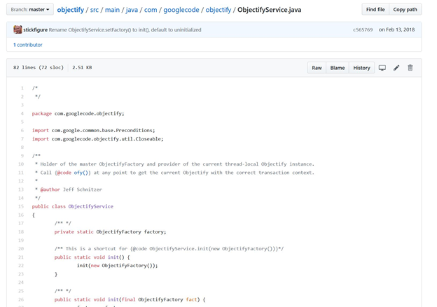

As a result the recommendation would be to create a custom ObjectifyFactory instance within the ofyhelper.java file. And then as we see in the image below each instance of the storage classes are registered with the Google App Engine. This practice is limited to version 5 however.

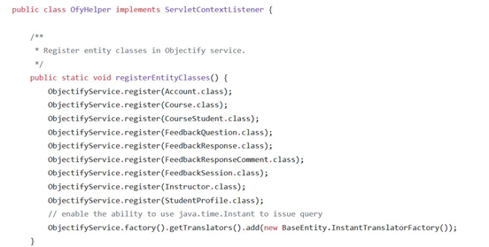

Our recommendation would be to change to the new version of the ObjectifyFactory instances by using the code below. Here we can register each of the classes inside of an ObjectifyFactory instance and then register and pass the ObjectifyFactory in order to be recognized by the new Google Cloud SDK.

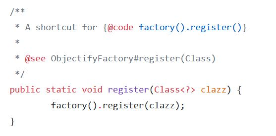

#### 6.4.2  Search Engine Optimization \(SEO\) Friendliness 

##### 6.4.2.1  Technical Debt 

Teammates adopted the Single Page Application \(SPA\) architecture in designing the frontend. The decision of implementing SPA architecture using Angular version 7 has caused a challenge in terms of friendliness on SEO. Angular v7 is usually rendered on the client side which prevents web crawlers and search engines from seeing the complete structure and contents of the website \[6\]. Being visible to the public and acquiring users through search engines is important to Teammates business goals. With the growing use of angular, the solution has been developed to solve this named Angular Universal. But based on the teammate’s frontend design, there is the problem for using Angular Universal with teammates. The trade-off here is that Universal can run only in Node.js and it requires webpage files and web API’s to run on different servers.

##### 6.4.2.2  Recommendation 

To solve this problem, it is required to separate the Webpages from the web API’s and make it run on different servers. Once completed, the Angular Universal can be implemented which uses server side rendering \(SSR\). This will allow web crawlers to detect the site by executing javascript code along with producing complete html at the server. Implementing Angular universal is a tradeoff though as it creates another dependency on outside technology and SSR is not ideal and defeats some of the purpose of using a SPA.

## 7.0 Conclusion 

In this designed architecture, concerns has been on stakeholders requirements, Architecturally Significant Requirements with highlights on the some of the stakeholders concerns. In addition, the View and Beyond approach has been used to present the static run time view of Teammates. However, the project was concluded by assessing some of the technical dept within Teammates including recommendation provision for future improvement of the product.

## 8.0 References 

\[1\] "TEAMMATES/teammates", GitHub, 2019. \[Online\]. Available: [https://github.com/TEAMMATES/teammates/blob/master/docs/best-practices/data-migration.md](https://github.com/TEAMMATES/teammates/blob/master/docs/best-practices/data-migration.md). \[Accessed: 03- Feb- 2019\].

\[2\] “Explore new architectural integrity checker tool · Issue \#9386 · TEAMMATES/teammates", GitHub, 2019. \[Online\]. Available: [https://github.com/TEAMMATES/teammates/issues/9386](https://github.com/TEAMMATES/teammates/issues/9386). \[Accessed: 03- Feb- 2019\].

\[3\] "TEAMMATES - Online Peer Feedback/Evaluation System for Student Team Projects", Teammatesv4.appspot.com, 2019. \[Online\]. Available: [https://teammatesv4.appspot.com/features.jsp](https://teammatesv4.appspot.com/features.jsp). \[Accessed: 03- Feb- 2019\].

\[4\] "TEAMMATES/teammates", GitHub, 2019. \[Online\]. Available: [https://github.com/TEAMMATES/teammates/blob/master/docs/overview.md](https://github.com/TEAMMATES/teammates/blob/master/docs/overview.md). \[Accessed: 03- Feb- 2019\].

\[5\] "TEAMMATES - Online Peer Feedback/Evaluation System for Student Team Projects", Teammatesv4.appspot.com, 2019. \[Online\]. Available: [https://teammatesv4.appspot.com/about.jsp](https://teammatesv4.appspot.com/about.jsp). \[Accessed: 03- Feb- 2019\].

\[6\] "TEAMMATES - Online Peer Feedback/Evaluation System for Student Team Projects", Teammatesv4.appspot.com, 2019. \[Online\]. Available: [https://teammatesv4.appspot.com/terms.jsp](https://teammatesv4.appspot.com/terms.jsp). \[Accessed: 03- Feb- 2019\].

\[7\] "Trust & security \| Google Cloud", Google Cloud, 2019. \[Online\]. Available: [https://cloud.google.com/security/](https://cloud.google.com/security/). \[Accessed: 03- Feb- 2019\].

\[8\] "General Data Protection Regulation \(GDPR\) \| Google Cloud", Google Cloud, 2019. \[Online\]. Available: [https://cloud.google.com/security/gdpr/](https://cloud.google.com/security/gdpr/). \[Accessed: 03- Feb- 2019\].

\[9\] "TEAMMATES/teammates", GitHub, 2019. \[Online\]. Available: [https://github.com/TEAMMATES/teammates](https://github.com/TEAMMATES/teammates). \[Accessed: 03- Feb- 2019\].

\[10\] "TEAMMATES/teammates", GitHub, 2019. \[Online\]. Available: [https://github.com/TEAMMATES/teammates/blob/master/.github/CODE\_OF\_CONDUCT.md](https://github.com/TEAMMATES/teammates/blob/master/.github/CODE_OF_CONDUCT.md). \[Accessed: 03- Feb- 2019\].

\[11\] "TEAMMATES - Online Peer Feedback/Evaluation System for Student Team Projects", Teammatesv4.appspot.com, 2019. \[Online\]. Available: [https://teammatesv4.appspot.com/terms.jsp](https://teammatesv4.appspot.com/terms.jsp). \[Accessed: 03- Feb- 2019\].

\[12\] "TEAMMATES/teammates", GitHub, 2019. \[Online\]. Available: [https://github.com/TEAMMATES/teammates/blob/master/.github/ISSUE\_TEMPLATE/data-migration.md](https://github.com/TEAMMATES/teammates/blob/master/.github/ISSUE_TEMPLATE/data-migration.md). \[Accessed: 03- Feb- 2019\].

\[13\] A. Affairs, "The Impact of Aesthetics on Attitudes Towards Websites \| Usability.gov", Usability.gov, 2019. \[Online\]. Available: [https://www.usability.gov/get-involved/blog/2009/07/aesthetics-and-attitude.html](https://www.usability.gov/get-involved/blog/2009/07/aesthetics-and-attitude.html). \[Accessed: 03- Feb- 2019\].

\[14\] Courses.cs.washington.edu, 2019. \[Online\]. Available: [https://courses.cs.washington.edu/courses/csep590/05au/whitepaper\_turnin/oss\(10\).pdf](https://courses.cs.washington.edu/courses/csep590/05au/whitepaper_turnin/oss%2810%29.pdf). \[Accessed: 03- Feb- 2019\].

\[15\] "TEAMMATES/teammates", GitHub, 2019. \[Online\]. Available: [https://github.com/TEAMMATES/teammates/wiki/Data-Protection](https://github.com/TEAMMATES/teammates/wiki/Data-Protection). \[Accessed: 03- Feb- 2019\].

\[16\] "TEAMMATES/teammates", GitHub, 2019. \[Online\]. Available: [https://github.com/TEAMMATES/teammates/projects](https://github.com/TEAMMATES/teammates/projects). \[Accessed: 03- Feb- 2019\].

\[17\] [https://github.com/objectify/objectify](https://github.com/objectify/objectify)

\[18\] [https://github.com/TEAMMATES/teammates/blob/master/docs/overview.md](https://github.com/TEAMMATES/teammates/blob/master/docs/overview.md)

\[19\] [https://github.com/TEAMMATES/teammates/blob/master/src/main/java/teammates/storage/api/OfyHelper.java](https://github.com/TEAMMATES/teammates/blob/master/src/main/java/teammates/storage/api/OfyHelper.java)

\[20\] [https://github.com/objectify/objectify/wiki/UpgradeVersion5ToVersion6](https://github.com/objectify/objectify/wiki/UpgradeVersion5ToVersion6)

\[21\] [https://github.com/objectify/objectify/wiki/FrequentlyAskedQuestions](https://github.com/objectify/objectify/wiki/FrequentlyAskedQuestions)

\[22\] [https://medium.com/codingthesmartway-com-blog/angular-seo-making-angular-6-single-page-web-apps-search-engine-friendly-c8ec4ff2f549](https://medium.com/codingthesmartway-com-blog/angular-seo-making-angular-6-single-page-web-apps-search-engine-friendly-c8ec4ff2f549)
  