# Terraform Documentation


## Table of Contents <!-- omit in toc -->

- [Terraform Documentation](#terraform-documentation)
  - [1. Introduction](#1-introduction)
  - [2. Document Purpose](#2-document-purpose)
  - [3. About Terraform](#3-about-terraform)
  - [4. Our Team](#4-our-team)
  - [5. Terraform's Stakeholders, Business Goals, and Ethical Report](#5-terraforms-stakeholders-business-goals-and-ethical-report)
    - [5.1 Stakeholders](#51-stakeholders)
    - [5.2 Business Goals](#52-business-goals)
    - [5.3 A Report on Privacy, Security, and Ethics Concerns for the Terraform Project](#53-a-report-on-privacy-security-and-ethics-concerns-for-the-terraform-project)
  - [6. Terraform's Architecturally Significant Requirements, Quality Attribute Scenarios & Utility Tree](#6-terraforms-architecturally-significant-requirements-quality-attribute-scenarios--utility-tree)
    - [6.1 Architecturally Significant Requirements](#61-architecturally-significant-requirements)
    - [6.2 Quality Attribute Scenarios](#62-quality-attribute-scenarios)
    - [6.3 Utility Tree](#63-utility-tree)
  - [7. Terraform's Module View: Extensibility](#7-terraforms-module-view-extensibility)
    - [7.1 Quality Attribute Addressed](#71-quality-attribute-addressed)
    - [7.2 Module View](#72-module-view)
      - [7.2.1 View Selection and Rationale](#721-view-selection-and-rationale)
      - [7.2.2 Primary Presentation](#722-primary-presentation)
      - [7.2.3 Element Catalog](#723-element-catalog)
        - [7.2.3.1 Elements and their properties](#7231-elements-and-their-properties)
        - [7.2.3.2 Relations and their properties](#7232-relations-and-their-properties)
        - [7.2.3.3 Element Interfaces](#7233-element-interfaces)
        - [7.2.3.4 Element Behavior](#7234-element-behavior)
      - [7.2.4 Context Diagram](#724-context-diagram)
      - [7.2.5 Rationale](#725-rationale)
  - [8. Terraform's Component & Connector View: Traceability](#8-terraforms-component--connector-view-traceability)
    - [8.1 Quality Attribute Addressed](#81-quality-attribute-addressed)
    - [8.2 Module View](#82-module-view)
      - [8.2.1 View Selection and Rationale](#821-view-selection-and-rationale)
      - [8.2.2 Primary Presentation](#822-primary-presentation)
      - [8.2.3 Element Catalog](#823-element-catalog)
        - [8.2.3.1 Elements and their properties](#8231-elements-and-their-properties)
        - [8.2.3.2 Relations and their properties](#8232-relations-and-their-properties)
        - [8.2.3.3 Element Interfaces](#8233-element-interfaces)
        - [8.2.3.4 Element Behavior](#8234-element-behavior)
      - [8.2.4 Context Diagram](#824-context-diagram)
      - [8.2.5 Variability Guide](#825-variability-guide)
      - [8.2.6 Rationale](#826-rationale)
  - [9. Terraform's Code Quality & Technical Debt](#9-terraforms-code-quality--technical-debt)
    - [9.1 Code Quality Analysis](#91-code-quality-analysis)
    - [9.2 Technical Debt](#92-technical-debt)
    - [9.3 Code Analysis Conclusion](#93-code-analysis-conclusion)
  - [10. Conclusions](#10-conclusions)
  - [References](#references)

## 1. Introduction

In recent years, companies seek to deliver software-based products and features as soon and as frequently as possible in such a way that their customers can perceive value generation continuously. Automated provisioning of infrastructure resources is key for this goal, as a manual realization of this process results in time-consuming and costly software releases, among other undesirable consequences [21]. Since companies coexist in a tight economy and competitive markets, it is not surprising that most of them are now looking for reducing deployment times in order to rapidly meet changing requirements by users, which could affect decisively in obtaining a stronger market position. The capability of delivering, as soon as possible, new features or bug fixes for software systems has consolidated the implementation of new software engineering approaches, inspired in agile methodologies, such as DevOps, continuous delivery, and continuous deployment, where the automation of software deployment and infrastructure provisioning must be treated as an indispensable goal to achieve a continuous delivery of value for customers [21]. 

Today, organizations adopting the principles and practices that originated continuous delivery and DevOps cultures often deploy new software or features hundreds or even thousands of times per day [22]. Furthermore, since most modern applications or features of any size are composed of different parts (that is, infrastructure resources, components, modules, configuration files, among others), every deployment and infrastructure provisionning process tends to be complex and prone to human errors [21]. Consequently, organizations implementing these methodologies must avoid a manually-realization of deployment activities so that they can be done routinely and with low risk over time [22].Different proposals and technologies have arisen to provide the means for automating deployment and infrastructure provisioning tasks. In particular, technologies such as Containerization (e.g., [Docker](https://www.docker.com/) and [Kubernetes](https://kubernetes.io/)) and Infrastructure as Code (e.g., Terraform and [Chef](https://www.chef.io/products/chef-infra/)) have been leading this purpose. In this document, we analyze the architecture of Terraform, one of the most relevant and widespread Infrastructure as Code platforms.

## 2. Document Purpose

The document summarizes the analysis of the software architecture of Terraform's core, performed as the final project for the course SENG 480 (*Documenting and Understanding Software Systems*) at the Computer Science Department of the University of Victoria. First, this document describes the most relevant stakeholders, business goals, and ethical concerns related to the Terraform project. Second, we characterize the most relevant architecturally significant requirements, quality attribute scenarios, and utility tree of Terraform. Third, we analyze Terraform's extensibility by documenting a Module View of the system. Fourth, we examine Terraform's traceability by documenting a Component and Connector View of the platform. Fifth, we study the code quality and technical debt of the project. Finally, we provide concluding remarks about this experience.

## 3. About Terraform

Terraform is an open source platform, created by HashipCorp (https://www.hashicorp.com/), that allows users to provision infrastructure in a robust and reproducible manner using a simple domain-specific language [1]. Running on Golang or inside a Docker container, Terraform allows users to manage Infrastructure as Code, in future referred to as IAC. IAC maps a modifiable blueprint of a system, which can be executed to provision or modify various infrastructure resources in the cloud (i.e., IaaS: Infrastructure as a Service). Thus, Terraform-based IAC specifications could be used for provisioning an Amazon Web Services (AWS) hosting server to run an application, deploying a Cloudant Database to store data, configuring an Azure Load Balancing service to handle and distribute traffic, and setting up a Jenkins testing server. In addition, Terraform handles credentials and environmental variables allowing systems to be instantly integrated with its capabilities.

The following table depicts relevant details about the project being analyzed in this document.

| Project Name | URL | Language | KSLOC | Activity |
|------|--------|-------|--------|---------|
| Terraform | https://github.com/hashicorp/terraform | GO | 681 | 119 |

## 4. Our Team

### Graduate Students <!-- omit in toc -->

* [Felipe Rivera](https://github.com/lfrivera)
* [Trevor Rae](https://github.com/Trevorrae)

### Undergraduate Students <!-- omit in toc -->

* [Callum Thomas](https://github.com/CThomas818)
* [Tyler Dai](https://github.com/luod1211)
* Mohamed Almahmood

### Supervisors <!-- omit in toc -->

* [Neil Ernst](https://github.com/neilernst)
* [Omar Elazhary](https://github.com/omazhary)

## 5. Terraform's Stakeholders, Business Goals, and Ethical Report

In this section, we describe relevant stakeholders and business goals that have been influencing the realization, operation, and maintenance of the Terraform project. Each stakeholder described below is considered as an individual or organization that has a right,  share,  claim, or interest over a  system and its capabilities to fulfill particular needs and expectations [11]. Furthermore, we detail business goals that will govern the analysis and documentation of the Terraform's software architecture.

### 5.1 Stakeholders

The following table characterizes the set of stakeholders that must be considered when analyzing the Terraform's architecture. We categorize stakeholders using the roles, and their corresponding definitions, provided by Rozanski and Woods [12]. To the best of our knowledge, some details concerning the team in charge of guiding the development of Terraform are not public. Thus, we did our best for completing the table by not only gathering relevant information about the project [13-20] but also using logical assumptions (marked with an asterisk *) based on our expertise.

| Role | Responsibilities | Role Instances | Description |
| :---: | :----: | :---: | :---: |
| Acquirer | Oversee the procurement of the system or product | Hashicorp CTO - Mitchell Hashimoto | As the founder and CTO of Hashicorp, Mitchell Hashimoto is directly responsible for overseeing the procurement of Terraform. |
| Assessors | Oversee the system’s conformance to standards and legal regulation | Hashicorp’s Legal Team | Hashicorp follows GDPR rules for collecting data. https://www.hashicorp.com/privacy. The legal team would make sure Terraform complies with regulations. |
| Communicator | Explain the system to other stakeholders via its documentation and training materials. | CTO, Open-Source Developers, Software Architect*, Product Owners (Lead Developers)*, Technical Writers*, Marketing Team*.  | The CTO will explain the system to other stakeholders via documentation when the project begins or when new developers are on-boarded. The software architect must explain their architecture to other stakeholders to be realized. Product owners explain the system to developers. Open-source developers can contribute to documentation and example code on Github. |
| Production Engineers | Design, deploy, and manage the hardware and software .environments in which the system will be built, tested, and run | Hashicorp Developers | The initial and greatest contributors to the project would likely have created the development environment for Terraform. Open source developers can also contribute to the testing environment requirements. Because Terraform runs locally on user’s environments, Production Engineers aren’t needed to manage hardware. |
| Support Staff | Provide support to users for the product or system when it is running | Open Source Developers, Hashicorp Support Team.| Users of Terraform may contact the official Hashicorp Support Team, or they can also talk to open source developers by raising issues on the Github repository.  |
| Supplier | Build and/or supply the hardware, software, or infrastructure on which the system will run | N/A - Not required. | Terraform runs entirely on the user’s local computer, making API calls to services such as Google Cloud, Amazon AWS, and Azure. As a consequence, no special hardware, software, or infrastructure is required. Users can set up their own development environment of Terraform by following the documentation. |
| System Administrators | Run the system once it has been deployed | Maintainers of the download endpoints for Terraform | Because Terraform runs locally, there are no System Administrators needed. The users become administrators of their Terraform environment. |
| Developers | Construct and deploy the system from specifications (or lead the teams that do this) | Initial creators of the product, Lead Developers, Open-source Developers | Both open-source developers from anywhere in the world and dedicated developers working at Hashicorp contribute to the project. Certain developers have contributed large amounts of code at different stages of the project. Developers can also see raised issues in the “issues” page of the project and can construct bug fixes and submit them to the project as pull requests. |
| Maintainers | Manage the evolution of the system once it is operational | Open-source Developers, Lead Developers | Bugs are tracked through the “issues” page, which open-source developers can use to attempt bug fixes and maintain the system when changes are made. |
| Testers | Test the system to ensure that it is suitable for use | Open-source Developers, Lead Developers  | Terraform defines comprehensive acceptance tests for the different modules comprising the system [20]. Developers must run acceptance tests to ensure changes do not affect system stability. Lead Developers (Product Owners) are responsible for making sure new releases are as stable as possible.  |
| Users | Define the system’s functionality and ultimately make use of it | Companies that use Terraform to define system infrastructure for providers (e.g., Comcast, Nike, Verizon, among others) | DevOps engineers, IT professionals use Terraform to build, change, and version infrastructure. Terraform will prove useful for many use cases, such as for anyone who needs to run a multi-tiered architecture on web services such as AWS.  Some other uses cases includes: Self-Service Clusters, Software demos, Disposable Environments and Multi-Cloud Deployment. |  |

### 5.2 Business Goals

As with the previous section, we used available online resources [13-20] and logical assumptions, based on our expertise, to identify the business goals depicted below.

**1. To provide an efficient platform for Infrastructure as Code**
* Terraform codifies API-driven interactions into declarative configuration files that enable users managing infrastructure resources using code-based specifications [13].
* To improve efficiency, Terraform parallelizes the creation and modification of any non-dependent resources.

**2. To ease tracking changes to provisioned infrastructure by providing infrastructure versioning**
* Terraform generates execution plans that outline the exact steps it will perform to achieve a desired state of the provisioned infrastructure.
* Infrastructure versioning enables a seamless evolution of the specifications that describe the resources to be provisioned.

**3. To support as many infrastructure providers and provisioners as possible**
* A provider is responsible for understanding API interactions and exposing infrastructure resources. On the other hand, provisioners allow the execution of particular actions (scripts) over the provisioned resources. By supporting multiple providers and provisioners, Terraform enable users to achieve flexible configurations.

**4. To promote a collaborative environment for Infrastructure as Code**
* One of the main goals of Terraform is to provide collaborative Infrastructure as Code. Infrastructure specifications can be split into smaller Terraform configurations which are owned by specific teams. This enables infrastructure ownership to enable parallel development [13].  

**5. To maintain Terraform and support different operating systems and hardware**
* Since different members of the operations team in charge of maintaining infrastructure resources could use variable operative systems, Terraform configurations can be executed from Unix-based (i.e., FreeBSD, Linux, OpenBSD, Solaris), macOs, and Windows systems. Terraform is maintained for each of these systems.

**6. To get users and businesses to use the HashiCorp suite**
* Terraform facilitates the integration of multiple Hashicorp technologies such as [Vault](https://www.hashicorp.com/products/vault/), [Consul](https://www.hashicorp.com/products/consul), and [Nomad](https://www.hashicorp.com/products/nomad).

**7. To generate revenue by implementing a freemium pricing model for Terraform**
* Terraform is free for small teams who want basic terraform functions. However, additional functions require either the business or the enterprise versions with incremental costs.

**8. To establish secure connections with infrastructure providers**
* Terraform provides mechanisms for enabling secure connections to infrastructure providers.

### 5.3 A Report on Privacy, Security, and Ethics Concerns for the Terraform Project

The proliferation of cloud computing platforms, especially those able to provide IaaS, requires considering multiple ethical issues associated with the use of third-party data centers for storing and managing both services and data [2]. As a key facilitator of IAC and, consequently, IaaS, Terraform must be analyzed from an ethical and security viewpoint. Following the ACM Code of Ethics and Professional Conduct [3], this document examines Terraform's policies concerning privacy, security and ethics, from the perspective of the different stakeholders that govern the development, operation and maintenance of the project.

#### 5.3.1 Potential Privacy and Security Concerns <!-- omit in toc -->

HashiCorp establishes a set of security [4] and privacy [5] policies that dictate the way its products (e.g., Terraform, Vault, Consul, and Nomad) must conform to those concerns. Since the impact of potential security breaches in cloud technologies might reach a vast number of users, and jeopardize the privacy and integrity of data and services deployed on third-party cloud platforms, the company encourages Terraform users to disclose vulnerabilities in a responsible manner [6]. This means that security-related bugs should be communicated by email (security@hashicorp.com), instead of being reported as Github issues. Moreover, HashiCorp allows users to establish secure communication channels by providing a PDG key, and to verify product downloads through the use of file checksums. On the other hand, the Hashicorp’s privacy policy defines the course of action when user data is collected from the company’s website or any other media form or channel. This policy covers the tracking technologies being used, the kind of data being gathered, the retention period for the data, data usage, data sharing, and users’ rights regarding personal data. Although these policies establish a well-defined code of conduct for privacy and security concerns, Terraform, as any other system, is vulnerable to sophisticated or social engineering attacks, which might lead to adverse consequences. We explore more this sort of concerns in the following section.

#### 5.3.2 Ethical Dilemmas <!-- omit in toc -->

The ACM code of ethics states seven general ethical principles for any computer scientist to follow. We will go over each of these principles and describe how Hashicorp addresses them. Moreover, we discuss potential dilemmas that could arise with regards to each principle. 

The first principle relates to contributing to society and human well being. Terraform is provided free of charge to any user [7] and provides a service which increases efficiency and improves quality of life for developers. Unless the developmental direction of Terraform changes, this principle is met. 

The second principle refers to avoid harm. At first glance, Terraform obviously meets this criterion; however, it brings to mind a quote from Jason Silva: “Technology is, of course, a double edge sword. Fire can cook our food but also burn us”. Much like fire, Terraform has value and can be used for good. However, it also has the ability to be used negatively. For example, this platform could be used to facilitate service requests in the formation of a DDoS attack or the creation of a bot farm. 

The third principle addresses honesty and trustworthiness. While we cannot state anything with absolute certainty in regards to this, our experience has led us to believe Hashicorp is a reputable company. There are very few negative reviews and no major scandals. From a code perspective, by open sourcing their product, anyone is able to view the entire flow of the product to detect any malfeasance. This further implies that they are not trying to deceive anyone.  

The fourth principle involves considering fairness and discrimination. Looking at Hashicorp executives, it is not possible to rule out discrimination: out of 12 executives, there is only one woman. That being said, this also does not necessarily suggest any discrimination. Controversy currently exists surrounding machine learning and discrimination. However, this does not apply in the context of a free, open-source platform that does not collect any personal information from the user. As such, Terraform likely has no bias against sex, gender, race, religion or age. Finally, in terms of socioeconomic fairness, Terraform is offered as a freemium service, allowing free access to its core functionality.

The fifth principle concerns intellectual property and respecting the work required for the creation of new ideas. While we were unable to find the full form patent for Terraform, they include a non-legalise version of their patent policy on their Github [8]. In plain terms, Hashicorp owns the right to all work contributors make and commit to their project and does not allow the resale of Terraform or any of its components. Despite being an open source project, Terraform is still the property of Hashicorp. Although developers from the community are welcome to contribute and maintain the code, the idea and product are still the intellectual property of Hashicorp. This is not unusual among open source projects. Contributors cannot receive financial compensation or recognition in any form of public release from the company, the individual commits from each contributor are publically viewable on the GitHub page [9].

The final two principles deal with privacy and confidentiality, which have been addressed in the above section: Potential Privacy and Security Concerns. 

#### 5.3.3 Summary <!-- omit in toc -->

In conclusion, privacy, security and ethics play a pivotal role in software development. While HashiCorp has taken preventative measures to keep their system safe, secure and available to everyone, it still has potential risks. Any system that stores sensitive data opens itself to the risk of breaches in security, thus leaking confidential information to the world. Similarly, creating a massive service that can be reached by a broad public requires considering that it can be used to do harm unto other people and technologies. The mark of an ethical company is one that addresses this and attempts to minimize the potential damage that could be caused [10].

## 6. Terraform's Architecturally Significant Requirements, Quality Attribute Scenarios & Utility Tree

In this section, we describe Architecturally Significant Requirements (ASR), Quality Attributes Scenarios (QA), and the Utility Tree derived from Terraform's business goals and available documentation of the project. 

### 6.1 Architecturally Significant Requirements

Researchers from the Software Engineering Institute (SEI) [23] defined a set of factors that may cause a requirement to have a significant impact on an system architecture (i.e., factors that may define an ASR). According to their research, ASR often arise from the factors stated below. 

* **Quality attributes (QA)**: Refers to non-functional properties that a system must satisfy.
* **Volume of functionality**: Refers to large collections of similar functionality and their impact on the system architecture.
* **Architecting for a family of related systems**: Refers to commonalities and variations in similar systems (e.g., software product lines).
* **Choice of technologies**: Refers to requirements to use a particular technology for developing a system.
* **Deployment and operations**: Refers to requirements that describe not only an anticipated deployment strategy but also the operation and maintenance of a system.

In this section, we emphasize gathering ASR arising from quality attributes. For each ASR identified we provided its associated QA. The list of Terraform's ASR is specified as follows.

***Note:*** In the following requirements, *the system* refers to the Terraform platform.

1. **ASR01:** The installation and configuration of the system shall be seamless. **QA: Usability**.
2. **ASR02:** The system shall provide users with a high-level (intuitive)  language for provisioning and configuring infrastructure. **QA: Usability**.
3. **ASR03:** The system shall enable tracing user actions at different levels of detail. **QA: Traceability**.
4. **ASR04:** The system shall enable tracing and visualizing changes in infrastructure configurations over time. **QA: Traceability**.
5. **ASR05:** The system shall produce identical outcomes when the same infrastructure configurations are run over time. **QA: Reproducibility/Consistency**.
6. **ASR06:** The system shall facilitate the incorporation of new modules and functionalities over time. **QA: Extensibility**.
7. **ASR07:** The system shall enable users to reuse previously defined infrastructure configurations across teams and organizations. **QA: Reusability**.
8. **ASR08:** The system shall enable provisioning and configuring infrastructure efficiently. When possible, the system shall allow processing multiple API calls at the time. **QA: Performance**.
9. **ASR09:** The system shall enable provisioning and configuring infrastructure using multiple IaaS providers. **QA: Interoperability**.
10. **ASR10:** The system shall establish a secure communication channel for the API calls performed by the client to the IaaS providers. User credentials must be validated when establishing the connection. **QA: Security**.
11. **ASR11:** The system shall allow users to run it on different operative systems. **QA: Portability**.

### 6.2 Quality Attribute Scenarios

We defined below detailed scenarios for some of the identified Terraform's quality attributes. For each scenario, we created a table, based on the SEI's Quality Attribute Workshop (QAW) method [24], that includes the scenario description, associated business goals, relevant quality attributes, scenario's stimulus, stimulus source, expected response from the system, and how the response should be measured.

#### Scenario 1: Extensibility <!-- omit in toc -->

Scenario Component (SC) | SC Description 
------------ | ------------- 
***Scenario*** | A user requires to add new functionalities (e.g., a new IaaS provider) to the system. Terraform enables users to extend the platform capabilities using plugin-based interaction schemas.
***Associated Business Goals*** | **3.** To support as many infrastructure providers and provisioners as possible.
***Relevant Quality Attribute(s)*** | Extensibility
***Stimulus*** | A relevant IaaS provider is not currently supported by Terraform. 
***Stimulus Source*** | A user that demands mananging IaaS resources as code from a provider that is not supported by Terraform. 
***Response*** | Terraform provides an extensible interaction schema that enables users to integrate new functionalities defined in a plugin.
***Response Measure*** | The new functionality is integrated in less than 15 bussines days.

#### Scenario 2: Traceability <!-- omit in toc -->

Scenario Component (SC) | SC Description 
------------ | ------------- 
***Scenario*** | A user wants to be able to maintain infrastructure specifications over time and have a trace of the changes to be performed in every evolution of the specifications. Terraform provides users with a set of actions to be performed to achieve the desired infrastructure state.
***Associated Business Goals*** | **2.** To ease tracking changes to provisioned infrastructure by providing infrastructure versioning. **4.** To promote a collaborative environment for Infrastructure as CodeTo promote a collaborative environment for Infrastructure as Code.
***Relevant Quality Attribute(s)*** | Traceability
***Stimulus*** | Required changes to the current state of the infrastructure. 
***Stimulus Source*** | An operator in charge of managing the infrastructure of the software deployed, who wants to understand the set of steps (actions) that will be performed in order to achieve the desired state.
***Response*** | Terraform detects differences between the current state of the target infrastructure and the desired state (user configurations) and shows the user the set of actions to be performed for achieving the new state. 
***Response Measure*** | Less than 30 seconds.

#### Scenario 3: Performance <!-- omit in toc -->

Scenario Component (SC) | SC Description  
------------ | ------------- 
***Scenario*** | A user defines and applies (execute) a configuration file that specifies a basic two-tier architecture that includes infrastructure resources from different IaaS providers. Terraform executes the plan in an effective manner.
***Associated Business Goals*** | **1.** To provide an efficient platform for Infrastructure as Code.
***Relevant Quality Attribute(s)*** | Performance. 
***Stimulus*** | A configuration plan, which defines infrastructure resources to be deployed in different providers, is executed. 
***Stimulus Source*** | A user that requires provisioning the infrastructure that will enable the execution of a system.
***Response*** | The system executes the plan by performing API calls, and, when possible, executes them in parallel and asynchronously.
***Response Measure*** | Five (5) minute. 


#### Scenario 4: Reproducibility / Consistency <!-- omit in toc -->

Scenario Component (SC) | SC Description  
------------ | ------------- 
***Scenario*** | Every day, at the end of the day, a system operator requires applying (executing) a configuration plan that describes the deployment of ten (10) additional servers, with very specific configurations, to handle the massive load and analysis of daily user transactions. Every time, Terraform deploys and configure the servers as defined in the configuration file accurately. 
***Associated Business Goals*** | **1.** To provide an efficient platform for Infrastructure as Code. **5.** To maintain Terraform and support different operating systems and hardware. **3.** To promote a collaborative environment for Infrastructure as Code. 
***Relevant Quality Attribute(s)*** | Reproducibility / Consistency. 
***Stimulus*** | Additional servers to be deployed by applying a pre-defined configuration file. Ten (10) servers, with very specific configurations, are required.
***Stimulus Source*** | A user (operator) that requires loading and analyzing massive daily user transactions.
***Response*** | Every time the operator runs the configuration plan, ten (10) additional servers are deployed, exactly as defined in the configuration file.
***Response Measure*** | 1. The number of servers deployed that remain consistent with the specific configuration properties described in the configuration file. 2. The system verifies the consistency of the execution in less than 5 minutes.

### 6.3 Utility Tree

In this section, we describe the prioritization process of Terraform's quality attribute scenarios. For this, we used the Utility Tree method proposed by Bass et al [25]. The following figure depicts the results of applying the aforementioned method.

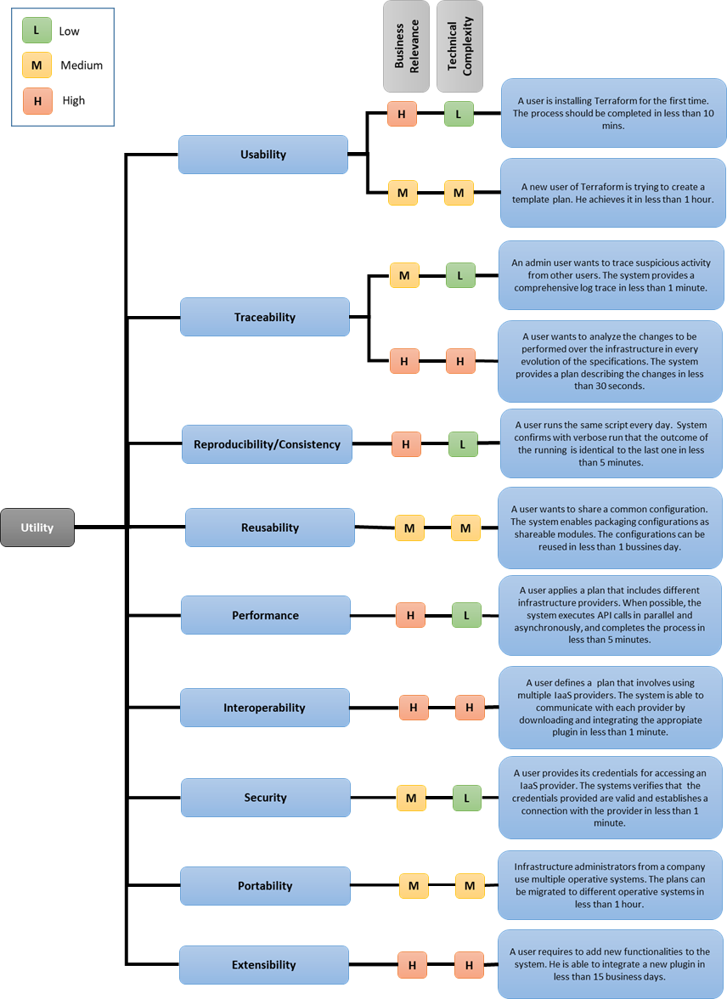

## 7. Terraform's Module View: Extensibility

This section describes a relevant module view for Terraform's architecture documentation. In order to provide a view that helps stakeholders to comprehend and analyze Terraform's ability to meet significant quality attributes, we followed the view template proposed by Bass, Clements, and Kazman [25].

### 7.1 Quality Attribute Addressed

As depicted in [Terraform's Architecturally Significant Requirements, Quality Attribute Scenarios & Utility Tree](https://github.com/SENG480/project-team-2/blob/master/milestones-deliverables/M2/01-ASRs-QAS.md), Terraform's significant quality attributes include usability, traceability, reproducibility/consistency, reusability, performance, interoperability, security, portability, and extensibility. When conceiving Terraform, Hashicorp envisioned an extensible architecture capable of supporting seamless integration with new cloud providers and infrastructure provisioners. Therefore, in this document, we analyze and document the grade of **extensibility** delivered by Terraform's architecture using a module view that represents the module structures defined when designing the platform.

### 7.2 Module View

This section contains the followed template for describing our proposed module view that will help stakeholders to comprehend Terraform's extensibility. This section is structured as follows. Section 7.2.1 describes the style of module view we selected and the set of reasons behind it. Section 7.2.2 describes the primary representation of the selected view. Section 7.2.3 specifies the element catalog for the primary representation. This includes the properties of the elements, relations, and interfaces defined in the primary representation, along with a behavioral diagram that explains the way some of these elements interact with each other. Section 7.2.4 depicts a context diagram that shows the interaction between Terraform and external systems. Finally, Section 7.2.5 explains our assumptions about the reasons that led Terraform's architects to organize the platform functionalities in the way the module view depicts it.

#### 7.2.1 View Selection and Rationale

Since we are interested in understanding Terraform's architecture ability to be extended, we use a **combined view** that integrates elements and relations from both decomposition and uses views. This overlay enable us to specify two kinds of relations: *is a module of* and  *uses* (a specialization of the *dependency* relationships). Since *decomposition structures* determine system's modifiability and *uses structures* are fundamental to comprehend system's extensibility [25], with this combined view we expect to provide useful information that enables reasoning the way Terraform accommodates new functionalities over time.

#### 7.2.2 Primary Presentation

The following figure depicts our primary presentation.

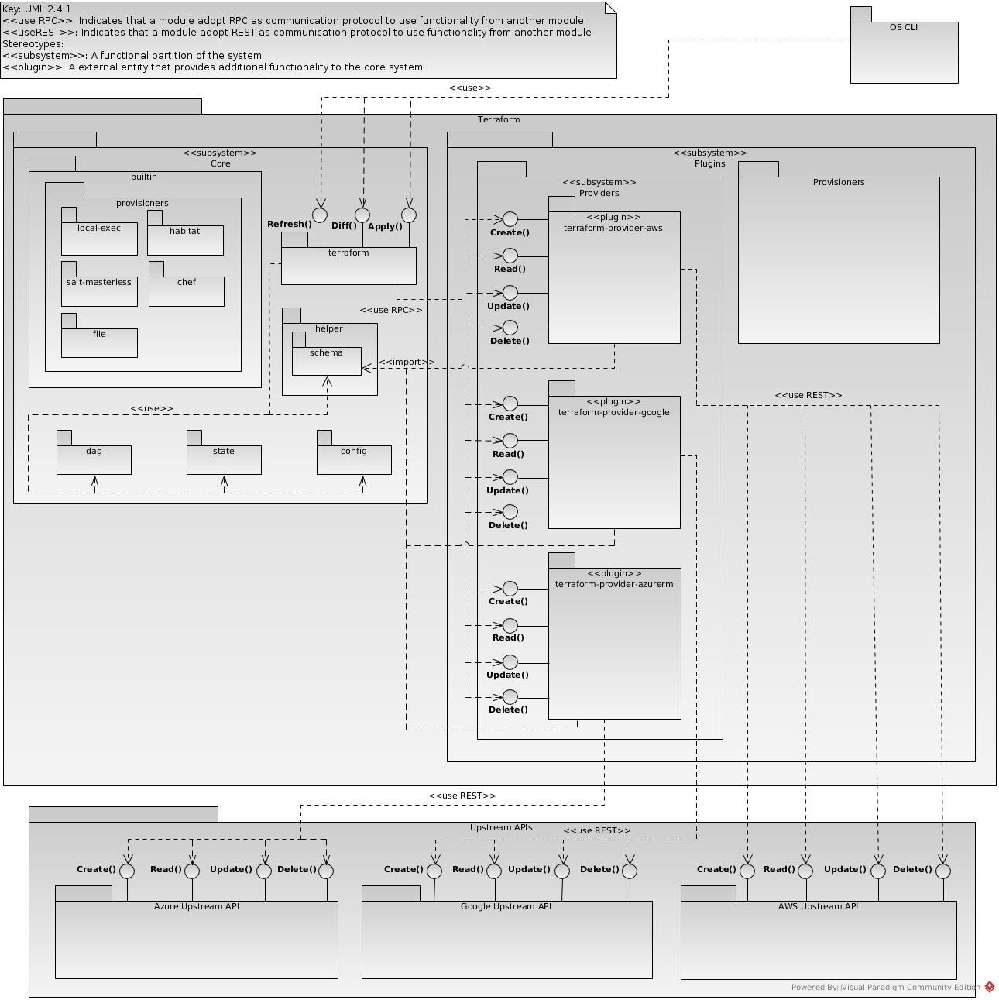

#### 7.2.3 Element Catalog

##### 7.2.3.1 Elements and their properties

-  **OS CLI:** This external element enables users to interact with Terraform through a Command-Line Interface.

- **Core:** The Terraform's core is concerned with the graph-related tasks of the platform. The core interacts with plugins invoking requests in a client-server mode.  Its main responsabilities are listed as follows.
  -  To read the user's configuration.
  -  To manage the configuration state.
  -  To read the interpolation.
  -  To translate configuration into a Directed Acyclic Graph (DAG)–also called dependency graph–.
  -  To discover and communicate with plugins.
  -  To discover and describe differences between the desired state and the current state (i.e., *Diff()*).
  -  To manage the *plan*, *Apply()*, and *Refresh()* actions.
 
  The core module is comprised of several sub-modules that provide different functional capabilities. The most important core's submodules (especially those related to the quality attribute addressed in this view) are described as follows.
 
  - Core Sub-Modules:
    
    - **terraform:** This module is in charge of orchestrating Terraform's operations throughout their execution. It enables translating user specifications to CRUD operations executed by external plugins.

    - **config:** This module allows Terraform reading and interpreting user configuration files from the disk, thus bringing them into memory and passing them to the *terraform* module.

    - **state:** This module enables Terraform to track the current state of managed infrastructure.

    - **dag:** This module implements the graph theoretical concepts required to manage the dependencies among resources defined in user configuration files. This module is used by the *terraform* module in order to build the graph.
    
    - **helper:** This module provides resources for plugin development. In defines a generic schema for describing the types and operations that a plugin will define. 

    - **builtin:** This module contains a set of built-in functionalities included in the core module. Some of this functionalities include the execution of executables after creating resources in the managed infrastructure (*local-exec* module), the installation of [Habitat](https://www.habitat.sh/) supervisors and services in Linux-based target machines (*habitat* module), the configuration of infrastructure using [SaltStack](https://www.saltstack.com/) *states* (*salt-masterless* module), the installation of a [Chef](https://www.chef.io/chef/) client in the remote machine (*chef* module), and the transmission of files and folders between the machine executing Terraform and the managed resources (*file* module).

- **Plugins:** Terraform’s plugins encapsulate third-party functionalities as a set of providers and provisioners. Each plugin provides an interface to send API calls to specific services (e.g., Amazon AWS, Google Cloud Platform, etc.).
  
  - **Providers:** A provider plugin specifies a set of resource types, the arguments the resource accepts, the attributes the resource exports, and how changes to that resource are applied through remote APIs. For example, terraform-provider-aws specifies these properties for Amazon Web Services’ resources, such as compute servers and load balancers.

  - **Provisioners:** Provisioners execute scripts on local or remote machines as part of resource creation or destruction.

##### 7.2.3.2 Relations and their properties

- **«use RPC»** (*terraform*—*terraform-provider-aws*, *terraform*—*terraform-provider-gogle*, *terraform*—*terraform-provider-azurerm*): This type of dependency indicates that the Terraform's core invokes a function, provided by a plugin, through a Remote Procedure Call (RPC).

- **«use REST»** (*terraform-provider-aws*—*AWS Upstream API*, *terraform-provider-google*—*Google Upstream API*, *terraform-provider-azurerm*—*Azure Upstream API*): This type of dependency indicates that a specific Terraform's plugin invokes an API call to the corresponding upstream API.

- **«use»** (*terraform*—*config*, *terraform*—*state*, *terraform*—*dag*): A simple usage dependency in which some functionalities of the target element are used by the source element.

- **«use»** (*OS CLI*—*terraform*): Refers to user invocations (command executions) to the Terraform platform.

- **«import»** (*terraform-provider-aws*—*schema*, *terraform-provider-google*—*schema*, *terraform-provider-azurerm*—*schema*): Represents the way plugins import the Terraform's schema to use internal data types and overwrite operations (e.g., Create()).

##### 7.2.3.3 Element Interfaces

This section is divided into two parts. First, we briefly describe each interface defined in our primary representation. Then, we use the Software Engineering Institute (SEI) template [26] for documenting two important interfaces for the communication between the Terraform's core and the plugins.

- **Diff()** (*terraform*): This operation calculates the difference between the target configuration (Config) and its latest known state (State): Diff = Config - State.

- **Apply()** (*terraform*): This operation resolves the result of the Diff() operation by translating it in a set of *create*, *read*, *update*, or *delete* operations. In case the *plan* command is executed, the Diff() will be displayed to the user first.

- **Refresh()** (*terraform*): This operation enables updating the latest known state of the real-world infrastructure.

- **Create()** (*terraform-provider-aws*, *terraform-provider-google*, *terraform-provider-azurerm*, *AWS Upstream API*, *Google Upstream API*, *Azure Upstream API*): Enables creating a resource in the target infrastructure provider.
  
- **Read()** (*terraform-provider-aws*, *terraform-provider-google*, *terraform-provider-azurerm*, *AWS Upstream API*, *Google Upstream API*, *Azure Upstream API*): Enables reading properties of a resource defined in the target infrastructure provider.

- **Update()** (*terraform-provider-aws*, *terraform-provider-google*, *terraform-provider-azurerm*, *AWS Upstream API*, *Google Upstream API*, *Azure Upstream API*): Enables updating properties of a resource defined in the target infrastructure provider.

- **Delete()** (*terraform-provider-aws*, *terraform-provider-google*, *terraform-provider-azurerm*, *AWS Upstream API*, *Google Upstream API*, *Azure Upstream API*): Enables removing a resource defined in the target infrastructure provider.

###### 7.2.3.3.1 SEI Template for Documenting Interfaces <!-- omit in toc -->

We decided to use the SEI template for documenting a generic version of the *create()* and *read() interfaces that a plugin must provide to the core in order to create and read resources from a specific provider. These interfaces are based on the helper schema defined in Terraform's core, which provides third-party developers with the foundations required to extend the platform seamlessly.

| Section | Description  |
|--------------------|---|
| Interface Identity     |  CreateResource (Create()) |
| Resources     |  **a. Syntax:** The signature of this interface is established depending on the type of resource to be created. A simple and general purpose signature is presented as follows: Create(schemaData*: ResourceData, meta: interface{}). **b. Semantics:** This interface enables creating new resources for a specific provider. The pre-conditions for this interface include defining the schema of the plugin and the way variables will be used (interpolation). In this interface, the post-condition refers to the creation of a new resource in the target infrastructure. **c. Error handling:** The helper schema allows to propagate errors to a central point or to be managed inside the body of the function. |
| Data Types and Constants     |  The schemaData pointer required by this interface refers to the different data types that can be described in the schema owned by the plugin. The data types defined in a schema can be loosely categorized as Primitive Types or Aggregated Types [27]. Primitive Types include: TypeBool (boolean), TypeInt (integer), TypeFloat (float), TypeString (String). Aggregated types combine different primitive types. Some of these data types include TypeList (List) and TypeSet (Set).  |
| Error Handling     | When specifying interfaces as established by the helper schema defined in Terraform's core, the errors are usually propagated and capture in a central point. |
| Variability     |  N/A |
| Quality Attribute Characteristics     |  Security. The creating of resources in target infrastructure platforms imposes security consideration when accessing user credentials to invoke API calls. |
| Rationale and Design Issues     |  In order to promote interoperability and standardization, this interface is governed by the definitions provided in the helper schema. This schema enables breaking down user actions into tractable and simple operations performed over specific resources in a cloud provider [28]. Moreover, separating the creation of resources from the graph operations defined in Terraform's core allow promoting the design principle of separation of concerns and allows facilitating Terraform's extensibility. |
| Usage Guide     |  The usage of this interface relies on the Terraform's core and its provided helper schema [28]. |


| Section | Description  |
|--------------------|---|
| Interface Identity     |  ReadResource (Read()) |
| Resources     |  **a. Syntax:** The signature of this interface depends on the type of resource to be read. A simple and general purpose signature is presented as follows: Read(schemaData*: ResourceData, meta: interface{}). **b. Semantics:** This interface enables reading resource properties for a specific provider. The pre-conditions for this interface include defining the schema of the plugin and the way variables will be used (interpolation). In this interface, no post-conditions are defined. **c. Error handling:** The helper schema allows to propagate errors to a central point or to be managed inside the body of the function. |
| Data Types and Constants     |  The schemaData pointer required by this interface refers to the different data types that can be described in the schema owned by the plugin. The data types defined in a schema can be loosely categorized as Primitive Types or Aggregated Types [27]. Primitive Types include: TypeBool (boolean), TypeInt (integer), TypeFloat (float), TypeString (String). Aggregated types combine different primitive types. Some of these data types include TypeList (List) and TypeSet (Set). |
| Error Handling     |  When specifying interfaces as established by the helper schema defined in Terraform's core, the errors are usually propagated and capture in a central point. |
| Variability     |  N/A |
| Quality Attribute Characteristics     |  Security. As with the previous interface, access to resources is conditioned to user-level permissions. |
| Rationale and Design Issues     |  Separating the process of reading resources properties from the graph operations defined in Terraform's core allow promoting the design principle of separation of concerns and allows facilitating Terraform's extensibility. |
| Usage Guide     |  The usage of this interface relies on the Terraform's core and its provided helper schema [28]. |

##### 7.2.3.4 Element Behavior

To provide a detailed and realistic explanation about the way Terraform's core is extended by plugin functionalities, we decided to use a UML sequence diagram (i.e., a trace-based diagram) to depict the sequence of actions that are performed by the main module in the core (i.e., *terraform*) when user's infrastructure configurations involve configuring resources from a provider (plugin) that has not been installed yet. Thus, the following sequence diagram, which is based on the UML metamodel 2.4.1, depicts the way the original Terraform's core capabilities are extended by downloading and integrating an external (and self-contained) plugin for Amazon Web Services (AWS). This trace diagram is based on the output produced by the Terraform's debugger.

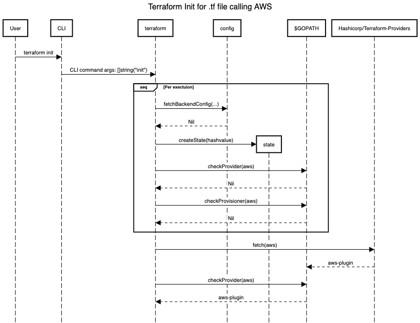

#### 7.2.4 Context Diagram

Below is the context diagram for the Terraform system. The diagram shows how the system interacts with external entities.

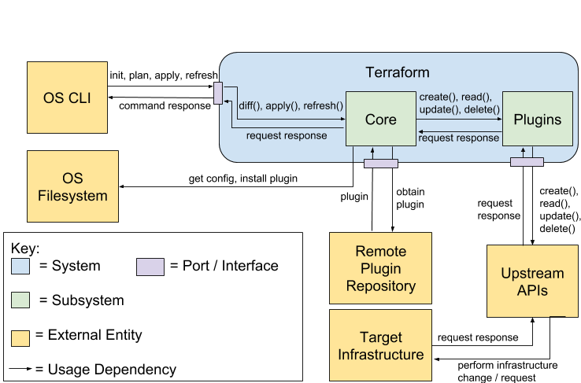

#### 7.2.5 Rationale

According to available documentation [29] and the Terraform's core source code, we believe that addressing extensibility is a priority for HashiCorp and the architects who originally designed and maintain Terraform.  A recent key decision taken by Terraform's architects/designers was to re-design the platform using a plugin-based architecture in order to improve extensibility. A plugin-based architecture promotes a loosely coupled definition of functionalities. Thus the architects separated the core responsibilities from plugin capabilities in the version v.0.1.0.0 of the platform [29]. Before that, every time a user downloaded the Terraform binary, all the plugins were included in the distribution file (even when only one of the plugins was required to be updated). The current separation between the core and plugin capabilities promote a fast and well-managed development of the platform, together with a minimal impact of provider changes perceived by the final users.

The Terraform's core defines the fundamental operations to read, interpret, and process user configurations, while specific details and actions on infrastructure are relegated to external plugins. Thus, each plugin defines a provider or a provisioner that is managed as an external static binary, which processes invocations from the core via remote procedure call (RPC) interfaces. Therefore, plugins are not aware of graph theory operations; they provide the mechanisms to translate them into a particular set of actions to be executed on a specific infrastructure provider.  This improves both the extensibility and interoperability of Terraform. The former is improved by granting the addition of new functionalities without requiring vast expertise on the platform internals. The improvement of the latter relies on the possibility to manage multiple providers without being concerned about the way the resources were described. Furthermore, using this architecture enhances security since plugins are not able to access information or make requests to the core or the user's system. 

The Terraform's plugin-based architecture enables the core functionalities to be independent of low-level details of specific providers (e.g., different levels of authentication as in Amazon Web Services), thus promoting a high degree of flexibility and extensibility that has enabled Terraform to integrate with several providers and provisioners.  Since its initial release four years ago [30], Terraform has already grown to interact with more than 160 cloud service providers [7]. They accomplished this by providing a set of reusable functionalities defined in a generic scheme that describes the data types and operations that a plugin must provide to the core in order to enable it to communicate with any Infrastructure-as-a-Service (IaaS) cloud provider that offers a basic CRUD (create, read, update, delete) API interface.  This generic interaction schema provided by Terraform's core allows third-party developers to define clear plugin capabilities that can be integrated with the platform seamlessly.

For Terraform to still succeeding in a competitive market, it is critical that the platform continues being developed in such an extensible manner. This arises from the rapid pace at which software evolves due to volatile requirements from industry and the new technologies that emerge continuously. Hence, a plugin-based architecture provides the means to guarantee a proper evolution that accommodates new infrastructure provisioning requirements as soon as they are originated. 

## 8. Terraform's Component & Connector View: Traceability

In this section, we analyze Terraform's architecture from a run-time perspective. For this, we document a Component & Connector (C&C) view of the platform architecture. To document the view, we followed the view template proposed by Bass, Clements, and Kazman [25].

### 8.1 Quality Attribute Addressed

Tracking infrastructure is a key feature in Terraform [13,31]. In this document, we analyze and document Terraform's **traceability**, that is, its ability to keep track of changes in infrastructure specifications over time. We believe that understanding the way the platform addresses this quality attribute at run-time is fundamental for multiple stakeholders since it will enable them to comprehend how infrastructure evolve using Terraform. Previously, In [Terraform's Architecturally Significant Requirements, Quality Attribute Scenarios & Utility Tree]([asd](https://github.com/SENG480/project-team-2/blob/master/milestones-deliverables/M2/01-ASRs-QAS.md)), we defined two important scenarios regarding Terraform's traceability. In this document, we focus on the following scenario.

| Quality Attribute | Scenario  |
|--------------------|---|
| Traceability     |  A user wants to be able to maintain infrastructure specifications over time and have a trace of the changes to be performed in every evolution of the specifications. Terraform detects differences between the current state of the target infrastructure and the desired state (user configurations) and shows the user, in less than 30 seconds, the set of actions to be performed for achieving the new state. |

### 8.2 Module View

This section contains the followed template for describing our proposed C&C view that will help stakeholders to comprehend Terraform's traceability. This section is structured as follows. Section 8.2.1 describes the style of C&C view we selected and the set of reasons behind it. Section 8.2.2 describes the primary representation of the selected view. Section 8.2.3 specifies the element catalog for the primary representation. This includes the properties of the elements, relations, and interfaces defined in the primary representation, along with a behavioral diagram that explains the way some of these elements interact with each other. Section 8.2.4 depicts a context diagram that shows the interaction between Terraform and external systems. Section 8.2.5 explains the variability guide of the view. Finally, Section 8.2.6 explains our assumptions about the reasons that led Terraform's architects to structure control and data flow in the way the C&C view depicts it.

#### 8.2.1 View Selection and Rationale

In order to analyze and document Terraform's architecture ability to deliver traceability of infrastructure specifications, we use a **combined view** that integrates elements and relations from both concurrency (processes) and pipes & filters views. With this integrated view we can analyze the data and control flows between the two main run-time processes of Terraform when state-based operations are performed over the infrastructure specifications.

#### 8.2.2 Primary Presentation

The following figure depicts our primary presentation.

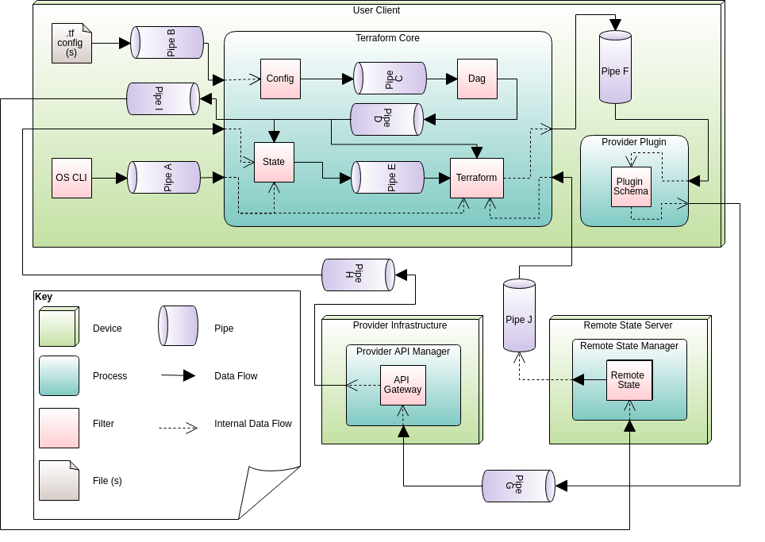

#### 8.2.3 Element Catalog

##### 8.2.3.1 Elements and their properties

###### Filters <!-- omit in toc -->

- **State:** The most important component in terms of Terraform's traceability. It provides the mechanisms for tracking changes in infrastructure specifications, thus enabling their evolution over time. Moreover, it represents a mapping between the resources defined in textual-based notations and their real-world counterparts.

- **Remote State:** Similar functionalities as the **State** component, but it resides in a remote server.

- **OS CLI:** This external element enables run-time interaction between users and Terraform through a Command-Line Interface. In terms of traceability, using the CLI, a user can invoke the following state-based commands:

  -  *refresh*: Allows updating the latest known state with information obtained from currently deployed infrastructure, thus reconciling resources in user specifications with their real-world counterparts.

  -  *plan*: Allows creating an execution plan that involves a set of actions necessary to achieve the desired state, which is based on the output from *refresh* (unless deactivated).

  -  *destroy*: Allows removing resources defined in Terraform specifications. If desired, depending resources will be removed as well.

  -  *show*: Allows providing human-readable information about the state of an infrastructure configuration.

  -  *state list*: Allows listing all the resources managed in a Terraform state.

  -  *state mv*: Allows moving resources defined in a Terraform state.

  -  *state pull*: Allows downloading and describing a remote state.

  -  *state push*: Allows uploading a local state file to a remote state.

  -  *state rm*: Allows removing resources defined in a Terraform state.

  -  *state show*: Allows showing the attributes of resources defined in a Terraform state.

- **Config:** This component allows parsing user's infrastructure specifications (written in Hashicorp Configuration Language (HCL)), thus loading in memory the objects that map to the resources defined in the terraform configurations.

- **Dag:** This component builds the dependency graph using the objects loaded by the *Config* component.

- **Terraform:** This component is in charge of orchestrating Terraform's operations throughout its execution. It enables translating user specifications into CRUD operations executed by external plugins.

- **Plugin Schema:** This component abstracts the run-time aspects of a plugin. It enables the communication between Terraform's core and the target infrastructure provider.

- **API Gateway:** This component abstracts the run-time aspects of API supplied by Terraform's supported infrastructure providers and provisioners. It enables the execution of specific actions (CRUD operations) over the target infrastructure.

###### Pipes <!-- omit in toc -->

- **Pipe A:** This pipe represents a run-time data conduit between the *OS CLI* and the main Terraform process. Users interact with Terraform through the execution of commands, which are processed by the *terraform* component. In addition, relevant resource-related data (e.g., attributes) is stored in the state for later use.

- **Pipe B:** This pipe represents a run-time data stream that enables *Config* reading information from Terraform configurations (.tff files).

- **Pipe C:** This pipe represents a run-time data conduit between the *Config* and *Dag* components. The objects read by the former are passed to the latter in order to generate the directed acyclic graph that describes dependencies between resources.

- **Pipe D:** This pipe represents a run-time data conduit that enables providing graph-related information to the *Terraform* component. Moreover, it supplies the state with the latest known set of dependencies established in the configuration files.

- **Pipe E:** This pipe represents a run-time data conduit that supplies the *Terraform* component with state-related information in order to map specified resources with the target infrastructure (thus enabling it to generate the set of actions to achieve the desired state), remove no-longer resources, and optimize the number of API calls when performance is jeopardized due to the specification of large scale infrastructures.  

- **Pipe F:** This pipe represents a run-time data conduit that provides CRUD operations defined by Terraform plugins with information for communicating with external API and executing the corresponding actions. This pipe is based on the Remote Procedure Calls (RPC) protocol.

- **Pipe G:** This pipe represents a run-time data conduit that enables providing required data to external API calls.

- **Pipe H:** This pipe represents a run-time data conduit that provides the local state with information about the current attributes and properties of the target infrastructure. This information is used to determine the differences between the current state of the user configurations and the resources being managed by Terraform (i.e., *refresh*).

- **Pipe I:** This pipe represents a run-time data conduit that supplies the remote state with the latest known set of dependencies established in the configuration files.

- **Pipe J:** This pipe represents a run-time data conduit that supplies the *Terraform* component with state-related information stored in a remote server.

##### 8.2.3.2 Relations and their properties

- **Data Flow:** Describes a unidirectional flow of data between two run-time elements.

- **Internal Data Flow:** Similar behaviour of a *Data Flow*, but it abstracts the way main Terraform processes interact with internal components and external entities.

##### 8.2.3.3 Element Interfaces

###### 8.2.3.3.1 SEI Template for Documenting Interfaces <!-- omit in toc -->

 The following tables describe the application of the Software Engineering Institute (SEI) template [26] for documenting two important interfaces related to the view being analyzed. We document interfaces concerning with the management of Terraform states. The first two tables describe relevant interfaces for the use of remote states that are implemented as [Postgres databases](https://github.com/hashicorp/terraform/tree/master/backend/remote-state/pg). The third interface documented in this section refers to the process of creating state backups with time logs.

| Section | Description  |
|--------------------|---|
| Interface Identity     |  Get() |
| Resources |  **a. Syntax:** The signature of this interface is defined as follows: func (c *RemoteClient) Get() (*remote.Payload, error). **b. Semantics:** This interface enables getting a remote state from a Postgres database. The pre-conditions for this interface include creating and configuring a remote state in the database. In this interface, no post-conditions are defined. **c. Error handling:** In case no states are found, a zero value (*nil*) is returned. |
| Data Types and Constants     |  The RemoteClient pointer required by this interface refers to a structure that defines the type of client (*Client*, a SQL database in this case), the name of the database (*Name*, a sequence of characters—*string*) and the name of the DB schema to be used (*SchemaName*, a sequence of characters—*string*). Moreover, this interface requires a pointer to response payload associated with the remote client and the accumulated error. |
| Error Handling     | The errors are usually propagated and captured in a central point of the Terraform's backend. |
| Variability     |  N/A |
| Quality Attribute Characteristics     |  Security. The communication channels between Terraform's core and the remote state must be secured. |
| Rationale and Design Issues     |  In order to promote traceability of Terraform-based infrastructure specifications for multiple users, the platform allows specifying remote states that enable a collaborative environment in which changes to specifications are maintained seamlessly by multiple users. |
| Usage Guide     |  This interface is used when users require updating their latest known version of the remote state (i.e., *terraform state pull*). Its usage is defined by the specific remote state [implementation](https://github.com/hashicorp/terraform/tree/master/backend/remote-state). |

From a client (Terraform core) perspective, an important piece of [code](https://github.com/hashicorp/terraform/blob/master/backend/remote-state/pg/client.go), from the interface documented previously, is shown below.

```go
func (c *RemoteClient) Get() (*remote.Payload, error) {
	query := `SELECT data FROM %s.%s WHERE name = $1`
	row := c.Client.QueryRow(fmt.Sprintf(query, c.SchemaName, statesTableName), c.Name)
	var data []byte
	err := row.Scan(&data)
	switch {
	case err == sql.ErrNoRows:
		// No existing state returns empty.
		return nil, nil
	case err != nil:
		return nil, err
	default:
		md5 := md5.Sum(data)
		return &remote.Payload{
			Data: data,
			MD5:  md5[:],
		}, nil
	}
}
```

| Section | Description  |
|--------------------|---|
| Interface Identity     |  Put(data []byte) |
| Resources | **a. Syntax:** The signature of this interface is defined as follows: func (c *RemoteClient) Put(data []byte) error **b. Semantics:** This interface enables storing a remote state in a Postgres database. The pre-conditions for this interface requires a connection to a predefined and configured database. Post condition is the database contains the state information package sent to it. **c. Error Handling:** If an error occurs the error is returned. No specific error handling is specified   |
| Data Types and Constants     |  A requirement is the RemoteClient pointer that defines the connection to the database. RemoteClient Structure is described in the above interface. In addition the state that is being stored is required in the following format: a variable data which consists of two data types, the first being the name of the state being inserted/updated, the second being the state data. Finally it also requires the accumulated error value. |
| Error Handling     | If an error occurs the error is returned and is handled by Terraforms back end |  
| Variability     |  N/A |
| Quality Attribute Characteristics     |  Security. The communication channels between Terraform's core and the remote state must be secured. |
| Rationale and Design Issues     |  In order to promote traceability of Terraform-based infrastructure specifications for multiple users, the platform allows specifying remote states that enable a collaborative environment in which changes to specifications are maintained seamlessly by multiple users. |
| Usage Guide     |  This interface is used when users update or create a remote state. Its usage is defined by the specific remote state [implementation](https://github.com/hashicorp/terraform/tree/master/backend/remote-state). |

From a client (Terraform core) perspective, an important piece of [code](https://github.com/hashicorp/terraform/blob/master/backend/remote-state/pg/client.go), from the interface documented previously, is shown below.

```go
func (c *RemoteClient) Put(data []byte) error {
	query := `INSERT INTO %s.%s (name, data) VALUES ($1, $2)
		ON CONFLICT (name) DO UPDATE
		SET data = $2 WHERE %s.name = $1`
	_, err := c.Client.Exec(fmt.Sprintf(query, c.SchemaName, statesTableName, statesTableName), c.Name, data)
	if err != nil {
		return err
	}
	return nil
}
```

The third and final table describes the interface for creating a backup of the state allowing a history of state data to be stored.

| Section | Description  |
|--------------------|---|
| Interface Identity     |  backup() |
| Resources | **a. Syntax:** The signature of this interface is defined as follows: func (s *BackupState) backup() error. **b. Semantics:** This interface allows Terraform to create a saved copy of the state you are executing. If the state file already exists it is moved to a backup file and the current state stored in the state file. There are no preconditions as this will work on Terraforms first, second or nth run. Post condition is the creation or update of a file storing previous and current state information. **c. Error Handling:** There are multiple checks with the end result being an error object being returned.  |
| Data Types and Constants     |  This function requires the the BackupState structure which is as follows: a synchronous mutex lock to prevent cross data writing (mu), the current state being created (Real), a string indicating the directory path (Path), and a boolean indicating if a backup state has been successfully created (done). It also requires the accumulated error value.|
| Error Handling     | The error handling is done by Terraform back end. |
| Variability     |  N/A |
| Quality Attribute Characteristics     |  Traceability. User must always be able to identify historical state information.|
| Rationale and Design Issues     |  This design allows for users to attribute a history of build information to the system. This ability enables traceability. |
| Usage Guide     |  This interface is used whenever a user applies or executes a Terraform plan. |

The following [code](https://github.com/hashicorp/terraform/blob/86e6481cc661b2ba694d353aab6d11838c066c7c/state/backup.go) is what the previous interface is documenting.

```go
func (s *BackupState) backup() error {
	state := s.Real.State()
	if state == nil {
		if err := s.Real.RefreshState(); err != nil {
			return err
		}

		state = s.Real.State()
	}

	// LocalState.WriteState ensures that a file always exists for locking
	// purposes, but we don't need a backup or lock if the state is empty, so
	// skip this with a nil state.
	if state != nil {
		ls := statemgr.NewFilesystem(s.Path)
		if err := ls.WriteState(state); err != nil {
			return err
		}
	}

	s.done = true
	return nil
}
```

##### 8.2.3.4 Element Behavior

The following diagram depicts a high-level view of the different states involved in Terraform's resources traceability.

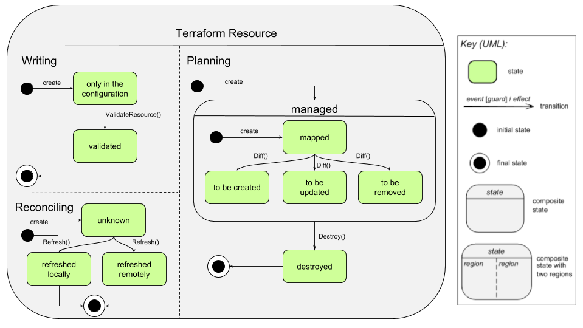

#### 8.2.4 Context Diagram

The following figure depicts the way Terraform interacts with external entities related to the view being analyzed.

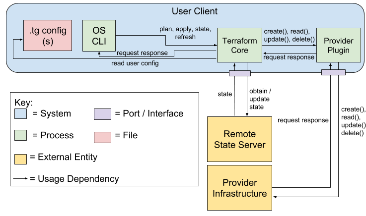

#### 8.2.5 Variability Guide

Substantial changes in the way Terraform addresses evolutive changes in infrastructure through *state* are not likely to happen [33], thus we believe that the view described in this document has low variability. However, security concerns (especially from the privacy perspective) might impact how sensitive data flows through different run-time components of the platform [34]. Therefore, some pipes in charge of data transmission might be encrypted and additional filters should be required in the pipes' endpoints in order to perform cipher and decipher operations over the data.

#### 8.2.6 Rationale

The rapid pace at which software products and features are being delivered demands not only providing mechanisms for operating computing infrastructure as code but also managing changes in the infrastructure specifications over time. Terraform enables users to achieve both of these requirements.  To accomplish the management of changes to infrastructure progressively, the platform's core defines a set of components that allow managing the infrastructure state, thus enabling is traced evolution.  In fact, architects and other important stakeholders of Terraform envisioned *state* as part of the foundations from which the platform would be built [33]. Terraform uses the infrastructure state for mapping target resources to current configuration specifications, maintaining track of metadata, and improving performance for large infrastructures [32,33].

First, the *state* acts as a knowledge base that establishes a direct connection between each target infrastructure resource to be managed and its user-driven specification counterpart. Although the Terraform *state* is mainly centred on enabling traceability over changes in user configurations, it also promotes improved interoperability since it removes the need for specific provider-based tags to map target resources with their text-based specifications. This is the reason why Terraform architects decided to replace tag-driven mappings, present in early versions of the platform, with *state*.

Second, Terraform's *state* allows storing relevant metadata for processing changes in infrastructure in a proper manner.  Once the dependency order has been established and the graph built, Terraform uses *state* as storage for the existing dependencies among the specified resources. The platform uses this information when performing operations (e.g., delete) that might require an ordered set of steps, in a similar way as occurs in relational databases when a cascade delete is required. This approach enables avoiding the definition of a general hierarchy of resources for knowing their proper order, which might be compromised due to particular provider and provisioner implementations.

Third, in order to improve performance by reducing the number of API calls, Terraform stores a cache of the attribute values for every resource defined in the *state*. This feature is optional and is used by the platform to discern the difference between the current state of the target infrastructure and the desired state as specified by the user in the configuration files. For this, Terraform requires to perform a Refresh() operation that queries the target resources and compares the obtained values with the ones specified in the current configurations.  However, this approach is not feasible for large infrastuctures due to limitations in the API supplied by providers such as lack of parallelism between calls and limits on the number of requests per unit of time. In this kind of scenario, the latest known values of the resource attribute stored in the *state* become indispensable. Nonetheless, this approach might imply critical security and privacy issues since malicious users might have access to sensitive data such as passwords or access tokens, which cannot be encrypted locally in the current implementation of the platform [34] To overcome this, Terraform provides an interface for managing the encryption of the resource attributes stored in the *state* remotely. Moreover, this feature promotes a collaborative environment for the members of the development team in charge of the infrastructure operation.

## 9. Terraform's Code Quality & Technical Debt

In this section, we describe the use of SonarCloud as the main tool for generating code analysis report on Terraform.  SonarCloud is an open source tool based on SonarQube that enables its users to continuously inspect code quality and detect bugs, code smells and security vulnerabilities. It automatically analyzes branches, decorates pull requests and generates code quality reports.  We use the results from the report to gain different insights on the source code of Terraform and also identify possible technical debt that might have been overlooked by developers, or as a result of deliberate choice due to constraints.

* SonarQube instance: https://sonarcloud.io/dashboard?id=Trevorrae_terraform

### 9.1 Code Quality Analysis

#### SonarCloud Overview <!-- omit in toc -->

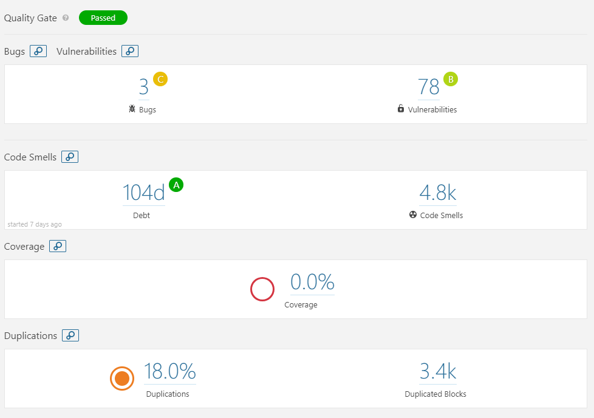

An overview of the SonarCloud report is shown here, indicating that it has 3 bugs (associated with reliability), 78 vulnerabilities (associated with security), 4.8k code smells (associated with maintainability), a total technical remediation time of 104 days and a density of 18%.  SonarCloud then produces more detailed reports for each different quality attributes, we use these reports to identify possible flaws in the code quality.

##### Reliability <!-- omit in toc -->

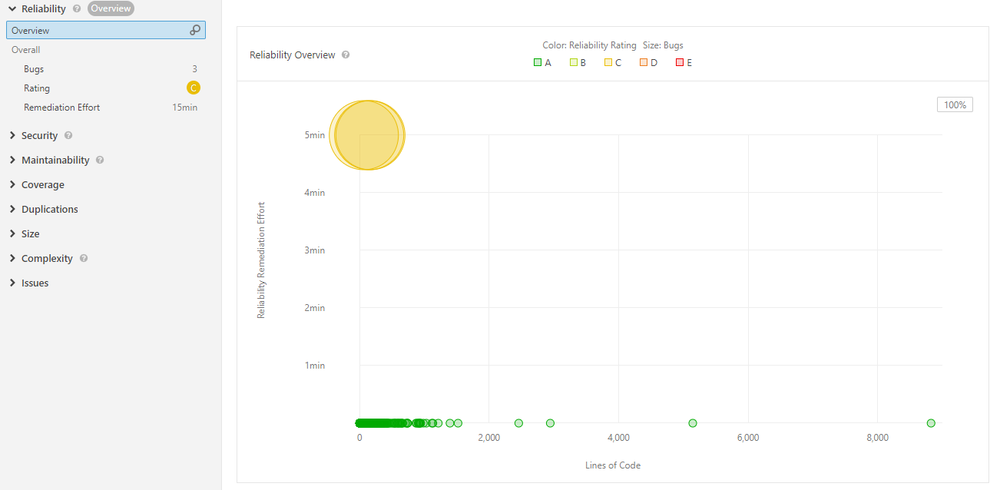

The reliability report gives Terraform's a score of C, with 3 bugs found but a remediation time of 15 minutes.  

All 3 bugs are due to having dead code in the source code, which is usually always a bad idea.  Leaving dead code makes it an obstacle for others to understand the code, and it certainly decreases the quality of the code.  It can be misleading, adds complexity to the code and more importantly, it introduces the risk of having the dead code being called by accident.  Thus it is always good practice to remove code that are no longer needed.

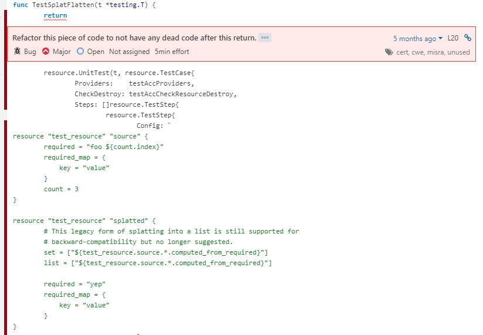

Here we can see that in this function, the bug for dead code is due to having blocks of code commented out.  If the functionality of the code is no longer needed, it would be a good idea to remove the blocks so it would not confuse others reading the code.  However, due to the dead code only resides in test functions, we do not believe the rating accurately indicates the reliability of Terraform.

##### Security <!-- omit in toc -->


The security section of the report was given a score of B, with 78 minor vulnerabilities detected and a redemption effort of 4 days and 7 hours.  

Through further inspection, it is clear that all of the detected vulnerabilities have the same cause, which is assigning static IP addresses.  This does not necessarily have an effect on the quality of the code but is usually a bad practice for many other reasons, such as requiring a full recompile when there is a change in the hard-coded IP address.  Although we can see from the code that the IP is set as defaults for testing purposes, thus it is acceptable in this case.

##### Maintainability <!-- omit in toc -->

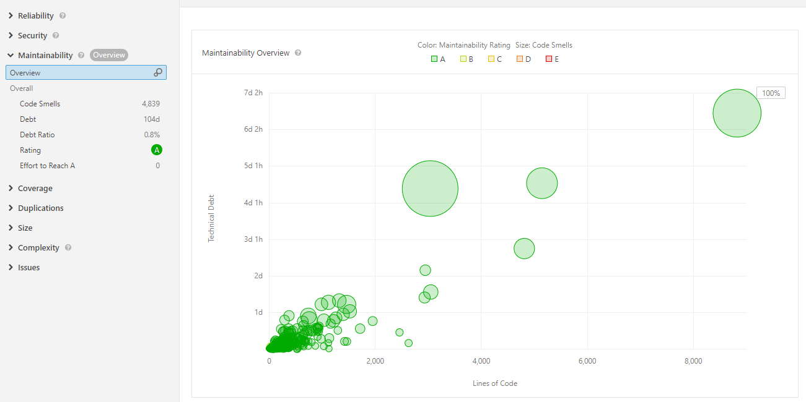

The maintainability section shows there are 4839 code smells, a total of 104 days remediation time for technical debts incurred, but a low debt ratio of only 0.8%.  The report gives a score of A for the maintainability.  Diving deeper into the detected code smells, we can find several issues regarding the code quality, and SonarCloud has sectioned them by different severity, ranging from critical to minor.  

* **Duplication (Critical)**: Many duplicated literals are found within Terraform, some of them are duplicated up to 13 times.  To improve code quality, it would make much more sense to just assign a constant, which will certainly save time and prevent possible errors.
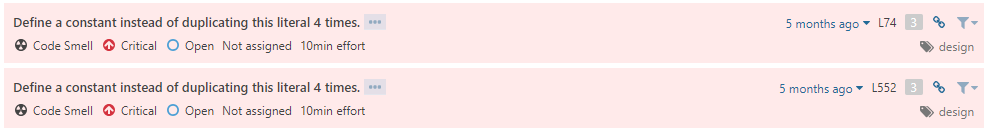
* **Empty functions (Critical)**: A few empty functions are found.  Empty functions are best avoided as it could cause others to guess their purpose and whether it was intentional, which can lead to confusion.
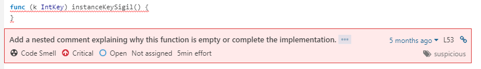
* **Over-complexed functions (Critical)**: SonarCloud detected several functions which the cognitive complexity can be greatly reduced.  Having functions that are too complexed leads to lower maintainability of the code as a whole, and decreases code quality.
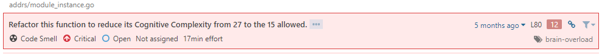
* **Unused parameters (Major)**: There are many places where some function parameters are not used.  Again, this could leads to confusion when trying to understand the code.
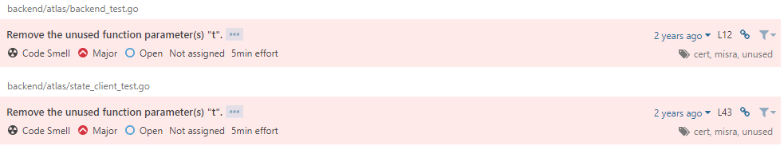
* **Unessary nested if-statements (Major)**: We found a couple of places where the code can be cleaned by merging the nested if statement into a single statement, improving readbility.
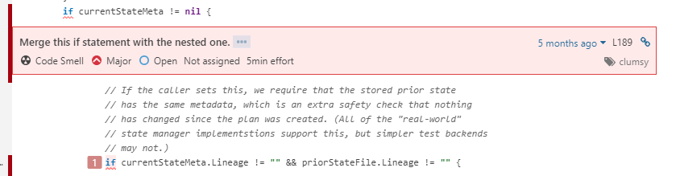
* **Function name not matching [a-zA-Z0-9]+$ (Minor)**: The function name does not adhere to SonarQube standards, meaning that it may be hard to use these functions as a new developer, for modifiability for example.
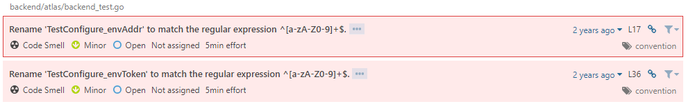

### 9.2 Technical Debt

Technical debt is a concept in software development that reflects the extra work that arises when code that is easy to implement in the short term is used instead of applying the best practical solution [35]. This includes writing “hacks” to solve problems, decisions made to reduce development time in order to ship a product, and using outdated technology that harbours bugs and security flaws instead of upgrading to more robust modern software. All of these things don’t necessarily impede a working software, indeed practically all software has technical debt despite performing all necessary functionality and fulfilling Quality Attribute Scenario metrics. However, having too much technical debt can introduce bugs, prevent new features from being added, and impede quality attributes such as performance and maintainability. Terraform, as shown in the previous section, does not have excessive technical debt, earning an “A” rating from SolarQube for maintainability. However, we did identify some parts of the codebase that could be refactored, and other examples of technical debt within the system. In addition, we explore the design problems that may arise from this technical debt.

Below is a table of the potential technical debt within Terraform. The links go to the Github repository for Terraform, identifying the sources of commits, pull requests, and lines of code that harbour technical debt.

| Identified Potential Technical Debt  | Description | Link |
| ------------- | ------------- | ------------- |
| Excessively Complex Functions  | A number of functions in Terraform are overly complex, making them less maintainable, contributing to technical debt in the system.  | [Code](https://github.com/hashicorp/terraform/blob/ac0bdb7f2180d59da744882ecbf88d47338f397d/addrs/module_instance.go#L80)  |
| Legacy Software Exception  | Because of the behavior of a legacy software, an exception to the “Ground rules” for mapping config schema was made. A shortcut using legacy software resulting in minor technical debt.  | [Commit](https://github.com/hashicorp/terraform/commit/0b2cc6298b8adbdaf698c8ce764a476c08bd3061)  |
| Stopped Hook Doesn’t Return Error  | When a hook stops, it doesn’t return an error despite being a failed end-to-end completion. However, this has not been addressed because existing automation may depend on this behavior, despite not being the best practice. This shortcut contributes to technical debt in the form of reducing maintainability.  | [Code](https://github.com/hashicorp/terraform/blob/ac0bdb7f2180d59da744882ecbf88d47338f397d/terraform/hook_stop.go#L79)  |
| Existing HCL parser API cannot give warnings in the absence of errors.  | Current HCL parser has a diagnostic API that cannot return warnings in the absence of error. The lack of warnings may lead to technical debt in the future within new functions.| [Code](https://github.com/hashicorp/terraform/blob/ac0bdb7f2180d59da744882ecbf88d47338f397d/config/loader_hcl2.go#L186)  |

None of the technical debt found impedes Terraform’s current functionality or quality in any serious way. However, they may contribute to long-term maintainability issues. Most of the issues had comments in the code explaining the decision making, and accepting the risks that come with introducing the technical debt, therefore the debt can be classified as managed technical debt. Next, we will go over some of the technical debt issues in more detail.

While searching the code, we found that many of the “FIXME” comments were related to functions not returning proper error messages, rather than having a defect. This is a minor form of technical debt as the functionality is not affected, however, the missing error messages could impact future development as bugs might be harder to solve if the correct error messages are not returned.

#### Legacy Software Exception <!-- omit in toc -->

The Legacy Software Exception debt is defined by allowing an exception through the ground rules of mapping config schema because of a legacy SDK. The commit message outlines the reasoning behind allowing this exception (allowing unknown and null collections returned from PlanResourceChange and ApplyResourceChange methods) is to support the legacy SDK instead of creating a new SDK; this is a code shortcut taking the easier solution of creating an exception to the ground rules rather than reworking the entire SDK. The message explains that the developers must be mindful when creating safety check functions due to this exception [36], but the technical debt is not critical as the functionality does not change as a consequence. Therefore, the debt is introduced in a manageable way. However, it is still technical debt because a new developer may have missed this intricacy, and bugs may be introduced because of this exception being allowed in the future. This has consequences for the design of Terraform as modifying the functions PlanResourceChange and ApplyResourceChange may introduce unexpected behaviors due to the exception allowed.

#### Excessively Complex Functions <!-- omit in toc -->

One of the issues that our SonarQube instance detected was that there were some overly complex functions that could be refactored. One such function is the opApply function in backend/local/backend_apply.go file. It has a cognitive complexity rating of 57, exceeding the 15 rating recommended [37]. This means that the function’s control flow is hard to understand, and therefore it will be difficult to maintain. The function’s structure could be a shortcut form of technical debt, as it is easier to write one long function sometimes, especially if you as the developer already understand it. However, some long term consequences of this design include the function being harder to maintain, especially by new developers who may not be able to grasp the function’s full purpose due to its complexity. Because of this, the ramifications of changing the function may impact other modules if the function’s full range is not understood easily. Fortunately, this debt could easily be refactored, rewriting the function to call other functions rather than being a continuous monolithic design, making the function easier to understand and therefore modify.

### 9.3 Code Analysis Conclusion

Through the use of automated code quality checking tools, analyzing the source code, and searching through commits and pull requests, we've ascertained that Terraform has little technical debt compared to other systems, and as such, it was hard to find shortcuts and design tradeoffs to critique. However, we found some minor issues to refactor, such as the overly complex functions found by SonarQube, and addressing the other technical debt discovered in section 9.2 SonarQube helped us analyze the source code of Terraform to search for code smells that may lead to technical debt, however for finding technical debt is was more useful to search the commits, code base for "fixme" instances, and pull request discussions.

## 10. Conclusions

Dynamic and demanding customer requirements are changing the way IT companies have to deliver value to their clients. Today, agile-based practices are being broadly adopted, aiming at delivering value as soon and as frequently as possible to customers, thus promoting a continuous and faster feedback cycle that enables companies to address market requirements and expectations more effectively. Strategies such as continuous delivery and DevOps, rely on early and frequent software deliveries, which implies that applications or features must be constantly (re-)deployed on heterogeneous target environments (infrastructures) that support their execution. The frequency and complexity of infrastructure provisioning advocate for its automation. Terraform provides an extensible platform that enables users to manage infrastructure resources seamlessly. It provides mechanisms for both automating infrastructure provisioning and evolving specifications over time in a consistent way. Its architecture relies on a plugin-based schema that enables open-source developers to extend the platform's capabilities (i.e., infrastructure providers and provisioners). Moreover, Terraform's traceability provides users with valuable information about the exact sequence of steps to be performed in order to achieve the desired state of the infrastructure being provisioned. Furthermore, despite the project is being maintained by open-source developers, its code quality is fairly satisfactory, and it does not present any major technical debt concerns. 

## References

[1] Y. Brikman, Terraform: Up and Running : Writing Infrastructure as Code. O’Reilly Media, 2017.

[2] H. R. Faragardi, Ethical considerations in cloud computing systems," Proceedings, vol. 1, p. 166, 06 2017.

[3] “Acm code of ethics and professional conduct," Commun. ACM, vol. 35, no. 5, pp. 94-99, May 1992. [Online]. Available: http://doi.acm.org/10.1145/129875.129885 

[4] HashiCorp. (2019) Hashicorp security policy. [Online]. Available:
https://www.hashicorp.com/security.html

[5] HashiCorp. (2018) Hashicorp privacy policy. [Online]. Available:
https://www.hashicorp.com/privacy

[6] HashiCorp. (2017) Terraform security. [Online]. Available: https://www.terraform.io/security.html

[7] HashiCorp. (2019) Terraform Features. [Online]. Available:
https://www.hashicorp.com/products/terraform

[8] HashiCorp. (2014) Terraform License. [Online]. Available: https://github.com/hashicorp/terraform/blob/master/LICENSE

[9] HashiCorp. (2019) Terraform Contributors. [Online]. Available: https://github.com/hashicorp/terraform/graphs/contributors 

[10] HashiCorp. (2019) Terraform Issue Tracker. [Online]. Available: https://github.com/terraform-providers/terraform-provider-azurerm/issues/2584

[11] "ISO/IEC/IEEE International Standard - Systems and software engineering - Vocabulary," ISO/IEC/IEEE 24765:2010(E), pp. 1-418, 2010.

[12] N. Rozanski and E. Woods. (2019) Stakeholders. [Online]. Available:
https://www.viewpoints-and-perspectives.info/home/stakeholders/

[13] HashiCorp. (2019) Terraform by Hashicorp. [Online]. Available: https://www.terraform.io/

[14] HashiCorp. (2019) Terraform Documentation. [Online]. Available: https://www.terraform.io/docs/index.html

[15] HashiCorp. (2019) About Hashicorp. [Online]. Available: https://www.hashicorp.com/about 

[16] HashiCorp. (2019) Hashicorp Terraform Enterprise. [Online]. Available: https://www.hashicorp.com/products/terraform?utm_source=oss&utm_medium=header-nav&utm_campaign=terraform 

[17] HashiCorp. (2019) Extending Terraform. [Online]. Available: https://www.terraform.io/docs/extend/index.html

[18] HashiCorp. (2019) Learn about provisioning infrastructure with HashiCorp Terraform. [Online]. Available: https://learn.hashicorp.com/terraform/

[19] HashiCorp. (2019) Terraform Guides. [Online]. Available: https://www.terraform.io/guides/index.html

[20] HashiCorp. (2019) Terraform Github Repository. [Online]. Available: https://github.com/hashicorp/terraform

[21] Jez Humble and David Farley. Continuous Delivery: Reliable Software Releases Through Build, Test, and Deployment Automation. Addison-Wesley Professional, 1st edition, 2010.

[22] Gene Kim, Patrick Debois, John Willis, Jez Humble, and John Allspaw. The DevOps handbook: how to create world-class agility, reliability, and security in technology organizations. IT Revolution Press, LLC, 2016.

[23] L. Bass, J. Bergey, P. Clements, P. Merson, I. Ozkaya, and R. Sangwan, A
Comparison of Requirements Specication Methods from a Software Archi-
tecture Perspective," Tech. Rep., 2006. 

[24] M. R. Barbacci, R. J. Ellison, A. J. Lattanze, J. A. Stafford, C. B. Weinstock, and W. G. Wood, Quality attribute workshops qaws - third edition," Carnegie Mellon, Technical Report CMU/SEI-2003-TR-016, oct 2003. [Online]. Available:
http://www.sei.cmu.edu/library/abstracts/reports/03tr016.cfm

[25] L. Bass, P. Clements, and R. Kazman, Software Architecture in Practice,
3rd ed. Addison-Wesley Professional, 2012.

[26] F. Bachmann, L. Bass, P. Clements, D. Garlan, J. Ivers, J. Little, R. Nord, and J. Stafford, "Documenting Software Architecture: Documenting Interfaces," Carnegie Mellon, Technical Report CMU/SEI-2002-TN-015, jun 2002. [Online]. Available: [http://www.sei.cmu.edu/library/abstracts/reports/03tr016.cfm](http://www.sei.cmu.edu/library/abstracts/reports/03tr016.cfm)

[27] Hashicorp. (2019) Schema Attributes and Types. [Online]. Available: https://www.terraform.io/docs/extend/schemas/schema-types.html

[28] Hashicorp. (2019) package schema. [Online]. Available: https://godoc.org/github.com/hashicorp/terraform/helper/schema

[29] HashiCorp. (2017) Terraform and its Extensible Provider Architecture. [Online]. Available: https://www.hashicorp.com/resources/terraform-extensible-provider-architecture

[30] Wikipedia. (2019) Terraform. [Online]. Available: https://en.wikipedia.org/wiki/Terraform_(software)

[31] HashiCorp. (2019) Terraform vs. Custom Solutions. [Online]. Available: https://www.terraform.io/intro/vs/custom.html

[32] HashiCorp. (2019) State. [Online]. Available: https://www.terraform.io/docs/state/

[33] HashiCorp. (2019) Purpose of Terraform State. [Online]. Available: https://www.terraform.io/docs/state/purpose.html

[34] HashiCorp. (2019) Sensitive Data in State. [Online]. Available: https://www.terraform.io/docs/state/sensitive-data.html

[35] Techopedia. (2019) Technical Debt. [Online]. Available: https://www.techopedia.com/definition/27913/technical-debt

[36] HashiCorp. (2019) Terraform Commits. [Online]. Available: https://github.com/hashicorp/terraform/commit/0b2cc6298b8adbdaf698c8ce764a476c08bd3061

[37] SonarCloud. (2019) Terraform. [Online]. Available: https://sonarcloud.io/project/issues?id=Trevorrae_terraform&issues=AWlvISbfe1QvbR9zb906&open=AWlvISbfe1QvbR9zb906