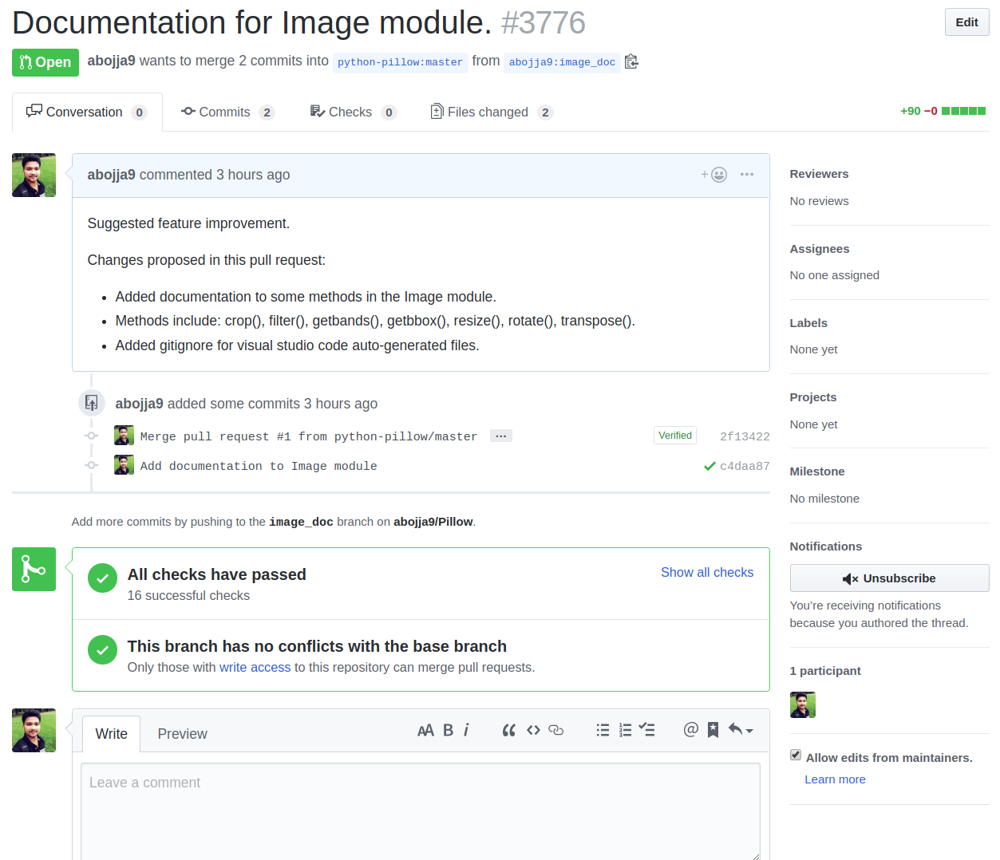
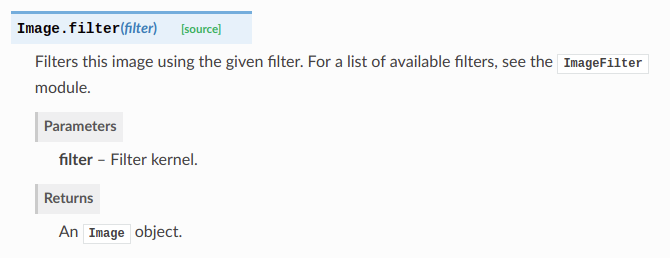
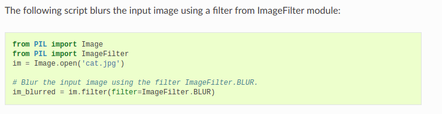

-# Contributions

This chapter outlines some of the contributions---in the form of pull requests---made by several teams to their open source project.

## Pillow:

The pull request is available at this link:

https://github.com/python-pillow/Pillow/pull/3776

### 1. Problem Description:

On the Pillow documentation page, the authors provide only a small description of how different methods work. But for many functions, it is not clear how to use them properly. And there are many issues related to it in the Pillow GitHub repository.

### 2. Proposed Solution:
We have taken seven essential and most commonly used functions and provided some examples with helpful comments on explaining how to use that particular method properly. As an example, we have attached a small picture below.

The above image is from the Pillow documentation page. Here it just describes that the method is used to filter an image. It would be helpful to users if they could provide an example of how to use it.

So, we added this above code block, which shows how to blur an image using the method filter.

Similarly, we have added the code documentation to seven essential functions and added as a pull request. The methods include: crop(), filter(), getbands(), getbbox(), resize(), rotate(), transpose().

## IPython

[Pull Request](https://github.com/ipython/ipython/pull/11672)

To enhance the original Python syntax, IPython introduces magic commands. These are prefixed by the `%` character for line magics \(single line of input\), and `%%` for cell magics \(multiple lines of input\). This allows for a more efficient terminal experience. An example of a magic function is`%paste`, which enables the user to paste and execute code directly into IPython, regardless of line count, and ignore additional markup or prompt characters.

In our pull request, we extended the `%psearch` magic function. This function allows the user to search for objects in namespaces by wildcard; essentially matching objects according to their type, pattern, and options specified by the user. This pull request addresses the **usability** QAS aspect and **learnability debt** we discovered in the IPython system by providing a command for users of the system to quickly determine which object types are available for filtering. This improves the overall efficiency at which users can find the object they are searching for.

## JSettlers2
As part of our evaluation and assessment of JSettlers2, we submitted a number of pull requests to help improve JSettlers2. All of the pull requests were accepted with minimal change required by the owners. Most of these pull requests aided in our ability to understand the JSettlers2 code base.

* Our first pull request was adjusting the Java version from v1.5 to v1.6. This was done as the code would not compile with a Java 11 compiler. In addition, Java v1.5 is no longer support by Oracle. (https://github.com/jdmonin/JSettlers2/pull/49)
* Our next pull request cleaned up the scope of many classes in JSettlers2. In Java, the default scope is package; however, this is not explicitly apparent and therefore it is good style to put `/*package*/` in front of every default scope class. In addition, many other classes were public that did not need to be, so those classes were changed to package scope. (https://github.com/jdmonin/JSettlers2/pull/50)
* The next pull request was to use `Integer.valueOf()` instead of the Integer constructor (which was deprecated). The `Integer.valueOf()` method should also yield better performance as it caches many commonly (or expected) Integer objects in memory. (https://github.com/jdmonin/JSettlers2/pull/52)
* Our next pull request was the most significant as we moved a large piece of embedded functionality out of an overly large class into its own Java file. (https://github.com/jdmonin/JSettlers2/pull/53)
* Our subsequent pull request was very small; however, it removed a cyclic dependency from JSettlers2, whereby the robot package depended on the baseclient package and the baseclient package depended on the robot package. (https://github.com/jdmonin/JSettlers2/pull/54)
* Our next pull request simply involved making small changes to an assortment of methods and classes to make the code easier to read. In addition, a few of our changes were intended to slightly optimize the software. (https://github.com/jdmonin/JSettlers2/pull/55)
* Our next pull request removed an unused method and used StringBuilder instead of StringBuffer. StringBuffer is thread-safe whereas StringBuilder is not. However, multiple threads were not accessing the StringBuffer. Therefore, there it was needless to use StringBuffer so we used StringBuilder instead. (https://github.com/jdmonin/JSettlers2/pull/59)
* Our last pull request was relatively trivial, as we removed two unused constructors. (https://github.com/jdmonin/JSettlers2/pull/61)

## Terraform

### Motivation

As shown in [this image](images/Terraform/PullRequest/01-state.png), when applying changes to managed infrastructure (e.g., adding simple DigitalOcean [droplet](/images/Terraform/PullRequest/02-do-droplet.png), using a plain-text JSON file, Terraform will store the latest known configuration properties (state) of the resource, as defined in the target environment. This might include properties that can be considered as sensitive, such as the resource ID, IP addresses used, SSH fingerprints, database passwords, geographical region, among others. Malicious users could take advantage of these properties to perform harmful actions over the infrastructure resources being managed, thus affecting the normal operation of the system that relies upon the correct behaviour of the infrastructure. According to [available documentation](https://www.terraform.io/docs/state/sensitive-data.html), there is no mechanism in the current version of Terraform that enables users to secure sensitive data stored in the local state.

### Pull Request 

Our [pull request](https://github.com/hashicorp/terraform/pull/20962) consists of a first step towards the achievement of secure sensitive data in the local state. For this, we added new modules for encrypting and decrypting values in the JSON file that contains the configuration properties of the resources being managed. Moreover, using the knowledge acquired while understanding and documenting the project, we identified the Terraform [module](https://github.com/hashicorp/terraform/blob/master/states/statefile/version4.go) in charge of serializing and deserializing the JSON file containing the state, and integrate it with our encryption and decryption functions. In this way, we were able to provide a secure mechanism for storing values in a local state.

### Validation

To validate our contributions we [ran the Terraform tests](../images/Terraform/PullRequest/03-test.png) defined using the *Make* build automation tool. In addition to this, to submit the pull request, we followed the [contribution guidelines](https://github.com/hashicorp/terraform/blob/master/states/statefile/version4.go) defined by Terraform's lead developers. 

#### Limitations

Due to current platform migration from version 0.11 to 0.12 (alpha), testing Terraform's core development version (v0.12) in conjunction with provided plugins (e.g., DigitalOcean and AWS, which are currently targeted for the version v0.11 of the core) was not possible for us. This is confirmed by Mitchell Hashimoto, the Terraform creator and one of the key developers of the platform. Despite he provided a [set of steps]((https://www.youtube.com/watch?list=PL4z1WbdlT5GKw1l2w0U-8YijoTwZp_GvU&v=Q6SGhWK6y0o)) to update provider dependencies to make it compatible with the new version of the platform's core, this partial solution is not currently working due to inconsistencies in the way Go update references of old modules such as [golang.org/x/lint](../images/Terraform/PullRequest/04-error-dependencies.png) (c.f., open Go [Issue #30831](https://github.com/golang/go/issues/30831) ). Therefore, part of our future work will be to keep improving the functionality proposed (since we really enjoyed the process of contributing to Terraform and consider we have enough expertise to complete it) and validate it using multiple cloud providers.

## Spyder

https://github.com/spyder-ide/spyder/pull/9109 

This pull requests adds a GUI feature to the Spyder IDE. Since the Spyder IDE is primarily feature based, it is assumed that a utility based feature that contributes to the overall functionality of the application is welcome. The utility feature added was a menu item that performs a lexographical sorting of the tabs of the main Editor window of Spyder. Most developers have experienced a time during the use of an IDE where multiple open tabs can become overwhelming and disorganized. By sorting the tabs by filename, navigation of these tabs becomes easier since the feature facilitates visual searching (or manual tabbing over) by lexographical order.

The feature sorts the tabs and maintains their file contents, and does not change file focus. For example, if a user is looking at file A.txt, and does a sort, the position of A.txt's tab may change, but the file remains open, its contents are still in view, and the tab remains selected.

https://github.com/SENG480/project-team-1/blob/master/images_m7/sort_tabs_1.PNG 

https://github.com/SENG480/project-team-1/blob/master/images_m7/sort_tabs_2.PNG

## Mailpile

[Pull Request](https://github.com/mailpile/Mailpile/pull/2215)

Nowadays, there are many sites like google drive, dropbox, onedrive, etc, which allows to create, edit and save the document online. Users can share these online file using URLs. Mailpile being a morder e-mail client, should be able to send URLs of these files as attachement instead of sending the actual file. We found this [issue](https://github.com/mailpile/Mailpile/issues/2204) in Mailpile's github issue tracker raised by Mailpile's lead developer Mr. Bjarni Rúnar Einarsson. He created a list [list of tasks](https://github.com/mailpile/Mailpile/issues/2204#issue-403099577) to be completed to implement this feature .Initial two tasks were already completed in a commit. However, there are still other tasks that needs to be completed.

In our pull request, we have completed some tasks to implement beforementioned feature as follows.
1. We have extended `read_email` function in `mailpile/search.py` to scan and find any valid URL present in the email text. For this we have used a regular expression to identify any valid URL within the text. Once the URL is idetified, it is being added to the `att_urls` list which contains attachement URLs.
2. We have created a large list of regular expresssions of trusted URLs of common file sharing sites like dropbox, google drive, etc.
3. We added the list created in second task to default list of attachement URLs in the session configurations. 

## Teammates

[Pull Request](https://github.com/TEAMMATES/teammates/pull/9655)

This pull request focuses on the development of a Performance Test Plan for Teammates using JMeter tool. There has been no contribution yet for the measurement of the performance scenarios and we found it as an open issue in Teammates issue tracker. Hence, we planned to contribute to it. Our contribution includes the following:
* Basic Test Plan for JMeter GUI (.jmx file) including User defined variables, HTTP Cookie Manager, Thread group and Summary Report.
* Implemented the performance test scenarios for Admin Authentication, Adding Instructor, Loading the courses.
* Used Regular Expression Extractor for fetching the CSRF-Token and using it for generating the cookie parameter for the future web requests.

## Bokeh
Link to PR: https://github.com/bokeh/bokeh/pull/8823

This PR adds a new subclass for generalized "indicators" to be incorported in a Bokeh plot "document" (and subsequently serialized for syncronization between client and server). Indicators can be useful for a variety of reasons, but with this PR we illustrate their use in showing the connection status between a bokeh plot and a bokeh server - these can help to lighten the learning curve when working with websockets and/or bokeh server.

